# Docker Networking: A Comprehensive Guide

**Document Type**: Educational Technical Guide  
**Last Updated**: 2025-12-10  
**Audience**: Developers (beginners to intermediate)  
**Project Context**: SSE Streaming Application

---

## Table of Contents

1. [Introduction](#introduction)
2. [Docker Networking Fundamentals](#docker-networking-fundamentals)
3. [Network Types and Drivers](#network-types-and-drivers)
4. [Container Communication](#container-communication)
5. [SSE Project Network Architecture](#sse-project-network-architecture)
6. [Performance Dashboard Integration](#performance-dashboard-integration)
7. [Troubleshooting](#troubleshooting)
8. [Best Practices](#best-practices)
9. [References](#references)

---

## Introduction

### What is Docker Networking?

Docker networking is the mechanism that enables containers to communicate with each other and with the outside world. When you run containers, they don't exist in isolation—they need to:

- **Talk to each other** (e.g., your application container talking to Redis)
- **Talk to the host machine** (e.g., accessing host services)
- **Talk to the internet** (e.g., making API calls)
- **Be accessible from the outside** (e.g., serving HTTP traffic)

Think of Docker networking as a virtual network infrastructure that Docker creates and manages automatically, similar to how VLANs work in physical networking, but entirely software-defined.

### Why Docker Networking Matters

In traditional deployments, applications ran on the same server and communicated via `localhost`. With containers, each service runs in its own isolated environment, so we need a networking strategy to:

1. **Enable service discovery** - Containers find each other by name, not IP
2. **Provide isolation** - Separate networks for different applications
3. **Manage security** - Control which containers can talk to each other
4. **Support scaling** - Add/remove containers dynamically

### The Problem We're Solving

In the SSE project, we have multiple containers that need to work together:
- **3 FastAPI application instances** (for load balancing)
- **NGINX load balancer** (distributes traffic)
- **Redis cache** (shared state)
- **Kafka message queue** (distributed messaging)
- **Prometheus + Grafana** (monitoring)
- **Performance Dashboard** (separate UI application)

Without proper networking, these containers would be isolated islands unable to communicate. Docker networking bridges these islands into a cohesive system.

---

## Docker Networking Fundamentals

### How Docker Networks Work

When Docker is installed, it creates a virtual networking layer on your host machine. This layer includes:

1. **Virtual Bridges** - Software switches that connect containers
2. **Virtual Network Interfaces** - Each container gets its own network interface (like `eth0`)
3. **IP Address Management (IPAM)** - Docker assigns IP addresses automatically
4. **DNS Service** - Docker provides built-in DNS for container name resolution

### The OSI Model and Docker

Docker networking operates primarily at Layer 2 (Data Link) and Layer 3 (Network) of the OSI model:

```mermaid
graph TB
    subgraph "OSI Model"
        L7[Layer 7: Application<br/>HTTP, gRPC, etc.]
        L4[Layer 4: Transport<br/>TCP, UDP]
        L3[Layer 3: Network<br/>🔹 IP Addressing<br/>🔹 Docker manages this]
        L2[Layer 2: Data Link<br/>🔹 Virtual Bridge<br/>🔹 Docker manages this]
        L1[Layer 1: Physical<br/>Host NIC]
    end
    
    L7 --> L4 --> L3 --> L2 --> L1
    
    style L3 fill:#4A90E2,stroke:#333,stroke-width:2px,color:#fff
    style L2 fill:#4A90E2,stroke:#333,stroke-width:2px,color:#fff
```



Docker creates virtual networks at L2/L3, allowing containers to communicate as if they were on a physical network, but entirely in software.

### Container Network Namespaces

Each container gets its own **network namespace** - an isolated view of the network stack. This means:

- Each container has its own network interfaces
- Each container has its own routing table
- Each container has its own firewall rules
- Containers cannot see each other's network interfaces (unless bridged)


Think of namespaces as soundproof rooms—each container is in its own room with its own phone system (network stack), and the Docker bridge connects these rooms together.

---

## Network Types and Drivers

Docker supports multiple network drivers, each designed for specific use cases. Understanding these is crucial for architecting multi-container applications.

### 1. Bridge Network (Default)

**What It Is:**  
A software-based Layer 2 bridge that connects containers on the same host. This is the **most common network type** for single-host deployments.

**How It Works:**


**Key Characteristics:**
- **IP Range**: Docker assigns a private subnet (e.g., `172.18.0.0/16`)
- **DNS**: Containers can reach each other by **container name** (e.g., `http://redis:6379`)
- **Isolation**: Containers on different bridge networks cannot communicate
- **Port Mapping**: Expose container ports to host via `-p` flag

**Use Case:**  
Single-host applications where containers need to communicate (like our SSE backend stack).

**Example in SSE Project:**
```yaml
# docker-compose.yml
networks:
  sse-network:
    driver: bridge  # ← This creates a custom bridge network
    name: sse-network
```

When you create a custom bridge network (versus using the default `docker0` bridge), you get:
- ✅ Automatic DNS resolution
- ✅ Better isolation from other Docker projects
- ✅ More control over subnet and IP ranges

---

### 2. Host Network

**What It Is:**  
The container shares the host's network namespace directly—no network isolation.


**Key Characteristics:**
- **No port mapping needed** - Container binds directly to host ports
- **Performance** - Eliminates network virtualization overhead
- **No isolation** - Container can access all host network interfaces
- **Port conflicts** - Can't run multiple containers on same port

**Use Case:**  
Performance-critical applications (e.g., network monitoring tools). **Rarely used** in production due to security concerns.

**Example:**
```bash
docker run --network host nginx
# NGINX binds directly to host's port 80
```

⚠️ **Security Warning:** Avoid in production—containers can sniff host network traffic.

---

### 3. Overlay Network

**What It Is:**  
A distributed network spanning multiple Docker hosts, enabling containers on different machines to communicate.


**Key Characteristics:**
- **Multi-host** - Containers on different servers communicate seamlessly
- **Encryption** - Optional encrypted data plane (VXLAN tunneling)
- **Requires orchestration** - Needs Docker Swarm or Kubernetes
- **Service mesh** - Built-in load balancing and service discovery

**Use Case:**  
Distributed systems running across multiple servers (e.g., microservices in production).

**Why We Don't Use It in SSE:**  
Our project runs on a single host (development environment). Overlay networks add complexity without benefit here.

---

### 4. None Network

**What It Is:**  
Completely disable networking for a container.

**Use Case:**  
Batch processing jobs that don't need network access (e.g., data processing containers).

**Example:**
```bash
docker run --network none my-batch-job
```

---

### 5. Macvlan Network

**What It Is:**  
Assigns a MAC address to each container, making it appear as a physical device on the network.

**Use Case:**  
Legacy applications that expect to be directly on the physical network (rare).

---

## Container Communication

### How Containers Discover Each Other

Docker provides **built-in DNS** for service discovery. When containers are on the same network, they can reach each other using:

1. **Container Name** (most common)
2. **Service Name** (Docker Compose)
3. **Container ID**
4. **IP Address** (not recommended - IPs change)

#### Example: FastAPI Calling Redis

In our SSE project, the FastAPI application connects to Redis using:

```python
# src/infrastructure/cache/redis_client.py
REDIS_HOST = os.getenv("REDIS_HOST", "redis-master")  # ← Container name
REDIS_PORT = os.getenv("REDIS_PORT", "6379")

client = redis.Redis(host=REDIS_HOST, port=REDIS_PORT)
```

Docker's DNS resolution flow:


**Why Use Names Instead of IPs?**

❌ **Bad:**
```python
REDIS_HOST = "172.18.0.4"  # IP can change if container restarts
```

✅ **Good:**
```python
REDIS_HOST = "redis-master"  # Name stays consistent
```

Container IPs are dynamically assigned and can change on restart. Names are stable and defined in `docker-compose.yml`.

---

### Port Mapping vs. Port Exposure

Understanding the difference between **exposing** and **publishing** ports is crucial.

#### `expose` - Internal Only

The `expose` keyword in `docker-compose.yml` makes a port available **only to other containers** on the same network, **not to the host**.

```yaml
services:
  app-1:
    expose:
      - "8000"  # ← Other containers can access, host cannot
```



```mermaid
graph LR
    subgraph "Docker Network"
        APP1[app-1:8000<br/>Exposed]
        APP2[app-2]
        NGINX[nginx]
    end
    
    HOST[Host Machine<br/>localhost:8000<br/>❌ Not accessible]
    
    APP2 -->|✅ Can connect| APP1
    NGINX -->|✅ Can connect| APP1
    HOST -.->|❌ Cannot connect| APP1
    
    style APP1 fill:#E3F2FD,stroke:#2196F3,stroke-width:2px
```

**Why Expose Without Publishing?**

Security best practice—application containers should not be directly accessible from the host. Only the load balancer (NGINX) should be publicly accessible.

---

#### `ports` - Published to Host

The `ports` keyword **maps** a container port to a host port, making it accessible from outside Docker.

```yaml
services:
  nginx:
    ports:
      - "80:80"  # ← Host port 80 → Container port 80
      - "443:443"
```


**Format:** `"<host_port>:<container_port>"`

Examples:
```yaml
ports:
  - "3000:80"       # Host 3000 → Container 80
  - "8080:8080"     # Same port on both
  - "9090:9090"     # Prometheus
```

---

### Network Isolation

Containers on **different networks** cannot communicate (unless explicitly connected to both).

```mermaid
graph TB
    subgraph "Network A (sse-network)"
        A1[sse-app-1]
        A2[redis-master]
    end
    
    subgraph "Network B (other-network)"
        B1[other-app]
        B2[other-db]
    end
    
    A1 <-->|✅ Can communicate| A2
    B1 <-->|✅ Can communicate| B2
    A1 -.->|❌ Isolated| B1
    A2 -.->|❌ Isolated| B2
    
    style A1 fill:#E3F2FD,stroke:#2196F3
    style A2 fill:#E3F2FD,stroke:#2196F3
    style B1 fill:#FCE4EC,stroke:#E91E63
    style B2 fill:#FCE4EC,stroke:#E91E63
```



This isolation provides:
- **Security** - Prevent unauthorized access
- **Namespace management** - Multiple projects can use same container names
- **Resource organization** - Logical separation of concerns

---

## SSE Project Network Architecture

### Overview

Our SSE streaming application uses a **single custom bridge network** called `sse-network`. All containers connect to this network, enabling seamless communication.

### Complete Network Topology

```mermaid
graph TB
    INTERNET[Internet ☁️]
    
    subgraph "Host Machine (Windows + WSL2)"
        HOST_PORTS["Published Ports:<br/>:80 → nginx<br/>:443 → nginx<br/>:3000 → grafana<br/>:3001 → dashboard<br/>:9090 → prometheus"]
        
        subgraph "sse-network (172.18.0.0/16)"
            NGINX[sse-nginx<br/>Load Balancer<br/>:80, :443]
            
            subgraph "Application Tier"
                APP1[sse-app-1<br/>FastAPI<br/>:8000]
                APP2[sse-app-2<br/>FastAPI<br/>:8000]
                APP3[sse-app-3<br/>FastAPI<br/>:8000]
            end
            
            subgraph "Data Tier"
                REDIS[sse-redis-master<br/>Cache<br/>:6379]
                KAFKA[sse-kafka<br/>Queue<br/>:9092]
                ZOOKEEPER[sse-zookeeper<br/>Coordination<br/>:2181]
            end
            
            subgraph "Monitoring Tier"
                PROMETHEUS[sse-prometheus<br/>Metrics<br/>:9090]
                GRAFANA[sse-grafana<br/>Visualization<br/>:3000]
            end
            
            subgraph "External Services"
                DASHBOARD[performance-dashboard<br/>UI<br/>:80]
            end
        end
    end
    
    INTERNET <-->|HTTPS| HOST_PORTS
    HOST_PORTS <-->|Port Mapping| NGINX
    
    NGINX -->|Load Balance| APP1
    NGINX -->|Load Balance| APP2
    NGINX -->|Load Balance| APP3
    
    APP1 <-->|Cache| REDIS
    APP2 <-->|Cache| REDIS
    APP3 <-->|Cache| REDIS
    
    APP1 <-->|Queue| KAFKA
    APP2 <-->|Queue| KAFKA
    APP3 <-->|Queue| KAFKA
    
    KAFKA <-->|Coordination| ZOOKEEPER
    
    PROMETHEUS -.->|Scrape| APP1
    PROMETHEUS -.->|Scrape| APP2
    PROMETHEUS -.->|Scrape| APP3
    PROMETHEUS -.->|Scrape| REDIS
    
    GRAFANA <-->|Query| PROMETHEUS
    
    DASHBOARD -->|API Calls| NGINX
    
    style NGINX fill:#FFF3E0,stroke:#FF9800,stroke-width:3px
    style APP1 fill:#E3F2FD,stroke:#2196F3,stroke-width:2px
    style APP2 fill:#E3F2FD,stroke:#2196F3,stroke-width:2px
    style APP3 fill:#E3F2FD,stroke:#2196F3,stroke-width:2px
    style REDIS fill:#FCE4EC,stroke:#E91E63,stroke-width:2px
    style KAFKA fill:#F3E5F5,stroke:#9C27B0,stroke-width:2px
    style DASHBOARD fill:#E8F5E9,stroke:#4CAF50,stroke-width:2px
```



### Docker Compose Network Definition

In `docker-compose.yml` at the root:

```yaml
networks:
  sse-network:
    driver: bridge       # ← Use bridge driver
    name: sse-network    # ← Explicit name for external reference
```

**Why Explicit Name?**

By default, Docker Compose prefixes network names with the project directory (e.g., `sse_sse-network`). The `name` field ensures a predictable, clean name for external containers to reference.

---

### Container Communication Patterns

#### 1. Client → NGINX (External Traffic)


**Configuration:**
```yaml
nginx:
  ports:
    - "80:80"      # Publish to host
    - "443:443"
  networks:
    - sse-network  # Connect to internal network
```

---

#### 2. NGINX → Application (Internal Load Balancing)


**Configuration (`nginx.conf`):**
```nginx
upstream backend {
    server app-1:8000;  # ← Docker DNS resolves these names
    server app-2:8000;
    server app-3:8000;
}

location /api/v1/ {
    proxy_pass http://backend;
}
```

**How It Works:**
1. NGINX resolves `app-1`, `app-2`, `app-3` via Docker DNS
2. Docker DNS returns container IPs
3. NGINX distributes requests using round-robin (or configured algorithm)
4. All communication stays **within the Docker network** (no host network traversal)

---

#### 3. Application → Redis (Internal Service Call)


**Application Code:**
```python
# Environment variable set in docker-compose.yml
REDIS_HOST = os.getenv("REDIS_HOST", "redis-master")

# Connection via Docker DNS
redis_client = Redis(host=REDIS_HOST, port=6379)
```

**Docker Compose Configuration:**
```yaml
app-1:
  environment:
    - REDIS_HOST=redis-master  # ← Container name
  networks:
    - sse-network
  depends_on:
    redis-master:
      condition: service_healthy

redis-master:
  container_name: sse-redis-master  # ← DNS name
  expose:
    - "6379"  # Expose to network, not host
  networks:
    - sse-network
```

---

### Service Dependencies and Health Checks

Docker Compose's `depends_on` with `condition: service_healthy` ensures containers start in the correct order **and** are actually ready.

```yaml
app-1:
  depends_on:
    redis-master:
      condition: service_healthy  # ← Wait for health check
    
redis-master:
  healthcheck:
    test: ["CMD", "redis-cli", "ping"]  # ← PONG = healthy
    interval: 5s
    timeout: 3s
    retries: 5
```

**Startup Sequence:**

```mermaid
sequenceDiagram
    participant Docker as Docker Compose
    participant Redis as redis-master
    participant App as sse-app-1
    
    Docker->>Redis: Start container
    Redis->>Redis: Boot Redis server
    
    loop Health Check (every 5s)
        Docker->>Redis: redis-cli ping
        Redis-->>Docker: PONG ✅
    end
    
    Docker->>App: Start container (Redis is healthy)
    App->>Redis: Connect to Redis
    Redis-->>App: Connection successful
    
    Note over Docker,App: App starts only after<br/>Redis is confirmed healthy
```



This prevents race conditions where the application tries to connect to Redis before it's ready.

---

## Performance Dashboard Integration

### The Challenge: External Network Access

The performance dashboard is a **separate Docker Compose project** in a different directory:

```
SSE/
├── docker-compose.yml           # Backend infrastructure
└── performance_dashboard/
    └── docker-compose.yml       # Dashboard (separate project)
```

By default, Docker Compose creates **isolated networks per project**. The dashboard needs to access the backend API, so it must connect to the same network.

---

### Solution: External Networks

The dashboard's `docker-compose.yml` references the backend network as **external**:

```yaml
# performance_dashboard/docker-compose.yml
services:
  dashboard:
    container_name: performance-dashboard
    ports:
      - "3001:80"
    environment:
      # Option 1: Access via NGINX load balancer
      - VITE_API_BASE_URL=http://sse-nginx/api/v1
      
      # Option 2: Access host-based backend (python start_app.py)
      # - VITE_API_BASE_URL=http://host.docker.internal:8000/api/v1
    networks:
      - sse-network  # ← Connect to external network

networks:
  sse-network:
    external: true   # ← Don't create, use existing
    name: sse-network
```

**Key Concept: `external: true`**

This tells Docker Compose:
- ❌ **Don't create** a new `sse-network`
- ✅ **Use the existing** `sse-network` created by the backend stack

---

### Network Communication Flow


**Step-by-Step Flow:**

1. **User accesses dashboard**: `http://localhost:3001`
   - Browser → Host port 3001 → Dashboard container port 80
   
2. **Dashboard loads and makes API call**: `http://sse-nginx/api/v1/stream`
   - Dashboard uses Docker DNS to resolve `sse-nginx`
   - Request stays **within Docker network** (no host traversal)
   
3. **NGINX load balances**: Proxies request to one of `app-1`, `app-2`, or `app-3`
   
4. **Application processes**: Streams SSE response back through NGINX
   
5. **Dashboard receives and displays**: Real-time streaming data

---

### Alternative: Host Network Access

For local development (running backend with `python start_app.py`), the dashboard can access the **host machine** using `host.docker.internal`:

```yaml
environment:
  # Access backend running on host (outside Docker)
  - VITE_API_BASE_URL=http://host.docker.internal:8000/api/v1
```

**What is `host.docker.internal`?**

A special DNS name that Docker provides to resolve to the host machine's IP. This allows containers to call services running directly on the host (not in Docker).


This is useful during development when you're iterating on the backend without rebuilding Docker images.

---

## Troubleshooting

### Common Issues and Solutions

#### 1. "Network sse-network not found"

**Symptom:**
```bash
$ docker compose up
Error response from daemon: network sse-network declared as external, but could not be found
```

**Cause:**  
The dashboard is trying to connect to `sse-network`, but it doesn't exist (backend not running).

**Solution:**
```bash
# 1. Verify network exists
docker network ls | grep sse-network

# 2. If not found, start backend first
cd ..
docker compose up -d

# 3. Verify network created
docker network ls | grep sse-network

# 4. Now start dashboard
cd performance_dashboard
docker compose up -d
```

---

#### 2. "invalid cluster node while attaching to network"

**Symptom:**
```bash
$ docker compose up
Error response from daemon: invalid cluster node while attaching to network
```

**Cause:**  
Docker Swarm mode is active but in an error state. Swarm mode enables overlay networking for multi-host clusters, but it conflicts with simple bridge networks.

**Root Cause Analysis:**

Docker has two modes:
- **Standalone** - Single-host, uses bridge networks
- **Swarm** - Multi-host orchestration, uses overlay networks

When Swarm is in an error state, it interferes with bridge network operations.

**Solution:**

Leave Swarm mode (safe for development):

```bash
# Check Swarm status
docker info --format "{{.Swarm.LocalNodeState}}"
# Output: active | inactive | error

# Leave Swarm mode
docker swarm leave --force

# Clean up stale containers
docker rm -f performance-dashboard

# Restart dashboard
docker compose up -d
```

**Why This Happened:**

You likely initialized Swarm mode previously (`docker swarm init`) for testing. Swarm creates a control plane that manages networks differently. For single-host development, Swarm is unnecessary complexity.

---

#### 3. "Connection refused" when connecting to another container

**Symptom:**
```python
redis.exceptions.ConnectionError: Error connecting to redis-master:6379. Connection refused.
```

**Possible Causes:**

**A. Container not on the same network**
```bash
# Check which networks a container is on
docker inspect sse-app-1 --format '{{range $k, $v := .NetworkSettings.Networks}}{{$k}} {{end}}'
# Should output: sse-network

docker inspect redis-master --format '{{range $k, $v := .NetworkSettings.Networks}}{{$k}} {{end}}'
# Should output: sse-network
```

**B. Service not ready (health check failing)**
```bash
# Check container health
docker ps --filter name=redis-master
# Look for "(healthy)" status

# View health check logs
docker inspect redis-master --format '{{json .State.Health}}' | jq
```

**C. Firewall blocking internal traffic** (rare)
```bash
# Test connectivity from inside app container
docker exec -it sse-app-1 ping redis-master
docker exec -it sse-app-1 nc -zv redis-master 6379
```

---

#### 4. "Cannot resolve container name"

**Symptom:**
```bash
curl: (6) Could not resolve host: sse-nginx
```

**Cause:**  
Custom bridge networks provide automatic DNS, but the **default `docker0` bridge does not**.

**Solution:**

Ensure containers are on a **custom bridge network** (not the default):

```yaml
# ✅ Good - Custom bridge
networks:
  sse-network:
    driver: bridge

services:
  app:
    networks:
      - sse-network  # Containers can resolve each other by name
```

```yaml
# ❌ Bad - Default bridge (no DNS)
services:
  app:
    # No network specified = default bridge = no DNS
```

---

#### 5. Port mapping not working

**Symptom:**
```bash
curl http://localhost:3000
curl: (7) Failed to connect to localhost port 3000: Connection refused
```

**Debugging Steps:**

1. **Verify port is published:**
   ```bash
   docker ps --filter name=grafana
   # Should show: 0.0.0.0:3000->3000/tcp
   ```

2. **Check if service is listening inside container:**
   ```bash
   docker exec -it sse-grafana netstat -tlnp | grep 3000
   # Should show: tcp 0.0.0.0:3000 LISTEN
   ```

3. **Check Windows firewall** (if on Windows/WSL2):
   ```powershell
   # In PowerShell (as Administrator)
   New-NetFirewallRule -DisplayName "Docker Ports" -Direction Inbound -LocalPort 3000 -Protocol TCP -Action Allow
   ```

4. **Verify Docker Desktop port forwarding** (WSL2):
   - Docker Desktop → Settings → Resources → WSL Integration
   - Ensure WSL2 distribution is enabled

---

#### 6. Network subnet conflicts

**Symptom:**
```bash
Error response from daemon: could not find an available, non-overlapping IPv4 address pool
```

**Cause:**  
Docker's default subnet (172.17.0.0/16 or 172.18.0.0/16) conflicts with existing networks (VPN, corporate network, etc.).

**Solution:**

Explicitly define a non-conflicting subnet:

```yaml
networks:
  sse-network:
    driver: bridge
    ipam:
      driver: default
      config:
        - subnet: 10.99.0.0/16  # Choose an unused range
          gateway: 10.99.0.1
```

**How to find unused subnets:**
```bash
# List all Docker networks and their subnets
docker network inspect $(docker network ls -q) --format '{{.Name}}: {{range .IPAM.Config}}{{.Subnet}} {{end}}'

# Check host routing table
ip route  # On Linux/WSL
route print  # On Windows
```

---

### Debugging Networking Issues

#### Useful Commands

**1. Inspect network details:**
```bash
docker network inspect sse-network
```

**Output (JSON):**
```json
{
  "Name": "sse-network",
  "Driver": "bridge",
  "IPAM": {
    "Config": [{"Subnet": "172.18.0.0/16", "Gateway": "172.18.0.1"}]
  },
  "Containers": {
    "abc123...": {
      "Name": "sse-app-1",
      "IPv4Address": "172.18.0.5/16"
    },
    "def456...": {
      "Name": "redis-master",
      "IPv4Address": "172.18.0.4/16"
    }
  }
}
```

**2. List all networks:**
```bash
docker network ls
```

**3. Test DNS resolution from inside container:**
```bash
docker exec -it sse-app-1 nslookup redis-master
# Should resolve to 172.18.0.4
```

**4. Test connectivity:**
```bash
# Ping test
docker exec -it sse-app-1 ping -c 3 redis-master

# Port connectivity test
docker exec -it sse-app-1 nc -zv redis-master 6379
# Output: Connection to redis-master 6379 port [tcp/*] succeeded!
```

**5. View container network config:**
```bash
docker inspect sse-app-1 --format '{{json .NetworkSettings.Networks}}' | jq
```

**6. Monitor network traffic (advanced):**
```bash
# Install tcpdump in container (for debugging)
docker exec -it sse-app-1 sh
apk add tcpdump  # Alpine Linux
tcpdump -i eth0 port 6379  # Monitor Redis traffic
```

---

## Best Practices

### 1. Use Custom Bridge Networks (Not Default)

✅ **Do:**
```yaml
networks:
  my-app-network:
    driver: bridge

services:
  app:
    networks:
      - my-app-network
```

❌ **Don't:**
```yaml
services:
  app:
    # No network = default bridge = no DNS
```

**Why:**  
Custom bridge networks provide automatic DNS resolution and better isolation.

---

### 2. Use Container Names for Service Discovery

✅ **Do:**
```python
REDIS_HOST = "redis-master"  # Stable name
```

❌ **Don't:**
```python
REDIS_HOST = "172.18.0.4"  # IP changes on restart
```

---

### 3. Expose Only What's Needed

✅ **Do:**
```yaml
app:
  expose:
    - "8000"  # Internal only
nginx:
  ports:
    - "80:80"  # External facing
```

❌ **Don't:**
```yaml
app:
  ports:
    - "8000:8000"  # Exposes to host unnecessarily
```

**Why:**  
Minimizes attack surface—only the load balancer should be publicly accessible.

---

### 4. Use Health Checks with Dependencies

✅ **Do:**
```yaml
app:
  depends_on:
    redis:
      condition: service_healthy

redis:
  healthcheck:
    test: ["CMD", "redis-cli", "ping"]
    interval: 5s
```

❌ **Don't:**
```yaml
app:
  depends_on:
    - redis  # Only waits for container start, not readiness
```

**Why:**  
Prevents race conditions where the app tries to connect before Redis is ready.

---

### 5. Name Networks Explicitly

✅ **Do:**
```yaml
networks:
  sse-network:
    name: sse-network  # Explicit, predictable
```

❌ **Don't:**
```yaml
networks:
  sse-network:
    # Implicitly named: <project_dir>_sse-network
```

**Why:**  
External containers (like the dashboard) need to reference the network by name. Auto-generated names vary based on directory.

---

### 6. Document Network Architecture

Keep a network diagram in your README or docs showing:
- Which containers are on which networks
- Port mappings (host:container)
- Service dependencies
- Communication flows

This documentation you're reading is an example! 📘

---

### 7. Use Environment Variables for Hostnames

✅ **Do:**
```yaml
app:
  environment:
    - REDIS_HOST=redis-master
    - KAFKA_BROKERS=kafka:9092
```

```python
REDIS_HOST = os.getenv("REDIS_HOST", "localhost")
```

**Why:**  
Makes it easy to switch between Docker (container names) and local development (localhost).

---

### 8. Avoid Host Network Mode in Production

❌ **Don't:**
```yaml
app:
  network_mode: host  # Security risk
```

**Why:**  
Removes network isolation, exposes host network stack to containers. Use bridge networks instead.

---

### 9. Clean Up Unused Networks

```bash
# Remove networks not used by any containers
docker network prune
```

Prevents clutter and potential subnet conflicts.

---

## References

### Official Documentation
- [Docker Networking Overview](https://docs.docker.com/network/) - Comprehensive guide to Docker networking concepts
- [Docker Compose Networking](https://docs.docker.com/compose/networking/) - How networks work in Compose
- [Bridge Network Driver](https://docs.docker.com/network/bridge/) - Details on bridge networks

### Project Files
- [docker-compose.yml](file:///d:/Generative%20AI%20Portfolio%20Projects/SSE/docker-compose.yml) - Main infrastructure networking
- [performance_dashboard/docker-compose.yml](file:///d:/Generative%20AI%20Portfolio%20Projects/SSE/performance_dashboard/docker-compose.yml) - Dashboard external network integration
- [infrastructure/nginx/nginx.conf](file:///d:/Generative%20AI%20Portfolio%20Projects/SSE/infrastructure/nginx/nginx.conf) - NGINX upstream configuration

### Related Concepts
- **Container Orchestration**: Kubernetes, Docker Swarm
- **Service Mesh**: Istio, Linkerd (for advanced microservices networking)
- **Network Policies**: Kubernetes NetworkPolicy for fine-grained access control
- **Virtual Private Networks (VPN)**: Similar concept in cloud providers (AWS VPC, GCP VPC)

### Troubleshooting Resources
- [Docker Network Troubleshooting](https://docs.docker.com/config/daemon/#troubleshoot-conflicts-in-docker-networks)
- [WSL2 Networking](https://docs.microsoft.com/en-us/windows/wsl/networking) - Windows-specific networking

---

## Summary

### Key Takeaways

1. **Docker networks are virtual networks** managed entirely in software, providing isolation and service discovery.

2. **Bridge networks** (the default) are ideal for single-host applications, offering DNS resolution and container-to-container communication.

3. **Container names** are the primary service discovery mechanism—use them instead of IPs.

4. **Port mapping (`ports`)** exposes containers to the host; **port exposure (`expose`)** keeps them internal.

5. **External networks** allow separate Docker Compose projects to share networks, enabling modular architectures.

6. **Health checks** with `depends_on` prevent race conditions during startup.

7. **Troubleshooting** starts with inspecting networks (`docker network inspect`), checking DNS resolution, and verifying connectivity.

### SSE Project Networking at a Glance

| Component | Network | Published Ports | Internal Ports |
|-----------|---------|----------------|----------------|
| `sse-nginx` | sse-network | 80, 443 | 80, 443 |
| `sse-app-1/2/3` | sse-network | - | 8000 |
| `sse-redis-master` | sse-network | 6379 | 6379 |
| `sse-kafka` | sse-network | 9092, 9094 | 9092 |
| `sse-prometheus` | sse-network | 9090 | 9090 |
| `sse-grafana` | sse-network | 3000 | 3000 |
| `performance-dashboard` | sse-network (external) | 3001 | 80 |

**Communication Pattern:**  
Browser → NGINX (load balancer) → App instances → Redis/Kafka (data layer)

**Monitoring:**  
Prometheus scrapes all app instances → Grafana visualizes metrics

**Dashboard:**  
Connects to sse-network as external service → Calls NGINX API

---

## Next Steps

Now that you understand Docker networking in the SSE project:

1. **Experiment**: Try creating a custom network and connecting containers manually
2. **Monitor**: Use `docker network inspect` to observe network changes as containers start/stop
3. **Optimize**: Review which ports are truly needed to be published vs. exposed
4. **Secure**: Consider adding network segmentation for sensitive services (e.g., separate data network)

Happy networking! 🚀
