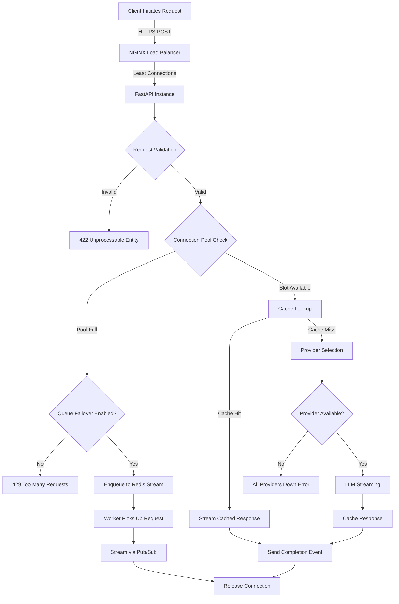
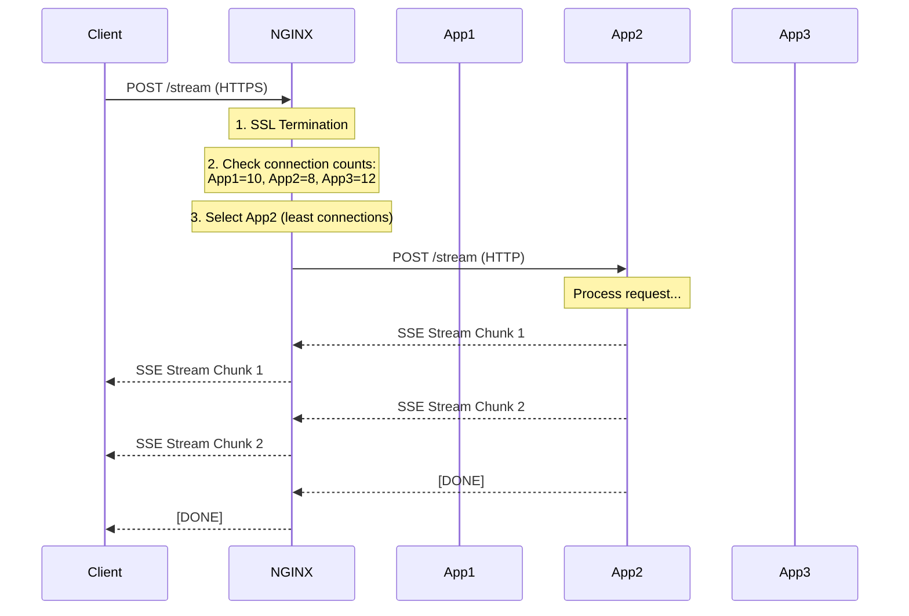
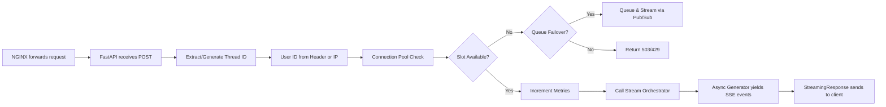
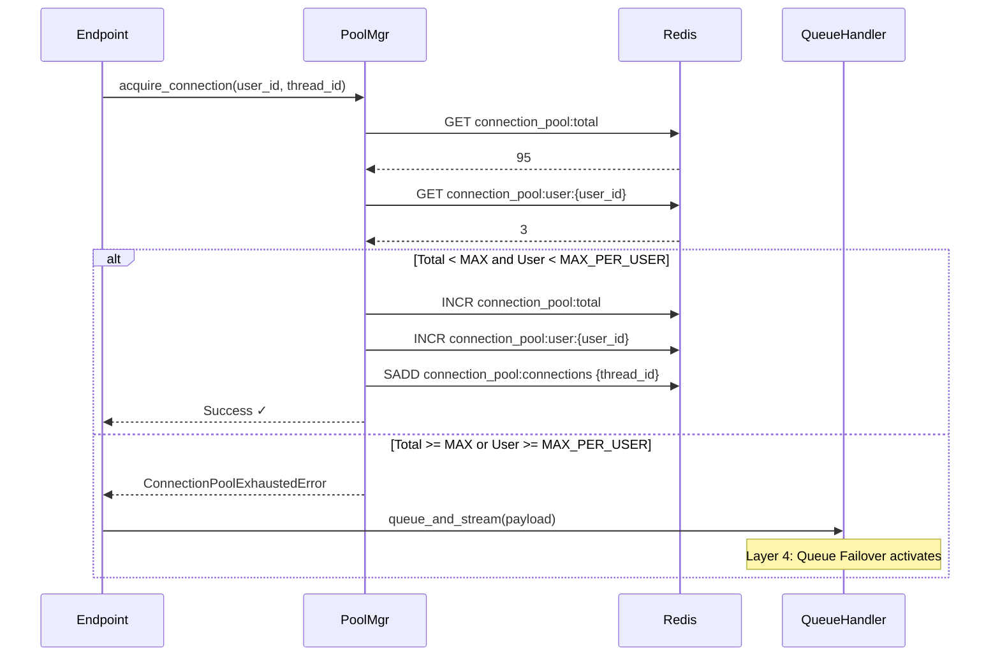
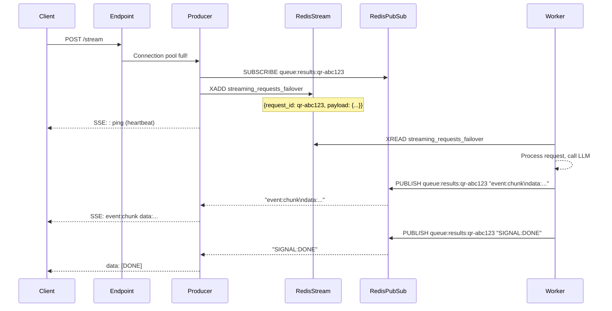
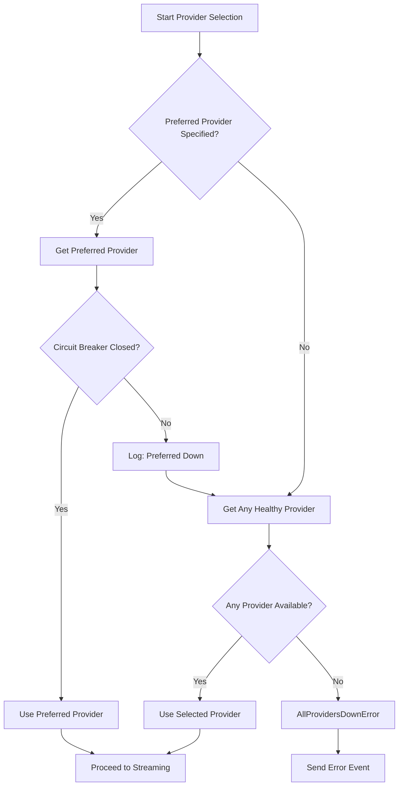
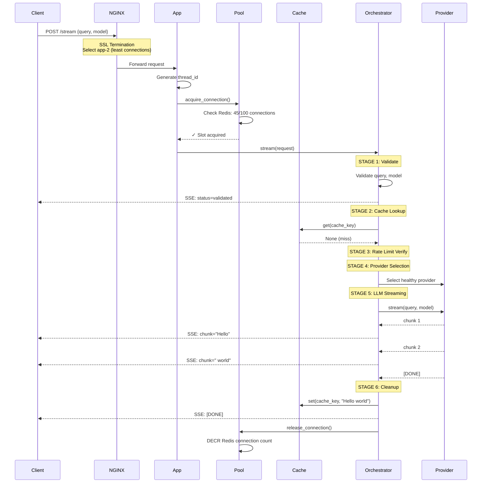
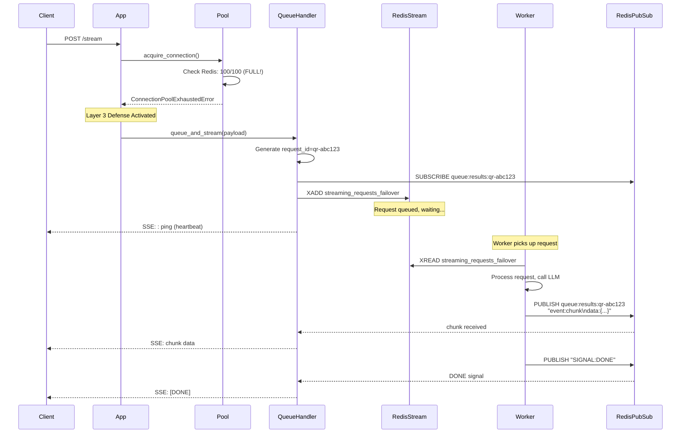
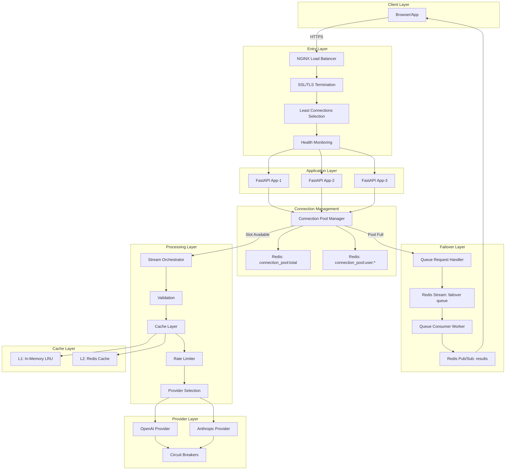

# SSE Streaming Service: Complete End-to-End Technical Flow

**A Comprehensive Technical Guide to Understanding the SSE Microservice Architecture**

> [!IMPORTANT]
> This document provides a detailed, stage-by-stage breakdown of how requests flow through the SSE streaming microservice from client to backend and back. It is designed for technical reviewers, developers, and architects who need to understand the internal decision-making, resilience mechanisms, and scalability patterns that make this system robust.

---

## Table of Contents

1. [System Overview](#chapter-1-system-overview)
2. [Architecture Components](#chapter-2-architecture-components)
3. [Request Flow Stages](#chapter-3-request-flow-stages)
4. [Layer 1: NGINX Load Balancer](#chapter-4-layer-1-nginx-load-balancer)
5. [Layer 2: FastAPI Application](#chapter-5-layer-2-fastapi-application)
6. [Layer 3: Connection Pool Management](#chapter-6-layer-3-connection-pool-management)
7. [Layer 4: Queue Failover (Distributed)](#chapter-7-layer-4-queue-failover-distributed)
8. [Stream Orchestration](#chapter-8-stream-orchestration)
9. [Resilience Mechanisms](#chapter-9-resilience-mechanisms)
10. [Complete Flow Diagrams](#chapter-10-complete-flow-diagrams)

---

## Chapter 1: System Overview

### 1.1 Purpose of This Document

This document provides an **authoritative technical reference** for understanding how a single user request flows through the SSE (Server-Sent Events) streaming microservice. It documents:

- **Every stage** of request processing
- **Every decision point** where the system makes routing, failover, or error handling choices
- **Every resilience layer** that ensures scalability and robustness
- **Every data structure** used for distributed coordination

### 1.2 High-Level Architecture

The SSE streaming service is a **multi-layer, distributed streaming microservice** designed to handle real-time AI/LLM streaming responses with enterprise-grade resilience. The system consists of:

```
┌─────────────┐
│   CLIENT    │  (Browser, Mobile App, API Consumer)
└──────┬──────┘
       │ HTTPS
       │
       ▼
┌─────────────────────────────────────────────┐
│        LAYER 1: NGINX LOAD BALANCER         │
│   - SSL/TLS Termination                     │
│   - Least Connections Load Balancing        │
│   - Connection Buffering Disabled (SSE)     │
│   - Health Checks                           │
└──────────────┬──────────────────────────────┘
               │ HTTP/1.1
               │
               ▼
┌─────────────────────────────────────────────┐
│     LAYER 2: FASTAPI APPLICATION POOL       │
│   - Multiple Instances (app-1, app-2,app-3) │
│   - Request Validation                      │
│   - Connection Pool Enforcement             │
│   - SSE Streaming Response                  │
└──────────────┬──────────────────────────────┘
               │
               ├──▶ [LAYER 3: CONNECTION POOL]
               │    - Redis-backed coordination
               │    - Per-user limits
               │    - Global capacity limits
               │
               ├──▶ [LAYER 4: QUEUE FAILOVER]
               │    - Redis Stream + Pub/Sub
               │    - Distributed worker processing
               │    - True streaming during failover
               │
               ├──▶ [CACHE LAYER]
               │    - L1: In-Memory (LRU)
               │    - L2: Redis (Distributed)
               │
               ├──▶ [STREAM ORCHESTRATOR]
               │    - 6-Stage Request Lifecycle
               │    - Provider selection
               │    - LLM streaming
               │
               └──▶ [LLM PROVIDERS]
                    - OpenAI, Anthropic, etc.
                    - Circuit breaker protection
                    - Automatic failover
```

### 1.3 Design Principles

The architecture is built on these core principles:

| Principle | Implementation |
|-----------|----------------|
| **Resilience** | 3-layer defense: NGINX rate limiting, connection pool backpressure, queue failover |
| **Scalability** | Horizontal scaling via Docker Compose, Redis-backed coordination |
| **Observability** | Stage-based logging, thread ID correlation, metrics at every layer |
| **Fail-Fast** | Validation at entry point, circuit breakers on providers |
| **Graceful Degradation** | Queue failover instead of 429 errors, cache serves stale during LLM outages |

---

## Chapter 2: Architecture Components

### 2.1 Component Inventory

| Component | Technology | Purpose | Distributed? |
|-----------|-----------|---------|--------------|
| **Load Balancer** | NGINX | Traffic distribution, SSL termination | No (single instance) |
| **Application Server** | FastAPI + Uvicorn | Request handling, SSE streaming | Yes (3 instances) |
| **Connection Pool** | Redis-backed | Capacity enforcement | Yes (shared state) |
| **Queue Failover** | Redis Streams + Pub/Sub | Overflow handling | Yes (distributed workers) |
| **Cache (L1)** | Python LRU Cache | In-memory fast cache | No (per-instance) |
| **Cache (L2)** | Redis | Distributed cache | Yes (shared state) |
| **Message Queue** | Redis Streams / Kafka | Async request processing | Yes (distributed) |
| **Circuit Breaker** | Custom Python | Provider failure protection | Yes (Redis state) |
| **Rate Limiter** | NGINX + Redis | Request throttling | Yes (distributed) |

### 2.2 Docker Network Architecture

The system runs in a **Docker Compose environment** with the following services:

```yaml
Services:
  - nginx (port 80→443)
  - app-1 (port 8000)
  - app-2 (port 8000)
  - app-3 (port 8000)
  - redis (port 6379)
  - kafka (optional, port 9092)
  - prometheus (port 9090)
  - grafana (port 3000)
```

**Network Communication:**
- Client → NGINX: Public internet (HTTPS)
- NGINX → Apps: Docker internal network (HTTP)
- Apps → Redis: Docker internal network (TCP)
- Apps → Kafka: Docker internal network (TCP)

**Why Docker Compose?**
- Development environment parity with production
- Easy horizontal scaling (`docker-compose up --scale app=3`)
- Service discovery via Docker DNS
- Network isolation and security

---

## Chapter 3: Request Flow Stages

### 3.1 Complete Request Lifecycle

Every SSE streaming request goes through these stages:



### 3.2 Stage Summary Table

| Stage | Component | Duration | Purpose | Failure Mode |
|-------|-----------|----------|---------|--------------|
| **S1** | NGINX | <1ms | Load balance, SSL terminate | 503 if all backends down |
| **S2** | FastAPI | 1-5ms | Validate request | 422 if invalid |
| **S3** | Connection Pool | <1ms | Enforce capacity | Queue failover or 429 |
| **S4** | Cache Layer | 1-50ms | Serve cached responses | Continue to LLM |
| **S5** | Rate Limiter | <1ms | Throttle abusive users | 429 if exceeded |
| **S6** | Provider Selection | 5-20ms | Choose healthy LLM | Error if all down |
| **S7** | LLM Streaming | 1-10s | Generate AI response | Retry or failover |
| **S8** | Cleanup & Caching | 10-50ms | Store for future | Log error, continue |

---

## Chapter 4: Layer 1: NGINX Load Balancer

### 4.1 Purpose and Responsibilities

The NGINX load balancer is the **entry point** for all client requests. It handles:

1. **SSL/TLS Termination**: Decrypts HTTPS traffic
2. **Load Balancing**: Distributes requests across multiple FastAPI instances
3. **Health Checks**: Routes traffic only to healthy backends
4. **Connection Management**: Prevents buffering for SSE streaming
5. **Security**: HTTP→HTTPS redirect, header sanitization

### 4.2 Load Balancing Algorithm

**Algorithm: Least Connections**

```nginx
upstream sse_backend {
    least_conn;  # Send to instance with fewest active connections
    server app-1:8000 max_fails=3 fail_timeout=30s;
    server app-2:8000 max_fails=3 fail_timeout=30s;
    server app-3:8000 max_fails=3 fail_timeout=30s;
    keepalive 32;
}
```

**Why Least Connections?**
- SSE connections are **long-lived** (seconds to minutes)
- Round-robin would create uneven load (some instances with many long connections)
- Least connections ensures **fair distribution** of active streams

**Health Check Logic:**
1. NGINX sends request to backend
2. If it fails, increment failure counter
3. If failures ≥ `max_fails` (3), mark backend as down
4. Wait `fail_timeout` (30s) before retrying
5. If retry succeeds, reset failure counter

### 4.3 SSE-Specific Configuration

```nginx
location / {
    proxy_pass http://sse_backend;
    proxy_http_version 1.1;
    proxy_buffering off;             # CRITICAL: Disable buffering
    proxy_set_header X-Accel-Buffering no;
    proxy_read_timeout 300s;         # 5 min for long LLM responses
    proxy_set_header Connection "";  # Enable keep-alive
}
```

**Configuration Rationale:**

| Setting | Value | Why? |
|---------|-------|------|
| `proxy_buffering off` | Disabled | SSE requires immediate chunk delivery, not buffered response |
| `proxy_read_timeout` | 300s | LLM generation can take minutes, prevent premature timeout |
| `proxy_http_version` | 1.1 | Required for keep-alive and SSE |
| `X-Accel-Buffering` | no | Redundant but ensures no buffering at any level |

### 4.4 Request Flow Through NGINX



**Key Observations:**
- NGINX **passes through** SSE chunks immediately (no buffering)
- Each chunk flows: App → NGINX → Client in real-time
- Connection count tracking ensures even load distribution

---

## Chapter 5: Layer 2: FastAPI Application

### 5.1 Application Architecture

Each FastAPI instance runs as a **separate Docker container** with:

```
FastAPI Instance
├── HTTP Server (Uvicorn)
├── Routes (/stream, /health, etc.)
├── Middleware (Rate Limiting, Request Logging)
├── Dependency Injection (Orchestrator, Cache, etc.)
└── Business Logic (Stream Orchestrator)
```

### 5.2 Streaming Endpoint

**File:** `src/application/api/routes/streaming.py`

**Endpoint:** `POST /stream`

**Request Model:**

```python
class StreamRequestModel(BaseModel):
    query: str = Field(..., min_length=1, max_length=100000)
    model: str = Field(description="LLM model identifier")
    provider: str | None = Field(default=None)
```

**Response:** SSE Event Stream

```
event: status
data: {"status": "validated", "thread_id": "..."}

event: chunk
data: {"content": "Hello", "chunk_index": 1}

event: chunk
data: {"content": " world", "chunk_index": 2}

data: [DONE]
```

### 5.3 Request Processing Stages



### 5.4 Dependency Injection

FastAPI uses **dependency injection** to provide components:

```python
@router.post("")
async def create_stream(
    request: Request,
    body: StreamRequestModel,
    orchestrator: OrchestratorDep,  # Injected
    user_id: UserIdDep              # Injected
):
    # orchestrator is ready to use, no manual creation
    async for event in orchestrator.stream(stream_request):
        yield event.format()
```

**Dependencies Injected:**
1. `OrchestratorDep`: Stream orchestrator instance
2. `UserIdDep`: User identification (from header or IP)
3. `Request`: FastAPI request object

**Benefits:**
- Testability (inject mocks for testing)
- Separation of concerns (routing vs. business logic)
- Configuration centralization (lifespan event creates singletons)

---

## Chapter 6: Layer 3: Connection Pool Management

### 6.1 Purpose

The **Connection Pool Manager** is a **distributed capacity enforcement** mechanism that prevents server overload by limiting concurrent SSE connections.

### 6.2 Architecture

**File:** `src/core/resilience/connection_pool_manager.py`

**Coordination:** Redis-backed with local fallback

```
Connection Pool Manager
├── Global Limit: MAX_CONCURRENT_CONNECTIONS (e.g., 100)
├── Per-User Limit: MAX_CONNECTIONS_PER_USER (e.g., 5)
├── Redis Keys:
│   ├── "connection_pool:total" → Integer (total connections)
│   ├── "connection_pool:user:{user_id}" → Integer (user connections)
│   └── "connection_pool:connections" → Set (thread IDs)
└── Health States: HEALTHY, DEGRADED, CRITICAL, EXHAUSTED
```

### 6.3 Connection Acquisition Flow



### 6.4 Why Redis-Backed?

**Problem:** Multiple FastAPI instances need to share connection count

**Solution:** Redis as single source oftruth

| Scenario | Without Redis | With Redis |
|----------|---------------|------------|
| App-1 has 40 connections | App-1 thinks: "40/100 OK" | Redis: "95/100 total" |
| App-2 has 35 connections | App-2 thinks: "35/100 OK" | All apps see same count |
| App-3 has 20 connections | App-3 thinks: "20/100 OK" | Prevents overload |
| **Total = 95** | ❌ Each accepts more (overload!) | ✓ Enforces global limit |

### 6.5 Health States

```python
if total_count >= max_connections:
    return ConnectionState.EXHAUSTED   # 100%
elif total_count >= critical_threshold:
    return ConnectionState.CRITICAL    # 90-100%
elif total_count >= degraded_threshold:
    return ConnectionState.DEGRADED    # 70-90%
else:
    return ConnectionState.HEALTHY     # <70%
```

**Usage:** Metrics, alerts, autoscaling triggers

---

## Chapter 7: Layer 4: Queue Failover (Distributed)

### 7.1 Purpose

When the connection pool is exhausted (all slots taken), instead of returning **429 Too Many Requests**, the system **queues the request** for processing when resources become available.

**This is the 3rd layer of defense:**
1. **Layer 1**: NGINX rate limiting (requests/second)
2. **Layer 2**: Connection pool (concurrent connections)
3. **Layer 3**: Queue failover (overflow handling)

### 7.2 Architecture

**File:** `src/core/resilience/queue_request_handler.py`

**Components:**
- **Producer** (this handler): Enqueues requests to Redis Stream
- **Consumer Worker** (separate process): Processes queued requests
- **Pub/Sub Channel**: Streams results back to waiting client

```
┌─────────────────┐
│  FastAPI Endpoint │
└────────┬─────────┘
         │ (Connection pool full)
         ▼
┌─────────────────────────────────────┐
│  Queue Request Handler (Producer)   │
│  1. Generate request_id             │
│  2. Subscribe to Redis channel      │
│  3. Enqueue to Redis Stream         │
│  4. Yield chunks from Pub/Sub       │
└────────┬────────────────────────────┘
         │
         ├──▶ Redis Stream: "streaming_requests_failover"
         │    └─ Message: {request_id, user_id, payload}
         │
         └──▶ Redis Pub/Sub: "queue:results:{request_id}"
                └─ Subscribe (waiting for results)

         ┌─────────────────────────────────────┐
         │  Queue Consumer Worker (Consumer)   │
         │  1. Pop from Redis Stream           │
         │  2. Process request (call LLM)      │
         │  3. Publish chunks to channel       │
         │  4. Publish DONE/ERROR signal       │
         └─────────────────────────────────────┘
```

### 7.3 Distributed Streaming Pattern

**Original Problem (v1):**
- Used process-local `asyncio.Future`
- Failed in Docker: consumer on app-2, request on app-1
- Future not shared across processes!

**Solution (v2):**
- **Redis Pub/Sub** for distributed communication
- Request handler subscribes to `queue:results:{request_id}`
- Worker publishes chunks to that same channel
- Works across any number of instances!

### 7.4 Queue Flow



### 7.5 Redis Data Structures

**Redis Stream** (Queue):

```
Key: streaming_requests_failover
Type: Stream
Value: [
  {
    message_id: "1234567890-0",
    data: {
      request_id: "qr-abc123",
      user_id: "user-456",
      thread_id: "thread-789",
      payload: {query: "...", model: "gpt-4"},
      enqueue_time: 1234567890.123,
      status: "pending"
    }
  },
  ...
]
```

**Redis Pub/Sub** (Results):

```
Channel: queue:results:qr-abc123
Messages:
  "event: chunk\ndata: {\"content\": \"Hello\"}\n\n"
  "event: chunk\ndata: {\"content\": \" world\"}\n\n"
  "SIGNAL:DONE"
```

### 7.6 Heartbeat Mechanism

**Problem:** Long queue wait times can cause NGINX to timeout (proxy_read_timeout=300s)

**Solution:** Send SSE comment pings every 15 seconds

```python
# Keep connection alive (NGINX proxy_read_timeout often 60s)
ping_interval = 15.0

if current_time - last_ping_time > ping_interval:
    yield ": ping\n\n"  # SSE comment, ignored by client
```

**Benefits:**
- Keeps TCP connection alive
- Prevents proxy timeouts
- Client knows system is working (not frozen)

---

## Chapter 8: Stream Orchestration

### 8.1 Purpose

The **Stream Orchestrator** is the **central coordinator** that manages the complete lifecycle of every streaming request through **6 distinct stages**.

**File:** `src/llm_stream/services/stream_orchestrator.py`

### 8.2 The 6-Stage Pipeline

```
┌──────────────────────────────────────────────────────────┐
│ STAGE 1: VALIDATION                                      │
│ Duration: ~1-5ms                                         │
│ - Validate query length (1-100,000 chars)               │
│ - Validate model name                                    │
│ - Check connection limits                                │
└─────────────────┬────────────────────────────────────────┘
                  ▼
┌──────────────────────────────────────────────────────────┐
│ STAGE 2: CACHE LOOKUP                                    │
│ Duration: ~1-50ms                                        │
│ - Generate cache key: hash(query + model)               │
│ - Check L1 cache (in-memory LRU)                        │
│ - Check L2 cache (Redis)                                 │
│ - If HIT: Return cached response (skip stages 3-6)      │
└─────────────────┬────────────────────────────────────────┘
                  ▼
┌──────────────────────────────────────────────────────────┐
│ STAGE 3: RATE LIMITING VERIFICATION                      │
│ Duration: ~1ms                                           │
│ - Log that rate limiting was verified                    │
│ - Actual enforcement done by middleware                  │
└─────────────────┬────────────────────────────────────────┘
                  ▼
┌──────────────────────────────────────────────────────────┐
│ STAGE 4: PROVIDER SELECTION                              │
│ Duration: ~5-20ms                                        │
│ - Check preferred provider (if specified)                │
│ - Verify circuit breaker is CLOSED (healthy)            │
│ - If preferred down, failover to another provider        │
│ - If all providers down: AllProvidersDownError           │
└─────────────────┬────────────────────────────────────────┘
                  ▼
┌──────────────────────────────────────────────────────────┐
│ STAGE 5: LLM STREAMING                                   │
│ Duration: ~1-10 seconds                                  │
│ - Start heartbeat task (background)                      │
│ - Call provider.stream(query, model)                     │
│ - Yield each chunk to client immediately                 │
│ - Collect chunks for caching                             │
│ - Stop heartbeat when complete                           │
└─────────────────┬────────────────────────────────────────┘
                  ▼
┌──────────────────────────────────────────────────────────┐
│ STAGE 6: CLEANUP & CACHING                               │
│ Duration: ~10-50ms                                       │
│ - Join all chunks into complete response                 │
│ - Cache response in L1 + L2 with TTL                     │
│ - Collect execution metrics                              │
│ - Send completion event to client                        │
└──────────────────────────────────────────────────────────┘
```

### 8.3 Cache Strategy

**Two-Tier Cache:**

```
Request → Check L1 (Memory)
          ├─ HIT → Return immediately (latency: ~1ms)
          └─ MISS → Check L2 (Redis)
                    ├─ HIT → Populate L1, return (latency: ~10-50ms)
                    └─ MISS → Call LLM (latency: ~1-10s)
```

**Cache Key Generation:**

```python
cache_key = f"response:{hash(query)}:{model}"
# Example: "response:a3f9e2b1:gpt-4"
```

**Why Two Tiers?**
- **L1 (Memory)**: Fastest, but limited capacity, not shared across instances
- **L2 (Redis)**: Shared across all instances, larger capacity, still fast

**Cache TTL:** Configured via `CACHE_RESPONSE_TTL` (e.g., 3600s = 1 hour)

### 8.4 Provider Selection Logic



**Circuit Breaker States:**

| State | Meaning | Action |
|-------|---------|--------|
| **CLOSED** | Provider healthy | Allow requests |
| **OPEN** | Provider failing | Block requests, fail fast |
| **HALF_OPEN** | Testing recovery | Allow limited requests |

**Failover Example:**
1. User prefers "openai"
2. OpenAI circuit breaker is OPEN (failing)
3. System selects "anthropic" instead
4. User gets response from Anthropic (transparent failover)

### 8.5 Heartbeat Mechanism

**Problem:** LLM generation can pause for seconds (thinking, processing)

**Solution:** Send periodic keepalive events

```python
async def _heartbeat_loop(self, thread_id: str):
    while True:
        await asyncio.sleep(SSE_HEARTBEAT_INTERVAL)  # 15s
        yield SSEEvent(event="heartbeat", data={})
```

**Benefits:**
- Keeps connection alive (prevents proxy timeouts)
- Client knows stream is active (not frozen)
- Detects client disconnections early

---

## Chapter 9: Resilience Mechanisms

### 9.1 Three Layers of Defense

```
┌────────────────────────────────────────────────────────┐
│ LAYER 1: NGINX RATE LIMITING                          │
│ - Limits requests per second per IP                   │
│ - Prevents abuse at network edge                      │
│ - Returns 429 if exceeded                             │
└────────────────────────────────────────────────────────┘
                        ▼
┌────────────────────────────────────────────────────────┐
│ LAYER 2: CONNECTION POOL                              │
│ - Limits concurrent SSE connections                   │
│ - Redis-backed distributed counting                   │
│ - Provides backpressure                               │
└────────────────────────────────────────────────────────┘
                        ▼
┌────────────────────────────────────────────────────────┐
│ LAYER 3: QUEUE FAILOVER                               │
│ - Queues overflow requests                            │
│ - Processes when resources available                  │
│ - True streaming via Redis Pub/Sub                    │
└────────────────────────────────────────────────────────┘
```

**Why Three Layers?**
- **Defense in Depth**: Multiple failure modes, multiple safeguards
- **Graceful Degradation**: System never crashes, it queues
- **Different Concerns**: Rate (requests/sec) vs Capacity (concurrent) vs Overflow (queue)

### 9.2 Circuit Breaker Pattern

**Purpose:** Prevent cascading failures when LLM providers fail

**Mechanism:**

```
Normal Operation:
  Request → Circuit CLOSED → Call Provider → Success ✓

Provider Starts Failing:
  Request → Circuit CLOSED → Call Provider → Failure (1)
  Request → Circuit CLOSED → Call Provider → Failure (2)
  Request → Circuit CLOSED → Call Provider → Failure (3)
  
Circuit Opens (Fail Fast):
  Request → Circuit OPEN → Immediate Error (no call) → Failover

After Timeout (Testing Recovery):
  Request → Circuit HALF_OPEN → Call Provider → Success?
    ├─ Yes: Close circuit (recovered)
    └─ No: Re-open circuit (still failing)
```

**Configuration:**

```python
circuit_breaker = CircuitBreaker(
    failure_threshold=5,    # Open after 5 failures
    recovery_timeout=60,    # Try recovery after 60s
    expected_exception=ProviderError
)
```

### 9.3 Distributed Coordination

**Challenge:** Multiple FastAPI instances need to coordinate

**Solution:** Redis as shared state store

| Component | Redis Keys | Purpose |
|-----------|------------|---------|
| **Connection Pool** | `connection_pool:total` | Global connection count |
|  | `connection_pool:user:{id}` | Per-user connection count |
| **Circuit Breaker** | `circuit_breaker:{provider}` | Provider health state |
| **Cache (L2)** | `response:{hash}:{model}` | Cached LLM responses |
| **Queue** | `streaming_requests_failover` | Stream of queued requests |
|  | `queue:results:{request_id}` | Pub/Sub channel for results |

**Why Redis?**
- Fast (in-memory)
- Atomic operations (INCR, DECR)
- Pub/Sub support
- Distributed state management
- Persistence (optional)

---

## Chapter 10: Complete Flow Diagrams

### 10.1 Successful Request (Cache Miss)



### 10.2 Queue Failover Scenario



### 10.3 Complete System Dataflow



---

## Summary

This SSE streaming microservice implements a **robust, scalable, and resilient architecture** using:

1. **NGINX Load Balancer** for traffic distribution with least-connections algorithm
2. **Multiple FastAPI Instances** for horizontal scalability
3. **Redis-Backed Connection Pool** for distributed capacity enforcement
4. **Queue Failover with Pub/Sub** for graceful overflow handling
5. **6-Stage Stream Orchestration** for consistent request processing
6. **Two-Tier Cache** (L1+L2) for performance optimization
7. **Circuit Breakers** for provider failure protection
8. **Distributed Coordination** via Redis for multi-instance deployments

**Key Design Decisions:**

- **Least Connections** over round-robin for long-lived SSE streams
- **Queue Failover** over 429 errors for better user experience
- **Redis Pub/Sub** for distributed streaming (not process-local Futures)
- **Heartbeats** at 15s intervals to prevent proxy timeouts
- **Fail-Fast Validation** at entry point to save resources
- **Circuit Breakers** to prevent cascading provider failures

This architecture ensures the system remains **responsive under load**, **resilient to failures**, and **scalable across multiple instances**.
