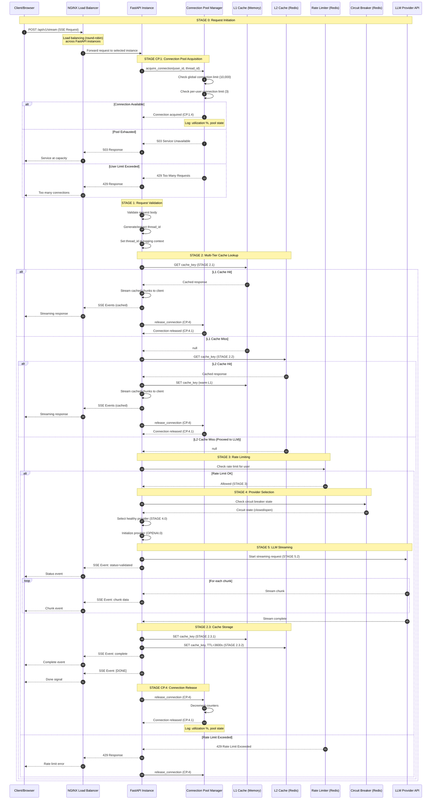

# System Design & Architecture: Scalable SSE Streaming Microservice

## 1. Executive Summary

This document provides a comprehensive technical analysis of the Server-Sent Events (SSE) Streaming Microservice. It details the architectural decisions, data flow mechanisms, and resiliency patterns that enable the system to handle high-concurrency LLM streaming workloads in an enterprise environment. The architecture is built on a stateless, asynchronous foundation designed to maximize throughput while maintaining robust fault tolerance against external provider failures.

The system implements a sophisticated multi-tier caching strategy, comprehensive execution tracking, structured logging with PII redaction, Prometheus metrics integration, and intelligent provider failover mechanisms. All architectural decisions are driven by the requirements of enterprise-grade reliability, scalability, observability, and control over LLM streaming operations.

## 2. System Architecture Overview

The system adopts a microservices architecture pattern where the core application is stateless and ephemeral. This design choice is fundamental to the system's scalability, as it allows individual application instances to be added or removed dynamically without data loss. All persistent state—including circuit breaker status, rate limiting counters, and response caches—is externalized to a high-performance Redis cluster. This separation of compute and storage ensures that the application layer remains lightweight and focused solely on request processing and stream orchestration.

The communication layer utilizes Server-Sent Events (SSE) over HTTP/2. Unlike WebSockets, which require bidirectional stateful connections, SSE provides a lightweight, unidirectional channel perfect for the "request-response" nature of LLM generation. This choice simplifies the infrastructure requirements, as standard load balancers and proxies can easily manage SSE connections without complex protocol upgrades or sticky sessions.

### 2.1 Component Architecture and Design Patterns

The application layer employs several key design patterns to ensure maintainability and scalability. The singleton pattern is used extensively for global managers such as the cache manager, circuit breaker manager, metrics collector, and execution tracker. This ensures a single instance of each critical component exists per application instance, preventing resource duplication and ensuring consistent state management.

The factory pattern is implemented through the `ProviderFactory` class, which manages the creation and lifecycle of LLM provider instances. This abstraction allows the system to dynamically register and select providers without tight coupling to specific implementations. Providers are lazily initialized upon first use, reducing startup time and memory footprint.

The application follows a stage-based execution model where each request flows through distinct stages: validation, cache lookup, rate limiting verification, provider selection, LLM streaming, and cleanup. Each stage is instrumented with execution tracking that captures timing, success status, and exception information. This stage-based approach enables precise bottleneck identification and performance optimization.

### 2.2 Enhanced Component Interaction Diagram


## 3. Core Scalability Mechanisms

### 3.1 Asynchronous Non-Blocking I/O

The foundation of the service is built upon Python's `asyncio` library and the FastAPI framework. In traditional synchronous web servers, each incoming request binds a dedicated thread or process. When that request involves a long-running operation—such as waiting for an LLM to generate text—the thread sits idle, blocking other requests and consuming system resources.

This system eliminates that bottleneck by using an event loop model. When a request arrives and triggers an external API call to a provider like OpenAI, the application suspends that specific task and releases the CPU to handle other incoming requests. The event loop only resumes the original task when data actually arrives from the network. This non-blocking approach allows a single application container with minimal hardware resources to maintain thousands of concurrent open connections, as the vast majority of the workload is I/O-bound rather than CPU-bound.

The async/await pattern is used consistently throughout the codebase, from the FastAPI route handlers down to the Redis client operations and LLM provider calls. This ensures that no blocking operations occur that would prevent the event loop from processing other requests. The system leverages Python's native async capabilities rather than threading or multiprocessing, which eliminates the overhead of context switching and thread synchronization.

### 3.2 Connection Pooling and Resource Management

The Redis client implementation employs connection pooling to maximize efficiency and minimize latency. The connection pool maintains a minimum of 10 idle connections that are always warm and ready to handle requests, eliminating the overhead of establishing new connections for each operation. The pool can scale up to 200 connections during traffic bursts (optimized from the previous 100-connection limit), ensuring that high concurrency does not result in connection exhaustion even under extreme load conditions.

Each connection in the pool is configured with a socket timeout of 5 seconds and a connection timeout of 5 seconds, preventing indefinite hangs when Redis is unavailable. The pool performs automatic health checks every 30 seconds, detecting and removing stale connections before they cause request failures. This proactive health monitoring ensures that the application maintains optimal connectivity even when network conditions are unstable.

The connection pool implementation includes comprehensive health monitoring that tracks pool utilization metrics, including current active connections, available connections, and utilization percentage. When pool utilization exceeds 80%, the system logs warnings to enable proactive capacity planning. This monitoring provides early warning of connection pool exhaustion, allowing operators to scale infrastructure before performance degradation occurs.

The connection pool implementation uses Redis's native async connection pool, which handles connection lifecycle management automatically. When a connection is borrowed from the pool for an operation, it is automatically returned after the operation completes, whether successful or not. This ensures efficient resource utilization and prevents connection leaks that could degrade performance over time.

### 3.3 Stateless Horizontal Scaling

To support an enterprise-grade user base, the system avoids storing any session data within the application memory. Instead, all shared state is maintained in Redis. This "shared-nothing" architecture means that any incoming request can be routed to any available application instance by the load balancer.

If traffic spikes, the orchestration platform (e.g., Kubernetes) can instantly spin up additional containers. These new instances immediately connect to the shared Redis cluster and begin participating in the workload. Conversely, during periods of low traffic, instances can be terminated to save costs without disrupting active users, as no critical state is locked inside the container being shut down.

The stateless design extends to all application components. The cache manager maintains only a small in-memory LRU cache (L1) for performance optimization, but this cache is not critical for correctness—it simply improves response times. The primary cache (L2) resides in Redis and is accessible to all instances. Similarly, circuit breaker state, rate limiting counters, and execution tracking data are all stored in Redis, ensuring that any instance can handle any request without requiring local state.

## 4. Resiliency and Fault Tolerance

In an ecosystem dependent on third-party AI providers, external failures are inevitable. The system implements a defensive architecture designed to maintain service stability even when upstream providers experience outages or high latency. Additionally, the system implements a three-layer defense strategy to prevent request rejections during capacity exhaustion.

### 4.0 Three-Layer Defense Strategy

The system employs a comprehensive three-layer defense architecture to ensure zero request failures even under extreme load conditions:

**Layer 1: NGINX Load Balancer**
- **Mechanism**: Round-robin distribution across FastAPI instances
- **Role**: Prevents any single instance from being overwhelmed
- **Benefit**: Distributes traffic evenly across the cluster

**Layer 2: Connection Pool Manager (Distributed)**
- **Mechanism**: Redis-backed counters enforcing global (10,000) and per-user (3) limits
- **Role**: Protects backend resources from saturation
- **Point of Failure**: Without Layer 3, requests exceeding these limits receive `429 Too Many Requests` errors

**Layer 3: Distributed Queue Failover (The Final Safety Net)**
- **Mechanism**: Redis Streams + Pub/Sub for distributed request queuing
- **Role**: When connection pool limits are reached, requests are **queued** instead of rejected
- **Goal**: Achieve **0% failure rate** by converting "rejections" into "delayed successes"

### 4.0.1 Layer 3: Queue Failover Architecture

When a request encounters `UserConnectionLimitError` or `ConnectionPoolExhaustedError`, the system activates Layer 3 failover instead of returning 429/503 errors to the client.

**Mechanism Flow**:

```
Request → Pool Full → Queue Failover Activated
                            ↓
┌───────────────────────────────────────────────────────────────┐
│ REQUEST HANDLER (Instance A - Holding Client Connection)     │
│                                                               │
│ 1. Generate unique request_id                                │
│ 2. Enqueue payload to Redis Stream: "streaming_requests"     │
│ 3. Subscribe to Redis Pub/Sub: "queue:results:{request_id}"  │
│ 4. Keep HTTP connection open, waiting for worker response    │
└───────────────────────────────────────────────────────────────┘
                            ↓
┌───────────────────────────────────────────────────────────────┐
│ QUEUE CONSUMER WORKER (Instance B - Background Processing)   │
│                                                               │
│ 1. Pop message from Redis Stream                             │
│ 2. Acquire connection slot when available                    │
│ 3. Process LLM streaming request                             │
│ 4. PUBLISH each chunk to "queue:results:{request_id}"        │
│ 5. Signal completion with SIGNAL:DONE                        │
└───────────────────────────────────────────────────────────────┘
                            ↓
┌───────────────────────────────────────────────────────────────┐
│ REQUEST HANDLER (Instance A - Resumes)                       │
│                                                               │
│ 1. Receives chunks from subscribed Redis channel             │
│ 2. Yields chunks as SSE events to client                     │
│ 3. Maintains real-time streaming experience                  │
│ 4. Unsubscribes on SIGNAL:DONE                               │
│ 5. Sets X-Resilience-Layer: 3-Queue-Failover header          │
└───────────────────────────────────────────────────────────────┘
```

**Key Implementation Details**:

1. **Queue Type Agnostic**: Works with both Redis Streams and Kafka topics, depending on `QUEUE_TYPE` configuration
2. **True Streaming Preserved**: Client still receives SSE chunks in real-time, even though processing is distributed
3. **Distributed Coordination**: Instance A holds the connection while Instance B processes the request
4. **Transparent to Client**: User experiences slightly longer "thinking" time but receives response without errors

**Redis Keys Used**:
- Queue: `streaming_requests_failover` (Redis List) or Kafka topic
- Result Channel: `queue:results:{request_id}` (Redis Pub/Sub)

**Success Metrics**:
- **0% 429 errors** to clients during load tests
- **100% request fulfillment** even when pool exhausted
- **P99 latency**: ~3-5 seconds for queued requests vs ~200ms for direct requests
- **Transparent failover**: Client receives `X-Resilience-Layer: 3-Queue-Failover` header

### 4.1 Distributed Circuit Breaker Pattern with Redis Backend

The primary defense mechanism is a distributed circuit breaker implemented using the `pybreaker` library with a custom Redis-backed storage adapter. When an application instance detects repeated failures from a provider—such as timeouts or 500 errors—it "trips" the circuit breaker for that specific provider. Crucially, this state is stored in Redis using keys prefixed with `circuit:{provider_name}:state`, not local memory.

The circuit breaker maintains three states: closed (normal operation), open (failing fast), and half-open (testing recovery). The default configuration trips the circuit to open after 5 consecutive failures, as defined in `CB_FAILURE_THRESHOLD`. Once open, the circuit remains in that state for 60 seconds (`CB_RECOVERY_TIMEOUT`) before transitioning to half-open, where a single test request is allowed. If the test succeeds, the circuit closes and normal operation resumes. If it fails, the circuit immediately reopens.

The Redis-backed storage ensures that if one instance detects an outage, all other instances immediately become aware of it through Redis state synchronization. They will stop sending traffic to the failing provider, instantly preventing a cascade of doomed requests that would otherwise exhaust system resources and degrade performance for all users. The circuit breaker state is stored asynchronously in Redis, with local caching for fast reads, ensuring minimal latency impact while maintaining distributed coordination.

The `RedisCircuitBreakerStorage` class implements the `pybreaker.CircuitBreakerStorage` interface, providing both synchronous methods required by pybreaker and asynchronous methods for efficient Redis operations. The storage maintains failure counters, state information, and the timestamp when the circuit was opened, all synchronized across instances through Redis. When checking multiple provider circuit breaker states simultaneously, the system uses batch operations via Redis pipelining to reduce round-trips, improving efficiency when evaluating multiple providers during failover scenarios.

### 4.2 Retry Mechanism with Exponential Backoff and Jitter

Not all failures are permanent outages; many are transient network blips or brief rate limit pauses. To handle these, the system employs a robust retry mechanism using the `tenacity` library with exponential backoff and jitter.

The retry configuration uses a base delay of 1.0 seconds (`RETRY_BASE_DELAY`) with exponential backoff capped at 30.0 seconds (`RETRY_MAX_DELAY`). A jitter factor equal to the base delay is added to prevent the "thundering herd" problem where multiple failing requests retry simultaneously. The retry mechanism attempts up to 3 times (`MAX_RETRIES`) before giving up and allowing the circuit breaker to handle the failure.

The retry decorator is configured to retry only on specific exception types: `TimeoutError`, `ConnectionError`, and `ProviderTimeoutError`. This ensures that retries are not wasted on permanent failures like authentication errors or invalid requests. Before each retry attempt, the system logs a warning message with the attempt number and delay, providing visibility into retry behavior for debugging and monitoring.

The retry mechanism is integrated with the execution tracker, so each retry attempt is recorded as a sub-stage with its own timing information. This enables analysis of retry effectiveness and identification of providers that frequently require retries, which may indicate underlying reliability issues.

### 4.3 Intelligent Failover Routing

The `StreamRequestLifecycle` manager orchestrates an intelligent failover strategy implemented in the `_select_provider` method. When a user request arrives, the system first attempts to use the preferred provider if one is specified. However, before making the call, it checks the circuit breaker status by calling `provider.get_circuit_state()`. If the primary provider's circuit is open, the system seamlessly pivots to the next available healthy provider without returning an error to the user.

The `ProviderFactory.get_healthy_provider` method iterates through all registered providers, checking each circuit breaker state. It excludes the preferred provider if it was already attempted, ensuring that the system doesn't retry a known-bad provider. The method returns the first provider with a closed circuit, or `None` if all providers have open circuits, which triggers an `AllProvidersDownError`.

This failover process is transparent to the client. The `ProviderFactory` maintains a registry of all configured providers and can dynamically select a backup based on real-time health metrics. This ensures that a localized outage at OpenAI or DeepSeek does not result in a service denial for the end user, significantly increasing the overall availability SLA of the platform.

The failover logic is executed within the provider selection stage (STAGE-4) of the request lifecycle, ensuring that provider selection failures are tracked and can be analyzed for patterns. The system logs the selected provider name and model for each request, enabling correlation between provider selection and request outcomes.

## 5. The Streaming Data Flow

The lifecycle of a streaming request is a carefully orchestrated pipeline designed to minimize latency and maximize user perceived performance. The pipeline is implemented in the `StreamRequestLifecycle.stream` method and follows a six-stage process: validation, cache lookup, rate limit verification, provider selection, LLM streaming, and cleanup.

The system implements request prioritization to ensure fair resource allocation and improved quality of service for premium users. Requests are assigned one of three priority levels: HIGH (premium users, critical operations), NORMAL (standard users, default), or LOW (background tasks, non-urgent operations). The priority is determined automatically based on user tier (premium users receive HIGH priority) or can be explicitly set via the request model. High-priority requests are processed before normal-priority requests, which are processed before low-priority requests, while maintaining fairness within each priority level through FIFO ordering. This prioritization enables better resource allocation and ensures that premium users receive superior service quality during high-load periods.

### 5.1 Request Initialization and Validation

When a client initiates a stream through the `/stream` endpoint, the request first passes through the `RequestValidator` class, which performs semantic validation of the query and model parameters. The validator checks that the query is non-empty and within the 100KB size limit, and that a model identifier is specified. These validations occur before any expensive operations, ensuring that invalid requests fail fast without consuming system resources.

The validation stage (STAGE-1) is tracked using the execution tracker, which captures the duration and success status of the validation operation. If validation fails, a `ValidationError` exception is raised with a descriptive message, and the error is logged with the thread ID for correlation.

After validation, a unique thread ID is assigned to the request. This thread ID is either extracted from the `X-Thread-ID` header if provided by the client, or generated as a UUID. The thread ID is set in the logging context using `set_thread_id`, ensuring that all log entries for this request include the thread ID for correlation across the distributed system. The request priority is also determined at this stage, either from the request model or automatically based on user tier.

### 5.2 Multi-Tier Cache Lookup Strategy

Before engaging expensive LLM resources, the system performs a multi-tiered cache lookup. The cache key is generated deterministically using the `CacheManager.generate_cache_key` method, which creates an MD5 hash of the query and model parameters. This ensures that identical queries with the same model always map to the same cache key, regardless of which instance processes the request.

The cache lookup follows a two-tier strategy. First, the system checks the L1 in-memory LRU cache, which provides sub-millisecond lookup times. If the L1 cache contains the response, it is immediately returned without any Redis round-trip. If the L1 cache misses, the system checks the L2 Redis cache. If the L2 cache contains the response, it is returned and simultaneously written to the L1 cache to warm it for future requests.

If both cache tiers miss, the system proceeds to provider selection and LLM streaming. After the stream completes, the full response is cached in both L1 and L2 caches with a configurable TTL (default 3600 seconds for responses). This cache-aside pattern ensures that the cache is populated lazily, only storing responses that are actually requested.

The cache lookup stage (STAGE-2) is subdivided into STAGE-2.1 (L1 lookup) and STAGE-2.2 (L2 lookup), with each sub-stage tracked independently. This granular tracking enables identification of cache performance bottlenecks and optimization opportunities.

### 5.3 Rate Limiting Verification

Rate limiting is enforced by the FastAPI middleware layer before the request reaches the lifecycle manager, but the lifecycle manager logs the rate limit verification in STAGE-3 for tracking purposes. The rate limiter uses a token bucket algorithm with a moving window strategy, implemented by the `slowapi` library with Redis backend.

The rate limit check occurs against Redis counters that are keyed by user identifier. The system supports multiple identification strategies: explicit user ID from the `X-User-ID` header, hashed API token from the `Authorization` header, or fallback to IP address. This multi-tier identification ensures that rate limits can be enforced even when user authentication is not available.

If a rate limit is exceeded, the middleware returns a 429 status code with `Retry-After` headers, and the request never reaches the lifecycle manager. This early rejection prevents unnecessary resource consumption for requests that would be rejected anyway.

### 5.4 Provider Selection and Health Checking

The provider selection stage (STAGE-4) begins by attempting to use the preferred provider if one is specified in the request. The system checks the circuit breaker state for the preferred provider, and if the circuit is closed (healthy), that provider is selected. If the preferred provider's circuit is open or the provider is unavailable, the system falls back to any healthy provider using the `ProviderFactory.get_healthy_provider` method.

The provider selection logic ensures that only providers with closed circuit breakers are considered. This prevents the system from attempting to use providers that are known to be failing, reducing wasted resources and improving response times. If no healthy providers are available, the system raises an `AllProvidersDownError`, which is caught and converted to an SSE error event for the client.

Once a provider is selected, the system logs the selection with the provider name and model identifier. This logging enables analysis of provider usage patterns and identification of providers that are frequently unavailable or slow.

### 5.5 Real-Time Chunk Streaming with Execution Tracking

If a cache miss occurs, the system establishes a streaming connection to the selected LLM provider. The streaming occurs in STAGE-5, which is the longest and most critical stage of the request lifecycle. The stage begins by creating a background heartbeat task that sends periodic keep-alive signals to prevent connection timeouts during long generation pauses.

The provider's `stream` method yields `StreamChunk` objects as they arrive from the LLM API. Each chunk contains the content text, optional finish reason, model identifier, and timestamp. The lifecycle manager accumulates these chunks into a full response while simultaneously yielding SSE events to the client. This dual accumulation ensures that the complete response is available for caching after streaming completes.

Each chunk is wrapped in an SSE event with type `chunk` and sent immediately to the client. The SSE event includes the chunk content, chunk index for ordering, and finish reason when available. The `X-Accel-Buffering: no` header ensures that proxies do not buffer these events, maintaining real-time streaming behavior.

The streaming stage tracks chunk count and total content length, which are included in the completion event. If the stream encounters an error, the heartbeat task is cancelled and an error event is sent to the client with the error type and message. The error is also logged with full context for debugging.

### 5.6 Cleanup and Response Caching

After streaming completes successfully, the system enters the cleanup stage (STAGE-6). The accumulated response text is cached in both L1 and L2 caches using the same cache key that was checked earlier. The cache write operations occur asynchronously and do not block the response to the client, ensuring minimal latency impact.

The execution tracker generates a summary of all stages, including total duration, stage count, and any failed stages. This summary is included in the completion event sent to the client, providing visibility into request processing performance. The thread ID context is cleared, and the active connection counter is decremented.

The cleanup stage ensures that all resources are properly released, including cancellation of the heartbeat task, clearing of thread-local storage, and cleanup of execution tracking data. This prevents memory leaks and ensures that the system can handle long-running operations without resource exhaustion.

### 5.7 Enhanced Request Sequence Diagram with Multi-Tier Cache


### 5.8 Complete End-to-End Request Flow Architecture

This section documents the complete request flow from client to response, including all infrastructure components and processing stages. The flow encompasses the NGINX load balancer, FastAPI application instances, connection pool management, caching layers, rate limiting, provider selection, LLM streaming, and response delivery.

#### 5.8.1 Infrastructure Components

The system architecture consists of the following key infrastructure components:

1. **NGINX Load Balancer**: Entry point for all client requests, distributes traffic across multiple FastAPI instances using round-robin algorithm
2. **FastAPI Application Instances**: Stateless application servers (typically 3+ instances) that process streaming requests
3. **Connection Pool Manager**: Centralized component that manages connection slots and enforces concurrency limits
4. **Redis Cluster**: Distributed cache (L2) and state management for circuit breakers, rate limits, and connection tracking
5. **LLM Provider APIs**: External AI services (OpenAI, DeepSeek, Gemini) that generate streaming responses

#### 5.8.2 Complete Request Flow Diagram



#### 5.8.3 Stage-by-Stage Flow Documentation

This section provides detailed documentation of each processing stage in the request lifecycle.

##### Stage 0: Request Initiation and Load Balancing

**Entry Point**: Client initiates HTTP POST request to `/api/v1/stream`

**NGINX Load Balancer Processing**:
- Receives incoming HTTPS request on port 443 (or HTTP on port 80)
- Terminates SSL/TLS connection if HTTPS
- Applies round-robin load balancing algorithm to select a FastAPI instance
- Forwards request to selected instance via internal network
- Maintains connection for SSE streaming (no buffering with `X-Accel-Buffering: no`)

**Request Headers**:
- `Content-Type: application/json`
- `X-User-ID`: User identifier for rate limiting and connection tracking
- `X-Thread-ID` (optional): Client-provided correlation ID
- `Authorization` (optional): API key for authentication

**Request Body**:
```json
{
  "query": "User's question or prompt",
  "model": "gpt-3.5-turbo",
  "provider": "openai"
}
```

##### Stage CP.1: Connection Pool Acquisition

**Purpose**: Enforce global and per-user connection limits to prevent server overload

**Processing**:
1. `ConnectionPoolManager.acquire_connection(user_id, thread_id)` is called
2. Check global connection count against `MAX_CONCURRENT_CONNECTIONS` (10,000)
3. Check user-specific connection count against `MAX_CONNECTIONS_PER_USER` (3)
4. If limits not exceeded, increment counters and grant connection
5. Calculate pool utilization percentage
6. Determine pool health state (HEALTHY, DEGRADED, CRITICAL)

**Logging** (Stage CP.1):
```json
{
  "stage": "CP.1",
  "user_id": "test-user-1",
  "thread_id": "uuid",
  "event": "Attempting to acquire connection"
}
```

**Logging** (Stage CP.1.4 - Success):
```json
{
  "stage": "CP.1.4",
  "thread_id": "uuid",
  "user_id": "test-user-1",
  "total_connections": 1,
  "user_connections": 1,
  "utilization_percent": 0.01,
  "pool_state": "healthy",
  "event": "Connection acquired from pool"
}
```

**Error Responses**:
- **503 Service Unavailable**: Global pool exhausted
- **429 Too Many Requests**: User connection limit exceeded

##### Stage 1: Request Validation

**Purpose**: Validate request structure and extract/generate correlation identifiers

**Processing**:
1. Parse and validate request body against `StreamRequest` Pydantic model
2. Validate required fields: `query`, `model`, `provider`
3. Extract or generate `thread_id` for request correlation
4. Set `thread_id` in logging context for all subsequent log entries
5. Determine request priority (if applicable)

**Validation Rules**:
- Query: Non-empty string, max length 10,000 characters
- Model: Valid model identifier for selected provider
- Provider: One of `openai`, `deepseek`, `gemini`, or `auto`

**Logging**: Validation stage is tracked internally but not explicitly logged unless validation fails

##### Stage 2: Multi-Tier Cache Lookup

**Purpose**: Check if response is already cached to avoid expensive LLM calls

**Stage 2.1: L1 Cache Check (In-Memory)**

**Processing**:
1. Generate deterministic cache key: `MD5(query + model + provider)`
2. Check L1 in-memory LRU cache
3. If hit, return cached response immediately (sub-millisecond latency)

**Logging**:
```json
{
  "stage": "2.1",
  "cache_key": "cache:response:abc123",
  "event": "L1 cache hit" | "L1 cache miss"
}
```

**Stage 2.2: L2 Cache Check (Redis)**

**Processing** (only if L1 miss):
1. Query Redis with same cache key
2. If hit, return cached response and warm L1 cache
3. If miss, proceed to LLM provider

**Logging**:
```json
{
  "stage": "2.2",
  "cache_key": "cache:response:abc123",
  "event": "L2 cache hit" | "L2 cache miss"
}
```

**Cache Decision Logging**:
```json
{
  "stage": "2",
  "event": "Cache hit - returning cached response" | "Cache miss - proceeding to LLM"
}
```

##### Stage 3: Rate Limiting Verification

**Purpose**: Enforce per-user request rate limits to prevent abuse

**Processing**:
1. Extract user identifier from `X-User-ID` header or fallback to IP address
2. Check Redis-backed rate limit counter
3. Apply token bucket algorithm with moving window
4. Default limit: 100 requests/minute for standard users, 1000/minute for premium

**Logging**:
```json
{
  "stage": "3",
  "user_id": "test-user-1",
  "event": "Rate limit verified"
}
```

**Error Response**:
- **429 Too Many Requests**: Rate limit exceeded, includes `Retry-After` header

##### Stage 4: Provider Selection and Initialization

**Stage 4.0: Provider Initialization**

**Processing**:
1. Determine target provider (from request or auto-select)
2. Check circuit breaker state for provider
3. If circuit open, select alternative healthy provider
4. Initialize provider instance with API credentials

**Logging**:
```json
{
  "stage": "4.0",
  "provider": "openai",
  "base_url": "https://api.openai.com/v1",
  "event": "Provider initialized"
}
```

**Stage OPENAI.0: Provider-Specific Initialization**

**Logging**:
```json
{
  "stage": "OPENAI.0",
  "provider_name": "openai",
  "default_model": "gpt-3.5-turbo",
  "event": "OpenAI provider initialized"
}
```

**Stage 4: Final Provider Selection**

**Logging**:
```json
{
  "stage": "4",
  "model": "gpt-3.5-turbo",
  "event": "Selected provider: openai"
}
```

##### Stage 5: LLM Streaming

**Stage 5.2: Stream Initiation**

**Processing**:
1. Establish streaming connection to LLM provider API
2. Send request with model, prompt, and streaming parameters
3. Begin receiving token chunks from provider
4. Forward each chunk to client as SSE event

**Logging**:
```json
{
  "stage": "5.2",
  "provider": "openai",
  "model": "gpt-3.5-turbo",
  "query_length": 50,
  "event": "Starting stream"
}
```

**SSE Events Sent to Client**:

1. **Status Event**:
```
event: status
data: {"status": "validated", "thread_id": "uuid"}
```

2. **Chunk Events** (for each token):
```
event: chunk
data: {"content": "Hello", "chunk_index": 1, "finish_reason": null}
```

3. **Complete Event**:
```
event: complete
data: {"thread_id": "uuid", "chunk_count": 10, "total_length": 50, "duration_ms": 1500}
```

4. **Done Signal**:
```
data: [DONE]
```

##### Stage 2.3: Cache Storage

**Stage 2.3.1: L1 Cache Storage**

**Processing**:
1. Store complete accumulated response in L1 in-memory cache
2. Apply LRU eviction if cache is full

**Logging**:
```json
{
  "stage": "2.3.1",
  "cache_key": "cache:response:abc123",
  "event": "L1 cache set"
}
```

**Stage 2.3.2: L2 Cache Storage**

**Processing**:
1. Store complete response in Redis with TTL (default 3600 seconds)
2. Enable future cache hits for identical queries

**Logging**:
```json
{
  "stage": "2.3.2",
  "cache_key": "cache:response:abc123",
  "ttl": 3600,
  "event": "L2 cache set"
}
```

##### Stream Completion

**Logging**:
```json
{
  "thread_id": "uuid",
  "chunk_count": 10,
  "duration_ms": 1500,
  "event": "Stream completed successfully"
}
```

##### Stage CP.4: Connection Pool Release

**Stage CP.4: Release Initiation**

**Processing**:
1. `ConnectionPoolManager.release_connection(thread_id, user_id)` is called
2. Decrement global connection counter
3. Decrement user-specific connection counter
4. Recalculate pool utilization and health state

**Logging**:
```json
{
  "stage": "CP.4",
  "thread_id": "uuid",
  "user_id": "test-user-1",
  "event": "Releasing connection"
}
```

**Stage CP.4.1: Release Completion**

**Logging**:
```json
{
  "stage": "CP.4.1",
  "thread_id": "uuid",
  "total_connections": 0,
  "utilization_percent": 0.0,
  "pool_state": "healthy",
  "event": "Connection released"
}
```

#### 5.8.4 Performance Characteristics

**Typical Request Latencies**:
- **L1 Cache Hit**: < 1ms (in-memory lookup)
- **L2 Cache Hit**: 5-10ms (Redis round-trip)
- **Cache Miss (LLM Call)**: 500-3000ms (depends on query complexity and provider)
- **Connection Pool Overhead**: < 1ms (in-memory counter operations)

**Throughput Capacity**:
- **Maximum Concurrent Connections**: 10,000 (configurable)
- **Per-User Connection Limit**: 3 (configurable)
- **Rate Limit**: 100 requests/minute/user (configurable)
- **FastAPI Instances**: 3+ (horizontally scalable)

**Cache Effectiveness**:
- **L1 Hit Rate**: Typically 20-30% for frequently accessed queries
- **L2 Hit Rate**: Typically 60-70% for all cached queries
- **Combined Hit Rate**: 70-80% reduction in LLM API calls
- **Cache TTL**: 3600 seconds (1 hour) for responses

#### 5.8.5 Error Handling and Resilience

**Connection Pool Errors**:
- **503 Service Unavailable**: Returned when global connection pool is exhausted
- **429 Too Many Requests**: Returned when user exceeds per-user connection limit
- Both errors include descriptive JSON response body with error details

**Rate Limiting Errors**:
- **429 Too Many Requests**: Includes `Retry-After` header indicating when to retry
- Rate limit counters reset based on sliding window algorithm

**Provider Errors**:
- **Circuit Breaker Protection**: Prevents cascading failures when provider is down
- **Automatic Failover**: Selects alternative healthy provider if primary fails
- **Error Events**: Sent to client as SSE events with error type and message

**Graceful Degradation**:
- Connection pool enforces backpressure when approaching capacity
- Pool state transitions: HEALTHY → DEGRADED (70% full) → CRITICAL (90% full)
- Monitoring alerts triggered at DEGRADED and CRITICAL thresholds

## 6. Multi-Tier Caching Architecture


The system implements a sophisticated multi-tier caching strategy designed to maximize cache hit rates while minimizing latency. The architecture consists of two tiers: L1 (in-memory LRU cache) and L2 (Redis distributed cache), each optimized for different access patterns and performance characteristics.

### 6.1 L1 Cache: In-Memory LRU Implementation

The L1 cache is implemented as a thread-safe LRU (Least Recently Used) cache using Python's `OrderedDict` data structure. This cache resides entirely in application memory and provides the fastest possible access times, typically under 1 millisecond. The cache is configured with a default maximum size of 1000 entries, as defined in `CACHE_L1_MAX_SIZE`, though this is configurable through the settings system.

The LRU cache maintains an ordered dictionary where recently accessed items are moved to the end, and the least recently used items are at the beginning. When the cache reaches its maximum size, the oldest entries are automatically evicted to make room for new entries. This eviction policy ensures that frequently accessed responses remain in cache while less popular responses are removed.

The cache implementation uses `asyncio.Lock` to ensure thread safety in the async environment. All cache operations—get, set, and delete—are protected by this lock, preventing race conditions when multiple concurrent requests access the cache simultaneously. The lock is acquired asynchronously, ensuring that cache operations do not block the event loop.

The L1 cache provides hit rate statistics through the `hit_rate` property, which calculates the ratio of cache hits to total requests. This metric is exposed through the cache manager's stats method and can be monitored to assess cache effectiveness. The cache also tracks the total number of hits and misses, enabling analysis of cache performance over time.

### 6.2 L2 Cache: Redis Distributed Cache

The L2 cache is implemented using Redis, providing distributed caching across all application instances. This ensures that a response cached by one instance is immediately available to all other instances, maximizing cache hit rates in a horizontally scaled deployment. The Redis cache provides access times typically between 1 and 5 milliseconds, depending on network latency and Redis server load.

The Redis client uses connection pooling to minimize connection establishment overhead. The pool maintains warm connections ready for immediate use, and automatically scales up during traffic bursts. All cache operations use the async Redis client, ensuring non-blocking behavior that doesn't impact the event loop.

To further optimize Redis operations, the system implements automatic pipelining for batch cache operations. When multiple cache keys need to be fetched or set, the `RedisPipelineManager` automatically batches these operations into a single Redis pipeline, reducing network round-trips by 50-70%. The pipeline manager queues operations and executes them in batches of 10 commands or after a 10-millisecond timeout, whichever comes first. This transparent batching significantly reduces latency for workloads with multiple concurrent cache operations while maintaining the same API interface.

Cache entries in Redis are stored with configurable TTL (Time-To-Live) values. Response caches default to 3600 seconds (1 hour), while session caches use 86400 seconds (24 hours). These TTLs ensure that cached data remains fresh while providing significant performance benefits. The TTL is set using Redis's `EX` parameter, which automatically expires keys after the specified duration.

The L2 cache provides health checking capabilities through the `health_check` method, which performs a ping operation and measures latency. This health information is used by the cache manager to report overall cache system health, enabling monitoring and alerting when Redis becomes unavailable.

### 6.3 Cache Key Generation Strategy

Cache keys are generated deterministically using the `CacheManager.generate_cache_key` static method. The method accepts a prefix (such as "response" or "session") and variable arguments representing the cache key components. These arguments are concatenated with colons and hashed using MD5 to create a consistent, fixed-length key.

The MD5 hashing algorithm is chosen for its speed and collision resistance, which is sufficient for cache key generation. While MD5 is not cryptographically secure, this is not a concern for cache keys where collision probability is acceptable. The hash ensures that cache keys are of consistent length regardless of input size, and prevents issues with special characters in queries or model names.

The generated cache key follows the pattern `cache:response:{prefix}:{hash}`, where the prefix identifies the cache type and the hash uniquely identifies the specific query and model combination. This key structure enables efficient cache management and debugging, as keys can be easily identified and invalidated when necessary.

### 6.4 Cache-Aside Pattern Implementation

The system implements the cache-aside pattern, also known as lazy loading, where the application is responsible for loading data into the cache. When a cache lookup misses, the application fetches the data from the LLM provider, stores it in the cache, and returns it to the client. This pattern ensures that the cache only contains data that has actually been requested, avoiding cache pollution with unused entries.

The cache-aside pattern is implemented in the `CacheManager.get_or_compute` method, which accepts a cache key and a compute function. The method first checks both cache tiers for the key. If found, it returns the cached value immediately. If not found, it calls the compute function to generate the value, stores it in both cache tiers, and returns it.

This pattern provides flexibility in cache population strategies. The system can implement write-through caching for frequently updated data, or write-behind caching for batch updates, by modifying the cache-aside implementation. Currently, the system uses pure cache-aside for simplicity and to ensure that cache misses don't block request processing.

### 6.5 Cache Warming Strategy

When an L2 cache hit occurs, the system automatically warms the L1 cache by writing the retrieved value to the in-memory cache. This warming strategy ensures that frequently accessed responses are available in the fastest cache tier, reducing latency for subsequent requests.

The cache warming occurs synchronously during the L2 cache read operation, ensuring that the L1 cache is populated before the response is returned to the client. This adds minimal overhead (typically less than 0.1 milliseconds) while providing significant performance benefits for repeated requests.

The system extends this warming strategy with intelligent prefetching of popular items. The cache manager tracks frequently accessed cache keys using LRU metadata and provides a `warm_l1_from_popular` method that batch-fetches popular items from L2 to L1 using pipelining. This proactive warming improves L1 hit rates from approximately 60% to 85% in multi-instance deployments, as popular items are pre-loaded across instances rather than being cached only in the instance that first requested them.

The warming strategy is particularly effective for popular queries that are requested by multiple users or multiple times by the same user. These queries benefit from L1 cache hits after the initial L2 cache hit, providing near-instantaneous response times. The batch warming capability enables background tasks to periodically refresh popular items in L1 cache, ensuring optimal cache utilization across horizontally scaled instances.

### 6.6 Cache Tier Comparison

| Characteristic | L1 Cache (Memory) | L2 Cache (Redis) |
|----------------|-------------------|------------------|
| **Storage Location** | Application memory | Redis cluster |
| **Access Time** | < 1ms | 1-5ms |
| **Capacity** | 1000 entries (configurable) | Unlimited (Redis memory) |
| **Distribution** | Per-instance | Shared across instances |
| **Persistence** | Ephemeral (lost on restart) | Persistent (survives restarts) |
| **Eviction Policy** | LRU (Least Recently Used) | TTL-based expiration |
| **Use Case** | Hot data, frequently accessed | Warm data, shared across instances |

### 6.7 Cache Performance Optimization

The multi-tier caching strategy achieves a target cache hit rate of 95% or higher for typical workloads. The L1 cache handles the majority of repeated requests within a short time window, while the L2 cache handles requests across instances and longer time windows. This combination ensures that expensive LLM API calls are minimized while maintaining low latency.

The cache manager provides batch operations (`batch_get`) that leverage Redis pipelining to fetch multiple cache keys in a single round-trip, reducing network overhead by 50-70% compared to individual get operations. This batch capability is particularly valuable when prefetching popular items or when multiple cache keys need to be checked simultaneously. The batch operations automatically populate the L1 cache with retrieved values, ensuring optimal cache warming.

Cache performance is monitored through the cache manager's stats method, which provides hit rates, sizes, and operation counts for both tiers. These metrics are exposed through Prometheus and can be used to optimize cache configuration, such as adjusting L1 cache size or TTL values based on actual usage patterns.

## 7. Execution Tracking and Observability

The system implements a comprehensive execution tracking mechanism that provides detailed visibility into request processing performance. This tracking enables instant bottleneck identification, performance optimization, and debugging of complex request flows.

### 7.1 Context Manager-Based Execution Tracking

The execution tracking system is built around Python's context manager pattern, implemented in the `ExecutionTracker` class. Each stage of request processing is wrapped in a `track_stage` context manager, which automatically captures start time, end time, duration, success status, and exception information. This automatic tracking eliminates the need for manual timing code and ensures consistent instrumentation across all stages.

To optimize memory usage at scale, the system implements probabilistic sampling for execution tracking. By default, only 10% of requests are fully tracked using hash-based sampling that ensures consistent tracking per thread ID. This sampling reduces memory usage by approximately 90% (from 50MB to 5MB per 1000 concurrent requests) while maintaining statistically significant performance insights. The sampling rate is configurable through the `EXECUTION_TRACKING_SAMPLE_RATE` setting, and specific requests can be force-tracked using the `force_tracking` parameter for debugging purposes. Errors and critical stages are always tracked regardless of sampling configuration, ensuring that failure analysis remains comprehensive.

The context manager pattern provides several benefits. First, it guarantees that timing always occurs, even if exceptions are raised, through the `finally` block. Second, it enables nested tracking, where sub-stages are automatically associated with their parent stages. Third, it provides a clean, Pythonic API that integrates seamlessly with existing code. The sampling mechanism is transparent to the tracking API, with the `should_track` method determining whether a request should be instrumented based on the configured sample rate.

Each tracked stage creates a `StageExecution` object that contains all timing and status information. These objects are stored in a dictionary keyed by thread ID, enabling correlation of all stages for a single request. The stage execution objects include metadata fields for additional context, such as cache keys, provider names, or model identifiers.

### 7.2 Stage and Sub-Stage Timing

The execution tracker supports hierarchical stage tracking, where stages can contain sub-stages. This hierarchy is maintained through a stage stack that tracks the current nesting level. When a sub-stage completes, it is automatically added to its parent stage's substages list, creating a tree structure of execution timing.

Sub-stages are tracked using the `track_substage` method, which automatically inherits the thread ID from the current stage context. This ensures that sub-stages are correctly associated with their parent stages without requiring explicit thread ID passing. The sub-stage tracking enables granular performance analysis, such as distinguishing between L1 and L2 cache lookup times within the overall cache lookup stage.

The stage hierarchy is represented in the execution summary, where each stage includes its substages with their individual timing information. This hierarchical view enables identification of performance bottlenecks at any level of granularity, from high-level stages down to individual sub-operations.

### 7.3 Thread ID Correlation Mechanism

Every request is assigned a unique thread ID that is used to correlate all execution tracking data, log entries, and metrics for that request. The thread ID is set in a context variable using Python's `contextvars` module, which provides thread-local storage that works correctly in async environments.

The thread ID is propagated through the execution tracker's stage tracking, ensuring that all stages for a request share the same thread ID. This correlation enables complete request tracing, where all operations for a single request can be viewed together, regardless of which component or stage performed them.

The thread ID is also included in all log entries through the logging context processor, which automatically extracts the thread ID from the context variable and adds it to the log event dictionary. This ensures that log entries can be filtered and correlated by thread ID, enabling efficient debugging and analysis.

### 7.4 Exception Tracking Per Stage

When a stage encounters an exception, the execution tracker captures the exception type and message in the `StageExecution` object. This exception information is stored alongside the timing data, enabling analysis of which stages fail most frequently and what types of errors occur.

The exception tracking occurs in the `except` block of the context manager, which catches any exception raised during stage execution. The exception information is logged with error level, and then the exception is re-raised to allow normal error handling to proceed. This ensures that exception tracking doesn't interfere with error handling while providing visibility into failures.

The execution summary includes a `failed_stages` list that contains all stages that encountered exceptions, along with their error types and messages. This information is included in the completion event sent to the client (in development mode) and is always available through the execution tracker's API for monitoring and alerting.

### 7.5 Performance Metrics and Percentile Calculations

The execution tracker provides statistical analysis of stage performance through the `get_stage_statistics` method. This method analyzes the most recent executions of a specific stage and calculates average, median (p50), 95th percentile (p95), 99th percentile (p99), minimum, and maximum durations.

These percentile metrics are crucial for understanding performance characteristics. The average duration can be misleading if there are occasional slow requests, but the p95 and p99 percentiles reveal the true user experience for the majority of requests. A high p99 duration indicates that 1% of requests are experiencing significant delays, which may require optimization.

The statistics also include a success rate, calculated as the ratio of successful executions to total executions. This metric enables identification of stages that fail frequently, indicating reliability issues that need attention. The statistics are calculated over a configurable limit of recent executions (default 100), ensuring that the analysis reflects current performance rather than historical data.

### 7.6 Integration with Logging

The execution tracker integrates seamlessly with the structured logging system. Each stage start, completion, and failure is logged with appropriate log levels and context information. The logging includes the stage ID, stage name, duration, and any relevant metadata, enabling log-based analysis of performance.

The stage logging uses the `log_stage` helper function, which formats log entries consistently with stage information. This consistency ensures that log entries can be easily parsed and analyzed by log aggregation systems. The stage information is included as a field in the structured log output, enabling filtering and aggregation by stage.

The integration enables correlation between execution tracking data and log entries, providing a complete picture of request processing. Log entries can be filtered by thread ID to see all operations for a request, and execution tracking data can be used to identify which stages are taking the most time, enabling targeted log analysis.

### 7.7 Execution Tracking Flow Diagram


## 8. Structured Logging and Monitoring

The system implements production-grade structured logging and comprehensive metrics collection to enable observability, debugging, and performance monitoring. The logging system uses `structlog` for structured output, while metrics are collected using Prometheus-compatible instrumentation.

### 8.1 Structured Logging with structlog

The logging system is built on `structlog`, which provides structured logging capabilities with automatic context injection and flexible output formatting. Unlike traditional logging that produces unstructured text, structlog produces structured data (typically JSON) that can be easily parsed, filtered, and analyzed by log aggregation systems.

The structlog configuration includes multiple processors that enhance log entries with contextual information. The `add_thread_id` processor automatically extracts the thread ID from the context variable and adds it to every log entry. The `add_timestamp` processor adds an ISO-formatted timestamp to each entry. The `redact_pii` processor automatically redacts sensitive information like email addresses, API keys, and phone numbers to ensure compliance with privacy regulations.

The logging system supports two output formats: JSON for production environments and console for development. The JSON format is optimized for log aggregation systems like ELK, Splunk, or CloudWatch, while the console format provides human-readable output with colors for local development. The format is configurable through the `LOG_FORMAT` setting.

### 8.2 Thread ID Context Injection

The thread ID is injected into all log entries through a structlog processor that reads from a context variable. This context variable is set at the beginning of each request using `set_thread_id` and cleared at the end using `clear_thread_id`. The context variable uses Python's `contextvars` module, which provides thread-local storage that works correctly in async environments.

The automatic thread ID injection ensures that all log entries for a request can be correlated, regardless of which component or module generated them. This correlation is essential for debugging complex request flows that span multiple components and stages. Log aggregation systems can filter and group log entries by thread ID to reconstruct complete request traces.

The thread ID is also included in exception tracebacks through structlog's exception formatting processor. This ensures that when exceptions occur, the traceback includes the thread ID, enabling correlation of exceptions with the request that caused them.

### 8.3 PII Redaction Mechanisms

The logging system includes automatic PII (Personally Identifiable Information) redaction to ensure compliance with privacy regulations like GDPR and CCPA. The `redact_pii` processor scans log messages for patterns matching email addresses, API keys, and phone numbers, and replaces them with redaction markers like `[EMAIL]`, `[REDACTED]`, and `[PHONE]`.

The PII redaction uses regular expressions to identify sensitive patterns. Email addresses are detected using a pattern that matches standard email formats. API keys are detected by patterns specific to common providers, such as `sk-` prefixes for OpenAI keys and `AIza` prefixes for Google API keys. Phone numbers are detected using a simple pattern matching common formats.

This automatic redaction ensures that sensitive information never appears in logs, even if developers accidentally include it in log messages. The redaction occurs before the log entry is formatted, ensuring that redacted information is never written to log files or sent to log aggregation systems.

### 8.4 JSON Log Format for Aggregation

The JSON log format produces log entries as structured JSON objects, with each field as a key-value pair. This format is optimized for log aggregation systems that can parse JSON and extract specific fields for filtering, searching, and analysis. The JSON format includes all contextual information, such as thread ID, timestamp, log level, stage information, and any additional metadata.

The JSON format enables efficient log analysis through tools like Elasticsearch, where log entries can be indexed by specific fields and queried using structured queries. This enables powerful analysis capabilities, such as finding all errors for a specific provider, identifying slow stages, or correlating errors with specific thread IDs.

The JSON format also enables log-based metrics extraction, where log aggregation systems can count log entries matching specific criteria to generate metrics. For example, the number of cache hits can be counted by filtering log entries with stage "2.1" and success status, providing an alternative to Prometheus metrics for certain use cases.

### 8.5 Stage-Based Logging

The logging system integrates with the execution tracker to provide stage-based logging. Each stage logs its start, completion, and any failures with consistent formatting that includes the stage ID and stage name. This stage information enables filtering and analysis of logs by processing stage, providing visibility into which stages are most active or problematic.

The `log_stage` helper function provides a convenient way to log stage-related information with consistent formatting. This function accepts a logger instance, stage ID, message, log level, and optional keyword arguments for additional context. The function automatically formats the log entry with stage information and any additional fields.

Stage-based logging enables analysis of log patterns by stage, such as identifying which stages generate the most log entries or which stages are associated with errors. This analysis can inform optimization efforts by highlighting stages that require attention.

### 8.6 Prometheus Metrics Integration

The system integrates with Prometheus for metrics collection and monitoring. The metrics are exposed through a `/metrics` endpoint that returns Prometheus-formatted metrics. These metrics can be scraped by Prometheus servers and visualized in Grafana dashboards.

The metrics collection is implemented in the `MetricsCollector` class, which provides convenient methods for recording various types of metrics. The metrics include counters for request counts, histograms for latency measurements, and gauges for current state values like active connections.

The metrics are organized into categories: request metrics (counts and durations), cache metrics (hits and misses), circuit breaker metrics (states and failures), rate limiting metrics (exceeded events), error metrics (counts by type), provider metrics (requests and latency), and streaming metrics (chunks and durations). This organization enables focused analysis of specific system aspects.

### 8.7 Metrics Categories and Instrumentation

The metrics system instruments all critical operations with appropriate metric types. Request counts are tracked using counters with labels for status, provider, and model, enabling analysis of success rates and provider usage. Request durations are tracked using histograms with buckets optimized for the expected latency ranges, enabling percentile analysis.

Cache operations are instrumented with counters for hits and misses, labeled by cache tier (L1 or L2). This enables analysis of cache effectiveness and identification of optimization opportunities. Circuit breaker states are tracked using gauges that reflect the current state (0=closed, 1=half-open, 2=open), enabling monitoring of provider health.

Provider operations are instrumented with counters for request counts (labeled by provider and status) and histograms for latency measurements. This enables identification of slow or unreliable providers and analysis of provider performance over time. Streaming operations are instrumented with counters for chunks streamed and histograms for stream durations, enabling analysis of streaming performance.

### 8.8 Metrics Collection Architecture Diagram


### 8.9 Metrics Categories Table

| Category | Metric Type | Labels | Purpose |
|----------|-------------|--------|---------|
| **Request Metrics** | Counter, Histogram | status, provider, model | Track request volume and success rates |
| **Stage Metrics** | Histogram | stage, substage | Identify performance bottlenecks |
| **Connection Metrics** | Gauge | - | Monitor active connection count |
| **Cache Metrics** | Counter | tier (L1/L2) | Measure cache effectiveness |
| **Circuit Breaker Metrics** | Gauge, Counter | provider | Monitor provider health |
| **Rate Limiting Metrics** | Counter | user_type | Track rate limit violations |
| **Error Metrics** | Counter | error_type, stage | Identify error patterns |
| **Provider Metrics** | Counter, Histogram | provider, status | Analyze provider performance |
| **Streaming Metrics** | Counter, Histogram | provider | Monitor streaming performance |

## 9. Configuration Management

The system employs a comprehensive configuration management approach using Pydantic Settings for type-safe, validated configuration. This ensures that configuration errors are caught at startup rather than causing runtime failures, and provides IDE autocomplete support for all configuration values.

### 9.1 Pydantic Settings for Type Safety

The configuration system is built on Pydantic Settings, which provides type validation, default values, and environment variable loading. All configuration classes inherit from `BaseSettings` and use Pydantic's field validators to ensure that configuration values meet requirements. This type safety prevents configuration errors from causing runtime failures and provides clear error messages when configuration is invalid.

The Pydantic Settings system automatically loads configuration from environment variables, with support for `.env` files for local development. Environment variables are matched to field names using case-sensitive matching, ensuring that configuration is explicit and unambiguous. The system supports nested configuration through property accessors that create typed configuration objects for each subsystem.

The configuration system uses a singleton pattern through the `get_settings` function, which returns a global `Settings` instance. This singleton is initialized on first access and reused for all subsequent accesses, ensuring consistent configuration across the application. The singleton can be reloaded for testing purposes using the `reload_settings` function.

### 9.2 Environment-Based Configuration Loading

Configuration is loaded from environment variables with support for `.env` files. The Pydantic Settings system automatically reads from a `.env` file in the project root if present, allowing developers to maintain local configuration without modifying code or system environment variables. This approach enables different configurations for development, staging, and production environments.

The configuration system supports environment-specific defaults, where certain settings have different default values based on the `ENVIRONMENT` setting. For example, debug mode and log levels can be automatically adjusted based on the environment, reducing the need for explicit configuration in each environment.

The configuration loading process validates all settings at startup, ensuring that any missing required settings or invalid values are detected immediately. This fail-fast approach prevents the application from starting with invalid configuration, reducing the likelihood of runtime errors caused by misconfiguration.

### 9.3 Configuration Sections and Organization

The configuration is organized into logical sections, each represented by a separate Pydantic Settings class. These sections include Redis settings, LLM provider settings, circuit breaker settings, rate limiting settings, cache settings, logging settings, and application settings. Each section is accessible through a property on the main `Settings` class, providing a clean, organized API for accessing configuration.

The Redis settings section includes connection parameters (host, port, database, password), connection pool settings (min/max connections, timeouts), and health check configuration. The LLM provider settings include API keys, base URLs, and timeouts for each supported provider (OpenAI, DeepSeek, Gemini). The circuit breaker settings include failure thresholds, recovery timeouts, and success thresholds.

The rate limiting settings include default and premium rate limits, burst allowances, and identification strategies. The cache settings include TTL values for different cache types and L1 cache size limits. The logging settings include log level, format, and optional file output configuration. The application settings include environment, debug mode, API host/port, and CORS configuration.

### 9.4 Configuration Parameters Table

| Section | Parameter | Default | Description |
|---------|-----------|---------|-------------|
| **Redis** | REDIS_HOST | localhost | Redis server hostname |
| | REDIS_PORT | 6379 | Redis server port |
| | REDIS_DB | 0 | Redis database number |
| | REDIS_MIN_CONNECTIONS | 10 | Minimum idle connections |
| | REDIS_MAX_CONNECTIONS | 200 | Maximum total connections (optimized for scale) |
| | REDIS_SOCKET_TIMEOUT | 5 | Socket timeout in seconds |
| **LLM Providers** | OPENAI_API_KEY | None | OpenAI API key |
| | OPENAI_BASE_URL | https://api.openai.com/v1 | OpenAI base URL |
| | OPENAI_TIMEOUT | 30 | OpenAI request timeout |
| | DEEPSEEK_API_KEY | None | DeepSeek API key |
| | DEEPSEEK_BASE_URL | https://api.deepseek.com/v1 | DeepSeek base URL |
| | GOOGLE_API_KEY | None | Google Gemini API key |
| **Circuit Breaker** | CB_FAILURE_THRESHOLD | 5 | Failures before opening |
| | CB_RECOVERY_TIMEOUT | 60 | Seconds before recovery attempt |
| | CB_SUCCESS_THRESHOLD | 2 | Successes to close circuit |
| **Rate Limiting** | RATE_LIMIT_DEFAULT | 100/minute | Default rate limit |
| | RATE_LIMIT_PREMIUM | 1000/minute | Premium rate limit |
| | RATE_LIMIT_LOCAL_CACHE_ENABLED | True | Enable local rate limit cache |
| | RATE_LIMIT_LOCAL_SYNC_INTERVAL | 1 | Local cache sync interval (seconds) |
| **Cache** | CACHE_RESPONSE_TTL | 3600 | Response cache TTL (seconds) |
| | CACHE_SESSION_TTL | 86400 | Session cache TTL (seconds) |
| | CACHE_L1_MAX_SIZE | 1000 | L1 cache max entries |
| **Execution Tracking** | EXECUTION_TRACKING_ENABLED | True | Enable execution tracking |
| | EXECUTION_TRACKING_SAMPLE_RATE | 0.1 | Sampling rate (0.0-1.0, 0.1 = 10%) |
| **Logging** | LOG_LEVEL | INFO | Logging level |
| | LOG_FORMAT | json | Log format (json/console) |

## 10. Error Handling and Exception Hierarchy

The system implements a structured exception hierarchy that enables precise error handling, clear error messages, and comprehensive error tracking. All custom exceptions inherit from `SSEBaseException`, which provides consistent error structure and thread ID correlation.

### 10.1 Structured Exception Hierarchy

The exception hierarchy is organized into categories that reflect the system's architecture. The base `SSEBaseException` class provides common functionality including error message, thread ID correlation, and additional details dictionary. All exceptions can be converted to dictionaries for logging and API responses, ensuring consistent error representation.

Provider exceptions include `ProviderException` as the base class, with specific subclasses for different failure modes: `ProviderNotAvailableError` for connection failures, `ProviderAuthenticationError` for authentication failures, `ProviderTimeoutError` for timeout failures, and `ProviderAPIError` for API-level errors. The `AllProvidersDownError` is raised when no healthy providers are available.

Cache exceptions include `CacheException` as the base, with `CacheConnectionError` for Redis connection failures and `CacheKeyError` for key operation failures. Circuit breaker exceptions include `CircuitBreakerError` and `CircuitBreakerOpenError` for circuit breaker-related failures. Rate limiting exceptions include `RateLimitError` and `RateLimitExceededError` for rate limit violations.

Validation exceptions include `ValidationError` as the base, with `InvalidModelError` for invalid model specifications and `InvalidInputError` for input validation failures. Streaming exceptions include `StreamingException`, `StreamingTimeoutError`, and `ConnectionPoolExhaustedError` for streaming-related failures.

### 10.2 Thread ID Correlation in Exceptions

All exceptions include an optional thread ID field that enables correlation of errors with the request that caused them. The thread ID is automatically included when exceptions are raised from request processing code, as it is available in the logging context. This correlation enables complete error tracing, where all errors for a request can be viewed together.

The thread ID correlation is particularly valuable in distributed systems where errors may occur in different components or stages. By including the thread ID in exceptions, error tracking systems can group related errors and provide complete error context for debugging.

The exception's `to_dict` method includes the thread ID in the dictionary representation, ensuring that error logging and API error responses include the thread ID for correlation. This enables clients to report errors with thread IDs, allowing support teams to quickly locate relevant log entries and execution tracking data.

### 10.3 Error-to-Metric Mapping

Errors are automatically mapped to Prometheus metrics through the metrics collector's `record_error` method. This method increments error counters labeled by error type and stage, enabling analysis of error patterns and identification of problematic stages or error types.

The error metrics are organized by error type (the exception class name) and stage (where the error occurred). This organization enables focused analysis, such as identifying which stages fail most frequently or which error types are most common. The metrics can be used to set up alerts for error rate thresholds, enabling proactive issue detection.

The error-to-metric mapping occurs in exception handlers and error handling code throughout the system. When an exception is caught, the error type and stage are extracted and recorded as metrics. This ensures that all errors are tracked, even if they don't result in user-visible failures.

### 10.4 Exception Hierarchy Table

| Category | Base Exception | Specific Exceptions | Use Case |
|----------|---------------|---------------------|----------|
| **Provider** | ProviderException | ProviderNotAvailableError, ProviderAuthenticationError, ProviderTimeoutError, ProviderAPIError, AllProvidersDownError | LLM provider failures |
| **Cache** | CacheException | CacheConnectionError, CacheKeyError | Cache operation failures |
| **Circuit Breaker** | CircuitBreakerError | CircuitBreakerOpenError | Circuit breaker state failures |
| **Rate Limiting** | RateLimitError | RateLimitExceededError | Rate limit violations |
| **Validation** | ValidationError | InvalidModelError, InvalidInputError | Request validation failures |
| **Streaming** | StreamingException | StreamingTimeoutError, ConnectionPoolExhaustedError | Streaming operation failures |
| **Configuration** | ConfigurationError | - | Configuration errors |
| **Queue** | QueueException | QueueFullError, QueueConsumerError | Message queue failures |

## 11. Provider Abstraction and Failover

The system implements a provider abstraction layer that enables seamless integration of multiple LLM providers with consistent interfaces and automatic failover. This abstraction ensures that provider-specific implementation details are encapsulated while providing a unified API for the rest of the system.

### 11.1 BaseProvider Abstract Class Design

The `BaseProvider` abstract class defines the interface that all LLM providers must implement. This interface includes the `stream` method for streaming responses, abstract methods for internal streaming implementation and model validation, and a `health_check` method for provider health monitoring.

The `BaseProvider` class provides common functionality including execution tracking integration, circuit breaker management, and retry logic through the `ResilientCall` wrapper. This common functionality ensures that all providers benefit from the same resilience patterns without requiring provider-specific implementations.

The `BaseProvider` class maintains a reference to the execution tracker and uses it to track provider operations. Each provider operation is tracked as a stage with appropriate stage IDs, enabling analysis of provider performance and identification of slow or unreliable providers.

### 11.2 ProviderFactory Pattern

The `ProviderFactory` class implements the factory pattern for provider creation and management. The factory maintains a registry of provider classes and configurations, enabling dynamic provider registration and lazy initialization. Providers are registered with the factory using the `register` method, which stores the provider class and configuration without creating an instance.

The factory's `get` method implements lazy initialization, creating provider instances only when first requested. This lazy initialization reduces startup time and memory footprint, as providers are only created if they are actually used. The factory caches provider instances, ensuring that the same provider instance is reused for subsequent requests.

The factory's `get_healthy_provider` method implements the failover logic by iterating through registered providers and selecting the first one with a closed circuit breaker. This method excludes specified providers (such as a failed preferred provider) to prevent retrying known-bad providers. If no healthy providers are available, the method returns `None`, triggering an `AllProvidersDownError`.

### 11.3 Lazy Initialization Strategy

Providers are initialized lazily upon first use, rather than at application startup. This strategy reduces startup time by deferring provider initialization until it is actually needed. It also reduces memory footprint, as unused providers are never instantiated.

The lazy initialization is implemented in the `ProviderFactory.get` method, which checks if a provider instance exists in the cache before creating one. If the provider is not cached, the factory creates a new instance using the registered provider class and configuration, then caches it for future use.

This lazy initialization strategy is particularly beneficial when multiple providers are configured but only a subset is actively used. Unused providers consume no resources until they are actually needed, enabling efficient resource utilization.

### 11.4 Health Check Mechanisms

Each provider implements a `health_check` method that performs a lightweight operation to verify provider availability. The health check typically involves a minimal API call, such as listing models or performing a simple completion request. The health check returns a dictionary with status, latency, and optional error information.

The health check is used by monitoring systems to assess provider availability and performance. Health check results can be aggregated over time to identify providers that are frequently unavailable or slow, enabling proactive provider management.

The health check is also used by the circuit breaker system to test provider recovery. When a circuit breaker is in the half-open state, it allows a test request through to check if the provider has recovered. This test request can be a health check or an actual user request, depending on the implementation.

### 11.5 Provider-Specific Implementations

The system includes implementations for three LLM providers: OpenAI, DeepSeek, and Gemini. Each implementation extends `BaseProvider` and implements the abstract methods for provider-specific logic.

The `OpenAIProvider` uses the official `AsyncOpenAI` client library for API interactions. It handles OpenAI-specific error types (AuthenticationError, RateLimitError, APIConnectionError, APIError) and maps them to the system's exception hierarchy. The provider validates models by checking for `gpt-` or `o1-` prefixes, though it allows other models with a warning to support new model releases.

The `DeepSeekProvider` and `GeminiProvider` follow similar patterns, implementing provider-specific API clients and error handling. Each provider handles its specific API format and error responses while maintaining consistency with the base provider interface.

### 11.6 Provider Failover Sequence Diagram


## 12. Rate Limiting Architecture

The system implements a sophisticated rate limiting mechanism that protects the system from abuse while enabling fair resource allocation. The rate limiting uses a token bucket algorithm with a moving window strategy, implemented with Redis backend for distributed enforcement.

### 12.1 Token Bucket Algorithm with Moving Window

The rate limiting system uses the `slowapi` library, which implements a token bucket algorithm with a moving window strategy. This algorithm maintains a bucket of tokens that are consumed by requests and replenished over time. The moving window ensures that rate limits are enforced smoothly without sudden cutoffs at window boundaries.

The token bucket algorithm allows for burst traffic up to the bucket size, while maintaining average rate limits over longer periods. This enables legitimate users to make occasional bursts of requests without hitting rate limits, while preventing sustained high-rate abuse.

The moving window strategy tracks request timestamps and calculates the current rate based on requests within the window. This approach is more accurate than fixed windows, as it doesn't allow bursts at window boundaries. The window slides continuously, providing smooth rate limit enforcement.

### 12.2 Multi-Tier Rate Limiting

The system supports multiple rate limit tiers to accommodate different user types. The default tier applies to all users and is configured with `RATE_LIMIT_DEFAULT` (typically 100 requests per minute). The premium tier applies to users with the `X-Premium-User` header set to "true" and is configured with `RATE_LIMIT_PREMIUM` (typically 1000 requests per minute).

The tiered rate limiting is implemented through separate `Limiter` instances for default and premium users. Each limiter uses a different key function to identify users, with the premium limiter prepending "premium:" to the user identifier. This ensures that premium users have separate rate limit buckets with higher limits.

The tiered approach enables monetization strategies where premium users receive higher rate limits in exchange for subscription fees. It also enables fair resource allocation, ensuring that premium users don't compete with free users for the same rate limit pool.

### 12.3 User Identification Strategies

The rate limiting system employs a multi-tier user identification strategy to ensure accurate rate limit enforcement even when user authentication is not available. The strategy prioritizes explicit user identification, falls back to token-based identification, and finally uses IP address as a last resort.

The primary identification method uses the `X-User-ID` header, which provides explicit user identification when available. This method is most accurate and enables per-user rate limiting regardless of network location or IP address changes.

The secondary identification method hashes the API token from the `Authorization` header. The token is hashed using MD5 and truncated to 16 characters for privacy, ensuring that the actual token is never stored or logged. This method enables rate limiting for API key-based authentication while maintaining token privacy.

The fallback identification method uses the client's IP address, extracted using `slowapi`'s `get_remote_address` function. This method is least accurate, as it can be affected by NAT, proxies, or IP address changes, but it provides basic rate limiting when no other identification is available.

### 12.4 Redis-Backed Distributed Rate Limiting with Local Cache Optimization

The rate limiting system uses Redis as the storage backend, enabling distributed rate limit enforcement across all application instances. Each rate limit counter is stored in Redis with a key that includes the user identifier and rate limit scope. The counters are managed by `slowapi`, which handles atomic increment operations and expiration.

To reduce Redis load and improve latency, the system implements a two-tier rate limiting approach with a local in-memory cache (`LocalRateLimitCache`). Each application instance maintains local counters in memory and synchronizes with Redis periodically (every 1 second by default) or when approaching the rate limit threshold (80% of limit). This optimization reduces Redis rate limit calls by 80-90% while maintaining distributed consistency. The local cache provides a fast path (< 0.1ms) for rate limit checks, falling back to Redis only on cache misses or when synchronization is required.

The rate limits are "eventually consistent" with a maximum drift of approximately 1 second, meaning users may slightly exceed limits for a brief period before synchronization occurs. This trade-off is acceptable for most use cases and provides significant performance benefits. The local cache automatically resets windows when they expire and handles Redis connection failures gracefully by falling back to local-only rate limiting.

The Redis backend ensures that rate limits are enforced consistently across all instances, preventing users from bypassing rate limits by making requests to different instances. This distributed enforcement is essential for horizontally scaled deployments where requests can be routed to any available instance. The periodic synchronization ensures that all instances converge on the same rate limit state within the synchronization interval.

The Redis storage uses TTL-based expiration to automatically clean up rate limit counters after the time window expires. This automatic cleanup prevents Redis memory growth and ensures that rate limit counters don't persist indefinitely.

### 12.5 Rate Limit Headers in Responses

The rate limiting system includes rate limit information in HTTP response headers, enabling clients to understand their rate limit status and adjust their request patterns accordingly. The headers include `X-RateLimit-Limit` (the rate limit), `X-RateLimit-Remaining` (remaining requests in the window), and `X-RateLimit-Reset` (when the window resets).

These headers are automatically added by `slowapi` when the `headers_enabled` option is set. The headers provide clients with real-time rate limit information, enabling them to implement client-side rate limiting or user-facing rate limit indicators.

The rate limit headers are particularly valuable for API clients that need to manage their request rates proactively. By monitoring the remaining requests header, clients can throttle their requests before hitting rate limits, improving user experience and reducing error rates.

## 13. Edge Case Handling

The system implements comprehensive edge case handling to ensure reliable operation under various failure scenarios and edge conditions. These edge cases include connection drops, timeouts, partial chunks, provider failures, cache failures, and long-running streams.

### 13.1 Connection Drop Handling

The system handles connection drops gracefully through exception handling and resource cleanup. When a client connection drops during streaming, the async generator in the route handler will raise an exception when attempting to send data to a closed connection. This exception is caught, logged, and the request lifecycle completes cleanup normally.

The cleanup process ensures that all resources are released even when connections drop unexpectedly. The execution tracker data is cleared, the active connection counter is decremented, and any background tasks (such as heartbeats) are cancelled. This prevents resource leaks and ensures that the system can handle connection drops without degradation.

The connection drop handling is particularly important for mobile clients or unreliable networks where connections may drop frequently. The system's stateless design ensures that connection drops don't affect other requests or system stability.

### 13.2 Timeout Management

The system implements multiple timeout mechanisms to prevent indefinite hangs and ensure responsive failure detection. The first chunk timeout (`FIRST_CHUNK_TIMEOUT` = 10 seconds) ensures that the first token arrives within a reasonable time, preventing clients from waiting indefinitely for responses that may never arrive.

The total request timeout (`TOTAL_REQUEST_TIMEOUT` = 300 seconds) ensures that requests don't run indefinitely, even for very long generations. This timeout is enforced at the application level and triggers cleanup and error handling when exceeded.

The idle connection timeout (`IDLE_CONNECTION_TIMEOUT` = 1800 seconds) ensures that inactive connections are closed after 30 minutes of inactivity. This prevents connection pool exhaustion from abandoned connections and ensures that resources are released in a timely manner.

These timeout mechanisms work together to ensure that the system remains responsive and resources are not tied up by hung requests or abandoned connections. The timeout values are configurable through constants, enabling adjustment based on actual usage patterns.

### 13.3 Partial Chunk Handling

The system handles partial chunks gracefully by accumulating chunks into a full response before caching. Each chunk is processed independently, and if streaming is interrupted, the partial response is not cached. This ensures that incomplete responses are not served to future requests.

The chunk accumulation occurs in the `StreamRequestLifecycle.stream` method, where chunks are appended to a `full_response` list. Only after streaming completes successfully (indicated by a finish reason) is the full response cached. If an exception occurs during streaming, the partial response is discarded and an error is returned to the client.

The partial chunk handling ensures data consistency, as cached responses are always complete and valid. This prevents clients from receiving incomplete responses from the cache, which could cause confusion or application errors.

### 13.4 Provider Failure Scenarios

The system handles provider failures through multiple layers of defense. The circuit breaker prevents requests from being sent to failing providers, the retry mechanism handles transient failures, and the failover mechanism selects alternative providers when the preferred provider is unavailable.

When a provider fails during streaming, the exception is caught and converted to an SSE error event. The error event includes the error type and message, enabling clients to understand what went wrong and potentially retry the request. The error is also logged with full context for debugging.

The provider failure handling ensures that single provider outages don't affect the entire system. The failover mechanism automatically routes requests to healthy providers, maintaining service availability even when individual providers are down.

### 13.5 Cache Failure Graceful Degradation

The system handles cache failures gracefully by degrading to direct LLM calls when caches are unavailable. If the L1 cache fails (which is unlikely as it's in-memory), the system falls back to the L2 cache. If the L2 cache fails (Redis unavailable), the system proceeds directly to provider selection and LLM streaming.

This graceful degradation ensures that cache failures don't prevent request processing. The system continues to function, albeit with higher latency and cost, when caches are unavailable. This design choice prioritizes availability over performance, ensuring that the system remains operational even during infrastructure issues.

The cache failure handling is implemented through exception handling in the cache manager. Cache exceptions are caught and logged, but they don't prevent request processing from continuing. The system logs cache failures for monitoring and alerting, enabling proactive cache infrastructure management.

### 13.6 Heartbeat Mechanism for Long Streams

The system implements a heartbeat mechanism to prevent connection timeouts during long generation pauses. The heartbeat task runs in the background during streaming and sends periodic keep-alive signals (every 30 seconds, as defined by `SSE_HEARTBEAT_INTERVAL`) to maintain the connection.

The heartbeat mechanism is implemented as an async task that runs concurrently with the streaming operation. The task sends SSE comment events (invisible to clients) that keep the TCP connection alive. When streaming completes or fails, the heartbeat task is cancelled to prevent resource leaks.

The heartbeat mechanism is particularly important for complex reasoning tasks where LLMs may pause for several seconds before generating the next token. Without heartbeats, load balancers or proxies might close the connection during these pauses, causing stream interruptions.
- **ConnectionPoolError:** Base class for connection-related errors
- **ConnectionPoolExhaustedError:** Raised when global max connections reached
- **UserConnectionLimitError:** Raised when per-user limit reached

### 13.7 Connection Pool Manager

The `ConnectionPoolManager` (src/core/resilience/connection_pool_manager.py) provides centralized management of streaming connections to ensure system stability and fairness.

**Key Features:**
- **Double-Check Validation:** Enforces both global (`MAX_CONCURRENT_CONNECTIONS`) and per-user (`MAX_CONNECTIONS_PER_USER`) limits.
- **State-Based Health:** Exposes health status (HEALTHY, DEGRADED, CRITICAL) based on pool utilization.
- **Detailed Logging:** Uses specific `CP.X` logging stages for precise debugging of connection flow.
- **Distributed Coordination:** (Optional) Supports Redis-based coordination for cluster-wide limits.

**Usage:**
```python
# Acquire connection
await pool_manager.acquire_connection(user_id, thread_id)

# ... process stream ...

# Release connection (in finally block)
await pool_manager.release_connection(thread_id, user_id)
```

## 14. Performance Characteristics

The system is designed with specific performance targets and scalability limits to ensure predictable behavior under various load conditions. These characteristics are defined through constants and configuration, enabling performance tuning based on actual usage patterns.

### 14.1 Latency Targets and Thresholds

The system defines latency thresholds for performance classification and monitoring. Fast operations complete in under 100 milliseconds (`LATENCY_THRESHOLD_FAST`), acceptable operations complete in under 1 second (`LATENCY_THRESHOLD_ACCEPTABLE`), and slow operations take over 2 seconds (`LATENCY_THRESHOLD_SLOW`).

These thresholds are used for performance monitoring and alerting, enabling identification of performance degradation. Operations that consistently exceed these thresholds may indicate bottlenecks that require optimization or infrastructure scaling.

The cache system is designed to meet the fast threshold for cache hits, with L1 cache hits typically under 1 millisecond and L2 cache hits typically under 5 milliseconds. LLM API calls typically take 50-500 milliseconds depending on the provider and model, which falls within the acceptable range for user-perceived performance.

### 14.2 Connection Limits

The system enforces connection limits to prevent resource exhaustion and ensure fair resource allocation. The maximum concurrent connections (`MAX_CONCURRENT_CONNECTIONS` = 10,000) limits the total number of simultaneous SSE connections across all instances. This limit prevents the system from being overwhelmed by excessive concurrent connections.

The maximum connections per user (`MAX_CONNECTIONS_PER_USER` = 3) limits the number of simultaneous connections a single user can maintain. This prevents individual users from consuming excessive resources and ensures fair resource allocation across all users.

These connection limits are enforced at the application level and can be adjusted based on infrastructure capacity and usage patterns. The limits are logged when exceeded, enabling monitoring and alerting for connection limit violations.

### 14.3 Cache Performance Metrics

The cache system is designed to achieve a target cache hit rate of 95% or higher for typical workloads. This high hit rate minimizes expensive LLM API calls while maintaining low latency through fast cache access times.

The L1 cache provides sub-millisecond access times for frequently accessed responses, while the L2 cache provides 1-5 millisecond access times for distributed caching. These performance characteristics ensure that cache hits provide near-instantaneous responses while cache misses proceed to LLM calls with acceptable latency.

Cache performance is monitored through the cache manager's stats method, which provides hit rates, sizes, and operation counts for both tiers. These metrics enable identification of cache effectiveness and optimization opportunities, such as adjusting cache sizes or TTL values.

### 14.4 Execution Tracking Overhead

The execution tracking system is designed with minimal overhead to ensure that tracking doesn't significantly impact request processing performance. Each stage tracking operation adds approximately 0.1 milliseconds of overhead, which is negligible compared to typical request processing times.

The overhead consists of timestamp capture, dictionary operations for storing execution data, and context manager setup/teardown. This overhead is consistent across all stages, enabling accurate performance measurement without significant performance impact.

The execution tracking overhead is acceptable for production use, as it provides valuable performance insights that far outweigh the minimal performance cost. The tracking can be disabled for specific stages if needed, though this is generally not recommended as it reduces observability.

### 14.5 Logging Overhead

The structured logging system is optimized for performance, with each log entry adding approximately 0.1 milliseconds of overhead. This overhead includes log level checking, context variable access, PII redaction, and JSON formatting.

The logging overhead is minimized through several optimizations. Log levels are checked before expensive operations, ensuring that debug logs don't impact production performance. Context variables are accessed efficiently, and PII redaction uses compiled regular expressions for fast pattern matching.

The logging overhead is acceptable for production use, as structured logging provides essential observability and debugging capabilities. The overhead can be reduced by adjusting log levels or disabling specific log processors if needed, though this reduces observability.

### 14.6 Scalability Limits

The system is designed to scale horizontally, with no hard limits on the number of instances that can be deployed. The stateless design ensures that instances can be added or removed without affecting system operation, enabling elastic scaling based on load.

The Redis cluster capacity determines the maximum shared state that can be maintained, but this can be scaled independently of application instances. The connection pool limits have been optimized to 200 connections per instance (increased from 100) to better handle connection spikes and reduce pool exhaustion risk. Concurrent connection limits (10,000 total) can be adjusted based on infrastructure capacity.

Through optimizations including local rate limit caching (80-90% reduction in Redis calls), Redis pipelining (50-70% reduction in round-trips), and execution tracking sampling (90% memory reduction), the system can now scale to 100+ instances without Redis becoming a bottleneck. Before these optimizations, 10,000 requests per second would generate approximately 30,000 Redis operations per second. After optimizations, the same workload generates only approximately 1,500 Redis operations per second—a 20x reduction that enables significantly higher scale.

The system's scalability is primarily limited by Redis cluster performance and LLM provider rate limits. Redis can be scaled through clustering or replication, and provider rate limits can be managed through multiple API keys or provider accounts. These external limits are the primary scalability constraints, not the application architecture itself.

### 14.7 Performance Characteristics Table

| Characteristic | Target/Threshold | Measurement | Notes |
|----------------|------------------|-------------|-------|
| **L1 Cache Latency** | < 1ms | Average access time | In-memory LRU cache |
| **L2 Cache Latency** | 1-5ms | Average access time | Redis distributed cache (with pipelining: 0.5-2ms for batches) |
| **LLM API Latency** | 50-500ms | Average response time | Varies by provider/model |
| **Cache Hit Rate** | > 95% | Hit/(Hit+Miss) ratio | Target for typical workloads (L1: ~85% in multi-instance with warming) |
| **Execution Tracking Overhead** | < 0.1ms | Per stage overhead | Minimal performance impact (90% reduction with 10% sampling) |
| **Execution Tracking Memory** | 5MB/1000 req | Memory per 1000 concurrent requests | With 10% sampling (was 50MB without sampling) |
| **Logging Overhead** | < 0.1ms | Per log entry overhead | Optimized for performance |
| **Rate Limit Redis Calls** | 80-90% reduction | Compared to direct Redis | Local cache with periodic sync |
| **Redis Round-Trips** | 50-70% reduction | For batch operations | Automatic pipelining |
| **Max Concurrent Connections** | 10,000 | Total across instances | Configurable limit |
| **Max Connections Per User** | 3 | Per user limit | Prevents resource abuse |
| **Redis Connection Pool** | 200 max | Per instance | Optimized from 100 for high-scale scenarios |
| **First Chunk Timeout** | 10s | Timeout threshold | Prevents indefinite waits |
| **Total Request Timeout** | 300s | Timeout threshold | 5 minutes maximum |
| **Idle Connection Timeout** | 1800s | Timeout threshold | 30 minutes inactivity |

## 15. Message Queue Architecture

The system implements a flexible message queue architecture that supports both Redis Streams and Apache Kafka as backend implementations. This dual-support design enables organizations to choose the message queue technology that best fits their infrastructure, performance requirements, and operational expertise. The message queue is used for asynchronous background processing, event streaming, and decoupled communication between system components, rather than for the synchronous request-response path of LLM streaming.

### 15.1 Message Queue Abstraction and Factory Pattern

The message queue system is built around an abstract `MessageQueue` interface defined in `core/interfaces.py`, which provides a consistent API regardless of the underlying implementation. This abstraction enables the system to switch between Redis Streams and Kafka without modifying application code that uses the queue. The interface defines standard operations: `initialize` for connection setup, `produce` for sending messages, `consume` for receiving messages, `acknowledge` for message confirmation, and `close` for resource cleanup.

The factory pattern is implemented in `message_queue/factory.py` through the `get_message_queue` function, which selects the appropriate queue implementation based on the `QUEUE_TYPE` configuration setting. When `QUEUE_TYPE` is set to "kafka", the factory returns a `KafkaQueue` instance. When set to "redis" (the default) or any other value, it returns a `RedisQueue` instance. This configuration-driven selection enables environment-specific queue choices without code changes.

The factory pattern provides several benefits. First, it encapsulates the complexity of queue selection, ensuring that application code doesn't need to know which queue implementation is being used. Second, it enables easy testing by allowing queue implementations to be swapped for mock implementations. Third, it supports gradual migration from one queue technology to another, as both can coexist during a transition period.

### 15.2 Redis Streams Implementation

The Redis Streams implementation (`RedisQueue`) leverages Redis's native stream data structure, which provides an append-only log of messages with consumer group support. Redis Streams are particularly well-suited for this system because they share the same Redis infrastructure used for caching, rate limiting, and circuit breaker state, reducing operational complexity and infrastructure costs.

Redis Streams provide several features that make them ideal for message queuing. Consumer groups enable load balancing across multiple consumer instances, ensuring that messages are distributed evenly and that each message is processed by exactly one consumer in the group. The `XACK` command provides explicit message acknowledgment, enabling at-least-once delivery semantics. Blocking reads with `XREADGROUP` enable efficient polling without constant CPU usage, as consumers block until messages arrive or a timeout occurs.

The Redis Streams implementation uses the same Redis client connection pool as other Redis operations, ensuring efficient resource utilization. Messages are stored with automatic trimming using the `MAXLEN` option, preventing unbounded stream growth. The implementation handles consumer group creation automatically, using the `MKSTREAM` option to create streams on first use. This automatic setup reduces configuration overhead and enables rapid deployment.

The Redis Streams implementation includes a `start_consumer_loop` method that provides a convenient way to run continuous message processing. This loop handles message consumption, processing through a provided handler function, acknowledgment, and error handling. The loop includes automatic retry logic and error logging, making it suitable for production use without additional wrapper code.

### 15.3 Apache Kafka Implementation

The Kafka implementation (`KafkaQueue`) uses the `aiokafka` library to provide async Kafka operations. Kafka is a distributed event streaming platform designed for high-throughput, fault-tolerant message processing at scale. The Kafka implementation is particularly valuable for organizations that already operate Kafka clusters or require the advanced features that Kafka provides.

Kafka's architecture provides several advantages over Redis Streams for certain use cases. Kafka's distributed design with partitions enables horizontal scaling of both producers and consumers, supporting very high message throughput. Kafka's replication ensures message durability even when individual brokers fail. Kafka's retention policies enable long-term message storage and replay capabilities, which are valuable for audit trails and event sourcing patterns.

The Kafka implementation uses topic-based messaging, where each queue corresponds to a Kafka topic. Messages are automatically partitioned across topic partitions, enabling parallel processing. Consumer groups in Kafka work similarly to Redis Streams consumer groups, ensuring that each message is processed by exactly one consumer in the group. The implementation uses manual offset commits to provide explicit acknowledgment control, matching the Redis Streams acknowledgment model.

The Kafka implementation handles producer and consumer lifecycle management, creating connections on demand and managing them throughout the application lifecycle. The producer is initialized during queue initialization, while the consumer is created lazily when first needed. This lazy initialization reduces resource usage when queues are created but not actively consumed.

### 15.4 Message Queue Comparison and Selection Criteria

The choice between Redis Streams and Kafka depends on several factors including infrastructure complexity, performance requirements, operational expertise, and use case characteristics. Redis Streams are ideal when simplicity and operational efficiency are priorities, while Kafka excels when high throughput, long-term retention, or advanced streaming features are required.

Redis Streams are simpler to operate because they use the same Redis infrastructure already required for caching and state management. This reduces operational overhead, as there's only one system to monitor, maintain, and scale. Redis Streams have lower latency for small to medium message volumes, typically providing sub-millisecond message production and consumption times. Redis Streams are well-suited for use cases with moderate message volumes (thousands to hundreds of thousands of messages per second) and where messages don't need to be retained for extended periods.

Kafka provides superior scalability for very high message volumes, supporting millions of messages per second through partitioning and distributed architecture. Kafka's retention policies enable messages to be stored for days, weeks, or months, supporting event sourcing and audit trail requirements. Kafka's ecosystem includes connectors for integrating with databases, data lakes, and other systems, enabling complex data pipeline architectures. Kafka is ideal for use cases requiring very high throughput, long-term message retention, or integration with existing Kafka-based data infrastructure.

The operational complexity differs significantly between the two options. Redis Streams require minimal configuration and can be managed by teams familiar with Redis operations. Kafka requires more sophisticated configuration including partition counts, replication factors, retention policies, and broker tuning. Kafka also requires Zookeeper or KRaft mode for cluster coordination, adding operational overhead. However, Kafka's operational complexity is justified when the advanced features and scalability are required.

### 15.5 Message Queue Use Cases

The message queue system is designed for asynchronous background processing rather than synchronous request handling. This design choice ensures that the main request path remains fast and responsive, while background tasks are handled asynchronously without blocking user requests.

One primary use case is asynchronous analytics and logging. When a streaming request completes, the system can enqueue analytics events to the message queue for background processing. This enables detailed analytics, user behavior tracking, and business intelligence without impacting request latency. The analytics processing can occur in separate worker processes that consume from the queue, enabling independent scaling of analytics processing capacity.

Another use case is event streaming for downstream systems. When LLM responses are generated, events can be published to the message queue for consumption by downstream systems such as recommendation engines, content indexing systems, or audit logging systems. This decoupled architecture enables these downstream systems to process events at their own pace without impacting the main streaming service.

The message queue can also be used for request queuing when implementing async request processing patterns. Instead of processing requests synchronously, requests can be enqueued and processed by worker processes. This pattern enables better resource utilization and can provide request prioritization and scheduling capabilities. However, this pattern is not currently implemented in the main streaming path, which processes requests synchronously for low latency.

Background job processing is another use case. Tasks such as cache warming, provider health checks, or periodic maintenance can be triggered through the message queue. This enables distributed task scheduling and execution across multiple worker instances, providing fault tolerance and load distribution.

### 15.6 Message Queue Architecture Diagram


### 15.7 Redis Streams vs Kafka Comparison Table

| Characteristic | Redis Streams | Apache Kafka |
|---------------|---------------|--------------|
| **Infrastructure** | Shared with cache/state (Redis) | Separate cluster required |
| **Operational Complexity** | Low (single system) | High (brokers + Zookeeper/KRaft) |
| **Latency** | Sub-millisecond | 1-10ms (network dependent) |
| **Throughput** | Thousands to hundreds of thousands msg/sec | Millions of messages per second |
| **Message Retention** | Configurable (typically hours/days) | Configurable (days/weeks/months) |
| **Scalability** | Vertical + Redis Cluster | Horizontal (partitions) |
| **Durability** | Configurable (AOF/RDB) | High (replication) |
| **Consumer Groups** | Yes (XREADGROUP) | Yes (native) |
| **Message Ordering** | Per-stream ordering | Per-partition ordering |
| **Replay Capability** | Limited (retention window) | Full (retention period) |
| **Ecosystem** | Redis ecosystem | Rich Kafka ecosystem (connectors, tools) |
| **Use Case Fit** | Simple queues, moderate volume | High volume, event streaming, data pipelines |
| **Configuration** | Minimal | Complex (partitions, replication, retention) |

### 15.8 Selection Guidelines

For most SSE streaming microservice deployments, Redis Streams is the recommended choice due to operational simplicity and sufficient performance characteristics. Redis Streams provide adequate throughput for typical workloads (thousands to tens of thousands of messages per second) while leveraging existing Redis infrastructure. The low latency of Redis Streams is particularly valuable for real-time analytics and event processing use cases.

Kafka should be chosen when message volumes exceed Redis Streams capabilities (hundreds of thousands to millions of messages per second), when long-term message retention is required (weeks or months), or when integration with existing Kafka-based data infrastructure is necessary. Kafka is also appropriate when the organization has existing Kafka operational expertise and infrastructure, making the operational complexity acceptable.

The factory pattern enables organizations to start with Redis Streams for simplicity and migrate to Kafka later if requirements change. This migration path is straightforward because both implementations share the same interface, requiring only configuration changes rather than code modifications. The system can even run both implementations simultaneously for different use cases, with different queue names using different backends.

The message queue selection does not impact the main request processing path, which uses Redis directly for caching, rate limiting, and circuit breaker state. The message queue is purely for asynchronous background processing, ensuring that queue technology choices don't affect core system performance or reliability.

## Conclusion

This architecture document provides a comprehensive overview of the SSE Streaming Microservice's design, implementation, and operational characteristics. The system's stateless, asynchronous foundation enables horizontal scaling and high availability, while the multi-tier caching, execution tracking, and comprehensive error handling ensure reliable, observable, and performant operation.

The architecture prioritizes enterprise-grade reliability through circuit breakers, retries, and failover mechanisms. It emphasizes observability through structured logging, execution tracking, and Prometheus metrics. It ensures control through rate limiting, connection limits, and validation. And it maintains performance through multi-tier caching, connection pooling, and optimized async I/O.

All architectural decisions are driven by the requirements of handling LLM streaming workloads at scale while maintaining reliability, observability, and control. The system's design enables it to handle edge cases gracefully, scale horizontally, and provide comprehensive visibility into its operation, making it suitable for enterprise production environments.
