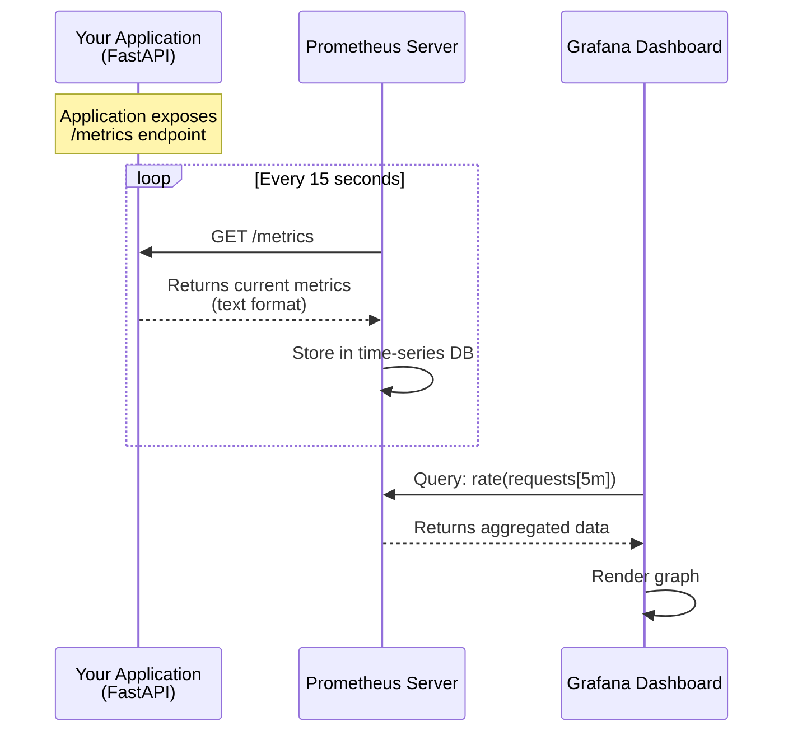
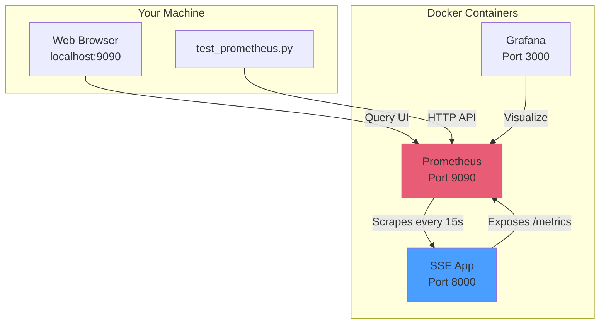

# Prometheus Monitoring Guide for Beginners 📊

**Welcome!** This guide will teach you everything you need to know about Prometheus, from the basics to using it in this SSE Streaming Service project.

---

## Table of Contents

1. [What is Prometheus?](#what-is-prometheus)
2. [How Prometheus Works](#how-prometheus-works)
3. [Understanding Metrics](#understanding-metrics)
4. [PromQL: The Query Language](#promql-the-query-language)
5. [Using Prometheus in This Project](#using-prometheus-in-this-project)
6. [Hands-On Tutorial](#hands-on-tutorial)
7. [Common Queries for This Project](#common-queries-for-this-project)
8. [Troubleshooting](#troubleshooting)

---

## What is Prometheus?

**Prometheus** is a **time-series database** designed for monitoring applications. Think of it as a specialized database that stores measurements over time.

### Real-World Analogy

Imagine you're tracking your car's fuel efficiency:
- **Traditional Database**: Stores "Car has 15 MPG" (just the current value)
- **Time-Series Database (Prometheus)**: Stores "Car had 15 MPG at 9:00 AM, 14 MPG at 10:00 AM, 16 MPG at 11:00 AM..."

This historical data lets you:
- See trends (Is efficiency improving or declining?)
- Detect anomalies (Why did it drop to 10 MPG at 2 PM?)
- Create alerts (Notify me if it drops below 12 MPG)

### Why Use Prometheus?

In software applications, you want to know:
- **Performance**: How fast are requests being processed?
- **Errors**: How many requests are failing?
- **Resource Usage**: Is the server running out of memory?
- **Business Metrics**: How many users are active right now?

Prometheus collects all this data automatically and lets you query it.

---

## How Prometheus Works

Prometheus uses a **pull model** (it "scrapes" data from your application).



### Step-by-Step Flow

1. **Your Application** exposes an HTTP endpoint (usually `/metrics`) that returns current measurements in a special text format.

2. **Prometheus Server** periodically (default: every 15 seconds) makes an HTTP GET request to `/metrics` and saves the data.

3. **You (or Grafana)** query Prometheus using **PromQL** (Prometheus Query Language) to retrieve and analyze the stored data.

### Example: What `/metrics` Looks Like

When Prometheus scrapes your app, it sees something like this:

```
# HELP sse_requests_total Total number of requests
# TYPE sse_requests_total counter
sse_requests_total{provider="openai",status="success"} 1523

# HELP sse_active_connections Current active connections
# TYPE sse_active_connections gauge
sse_active_connections 42

# HELP sse_request_duration_seconds Request duration
# TYPE sse_request_duration_seconds histogram
sse_request_duration_seconds_bucket{le="0.1"} 234
sse_request_duration_seconds_bucket{le="0.5"} 456
sse_request_duration_seconds_sum 123.45
sse_request_duration_seconds_count 500
```

Each line is a **metric** with a **value** and optional **labels** (the `{key="value"}` parts).

---

## Understanding Metrics

Prometheus has **4 metric types**. Let's understand each with real-world examples.

### 1. Counter (Always Goes Up)

**Definition**: A number that only increases (or resets to zero on restart).

**Real-World Example**: Your car's odometer.
- Starts at 0
- Increases as you drive
- Never decreases (unless reset)

**In This Project**:
```
sse_requests_total{provider="openai"} 1523
```
This means: "We've handled 1,523 requests to OpenAI since the app started."

**When to Use**: Counting events (requests, errors, messages sent).

---

### 2. Gauge (Goes Up and Down)

**Definition**: A number that can increase or decrease.

**Real-World Example**: Your car's speedometer.
- Can be 0 MPH
- Can increase to 60 MPH
- Can decrease back to 30 MPH

**In This Project**:
```
sse_active_connections 42
```
This means: "Right now, there are 42 active user connections."

**When to Use**: Current state (memory usage, active users, queue size).

---

### 3. Histogram (Distribution of Values)

**Definition**: Groups measurements into buckets to show distribution.

**Real-World Example**: Student test scores.
- Bucket 1: 0-50 points → 5 students
- Bucket 2: 51-75 points → 15 students
- Bucket 3: 76-100 points → 10 students

**In This Project**:
```
sse_request_duration_seconds_bucket{le="0.1"} 234
sse_request_duration_seconds_bucket{le="0.5"} 456
```
This means:
- 234 requests took ≤ 0.1 seconds
- 456 requests took ≤ 0.5 seconds

**When to Use**: Measuring latency, response times, request sizes.

**Why It's Useful**: You can calculate percentiles (P50, P95, P99) to understand "How fast are 99% of requests?"

---

### 4. Summary (Similar to Histogram)

**Definition**: Like histogram, but calculates percentiles on the client side.

**Difference from Histogram**:
- **Histogram**: Prometheus calculates percentiles (more flexible)
- **Summary**: Your app calculates percentiles (less server load)

**In This Project**: We primarily use histograms.

---

## PromQL: The Query Language

**PromQL** (Prometheus Query Language) is how you ask Prometheus for data. Think of it like SQL for time-series data.

### Basic Query Structure

```
metric_name{label="value"}[time_range]
```

Let's break this down with examples.

---

### Example 1: Get Current Value

**Query**:
```promql
sse_active_connections
```

**What it does**: Returns the current number of active connections.

**Result**:
```
sse_active_connections 42
```

---

### Example 2: Filter by Label

**Query**:
```promql
sse_requests_total{provider="openai"}
```

**What it does**: Returns total requests, but only for OpenAI provider.

**Result**:
```
sse_requests_total{provider="openai"} 1523
```

---

### Example 3: Calculate Rate (Requests Per Second)

**Query**:
```promql
rate(sse_requests_total[5m])
```

**What it does**: 
- Takes the `sse_requests_total` counter
- Looks at the last 5 minutes of data
- Calculates how fast it's increasing (per second)

**Why This Matters**: Counters always go up, so the raw value (1523) isn't useful. The **rate** tells you "We're processing 10 requests/second right now."

**Result**:
```
{provider="openai"} 10.5
{provider="anthropic"} 8.2
```

---

### Example 4: Calculate Percentiles (P99 Latency)

**Query**:
```promql
histogram_quantile(0.99, rate(sse_request_duration_seconds_bucket[5m]))
```

**What it does**:
1. Takes the histogram buckets for request duration
2. Calculates the rate over 5 minutes
3. Computes the 99th percentile (P99)

**Why This Matters**: "99% of requests complete in X seconds or less."

**Result**:
```
{provider="openai"} 0.45
```
This means: "99% of OpenAI requests complete in 0.45 seconds or less."

---

### Example 5: Aggregation (Sum Across All Providers)

**Query**:
```promql
sum(sse_active_connections)
```

**What it does**: Adds up active connections across all providers/instances.

**Result**:
```
{} 42
```

---

### Common PromQL Functions

| Function | Purpose | Example |
|----------|---------|---------|
| `rate()` | Calculate per-second rate | `rate(requests_total[5m])` |
| `sum()` | Add values together | `sum(active_connections)` |
| `avg()` | Calculate average | `avg(cpu_usage)` |
| `max()` | Find maximum | `max(memory_usage)` |
| `histogram_quantile()` | Calculate percentile | `histogram_quantile(0.95, ...)` |
| `increase()` | Total increase over time | `increase(errors_total[1h])` |

---

## Using Prometheus in This Project

### Architecture Overview



### Our Custom Metrics

This project exposes these metrics:

| Metric Name | Type | Description | Example Query |
|-------------|------|-------------|---------------|
| `sse_requests_total` | Counter | Total requests processed | `rate(sse_requests_total[5m])` |
| `sse_errors_total` | Counter | Total errors encountered | `rate(sse_errors_total[5m])` |
| `sse_active_connections` | Gauge | Current active connections | `sse_active_connections` |
| `sse_request_duration_seconds` | Histogram | Request latency distribution | `histogram_quantile(0.99, ...)` |
| `sse_circuit_breaker_state` | Gauge | Circuit breaker state (0/1/2) | `sse_circuit_breaker_state` |

---

## Hands-On Tutorial

Let's learn by doing! Follow these steps to explore Prometheus.

### Step 1: Verify Prometheus is Running

Open a terminal and run:

```bash
docker ps | grep prometheus
```

**Expected Output**:
```
sse-prometheus    Up 2 hours (healthy)    0.0.0.0:9090->9090/tcp
```

If it's not running, start it:
```bash
docker-compose up -d prometheus
```

---

### Step 2: Access Prometheus Web UI

1. Open your browser
2. Navigate to: **http://localhost:9090**
3. You should see the Prometheus interface


---

### Step 3: Run Your First Query

In the Prometheus UI:

1. Click on the search box at the top
2. Type: `up`
3. Click **Execute**

**What is `up`?**
- A special metric that Prometheus creates automatically
- Shows which targets (applications) are reachable
- Value of `1` = target is up
- Value of `0` = target is down

**You should see**:
```
up{instance="localhost:9090", job="prometheus"} 1
up{instance="sse-app:8000", job="sse-streaming"} 1
```

---

### Step 4: View Application Metrics

Now let's query our custom metrics:

**Query 1: Active Connections**
```promql
sse_active_connections
```

**Query 2: Request Rate (Last 5 Minutes)**
```promql
rate(sse_requests_total[5m])
```

**Query 3: Error Rate**
```promql
rate(sse_errors_total[5m])
```

---

### Step 5: Use the Test Script

We've created a Python script that demonstrates how to query Prometheus programmatically.

Run it:
```bash
.venv\Scripts\python scripts/test_prometheus.py
```

**What it does**:
1. Connects to Prometheus
2. Queries the `up` metric
3. Queries `sse_active_connections`
4. Shows you how to use the `PrometheusClient` in code

**Expected Output**:
```
[!] PROMETHEUS CLIENT TEST & TUTORIAL
=====================================
[OK] Connection Successful!
[OK] Current Active Connections: 0
```

---

### Step 6: Visualize with Graphs

In the Prometheus UI:

1. Enter this query:
   ```promql
   rate(sse_requests_total[5m])
   ```

2. Click the **Graph** tab (next to Table)

3. You'll see a line graph showing request rate over time

**Try adjusting the time range**:
- Click the time selector (top right)
- Choose "Last 1 hour" or "Last 6 hours"

---

## Common Queries for This Project

Here are ready-to-use queries for monitoring this SSE application.

### Performance Monitoring

**1. Request Rate (Requests Per Second)**
```promql
sum(rate(sse_requests_total[5m]))
```
*Shows: How many requests/second the app is handling*

---

**2. Error Rate (Errors Per Second)**
```promql
sum(rate(sse_errors_total[5m]))
```
*Shows: How many errors/second are occurring*

---

**3. Error Percentage**
```promql
(sum(rate(sse_errors_total[5m])) / sum(rate(sse_requests_total[5m]))) * 100
```
*Shows: What % of requests are failing*

---

**4. P50 Latency (Median Response Time)**
```promql
histogram_quantile(0.50, rate(sse_request_duration_seconds_bucket[5m]))
```
*Shows: 50% of requests complete in X seconds or less*

---

**5. P95 Latency**
```promql
histogram_quantile(0.95, rate(sse_request_duration_seconds_bucket[5m]))
```
*Shows: 95% of requests complete in X seconds or less*

---

**6. P99 Latency (Worst-Case Performance)**
```promql
histogram_quantile(0.99, rate(sse_request_duration_seconds_bucket[5m]))
```
*Shows: 99% of requests complete in X seconds or less*

---

### Resource Monitoring

**7. Active Connections**
```promql
sum(sse_active_connections)
```
*Shows: Total concurrent users*

---

**8. Circuit Breaker Status**
```promql
sse_circuit_breaker_state
```
*Shows: State of each provider's circuit breaker*
- `0` = Closed (healthy)
- `1` = Half-Open (testing)
- `2` = Open (failing, requests blocked)

---

### Provider-Specific Queries

**9. OpenAI Request Rate**
```promql
rate(sse_requests_total{provider="openai"}[5m])
```

---

**10. Anthropic Error Rate**
```promql
rate(sse_errors_total{provider="anthropic"}[5m])
```

---

## Troubleshooting

### Problem 1: "Can't Access Prometheus UI"

**Symptoms**: Browser shows "Connection refused" at `localhost:9090`

**Solution**:
```bash
# Check if container is running
docker ps | grep prometheus

# If not running, start it
docker-compose up -d prometheus

# Check logs for errors
docker logs sse-prometheus
```

---

### Problem 2: "No Data for My Metrics"

**Symptoms**: Query returns "No data"

**Possible Causes**:

1. **App hasn't emitted the metric yet**
   - Solution: Generate some traffic (make requests to your app)

2. **Prometheus hasn't scraped yet**
   - Solution: Wait 15 seconds (default scrape interval)

3. **Metric name is wrong**
   - Solution: Check available metrics in the UI dropdown

4. **Time range is wrong**
   - Solution: Adjust time range to "Last 1 hour"

---

### Problem 3: "Test Script Fails with Connection Error"

**Symptoms**:
```
[FAIL] CONNECTION FAILED: Connection refused
```

**Solution**:
```bash
# Verify Prometheus is accessible
curl http://localhost:9090/api/v1/query?query=up

# If that fails, check Docker networking
docker network inspect sse_default
```

---

### Problem 4: "Empty URL Error"

**Symptoms**:
```
Request URL is missing an 'http://' or 'https://' protocol
```

**Solution**: This was a bug we fixed! Make sure you're using the latest version of `prometheus_client.py`. The client now auto-detects the URL.

---

## Using PrometheusClient in Your Code

### Pattern 1: Async Context Manager (Recommended)

```python
from src.infrastructure.monitoring.prometheus_client import PrometheusClient

async def get_metrics():
    # Context manager handles connection lifecycle
    async with PrometheusClient() as client:
        # Query current active connections
        response = await client.query("sse_active_connections")
        
        # Extract the value safely
        value = client.extract_scalar_value(response)
        
        if value is not None:
            print(f"Active connections: {value}")
        else:
            print("No data available")
```

**Why use this pattern?**
- Automatically opens and closes HTTP connections
- Prevents resource leaks
- Handles errors gracefully

---

### Pattern 2: FastAPI Dependency Injection

```python
from fastapi import Depends
from src.infrastructure.monitoring.prometheus_client import PrometheusClient

async def get_prometheus_client():
    async with PrometheusClient() as client:
        yield client

@app.get("/admin/metrics")
async def get_metrics(client: PrometheusClient = Depends(get_prometheus_client)):
    response = await client.query("sse_active_connections")
    return {"active_connections": client.extract_scalar_value(response)}
```

---

### Pattern 3: Querying with Time Ranges

```python
async with PrometheusClient() as client:
    # Query data from last hour
    import time
    end = int(time.time())
    start = end - 3600  # 1 hour ago
    
    response = await client.query_range(
        promql="rate(sse_requests_total[5m])",
        start=start,
        end=end,
        step="15s"  # Data point every 15 seconds
    )
    
    # Extract multiple values
    values = client.extract_vector_values(response)
    for label, value in values.items():
        print(f"{label}: {value}")
```

---

## Next Steps

Now that you understand Prometheus basics:

1. **Explore the UI**: Try different queries in `localhost:9090`
2. **Run the Test Script**: See how to query programmatically
3. **Check Grafana**: Visit `localhost:3000` for pre-built dashboards
4. **Read the Code**: Look at `src/infrastructure/monitoring/prometheus_client.py` to see how we implement queries

---

## Additional Resources

- **Official Prometheus Docs**: https://prometheus.io/docs/
- **PromQL Cheat Sheet**: https://promlabs.com/promql-cheat-sheet/
- **Grafana Dashboards**: https://grafana.com/grafana/dashboards/

---

**Questions?** Check the code comments in `prometheus_client.py` or run the test script for examples!
