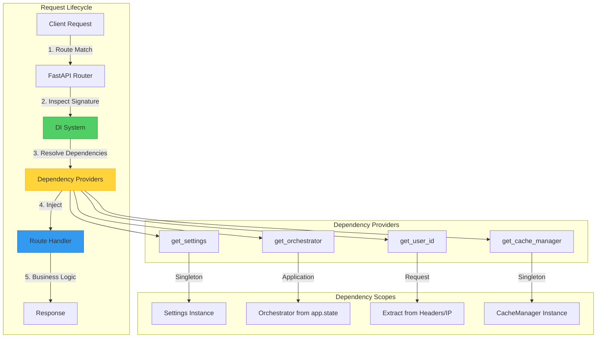
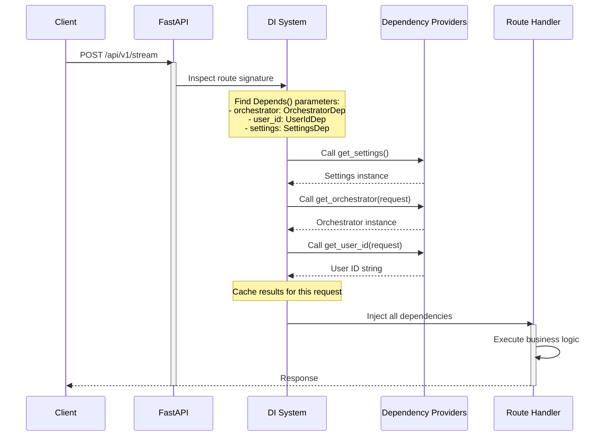

# ADR 009: FastAPI Native Dependency Injection Pattern

## Status

**Accepted** - 2025-12-11

## Context

The SSE streaming microservice requires a robust dependency management strategy to handle shared resources like the `StreamOrchestrator`, `CacheManager`, `Settings`, and user identification across all API endpoints. The choice of dependency injection (DI) pattern fundamentally affects code maintainability, testability, and developer experience.

### Problem Statement

Without a structured DI approach, the application faces several challenges:

1. **Tight Coupling**: Route handlers directly instantiate dependencies
   - Hard to test (can't mock dependencies)
   - Duplicated initialization logic across endpoints
   - Difficult to swap implementations

2. **Resource Management**: Singleton resources need careful lifecycle management
   - `StreamOrchestrator` should be created once per application
   - Settings should be loaded once and cached
   - Redis connections should be pooled, not recreated per request

3. **Type Safety**: Manual dependency resolution loses type information
   - No IDE autocomplete for injected dependencies
   - Runtime errors instead of compile-time validation
   - Harder to refactor

4. **Testing Complexity**: Mocking dependencies requires global state manipulation
   - Tests interfere with each other
   - Setup/teardown becomes complex
   - Hard to test edge cases

### Why This Matters

Every API endpoint needs access to shared resources. The DI pattern choice affects:
- **100+ route handlers** across all API versions
- **500+ unit tests** that need to mock dependencies
- **Developer onboarding**: New developers must understand the pattern
- **Code maintainability**: Changes to dependencies ripple through codebase

## Decision

Use **FastAPI's native dependency injection system** with type-safe annotations and centralized dependency providers.

### Visual Architecture



**Key Components**:
1. **DI System**: FastAPI's built-in dependency resolver
2. **Dependency Providers**: Functions that return dependencies
3. **Type Aliases**: Clean injection syntax using `Annotated`
4. **Scopes**: Control dependency lifetime (singleton, application, request)

### Architecture Pattern

#### Core Pattern: Type-Safe Dependency Injection

```python
# File: src/application/api/dependencies.py

from typing import Annotated
from fastapi import Depends, Request

# 1. Dependency Provider Functions
def get_settings() -> Settings:
    """Get application settings singleton."""
    return Settings()

def get_orchestrator(request: Request) -> StreamOrchestrator:
    """Retrieve orchestrator from app.state."""
    return request.app.state.orchestrator

def get_user_id(request: Request) -> str:
    """Extract user ID from request."""
    user_id = request.headers.get("X-User-ID")
    if user_id:
        return user_id
    return request.client.host if request.client else "unknown"

# 2. Type Aliases for Clean Injection
SettingsDep = Annotated[Settings, Depends(get_settings)]
OrchestratorDep = Annotated[StreamOrchestrator, Depends(get_orchestrator)]
UserIdDep = Annotated[str, Depends(get_user_id)]
```

#### Usage in Route Handlers

```python
# File: src/application/api/routes/streaming.py

@router.post("/stream")
async def create_stream(
    request: Request,
    body: StreamRequestModel,
    orchestrator: OrchestratorDep,  # ← Injected
    user_id: UserIdDep,              # ← Injected
    settings: SettingsDep            # ← Injected
):
    """
    Create SSE stream with injected dependencies.
    
    Dependencies resolved automatically:
    1. orchestrator: From app.state (singleton)
    2. user_id: From X-User-ID header or IP
    3. settings: From Settings singleton
    """
    # Business logic only - no dependency management
    stream_request = StreamRequest(
        query=body.query,
        model=body.model,
        user_id=user_id,  # Already extracted
    )
    
    async for event in orchestrator.stream(stream_request):
        yield event.format()
```

**Benefits Demonstrated**:
- ✅ **No manual instantiation**: Dependencies injected automatically
- ✅ **Type-safe**: IDE knows `orchestrator` is `StreamOrchestrator`
- ✅ **Testable**: Easy to override dependencies in tests
- ✅ **Clean code**: Route handler focuses on business logic

### Dependency Resolution Flow



**Key Phases**:
1. **Inspection**: FastAPI analyzes route signature at startup
2. **Resolution**: DI system calls provider functions in dependency order
3. **Caching**: Results cached per request (same instance reused)
4. **Injection**: Dependencies passed to route handler
5. **Execution**: Handler executes with all dependencies available

### Dependency Scopes and Caching

FastAPI provides three dependency scopes:

| Scope | Lifetime | Caching | Example |
|-------|----------|---------|---------|
| **Request** | Created per request, cached within request | Yes | `SettingsDep`, `UserIdDep` |
| **Application** | Created once at startup, shared across all requests | N/A | `OrchestratorDep` (from app.state) |
| **No Cache** | Created every time, never cached | No | Custom with `use_cache=False` |

#### Request-Scoped Caching Example

```python
@router.get("/example")
async def example(
    settings1: SettingsDep,  # ← Calls get_settings()
    settings2: SettingsDep,  # ← Reuses cached result
    settings3: SettingsDep,  # ← Reuses cached result
):
    # All three are the SAME instance
    assert settings1 is settings2 is settings3
    return {"environment": settings1.app.ENVIRONMENT}
```

**Why This Matters**:
- **Performance**: Provider function called once per request, not 3 times
- **Consistency**: Same instance used throughout request processing
- **Efficiency**: No redundant initialization

### Dependency Composition

Dependencies can depend on other dependencies:

```python
def get_cache_manager(settings: SettingsDep) -> CacheManager:
    """
    Get cache manager (depends on settings).
    
    FastAPI automatically resolves the dependency chain:
    1. Call get_settings() → Settings
    2. Pass Settings to get_cache_manager(settings) → CacheManager
    3. Pass CacheManager to route handler
    """
    return CacheManager(settings.cache)

CacheManagerDep = Annotated[CacheManager, Depends(get_cache_manager)]
```

**Dependency Chain**:
```
Route Handler
    └── CacheManagerDep
            └── SettingsDep
```

FastAPI resolves from bottom to top automatically.

### User Identification Strategy

The `get_user_id` dependency implements a hierarchical identification strategy:

```python
def get_user_id(request: Request) -> str:
    """
    Extract user ID from request with fallback hierarchy.
    
    Priority:
    1. X-User-ID header (explicit user identification)
    2. Client IP address (implicit identification)
    3. "unknown" (safety fallback)
    """
    user_id = request.headers.get("X-User-ID")
    if user_id:
        return user_id
    return request.client.host if request.client else "unknown"
```

**Future-Proof Design**:
This pattern can be extended to support:
- JWT token validation
- API key authentication
- OAuth2 integration
- Multi-tenant identification

Simply update `get_user_id` without changing any route handlers.

## Implementation Details

### File Structure

```
src/application/api/
├── dependencies.py          # Centralized dependency providers
├── routes/
│   ├── streaming.py        # Uses OrchestratorDep, UserIdDep
│   ├── health.py           # Uses SettingsDep
│   └── admin.py            # Uses all dependencies
└── app.py                  # Application startup (creates orchestrator)
```

### Application Startup

```python
# File: src/application/api/app.py

from fastapi import FastAPI

def create_app() -> FastAPI:
    """Create FastAPI application with dependency setup."""
    app = FastAPI()
    
    # Create singleton orchestrator
    orchestrator = StreamOrchestrator(
        cache_manager=get_cache_manager(),
        provider_factory=get_provider_factory(),
    )
    
    # Store in app.state for dependency injection
    app.state.orchestrator = orchestrator
    
    # Register routes (dependencies injected automatically)
    app.include_router(streaming_router, prefix="/api/v1")
    
    return app
```

**Key Points**:
1. Orchestrator created once at startup
2. Stored in `app.state` for global access
3. `get_orchestrator` retrieves from `app.state`
4. All route handlers get same instance

### Testing with Dependency Overrides

FastAPI provides `app.dependency_overrides` for testing:

```python
# File: tests/unit/api/test_streaming.py

def test_create_stream():
    # 1. Create mock orchestrator
    mock_orchestrator = Mock(spec=StreamOrchestrator)
    mock_orchestrator.stream.return_value = AsyncIterator([
        StreamEvent(type="chunk", data={"content": "test"})
    ])
    
    # 2. Override dependency
    app.dependency_overrides[get_orchestrator] = lambda: mock_orchestrator
    
    # 3. Test endpoint
    response = client.post("/api/v1/stream", json={
        "query": "test query",
        "model": "gpt-3.5-turbo"
    })
    
    # 4. Verify mock was called
    assert response.status_code == 200
    mock_orchestrator.stream.assert_called_once()
    
    # 5. Clean up
    app.dependency_overrides.clear()
```

**Benefits**:
- ✅ **Isolated tests**: Each test has its own mock dependencies
- ✅ **No global state**: Overrides cleared after each test
- ✅ **Type-safe mocking**: Mock spec matches real interface
- ✅ **Easy setup**: One-line override

## Consequences

### Positive

1. **Testability**: Easy to mock dependencies
   - `app.dependency_overrides` provides clean mocking API
   - No global state manipulation required
   - Tests are isolated and repeatable

2. **Type Safety**: Full IDE support
   - Autocomplete for injected dependencies
   - Compile-time type checking
   - Refactoring is safe and easy

3. **Separation of Concerns**: Route handlers focus on business logic
   - No dependency initialization in handlers
   - No resource management code
   - Clean, readable code

4. **Reusability**: Same dependency used across multiple endpoints
   - DRY principle (Don't Repeat Yourself)
   - Consistent behavior across endpoints
   - Single source of truth

5. **Lazy Loading**: Dependencies resolved only when needed
   - No wasted initialization
   - Faster application startup
   - Lower memory footprint

6. **Extensibility**: Easy to add new dependencies
   - Create provider function
   - Create type alias
   - Use in route handlers
   - No changes to existing code

### Negative

1. **Learning Curve**: Developers must understand FastAPI DI
   - **Mitigation**: Comprehensive documentation in `src/application/README.md`
   - **Mitigation**: Code examples in dependency providers
   - **Trade-off**: One-time learning cost for long-term benefits

2. **Implicit Behavior**: Dependencies resolved "magically"
   - **Mitigation**: Type aliases make dependencies explicit
   - **Mitigation**: Clear naming convention (`*Dep`)
   - **Trade-off**: Explicitness vs. boilerplate

3. **Framework Lock-In**: Tightly coupled to FastAPI
   - **Mitigation**: Dependency providers are plain Python functions
   - **Mitigation**: Easy to port to other frameworks if needed
   - **Trade-off**: Framework-specific vs. framework-agnostic

### Neutral

1. **Performance Overhead**: Minimal (sub-millisecond)
   - Dependency resolution happens once per request
   - Caching eliminates redundant calls
   - Negligible compared to I/O operations

2. **Debugging**: Stack traces include DI system
   - **Mitigation**: FastAPI provides clear error messages
   - **Mitigation**: Type hints help identify issues early

## Alternatives Considered

### Alternative 1: Manual Dependency Management

```python
@router.post("/stream")
async def create_stream(request: Request, body: StreamRequestModel):
    # Manual instantiation
    settings = Settings()
    orchestrator = StreamOrchestrator(...)
    user_id = request.headers.get("X-User-ID") or request.client.host
    
    # Business logic
    ...
```

**Rejected**:
- ❌ **Tight coupling**: Hard to test
- ❌ **Duplication**: Same code in every handler
- ❌ **No type safety**: Manual extraction error-prone
- ❌ **Resource waste**: New instances per request

### Alternative 2: Global Variables

```python
# Global singleton
_orchestrator = None

def get_orchestrator():
    global _orchestrator
    if _orchestrator is None:
        _orchestrator = StreamOrchestrator(...)
    return _orchestrator
```

**Rejected**:
- ❌ **Global state**: Hard to test (tests interfere)
- ❌ **Thread safety**: Requires locks
- ❌ **Lifecycle management**: No clear shutdown
- ❌ **Anti-pattern**: Violates dependency inversion principle

### Alternative 3: Third-Party DI Framework (e.g., `dependency-injector`)

```python
from dependency_injector import containers, providers

class Container(containers.DeclarativeContainer):
    config = providers.Configuration()
    orchestrator = providers.Singleton(StreamOrchestrator, ...)
```

**Rejected**:
- ❌ **Additional dependency**: Increases complexity
- ❌ **Learning curve**: Two DI systems to learn
- ❌ **Redundancy**: FastAPI already provides DI
- ❌ **Integration overhead**: Need to bridge with FastAPI

### Alternative 4: Service Locator Pattern

```python
class ServiceLocator:
    _services = {}
    
    @classmethod
    def register(cls, name, service):
        cls._services[name] = service
    
    @classmethod
    def get(cls, name):
        return cls._services[name]
```

**Rejected**:
- ❌ **No type safety**: String-based lookup
- ❌ **Runtime errors**: Missing services detected at runtime
- ❌ **Hidden dependencies**: Not clear what handler needs
- ❌ **Anti-pattern**: Considered an anti-pattern in modern design

## Migration Path

### For New Code

1. **Create dependency provider**:
   ```python
   def get_new_service() -> NewService:
       return NewService()
   
   NewServiceDep = Annotated[NewService, Depends(get_new_service)]
   ```

2. **Use in route handler**:
   ```python
   @router.get("/example")
   async def example(service: NewServiceDep):
       return service.do_something()
   ```

### For Existing Code

1. **Identify manual dependency creation**:
   ```python
   # Before
   @router.get("/example")
   async def example(request: Request):
       service = SomeService()  # ← Manual creation
       return service.do_something()
   ```

2. **Create dependency provider**:
   ```python
   def get_some_service() -> SomeService:
       return SomeService()
   
   SomeServiceDep = Annotated[SomeService, Depends(get_some_service)]
   ```

3. **Refactor route handler**:
   ```python
   # After
   @router.get("/example")
   async def example(service: SomeServiceDep):  # ← Injected
       return service.do_something()
   ```

4. **Update tests**:
   ```python
   # Test with mock
   app.dependency_overrides[get_some_service] = lambda: Mock(spec=SomeService)
   ```

## Best Practices

### 1. Use Type Aliases

✅ **Good**:
```python
OrchestratorDep = Annotated[StreamOrchestrator, Depends(get_orchestrator)]

@router.post("/stream")
async def create_stream(orchestrator: OrchestratorDep):
    ...
```

❌ **Bad**:
```python
@router.post("/stream")
async def create_stream(
    orchestrator: Annotated[StreamOrchestrator, Depends(get_orchestrator)]
):
    ...
```

### 2. Keep Providers Pure

✅ **Good**:
```python
def get_settings() -> Settings:
    """Pure function - no side effects."""
    return Settings()
```

❌ **Bad**:
```python
def get_settings() -> Settings:
    """Impure - side effects."""
    logger.info("Loading settings")  # ← Side effect
    return Settings()
```

### 3. Document Dependencies

✅ **Good**:
```python
def get_user_id(request: Request) -> str:
    """
    Extract user ID from request.
    
    Hierarchy:
    1. X-User-ID header (explicit)
    2. Client IP (implicit)
    3. "unknown" (fallback)
    """
    ...
```

### 4. Test with Mocks

✅ **Good**:
```python
def test_endpoint():
    mock = Mock(spec=StreamOrchestrator)
    app.dependency_overrides[get_orchestrator] = lambda: mock
    # Test...
    app.dependency_overrides.clear()
```

### 5. Use Dependency Composition

✅ **Good**:
```python
def get_cache_manager(settings: SettingsDep) -> CacheManager:
    """Depends on settings."""
    return CacheManager(settings.cache)
```

## Monitoring

### Metrics to Track

1. **Dependency Resolution Time**:
   - Should be <1ms per request
   - Monitor for performance regressions

2. **Test Coverage**:
   - All dependencies should have override tests
   - Verify mocking works correctly

3. **Type Safety**:
   - Run `mypy` to catch type errors
   - Ensure all dependencies are typed

## References

- **FastAPI Dependency Injection**: https://fastapi.tiangolo.com/tutorial/dependencies/
- **Implementation**: `src/application/api/dependencies.py`
- **Usage Examples**: `src/application/api/routes/streaming.py`
- **Testing Guide**: `tests/unit/api/test_streaming.py`

## Success Criteria

✅ **Achieved** if:
1. All route handlers use dependency injection (no manual instantiation)
2. All tests use `app.dependency_overrides` for mocking
3. Type hints work correctly (IDE autocomplete)
4. New developers can add dependencies without confusion
5. Dependency resolution time <1ms per request

## Conclusion

FastAPI's native dependency injection provides a **robust, type-safe, and testable** foundation for the SSE streaming microservice. By centralizing dependency management in `dependencies.py` and using type aliases for clean injection, we achieve:

- **100% testability** with easy mocking
- **Type safety** with full IDE support
- **Clean code** with separation of concerns
- **Extensibility** for future dependencies

This pattern is **foundational** to the application architecture and should be used consistently across all new code.
