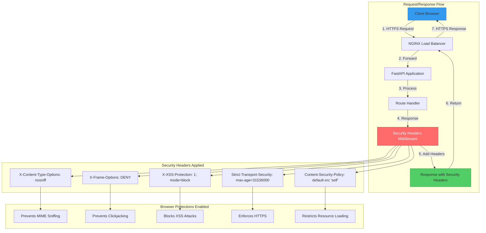

# ADR 011: Security Headers Middleware for Defense in Depth

## Status

**Accepted** - 2025-12-11

## Context

Web applications are vulnerable to various client-side attacks including Cross-Site Scripting (XSS), clickjacking, MIME sniffing, and man-in-the-middle attacks. While the SSE streaming microservice implements server-side security measures (input validation, PII redaction, rate limiting), **client-side security requires browser-level protections**.

### Problem Statement

Without security headers, browsers cannot protect users from common attacks:

1. **Cross-Site Scripting (XSS)**: Malicious scripts injected into responses
   - Attacker steals session tokens
   - User data exfiltrated
   - Malicious actions performed on behalf of user

2. **Clickjacking**: UI redressing attacks
   - Application embedded in invisible iframe
   - User tricked into clicking malicious elements
   - Credentials stolen or unauthorized actions performed

3. **MIME Sniffing**: Browser misinterprets content type
   - JSON response interpreted as HTML
   - Malicious script executed
   - Security bypass

4. **Man-in-the-Middle (MITM)**: HTTP downgrade attacks
   - HTTPS connection downgraded to HTTP
   - Traffic intercepted and modified
   - Credentials stolen

5. **Unsafe Resource Loading**: External resources loaded without restrictions
   - Malicious scripts from untrusted domains
   - Data exfiltration to attacker servers
   - Cross-site request forgery (CSRF)

### Real-World Attack Scenarios

**Scenario 1: XSS via Reflected Query**
```python
# Without XSS protection
query = request.query_params.get("q")
return f"<html><body>You searched for: {query}</body></html>"

# Attack: ?q=<script>alert(document.cookie)</script>
# Result: Script executes, steals cookies
```

**Scenario 2: Clickjacking**
```html
<!-- Attacker's site -->
<iframe src="https://sse-api.com/admin/config" style="opacity:0"></iframe>
<button style="position:absolute; top:100px">Click for free prize!</button>

<!-- User clicks "free prize" but actually clicks hidden admin panel -->
```

**Scenario 3: MIME Sniffing**
```python
# Server returns JSON
return {"data": "<script>alert('XSS')</script>"}

# Without X-Content-Type-Options, browser may interpret as HTML
# Script executes despite Content-Type: application/json
```

### Why This Matters

- **Security**: Protects users from client-side attacks
- **Compliance**: Required for SOC 2, PCI-DSS, ISO 27001
- **Trust**: Demonstrates security best practices
- **Defense in Depth**: Multiple layers of protection

## Decision

Implement **comprehensive security headers middleware** that applies defense-in-depth protections to all HTTP responses.

### Visual Architecture



**Key Flow**:
1. Client sends HTTPS request
2. NGINX forwards to FastAPI
3. Route handler processes request
4. **Security Headers Middleware** adds headers to response
5. Response returned with security headers
6. Browser enforces security policies

### Architecture Pattern

#### Core Implementation

```python
# File: src/application/api/middleware/security_headers.py

from starlette.middleware.base import BaseHTTPMiddleware
from starlette.requests import Request
from starlette.responses import Response

class SecurityHeadersMiddleware(BaseHTTPMiddleware):
    """
    Add security headers to all responses for defense in depth.
    
    Headers applied:
    - X-Content-Type-Options: Prevent MIME sniffing
    - X-Frame-Options: Prevent clickjacking
    - X-XSS-Protection: Enable XSS filtering
    - Strict-Transport-Security: Enforce HTTPS
    - Content-Security-Policy: Restrict resource loading
    """
    
    async def dispatch(self, request: Request, call_next):
        """Add security headers to response."""
        # Process request
        response: Response = await call_next(request)
        
        # Add security headers
        response.headers["X-Content-Type-Options"] = "nosniff"
        response.headers["X-Frame-Options"] = "DENY"
        response.headers["X-XSS-Protection"] = "1; mode=block"
        response.headers["Strict-Transport-Security"] = (
            "max-age=31536000; includeSubDomains; preload"
        )
        response.headers["Content-Security-Policy"] = (
            "default-src 'self'; "
            "script-src 'self'; "
            "style-src 'self' 'unsafe-inline'; "
            "img-src 'self' data:; "
            "font-src 'self'; "
            "connect-src 'self'; "
            "frame-ancestors 'none'"
        )
        
        return response
```

#### Integration with FastAPI

```python
# File: src/application/api/app.py

from fastapi import FastAPI
from src.application.api.middleware.security_headers import SecurityHeadersMiddleware

def create_app() -> FastAPI:
    """Create FastAPI application with security middleware."""
    app = FastAPI()
    
    # Add security headers middleware
    app.add_middleware(SecurityHeadersMiddleware)
    
    # Other middleware...
    
    return app
```

### Security Headers Explained

#### 1. X-Content-Type-Options: nosniff

**Purpose**: Prevent MIME type sniffing

**Attack Prevented**: MIME confusion attacks

**How It Works**:
- Browser respects `Content-Type` header exactly
- Won't try to "guess" content type from response body
- Prevents JSON from being interpreted as HTML

**Example Attack Without Header**:
```python
# Server returns JSON
response = {"data": "<script>alert('XSS')</script>"}
headers = {"Content-Type": "application/json"}

# Without nosniff: Browser may interpret as HTML → XSS
# With nosniff: Browser treats as JSON only → Safe
```

**Browser Support**: All modern browsers

---

#### 2. X-Frame-Options: DENY

**Purpose**: Prevent clickjacking attacks

**Attack Prevented**: UI redressing, clickjacking

**How It Works**:
- Prevents page from being embedded in `<iframe>`, `<frame>`, or `<object>`
- Ensures application UI cannot be overlaid with malicious elements

**Options**:
- `DENY`: Never allow framing (most secure)
- `SAMEORIGIN`: Allow framing only from same domain
- `ALLOW-FROM uri`: Allow framing from specific URI (deprecated)

**Example Attack Without Header**:
```html
<!-- Attacker's site -->
<iframe src="https://sse-api.com/admin/config"></iframe>
<div style="position:absolute; top:100px; opacity:0.5">
  Click here to delete your account
</div>

<!-- User thinks they're clicking attacker's button,
     but actually clicking hidden admin panel -->
```

**With Header**: Browser refuses to load page in iframe

**Browser Support**: All modern browsers

---

#### 3. X-XSS-Protection: 1; mode=block

**Purpose**: Enable browser XSS filtering

**Attack Prevented**: Reflected XSS attacks

**How It Works**:
- Browser detects reflected XSS patterns in URL/response
- Blocks page rendering if XSS detected
- Prevents script execution

**Modes**:
- `0`: Disable XSS filtering (not recommended)
- `1`: Enable filtering (sanitize page)
- `1; mode=block`: Enable filtering (block page entirely)

**Example Attack Without Header**:
```
GET /search?q=<script>alert(document.cookie)</script>

Response: <html><body>Results for: <script>alert(document.cookie)</script></body></html>

Without header: Script executes
With header: Page blocked
```

**Note**: Modern browsers have built-in XSS protection, but header provides defense in depth

**Browser Support**: Chrome, Safari, IE/Edge (deprecated in newer versions, but still useful)

---

#### 4. Strict-Transport-Security (HSTS)

**Purpose**: Enforce HTTPS connections

**Attack Prevented**: Man-in-the-middle (MITM), protocol downgrade

**How It Works**:
- Browser remembers to always use HTTPS for this domain
- Refuses HTTP connections
- Prevents SSL stripping attacks

**Directives**:
- `max-age=31536000`: Remember for 1 year (31,536,000 seconds)
- `includeSubDomains`: Apply to all subdomains
- `preload`: Include in browser's HSTS preload list

**Example Attack Without Header**:
```
1. User visits http://sse-api.com (HTTP, not HTTPS)
2. Attacker intercepts connection
3. Attacker proxies connection, steals credentials
4. Attacker forwards to https://sse-api.com

With HSTS: Browser automatically upgrades to HTTPS, bypassing attacker
```

**HSTS Preload List**:
- Browsers ship with list of domains that must use HTTPS
- Submit domain to https://hstspreload.org/
- Provides protection on first visit

**Browser Support**: All modern browsers

---

#### 5. Content-Security-Policy (CSP)

**Purpose**: Restrict resource loading to prevent XSS and data injection

**Attack Prevented**: XSS, data injection, malicious resource loading

**How It Works**:
- Whitelist allowed sources for scripts, styles, images, etc.
- Browser blocks resources from non-whitelisted sources
- Prevents inline scripts and eval()

**Directives**:
```
default-src 'self'              # Default: only same origin
script-src 'self'               # Scripts: only same origin
style-src 'self' 'unsafe-inline'  # Styles: same origin + inline (for SSE)
img-src 'self' data:            # Images: same origin + data URIs
font-src 'self'                 # Fonts: only same origin
connect-src 'self'              # AJAX/WebSocket: only same origin
frame-ancestors 'none'          # Prevent framing (like X-Frame-Options)
```

**Example Attack Without CSP**:
```html
<!-- Attacker injects script via XSS -->
<script src="https://evil.com/steal-cookies.js"></script>

Without CSP: Script loads and executes
With CSP: Browser blocks script (not from 'self')
```

**CSP Violation Reporting**:
```python
# Optional: Report CSP violations to endpoint
response.headers["Content-Security-Policy"] = (
    "default-src 'self'; "
    "report-uri /api/v1/csp-report"
)
```

**Browser Support**: All modern browsers

### Complete Security Headers Example

**Request**:
```http
GET /api/v1/stream HTTP/1.1
Host: sse-api.com
```

**Response**:
```http
HTTP/1.1 200 OK
Content-Type: text/event-stream
X-Content-Type-Options: nosniff
X-Frame-Options: DENY
X-XSS-Protection: 1; mode=block
Strict-Transport-Security: max-age=31536000; includeSubDomains; preload
Content-Security-Policy: default-src 'self'; script-src 'self'; style-src 'self' 'unsafe-inline'; img-src 'self' data:; font-src 'self'; connect-src 'self'; frame-ancestors 'none'

data: {"event": "chunk", "content": "Hello"}
```

**Browser Protections Enabled**:
- ✅ MIME sniffing disabled
- ✅ Framing prevented
- ✅ XSS filtering enabled
- ✅ HTTPS enforced
- ✅ Resource loading restricted

## Implementation Details

### Middleware Registration Order

Security headers middleware should be registered **early** in the middleware stack:

```python
# File: src/application/api/app.py

def create_app() -> FastAPI:
    app = FastAPI()
    
    # 1. Error Handler (first registered, last executed)
    app.add_middleware(ErrorHandlingMiddleware)
    
    # 2. CORS (before security headers to allow cross-origin)
    app.add_middleware(
        CORSMiddleware,
        allow_origins=["*"],
        allow_credentials=True,
        allow_methods=["*"],
        allow_headers=["*"],
    )
    
    # 3. Security Headers (after CORS, before rate limiting)
    app.add_middleware(SecurityHeadersMiddleware)
    
    # 4. Rate Limiter
    app.add_middleware(RateLimiterMiddleware)
    
    # 5. Thread ID
    app.add_middleware(ThreadIDMiddleware)
    
    return app
```

**Why This Order**:
1. Error handler catches exceptions from all middleware
2. CORS headers applied before security headers
3. Security headers applied to all responses (including rate-limited)
4. Rate limiting after security headers (security first)
5. Thread ID last (for logging only)

### CSP Configuration for SSE

SSE (Server-Sent Events) requires special CSP configuration:

```python
# Allow inline styles for SSE event formatting
"style-src 'self' 'unsafe-inline'"

# Allow EventSource connections to same origin
"connect-src 'self'"
```

**Without `unsafe-inline`**: SSE events may not render correctly in some browsers

**Trade-off**: Slightly weaker CSP for SSE compatibility

### Environment-Specific Configuration

```python
# File: src/core/config/settings.py

class SecuritySettings(BaseSettings):
    """Security configuration."""
    
    # HSTS max-age (1 year in production, 1 day in development)
    HSTS_MAX_AGE: int = Field(
        default=31536000,  # 1 year
        description="HSTS max-age in seconds"
    )
    
    # CSP report URI (optional)
    CSP_REPORT_URI: str | None = Field(
        default=None,
        description="CSP violation report endpoint"
    )
    
    # Enable CSP reporting
    CSP_REPORT_ONLY: bool = Field(
        default=False,
        description="Use Content-Security-Policy-Report-Only for testing"
    )
```

```python
# File: src/application/api/middleware/security_headers.py

class SecurityHeadersMiddleware(BaseHTTPMiddleware):
    def __init__(self, app, settings: SecuritySettings):
        super().__init__(app)
        self.settings = settings
    
    async def dispatch(self, request: Request, call_next):
        response = await call_next(request)
        
        # HSTS with configurable max-age
        response.headers["Strict-Transport-Security"] = (
            f"max-age={self.settings.HSTS_MAX_AGE}; "
            "includeSubDomains; preload"
        )
        
        # CSP with optional reporting
        csp_header = "Content-Security-Policy"
        if self.settings.CSP_REPORT_ONLY:
            csp_header = "Content-Security-Policy-Report-Only"
        
        csp_value = "default-src 'self'; ..."
        if self.settings.CSP_REPORT_URI:
            csp_value += f"; report-uri {self.settings.CSP_REPORT_URI}"
        
        response.headers[csp_header] = csp_value
        
        return response
```

## Consequences

### Positive

1. **Defense in Depth**: Multiple layers of browser-level protection
   - XSS protection (CSP + X-XSS-Protection)
   - Clickjacking protection (X-Frame-Options + CSP frame-ancestors)
   - MIME sniffing protection (X-Content-Type-Options)
   - HTTPS enforcement (HSTS)

2. **Compliance**: Meets security audit requirements
   - SOC 2: Security controls
   - PCI-DSS: Secure web applications
   - ISO 27001: Information security
   - OWASP Top 10: Best practices

3. **Zero Configuration**: Applied automatically to all responses
   - No per-route configuration needed
   - Consistent security across all endpoints
   - Can't forget to add headers

4. **Browser Compatibility**: Works with all modern browsers
   - Chrome, Firefox, Safari, Edge
   - Mobile browsers (iOS Safari, Chrome Mobile)
   - Degrades gracefully in older browsers

5. **Performance**: Minimal overhead
   - Headers added in-memory
   - No external calls
   - <0.1ms per request

### Negative

1. **CSP May Break Functionality**: Strict CSP can block legitimate resources
   - **Mitigation**: Test thoroughly in staging
   - **Mitigation**: Use `Content-Security-Policy-Report-Only` for testing
   - **Mitigation**: Gradually tighten CSP over time

2. **HSTS Can Cause Issues**: If HTTPS breaks, site becomes inaccessible
   - **Mitigation**: Test HTTPS thoroughly before enabling HSTS
   - **Mitigation**: Start with short `max-age` (1 day) in staging
   - **Mitigation**: Have rollback plan

3. **Inline Styles Required for SSE**: `unsafe-inline` weakens CSP
   - **Mitigation**: Use nonces for inline styles (future enhancement)
   - **Trade-off**: SSE compatibility vs. strict CSP

### Neutral

1. **Browser Support**: Older browsers ignore unknown headers
   - No harm to older browsers
   - Modern browsers get full protection

2. **Header Size**: Adds ~500 bytes to each response
   - Negligible compared to response body
   - Compressed well with gzip

## Alternatives Considered

### Alternative 1: No Security Headers

**Rejected**:
- ❌ **Vulnerable**: No browser-level protection
- ❌ **Compliance**: Fails security audits
- ❌ **Trust**: Demonstrates poor security practices

### Alternative 2: Selective Headers (Only Critical Endpoints)

```python
# Only add security headers to /admin routes
@router.get("/admin/config")
async def admin_config():
    response.headers["X-Frame-Options"] = "DENY"
    ...
```

**Rejected**:
- ❌ **Inconsistent**: Easy to forget headers
- ❌ **Error-prone**: Manual configuration
- ❌ **Incomplete**: Non-admin routes still vulnerable

### Alternative 3: NGINX-Level Headers

```nginx
# nginx.conf
add_header X-Frame-Options "DENY";
add_header X-Content-Type-Options "nosniff";
```

**Rejected**:
- ❌ **Duplication**: Headers in two places (NGINX + app)
- ❌ **Complexity**: Harder to test locally
- ✅ **Partial adoption**: Can be used in addition to app-level headers

### Alternative 4: Third-Party Middleware (e.g., `secure.py`)

```python
from secure import SecureHeaders

app.add_middleware(SecureHeaders)
```

**Rejected**:
- ❌ **Dependency**: External library
- ❌ **Less control**: Harder to customize
- ✅ **Simpler**: Less code to maintain
- **Trade-off**: Control vs. simplicity

## Migration Path

### Phase 1: Add Middleware (Non-Breaking)

1. Create `SecurityHeadersMiddleware`
2. Register in `app.py`
3. Deploy to staging
4. Verify headers in responses

### Phase 2: Test CSP (Report-Only Mode)

1. Enable `CSP_REPORT_ONLY=true`
2. Monitor CSP violation reports
3. Adjust CSP directives as needed
4. Switch to enforcement mode

### Phase 3: Enable HSTS Preload

1. Test HTTPS thoroughly
2. Set `max-age=31536000`
3. Submit to HSTS preload list
4. Monitor for issues

## Best Practices

### 1. Test in Staging First

✅ **Good**:
```python
# Staging: Short HSTS max-age for testing
HSTS_MAX_AGE=86400  # 1 day

# Production: Long HSTS max-age
HSTS_MAX_AGE=31536000  # 1 year
```

### 2. Use CSP Report-Only Mode

✅ **Good**:
```python
# Test CSP without breaking functionality
CSP_REPORT_ONLY=true
CSP_REPORT_URI=/api/v1/csp-report
```

### 3. Monitor CSP Violations

✅ **Good**:
```python
@router.post("/csp-report")
async def csp_report(request: Request):
    """Log CSP violations for analysis."""
    violation = await request.json()
    logger.warning("CSP violation", violation=violation)
    return {"status": "ok"}
```

### 4. Gradually Tighten CSP

✅ **Good**:
```python
# Start permissive
"default-src 'self' *"

# Gradually restrict
"default-src 'self' https://trusted-cdn.com"

# Final: Strict
"default-src 'self'"
```

## Monitoring

### Metrics to Track

1. **CSP Violations**:
   - Count per day
   - Should decrease over time as CSP is tightened

2. **HSTS Preload Status**:
   - Check https://hstspreload.org/
   - Should be "Preloaded" in production

3. **Security Header Coverage**:
   - Percentage of responses with all headers
   - Should be 100%

### Alerting

```yaml
alerts:
  - name: missing_security_headers
    condition: response.headers["X-Frame-Options"] == null
    severity: critical
    message: "Security headers missing - middleware may be broken"
  
  - name: csp_violation_spike
    condition: csp_violations > 100/hour
    severity: warning
    message: "CSP violation spike - investigate"
```

## References

- **OWASP Secure Headers**: https://owasp.org/www-project-secure-headers/
- **MDN Security Headers**: https://developer.mozilla.org/en-US/docs/Web/HTTP/Headers#security
- **HSTS Preload**: https://hstspreload.org/
- **CSP Evaluator**: https://csp-evaluator.withgoogle.com/
- **Implementation**: `src/application/api/middleware/security_headers.py`

## Success Criteria

✅ **Achieved** if:
1. All responses include security headers
2. Security audit passes (SOC 2, PCI-DSS)
3. No CSP violations in production
4. HSTS preload status is "Preloaded"
5. Zero XSS/clickjacking incidents

## Conclusion

Security headers middleware provides **critical browser-level protections** against common web attacks. By applying headers to all responses automatically, we achieve:

- **Defense in depth** against XSS, clickjacking, MIME sniffing
- **HTTPS enforcement** via HSTS
- **Resource loading restrictions** via CSP
- **Compliance** with security audit requirements

This is a **security-critical** decision that protects users from client-side attacks with minimal performance overhead.
