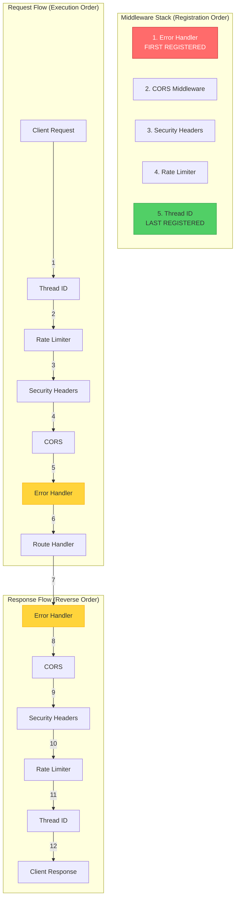
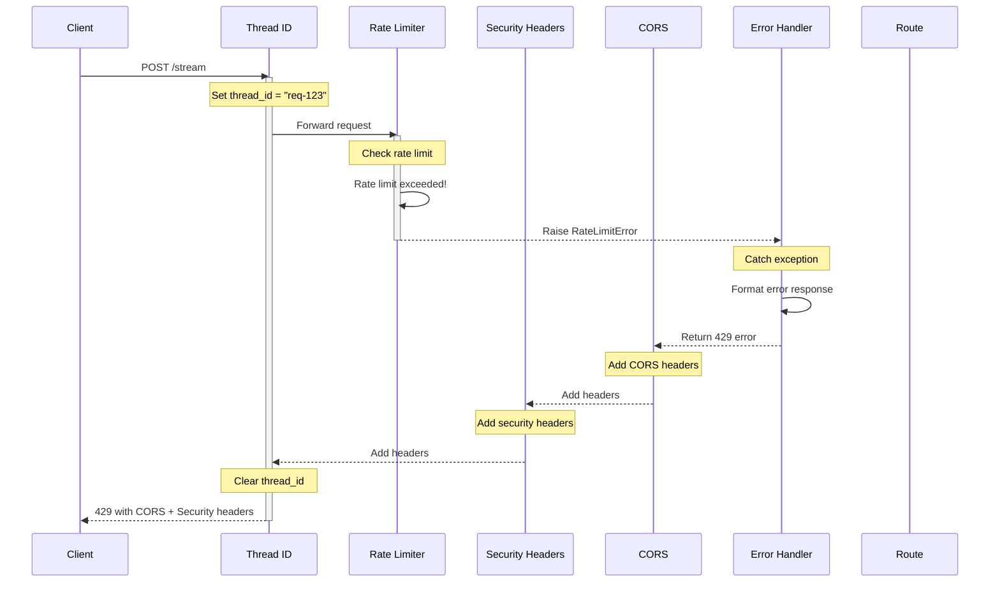

# ADR 014: Middleware Execution Order for Correctness and Security

## Status

**Accepted** - 2025-12-11

## Context

FastAPI middleware executes in a specific order that is **non-obvious and critical** to application correctness. Middleware is registered in **reverse order** of execution: the first middleware registered is the **last** to execute on the request path and the **first** to execute on the response path.

### Problem Statement

Incorrect middleware ordering causes serious issues:

1. **Missing CORS Headers on Errors**: Error responses lack CORS headers
   - Browser blocks error responses from cross-origin requests
   - Client sees generic CORS error instead of actual error message
   - Debugging becomes impossible

2. **Rate Limiting After Expensive Operations**: Rate limit checked too late
   - Expensive operations (cache lookup, LLM call) executed before rate limit
   - Attackers can DoS system by bypassing rate limiting
   - Resources wasted on requests that will be rejected

3. **Missing Thread ID in Logs**: Thread ID not set early enough
   - Some log entries missing correlation ID
   - Can't trace request through system
   - Debugging distributed failures is difficult

4. **Security Headers Not Applied**: Security headers added too late
   - Some responses missing security headers
   - Browser protections not enabled
   - Vulnerable to XSS, clickjacking

### Real-World Impact

**Incorrect Order (CORS after Error Handler)**:
```python
# WRONG ORDER
app.add_middleware(CORSMiddleware)  # Registered first
app.add_middleware(ErrorHandlingMiddleware)  # Registered second

# Execution order:
# Request:  Client → Error Handler → CORS → Route
# Response: Route → CORS → Error Handler → Client
#
# Problem: If route raises exception, Error Handler catches it
# and returns error response BEFORE CORS middleware runs.
# Result: Error response has no CORS headers!
```

**Client sees**:
```
Access to fetch at 'https://api.example.com/stream' from origin 'https://app.example.com' 
has been blocked by CORS policy: No 'Access-Control-Allow-Origin' header is present.
```

**Correct Order (Error Handler after CORS)**:
```python
# CORRECT ORDER
app.add_middleware(ErrorHandlingMiddleware)  # Registered first
app.add_middleware(CORSMiddleware)  # Registered second

# Execution order:
# Request:  Client → CORS → Error Handler → Route
# Response: Route → Error Handler → CORS → Client
#
# Result: Error Handler returns error, then CORS adds headers.
# Error response has CORS headers!
```

### Why This Matters

- **Correctness**: Application must work correctly for cross-origin requests
- **Security**: Rate limiting must protect against abuse
- **Observability**: Thread ID must be available for all logs
- **User Experience**: Clear error messages instead of generic CORS errors

## Decision

Establish **strict middleware registration order** with clear rationale for each position.

### Visual Architecture



**Key Principle**: Middleware registered **first** executes **last** on request, **first** on response.

### Middleware Execution Order

#### Registration Order (Code)

```python
# File: src/application/api/app.py

def create_app() -> FastAPI:
    """Create FastAPI application with correct middleware order."""
    app = FastAPI()
    
    # 1. Error Handler (FIRST REGISTERED, LAST EXECUTED)
    # Rationale: Must catch exceptions from ALL other middleware
    app.add_middleware(ErrorHandlingMiddleware)
    
    # 2. CORS Middleware
    # Rationale: Must add CORS headers to error responses
    app.add_middleware(
        CORSMiddleware,
        allow_origins=settings.CORS_ORIGINS,
        allow_credentials=True,
        allow_methods=["*"],
        allow_headers=["*"],
    )
    
    # 3. Security Headers Middleware
    # Rationale: Must add security headers to all responses
    app.add_middleware(SecurityHeadersMiddleware)
    
    # 4. Rate Limiter Middleware
    # Rationale: Must protect against abuse before expensive operations
    app.add_middleware(RateLimiterMiddleware)
    
    # 5. Thread ID Middleware (LAST REGISTERED, FIRST EXECUTED)
    # Rationale: Must set thread ID before any logging
    app.add_middleware(ThreadIDMiddleware)
    
    return app
```

#### Execution Order (Runtime)

**Request Path** (top to bottom):
```
Client
  ↓
Thread ID Middleware         ← Sets thread_id in context
  ↓
Rate Limiter Middleware      ← Checks rate limit, rejects if exceeded
  ↓
Security Headers Middleware  ← (No-op on request)
  ↓
CORS Middleware              ← Handles preflight, adds CORS context
  ↓
Error Handler Middleware     ← (No-op on request, wraps in try/catch)
  ↓
Route Handler                ← Business logic
```

**Response Path** (bottom to top):
```
Route Handler                ← Returns response
  ↓
Error Handler Middleware     ← Catches exceptions, formats errors
  ↓
CORS Middleware              ← Adds CORS headers (including to errors!)
  ↓
Security Headers Middleware  ← Adds security headers
  ↓
Rate Limiter Middleware      ← (No-op on response)
  ↓
Thread ID Middleware         ← Clears thread_id from context
  ↓
Client
```

### Detailed Rationale for Each Position

#### 1. Error Handler (First Registered, Last Executed)

**Position**: Outermost layer (first registered)

**Rationale**:
- Must catch exceptions from **all** other middleware
- Must format errors consistently
- Must ensure error responses have proper headers (CORS, security)

**What Happens**:
- **Request**: Wraps entire request in try/catch
- **Response**: If exception caught, returns formatted error response
- **Response**: If no exception, passes response through unchanged

**Why This Position**:
- If registered **after** CORS: Error responses won't have CORS headers
- If registered **after** Rate Limiter: Rate limit errors won't be caught
- **Must be first** to catch everything

#### 2. CORS Middleware (Second Registered)

**Position**: Second outermost layer

**Rationale**:
- Must add CORS headers to **all** responses, including errors
- Must handle preflight requests (OPTIONS)
- Must work with error responses from Error Handler

**What Happens**:
- **Request**: Handles OPTIONS preflight, adds CORS context
- **Response**: Adds CORS headers (`Access-Control-Allow-Origin`, etc.)

**Why This Position**:
- If registered **before** Error Handler: Error responses won't have CORS headers
- If registered **after** Security Headers: CORS headers might conflict
- **Must be second** to add headers to error responses

#### 3. Security Headers Middleware (Third Registered)

**Position**: Middle layer

**Rationale**:
- Must add security headers to all responses
- Must work with CORS headers (no conflicts)
- Must protect all responses, including errors

**What Happens**:
- **Request**: No-op
- **Response**: Adds security headers (X-Frame-Options, CSP, etc.)

**Why This Position**:
- If registered **before** CORS: Might miss error responses
- If registered **after** Rate Limiter: Works fine, but less consistent
- **Middle position** ensures all responses protected

#### 4. Rate Limiter Middleware (Fourth Registered)

**Position**: Inner layer

**Rationale**:
- Must check rate limit **before** expensive operations
- Must reject requests early if rate limit exceeded
- Must allow error responses to pass through

**What Happens**:
- **Request**: Checks rate limit, raises 429 if exceeded
- **Response**: No-op

**Why This Position**:
- If registered **after** Thread ID: Rate limit errors won't have thread ID
- If registered **before** CORS: Rate limit errors won't have CORS headers
- **Inner position** protects expensive operations

#### 5. Thread ID Middleware (Last Registered, First Executed)

**Position**: Innermost layer (last registered)

**Rationale**:
- Must set thread ID **before** any logging
- Must be available for all middleware and route handlers
- Must be cleared after request completes

**What Happens**:
- **Request**: Extracts or generates thread_id, sets in context
- **Response**: Clears thread_id from context

**Why This Position**:
- If registered **before** any middleware: Some logs won't have thread ID
- **Must be last** to execute first on request path

### Execution Flow Example

**Scenario**: Client makes request, rate limit exceeded



**Result**: Error response has:
- ✅ Thread ID in logs
- ✅ CORS headers (client can read error)
- ✅ Security headers (browser protections enabled)
- ✅ Proper error format

## Implementation Details

### Middleware Registration

```python
# File: src/application/api/app.py

from fastapi import FastAPI
from starlette.middleware.cors import CORSMiddleware
from src.application.api.middleware import (
    ErrorHandlingMiddleware,
    SecurityHeadersMiddleware,
    RateLimiterMiddleware,
    ThreadIDMiddleware,
)

def create_app() -> FastAPI:
    """
    Create FastAPI application with middleware in correct order.
    
    CRITICAL: Middleware order matters!
    - First registered = Last executed on request
    - First registered = First executed on response
    
    Order (registration → execution):
    1. Error Handler    → Executes last on request, first on response
    2. CORS             → Adds headers to all responses (including errors)
    3. Security Headers → Adds headers to all responses
    4. Rate Limiter     → Protects expensive operations
    5. Thread ID        → Executes first on request, last on response
    """
    app = FastAPI(
        title="SSE Streaming API",
        version="1.0.0",
        docs_url="/docs",
        redoc_url="/redoc",
    )
    
    # Get settings
    settings = get_settings()
    
    # 1. Error Handler (OUTERMOST)
    app.add_middleware(ErrorHandlingMiddleware)
    
    # 2. CORS
    app.add_middleware(
        CORSMiddleware,
        allow_origins=settings.CORS_ORIGINS,
        allow_credentials=True,
        allow_methods=["*"],
        allow_headers=["*"],
    )
    
    # 3. Security Headers
    app.add_middleware(SecurityHeadersMiddleware)
    
    # 4. Rate Limiter
    app.add_middleware(RateLimiterMiddleware)
    
    # 5. Thread ID (INNERMOST)
    app.add_middleware(ThreadIDMiddleware)
    
    # Register routes
    app.include_router(streaming_router, prefix=settings.API_BASE_PATH)
    app.include_router(health_router, prefix=settings.API_BASE_PATH)
    app.include_router(admin_router, prefix=settings.API_BASE_PATH)
    
    return app
```

### Thread ID Middleware

```python
# File: src/application/api/middleware/thread_id.py

import uuid
from starlette.middleware.base import BaseHTTPMiddleware
from starlette.requests import Request
from src.core.logging import set_thread_id, clear_thread_id

class ThreadIDMiddleware(BaseHTTPMiddleware):
    """
    Set thread ID for request correlation.
    
    MUST be last registered (executes first on request).
    """
    
    async def dispatch(self, request: Request, call_next):
        """Set thread ID, process request, clear thread ID."""
        # Extract or generate thread ID
        thread_id = request.headers.get("X-Thread-ID") or str(uuid.uuid4())
        
        # Set in context (for logging)
        set_thread_id(thread_id)
        
        try:
            # Process request
            response = await call_next(request)
            
            # Add thread ID to response headers
            response.headers["X-Thread-ID"] = thread_id
            
            return response
        finally:
            # Always clear thread ID
            clear_thread_id()
```

### Error Handler Middleware

```python
# File: src/application/api/middleware/error_handler.py

from starlette.middleware.base import BaseHTTPMiddleware
from starlette.requests import Request
from starlette.responses import JSONResponse

class ErrorHandlingMiddleware(BaseHTTPMiddleware):
    """
    Catch and format all exceptions.
    
    MUST be first registered (executes last on request, first on response).
    """
    
    async def dispatch(self, request: Request, call_next):
        """Wrap request in try/catch."""
        try:
            # Process request (may raise exception)
            response = await call_next(request)
            return response
        except RateLimitExceededError as e:
            # Rate limit error
            return JSONResponse(
                status_code=429,
                content={
                    "error": "rate_limit_exceeded",
                    "message": str(e),
                },
                headers={"Retry-After": "60"}
            )
        except ValidationError as e:
            # Validation error
            return JSONResponse(
                status_code=400,
                content={
                    "error": "validation_error",
                    "message": str(e),
                }
            )
        except Exception as e:
            # Unexpected error
            logger.error("Unhandled exception", error=str(e), exc_info=True)
            return JSONResponse(
                status_code=500,
                content={
                    "error": "internal_server_error",
                    "message": "An unexpected error occurred",
                }
            )
```

## Consequences

### Positive

1. **Correct CORS Behavior**: Error responses have CORS headers
   - Cross-origin requests work correctly
   - Clients can read error messages
   - No generic CORS errors

2. **Effective Rate Limiting**: Rate limit checked before expensive operations
   - Protects against DoS attacks
   - Resources not wasted on rejected requests
   - Early rejection

3. **Complete Observability**: Thread ID available for all logs
   - Can trace requests through system
   - Debugging is easier
   - Correlation across distributed system

4. **Consistent Security**: Security headers on all responses
   - Browser protections enabled
   - No gaps in security coverage
   - Defense in depth

5. **Predictable Behavior**: Execution order is documented and enforced
   - No surprises
   - Easy to reason about
   - Maintainable

### Negative

1. **Non-Obvious**: Middleware order is reverse of registration
   - **Mitigation**: Comprehensive documentation
   - **Mitigation**: Comments in code
   - **Trade-off**: Correctness vs. intuitiveness

2. **Fragile**: Changing order can break functionality
   - **Mitigation**: Integration tests verify middleware order
   - **Mitigation**: Code review checklist
   - **Trade-off**: Flexibility vs. correctness

### Neutral

1. **FastAPI-Specific**: Other frameworks may have different behavior
   - **Acceptable**: We're using FastAPI
   - **Documented**: Clear migration path if needed

## Alternatives Considered

### Alternative 1: Random Order (No Standard)

**Rejected**:
- ❌ **Unpredictable**: Behavior depends on registration order
- ❌ **Error-prone**: Easy to make mistakes
- ❌ **Hard to debug**: Non-obvious failures

### Alternative 2: Middleware Priorities

```python
# Hypothetical priority system
app.add_middleware(ErrorHandlingMiddleware, priority=1)  # Highest
app.add_middleware(CORSMiddleware, priority=2)
app.add_middleware(ThreadIDMiddleware, priority=5)  # Lowest
```

**Rejected**:
- ❌ **Not supported**: FastAPI doesn't have priority system
- ❌ **More complex**: Additional abstraction layer
- ✅ **Clearer**: Would be more explicit

### Alternative 3: Decorator-Based Middleware

```python
@app.middleware("http")
async def error_handler(request, call_next):
    try:
        return await call_next(request)
    except Exception as e:
        return JSONResponse(...)
```

**Rejected**:
- ❌ **Less reusable**: Can't share middleware across apps
- ❌ **Less testable**: Harder to unit test
- ✅ **Simpler**: Less boilerplate

## Best Practices

### 1. Document Middleware Order

✅ **Good**:
```python
# CRITICAL: Middleware order matters!
# 1. Error Handler (outermost)
# 2. CORS
# 3. Security Headers
# 4. Rate Limiter
# 5. Thread ID (innermost)
app.add_middleware(ErrorHandlingMiddleware)
app.add_middleware(CORSMiddleware)
# ...
```

### 2. Test Middleware Order

✅ **Good**:
```python
def test_cors_headers_on_error():
    """Verify error responses have CORS headers."""
    response = client.post("/stream", json={"invalid": "data"})
    assert response.status_code == 400
    assert "Access-Control-Allow-Origin" in response.headers
```

### 3. Use Type Hints

✅ **Good**:
```python
def create_app() -> FastAPI:
    """Create app with middleware."""
    app = FastAPI()
    # Middleware registration...
    return app
```

## Monitoring

### Metrics to Track

1. **CORS Errors**: Count of CORS-related errors
   - Should be 0 (all responses have CORS headers)

2. **Rate Limit Rejections**: Count of 429 responses
   - Should have CORS and security headers

3. **Thread ID Coverage**: Percentage of logs with thread ID
   - Should be 100%

## References

- **FastAPI Middleware**: https://fastapi.tiangolo.com/tutorial/middleware/
- **Starlette Middleware**: https://www.starlette.io/middleware/
- **Implementation**: `src/application/api/app.py`
- **Tests**: `tests/integration/test_middleware_order.py`

## Success Criteria

✅ **Achieved** if:
1. All error responses have CORS headers
2. Rate limiting protects expensive operations
3. All logs have thread ID
4. All responses have security headers
5. Integration tests verify middleware order

## Conclusion

Middleware execution order is **critical for correctness and security**. By establishing a strict order with clear rationale:

- **Error Handler first** (catches all exceptions)
- **CORS second** (adds headers to errors)
- **Security Headers third** (protects all responses)
- **Rate Limiter fourth** (protects expensive operations)
- **Thread ID last** (available for all logs)

We ensure **predictable, correct, and secure** behavior across all requests and responses.
