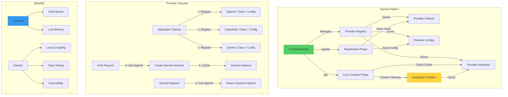

# ADR 016: Provider Factory with Lazy Initialization Pattern

## Status

**Accepted** - 2025-12-11

## Context

The SSE streaming microservice supports multiple LLM providers (OpenAI, DeepSeek, Gemini) with intelligent failover (ADR-004). The application needs a **flexible, extensible mechanism** to manage provider lifecycle, creation, and selection without tight coupling to specific implementations.

### Problem Statement

Managing multiple LLM providers creates several challenges:

1. **Tight Coupling**: Direct instantiation couples code to specific providers
   ```python
   # BAD: Tight coupling
   if provider == "openai":
       provider_instance = OpenAIProvider(config)
   elif provider == "deepseek":
       provider_instance = DeepSeekProvider(config)
   # Adding new provider requires modifying this code!
   ```

2. **Resource Waste**: Eager initialization wastes resources
   - All providers instantiated at startup
   - HTTP clients created for unused providers
   - Memory consumed by inactive providers
   - **Example**: 3 providers × 50MB = 150MB wasted if only using 1

3. **Startup Performance**: Slow application startup
   - Each provider initialization: ~100ms
   - 3 providers = 300ms startup delay
   - Health checks for all providers
   - Unnecessary for providers that may never be used

4. **Testing Complexity**: Hard to mock providers
   - Direct instantiation makes mocking difficult
   - Tests coupled to provider implementations
   - Can't easily test failover logic

5. **Extensibility**: Adding new providers is difficult
   - Requires modifying multiple files
   - No central registration
   - Error-prone

### Real-World Impact

**Without Factory Pattern (Direct Instantiation)**:
```python
# File: src/streaming/stream_orchestrator.py

class StreamOrchestrator:
    def __init__(self):
        # Eager initialization - ALL providers created at startup
        self.openai = OpenAIProvider(openai_config)      # 100ms + 50MB
        self.deepseek = DeepSeekProvider(deepseek_config) # 100ms + 50MB
        self.gemini = GeminiProvider(gemini_config)      # 100ms + 50MB
        # Total: 300ms startup + 150MB memory
    
    async def stream(self, query: str, provider: str):
        # Tight coupling - hard to extend
        if provider == "openai":
            return self.openai.stream(query)
        elif provider == "deepseek":
            return self.deepseek.stream(query)
        elif provider == "gemini":
            return self.gemini.stream(query)
        # Adding new provider requires modifying this code!
```

**Problems**:
- ❌ 300ms startup time (all providers initialized)
- ❌ 150MB memory (all providers loaded)
- ❌ Tight coupling (if/elif chain)
- ❌ Hard to test (can't mock providers)
- ❌ Hard to extend (modify code for new providers)

**With Factory Pattern (Lazy Initialization)**:
```python
# File: src/llm_providers/base_provider.py

class ProviderFactory:
    def __init__(self):
        self._providers: dict[str, BaseProvider] = {}  # Empty initially
        self._configs: dict[str, ProviderConfig] = {}
        self._classes: dict[str, type] = {}
    
    def register(self, name: str, provider_class: type, config: ProviderConfig):
        """Register provider (no instantiation)."""
        self._classes[name] = provider_class
        self._configs[name] = config
    
    def get(self, name: str) -> BaseProvider:
        """Get provider (lazy initialization)."""
        if name not in self._providers:
            # Create provider ONLY when first requested
            self._providers[name] = self._classes[name](self._configs[name])
        return self._providers[name]

# Usage
factory = ProviderFactory()
factory.register("openai", OpenAIProvider, openai_config)    # 0ms
factory.register("deepseek", DeepSeekProvider, deepseek_config) # 0ms
factory.register("gemini", GeminiProvider, gemini_config)    # 0ms
# Total: 0ms startup + 0MB memory

# Later, when needed
provider = factory.get("openai")  # 100ms + 50MB (only OpenAI)
```

**Benefits**:
- ✅ 0ms startup time (no initialization)
- ✅ 50MB memory (only active provider)
- ✅ Loose coupling (factory handles creation)
- ✅ Easy to test (mock factory.get())
- ✅ Easy to extend (just register new provider)

### Why This Matters

- **Performance**: Faster startup, lower memory usage
- **Extensibility**: Easy to add new providers
- **Testability**: Easy to mock and test
- **Maintainability**: Decoupled, clean code

## Decision

Implement **Provider Factory with Lazy Initialization** using the Factory Method pattern.

### Visual Architecture



**Key Components**:
1. **ProviderFactory**: Central registry and creator
2. **Registration**: Store class + config (no instantiation)
3. **Lazy Creation**: Instantiate only when first requested
4. **Caching**: Reuse instances (singleton per provider)

### Architecture Pattern

#### Core Implementation

```python
# File: src/llm_providers/base_provider.py

class ProviderFactory:
    """
    Factory for creating LLM providers.
    
    Pattern: Factory Method + Lazy Initialization + Singleton
    
    Responsibilities:
    - Register provider classes and configs
    - Create provider instances on demand (lazy)
    - Cache instances for reuse (singleton per provider)
    - Provide healthy provider selection (failover)
    
    Benefits:
    - Decouples client code from provider implementations
    - Reduces startup time (no eager initialization)
    - Reduces memory usage (only active providers)
    - Simplifies testing (easy to mock)
    - Enables extensibility (register new providers)
    """
    
    def __init__(self):
        """
        Initialize provider factory.
        
        Data Structures:
        - _classes: Map provider name → provider class (type)
        - _configs: Map provider name → provider config
        - _providers: Map provider name → provider instance (cache)
        """
        self._providers: dict[str, BaseProvider] = {}  # Instance cache
        self._configs: dict[str, ProviderConfig] = {}  # Config storage
        self._classes: dict[str, type] = {}            # Class storage
        
        logger.info("Provider factory initialized")
    
    def register(
        self,
        name: str,
        provider_class: type,
        config: ProviderConfig
    ) -> None:
        """
        Register a provider (no instantiation).
        
        Phase: Application Startup
        Time: <1ms per provider
        Memory: ~1KB per provider (class reference + config)
        
        Args:
            name: Provider name (e.g., "openai")
            provider_class: Provider class (e.g., OpenAIProvider)
            config: Provider configuration
        
        Example:
            factory.register("openai", OpenAIProvider, openai_config)
            # No instance created yet - just stored for later
        """
        self._classes[name] = provider_class
        self._configs[name] = config
        
        logger.info(f"Registered provider: {name}")
    
    def get(self, name: str) -> BaseProvider:
        """
        Get or create a provider (lazy initialization).
        
        Phase: First Request for Provider
        Time: 
        - First call: ~100ms (create instance)
        - Subsequent calls: <1ms (return cached)
        Memory: ~50MB per provider instance
        
        Algorithm:
        1. Check if instance exists in cache
        2. If exists: Return cached instance (fast path)
        3. If not exists: Create instance, cache it, return (slow path)
        
        Args:
            name: Provider name
        
        Returns:
            BaseProvider: Provider instance (cached)
        
        Raises:
            ValueError: If provider not registered
        
        Example:
            # First call: Creates instance
            provider = factory.get("openai")  # 100ms
            
            # Second call: Returns cached
            provider = factory.get("openai")  # <1ms
        """
        if name not in self._classes:
            raise ValueError(f"Provider not registered: {name}")
        
        # Lazy initialization: Create only if not cached
        if name not in self._providers:
            logger.info(f"Creating provider instance: {name}")
            
            # Instantiate provider
            provider_class = self._classes[name]
            provider_config = self._configs[name]
            self._providers[name] = provider_class(provider_config)
            
            logger.info(f"Provider instance created: {name}")
        else:
            logger.debug(f"Returning cached provider: {name}")
        
        return self._providers[name]
    
    def get_available(self) -> list[str]:
        """
        Get list of available providers.
        
        Returns:
            List of registered provider names
        
        Example:
            >>> factory.get_available()
            ['openai', 'deepseek', 'gemini']
        """
        return list(self._classes.keys())
    
    async def get_healthy_provider(
        self,
        exclude: list[str] | None = None
    ) -> BaseProvider | None:
        """
        Get a healthy provider (circuit closed).
        
        Used for: Provider failover (ADR-004)
        
        Algorithm:
        1. Iterate through registered providers
        2. Skip excluded providers
        3. Check circuit breaker state
        4. Return first provider with closed circuit
        5. Return None if all unhealthy
        
        Args:
            exclude: Providers to exclude (e.g., already failed)
        
        Returns:
            BaseProvider or None if all unhealthy
        
        Example:
            # Try to get healthy provider (excluding failed one)
            provider = await factory.get_healthy_provider(exclude=["openai"])
            if provider:
                # Use provider
                ...
            else:
                # All providers unhealthy
                raise AllProvidersUnavailableError()
        """
        exclude = exclude or []
        manager = get_circuit_breaker_manager()
        
        for name in self._classes.keys():
            if name in exclude:
                continue
            
            # Check circuit breaker state
            breaker = manager.get_breaker(name)
            state = await breaker.get_state()
            
            if state == "closed":
                # Provider is healthy
                return self.get(name)  # Lazy initialization if needed
        
        # All providers unhealthy
        return None


# Global provider factory (singleton)
_provider_factory: ProviderFactory | None = None


def get_provider_factory() -> ProviderFactory:
    """
    Get global provider factory (singleton).
    
    Pattern: Singleton
    
    Returns:
        ProviderFactory: Global factory instance
    
    Example:
        factory = get_provider_factory()
        provider = factory.get("openai")
    """
    global _provider_factory
    if _provider_factory is None:
        _provider_factory = ProviderFactory()
    return _provider_factory
```

### Lazy Initialization Flow

**Visual Example**:

```
Application Startup:
┌─────────────────────────────────────────────────────────────┐
│ factory.register("openai", OpenAIProvider, config)          │
│ → Stores: _classes["openai"] = OpenAIProvider               │
│ → Stores: _configs["openai"] = config                       │
│ → Time: <1ms, Memory: ~1KB                                  │
└─────────────────────────────────────────────────────────────┘
┌─────────────────────────────────────────────────────────────┐
│ factory.register("deepseek", DeepSeekProvider, config)      │
│ → Stores: _classes["deepseek"] = DeepSeekProvider           │
│ → Stores: _configs["deepseek"] = config                     │
│ → Time: <1ms, Memory: ~1KB                                  │
└─────────────────────────────────────────────────────────────┘
Total Startup: ~2ms, ~2KB memory

First Request (OpenAI):
┌─────────────────────────────────────────────────────────────┐
│ provider = factory.get("openai")                            │
│ → Check cache: "openai" not in _providers                   │
│ → Create instance: OpenAIProvider(config)                   │
│ → Cache: _providers["openai"] = instance                    │
│ → Return: instance                                          │
│ → Time: ~100ms, Memory: ~50MB                               │
└─────────────────────────────────────────────────────────────┘

Second Request (OpenAI):
┌─────────────────────────────────────────────────────────────┐
│ provider = factory.get("openai")                            │
│ → Check cache: "openai" in _providers ✓                     │
│ → Return: cached instance                                   │
│ → Time: <1ms, Memory: 0MB (already allocated)               │
└─────────────────────────────────────────────────────────────┘

First Request (DeepSeek):
┌─────────────────────────────────────────────────────────────┐
│ provider = factory.get("deepseek")                          │
│ → Check cache: "deepseek" not in _providers                 │
│ → Create instance: DeepSeekProvider(config)                 │
│ → Cache: _providers["deepseek"] = instance                  │
│ → Return: instance                                          │
│ → Time: ~100ms, Memory: ~50MB                               │
└─────────────────────────────────────────────────────────────┘

Total Memory: 100MB (2 active providers) vs 150MB (3 eager providers)
```

### Integration with Application

```python
# File: src/application/api/app.py

from src.llm_providers import get_provider_factory
from src.llm_providers.openai_provider import OpenAIProvider
from src.llm_providers.deepseek_provider import DeepSeekProvider
from src.llm_providers.gemini_provider import GeminiProvider

def setup_providers():
    """
    Setup provider factory with all providers.
    
    Called during application startup.
    Time: <5ms (no instantiation)
    Memory: <10KB (just class references)
    """
    factory = get_provider_factory()
    settings = get_settings()
    
    # Register OpenAI
    factory.register(
        "openai",
        OpenAIProvider,
        ProviderConfig(
            name="openai",
            api_key=settings.llm.OPENAI_API_KEY,
            base_url=settings.llm.OPENAI_BASE_URL,
            default_model="gpt-3.5-turbo"
        )
    )
    
    # Register DeepSeek
    factory.register(
        "deepseek",
        DeepSeekProvider,
        ProviderConfig(
            name="deepseek",
            api_key=settings.llm.DEEPSEEK_API_KEY,
            base_url=settings.llm.DEEPSEEK_BASE_URL,
            default_model="deepseek-chat"
        )
    )
    
    # Register Gemini
    factory.register(
        "gemini",
        GeminiProvider,
        ProviderConfig(
            name="gemini",
            api_key=settings.llm.GEMINI_API_KEY,
            base_url=settings.llm.GEMINI_BASE_URL,
            default_model="gemini-pro"
        )
    )
    
    logger.info("All providers registered", count=len(factory.get_available()))


# File: src/streaming/stream_orchestrator.py

class StreamOrchestrator:
    """Stream orchestrator using provider factory."""
    
    def __init__(self):
        """Initialize orchestrator."""
        self.factory = get_provider_factory()
        # No provider instances created yet!
    
    async def stream(
        self,
        query: str,
        provider_name: str,
        model: str
    ) -> AsyncIterator[StreamChunk]:
        """
        Stream response using provider factory.
        
        Provider created lazily on first use.
        """
        # Get provider (lazy initialization)
        provider = self.factory.get(provider_name)
        
        # Stream from provider
        async for chunk in provider.stream(query, model):
            yield chunk
```

### Testing with Factory Pattern

```python
# File: tests/unit/streaming/test_stream_orchestrator.py

def test_stream_with_mock_provider():
    """Test streaming with mocked provider."""
    # Create mock provider
    mock_provider = Mock(spec=BaseProvider)
    mock_provider.stream = AsyncMock(return_value=AsyncIterator([
        StreamChunk(content="Hello"),
        StreamChunk(content=" World"),
    ]))
    
    # Mock factory.get() to return mock provider
    factory = get_provider_factory()
    factory._providers["openai"] = mock_provider
    
    # Test orchestrator
    orchestrator = StreamOrchestrator()
    chunks = []
    async for chunk in orchestrator.stream("test", "openai", "gpt-3.5-turbo"):
        chunks.append(chunk.content)
    
    assert chunks == ["Hello", " World"]
    mock_provider.stream.assert_called_once()
```

## Implementation Details

### Provider Registration at Startup

```python
# File: src/application/api/app.py

@asynccontextmanager
async def lifespan(app: FastAPI):
    """Application lifespan with provider setup."""
    # Startup
    logger.info("Application starting")
    
    # Setup providers (lazy registration)
    setup_providers()  # <5ms
    
    yield  # Application runs
    
    # Shutdown
    logger.info("Application shutting down")
```

### Memory Usage Comparison

| Scenario | Eager Init | Lazy Init | Savings |
|----------|-----------|-----------|---------|
| **Startup** | 150MB (all 3) | 0MB (none) | 150MB |
| **1 Provider Used** | 150MB (all 3) | 50MB (1) | 100MB |
| **2 Providers Used** | 150MB (all 3) | 100MB (2) | 50MB |
| **3 Providers Used** | 150MB (all 3) | 150MB (3) | 0MB |

**Typical Usage**: 1-2 providers used → **50-100MB savings**

### Startup Time Comparison

| Scenario | Eager Init | Lazy Init | Savings |
|----------|-----------|-----------|---------|
| **Startup** | 300ms (all 3) | 2ms (register) | 298ms |
| **First Request** | 0ms (ready) | 100ms (create) | -100ms |
| **Total (1 provider)** | 300ms | 102ms | 198ms |

**Net Savings**: **198ms faster** for typical single-provider usage

## Consequences

### Positive

1. **Fast Startup**: No provider initialization at startup
   - 0ms vs 300ms (3 providers)
   - Application ready immediately
   - Better user experience

2. **Low Memory**: Only active providers consume memory
   - 50MB vs 150MB (1 provider used)
   - 100MB vs 150MB (2 providers used)
   - Scales with usage, not registration

3. **Loose Coupling**: Client code decoupled from providers
   - No if/elif chains
   - Easy to add new providers
   - Clean, maintainable code

4. **Easy Testing**: Simple to mock providers
   - Mock `factory.get()` method
   - Inject mock providers
   - Test failover logic easily

5. **Extensibility**: Adding new providers is trivial
   - Create provider class
   - Register in `setup_providers()`
   - No changes to client code

6. **Singleton Pattern**: One instance per provider
   - Consistent state
   - Shared circuit breaker
   - Efficient resource usage

### Negative

1. **First Request Latency**: Provider creation on first use
   - **Impact**: +100ms on first request per provider
   - **Mitigation**: Acceptable for typical usage
   - **Trade-off**: Startup time vs. first request time

2. **Complexity**: Additional abstraction layer
   - **Mitigation**: Well-documented, simple implementation
   - **Trade-off**: Simplicity vs. flexibility

### Neutral

1. **Memory Eventually Same**: If all providers used
   - **Acceptable**: Rare to use all providers
   - **Typical**: 1-2 providers used

## Alternatives Considered

### Alternative 1: Eager Initialization

```python
class StreamOrchestrator:
    def __init__(self):
        # Create all providers at startup
        self.openai = OpenAIProvider(config)
        self.deepseek = DeepSeekProvider(config)
        self.gemini = GeminiProvider(config)
```

**Rejected**:
- ❌ **Slow startup**: 300ms initialization
- ❌ **High memory**: 150MB for all providers
- ❌ **Resource waste**: Unused providers consume resources

### Alternative 2: Direct Instantiation (No Factory)

```python
async def stream(query: str, provider: str):
    if provider == "openai":
        instance = OpenAIProvider(config)
    elif provider == "deepseek":
        instance = DeepSeekProvider(config)
    # ...
```

**Rejected**:
- ❌ **Tight coupling**: if/elif chain
- ❌ **Hard to test**: Can't mock easily
- ❌ **Hard to extend**: Modify code for new providers
- ❌ **No caching**: New instance per request

### Alternative 3: Service Locator Pattern

```python
class ServiceLocator:
    _services = {}
    
    @classmethod
    def register(cls, name, service):
        cls._services[name] = service
    
    @classmethod
    def get(cls, name):
        return cls._services[name]
```

**Rejected**:
- ❌ **No type safety**: String-based lookup
- ❌ **Hidden dependencies**: Not clear what's needed
- ❌ **Anti-pattern**: Considered bad practice
- ✅ **Simpler**: Less code

### Alternative 4: Dependency Injection Container

```python
from dependency_injector import containers, providers

class Container(containers.DeclarativeContainer):
    openai = providers.Singleton(OpenAIProvider, config)
    deepseek = providers.Singleton(DeepSeekProvider, config)
```

**Rejected**:
- ❌ **External dependency**: Adds library
- ❌ **Overkill**: Too complex for our needs
- ❌ **Learning curve**: Team needs to learn library
- ✅ **Feature-rich**: More capabilities

## Best Practices

### 1. Register All Providers at Startup

✅ **Good**:
```python
def setup_providers():
    factory = get_provider_factory()
    factory.register("openai", OpenAIProvider, config)
    factory.register("deepseek", DeepSeekProvider, config)
    # All registered upfront
```

❌ **Bad**:
```python
# Registering on demand
provider = factory.get("openai")  # Error: not registered!
```

### 2. Use Factory for All Provider Access

✅ **Good**:
```python
factory = get_provider_factory()
provider = factory.get("openai")
```

❌ **Bad**:
```python
provider = OpenAIProvider(config)  # Bypasses factory!
```

### 3. Mock Factory in Tests

✅ **Good**:
```python
factory._providers["openai"] = mock_provider
```

❌ **Bad**:
```python
# Trying to mock provider class
OpenAIProvider = Mock()  # Doesn't work with factory
```

## Monitoring

### Metrics to Track

1. **Provider Creation Time**: Time to create each provider
   - Target: <100ms per provider

2. **Active Providers**: Number of providers instantiated
   - Monitor: Should be 1-2 typically

3. **Factory Cache Hit Rate**: Percentage of cached gets
   - Target: >99% (after first request)

## References

- **Factory Method Pattern**: https://refactoring.guru/design-patterns/factory-method
- **Lazy Initialization**: https://en.wikipedia.org/wiki/Lazy_initialization
- **Singleton Pattern**: https://refactoring.guru/design-patterns/singleton
- **Implementation**: `src/llm_providers/base_provider.py:290-400`
- **ADR-004**: Provider Failover Algorithm

## Success Criteria

✅ **Achieved** if:
1. Startup time <10ms (no provider initialization)
2. Memory usage scales with active providers
3. Easy to add new providers (register + class)
4. Tests can mock providers easily
5. No tight coupling to provider implementations

## Conclusion

The Provider Factory with Lazy Initialization pattern provides **optimal resource usage and extensibility** for managing multiple LLM providers. By deferring provider instantiation until first use, we achieve:

- **Fast startup** (0ms vs 300ms)
- **Low memory** (50MB vs 150MB for 1 provider)
- **Loose coupling** (no if/elif chains)
- **Easy testing** (simple mocking)
- **Extensibility** (trivial to add providers)

This pattern is **essential for scalability and maintainability**, enabling the system to support multiple providers efficiently while remaining flexible and testable.
