# ADR 017: Deterministic Hash-Based Sampling for Execution Tracking

## Status

**Accepted** - 2025-12-11

## Context

The SSE streaming microservice tracks execution time for all request stages to enable performance monitoring and bottleneck identification. However, **tracking every single request creates massive memory overhead** at scale. The system needs a way to maintain observability while reducing memory usage.

### Problem Statement

Without sampling, execution tracking consumes excessive memory:

1. **Memory Explosion**: Tracking all requests is unsustainable
   - Each request: 10 stages × 200 bytes = 2KB
   - 10,000 requests/min = 20MB/min
   - 1 hour = 1.2GB memory
   - 24 hours = **28.8GB memory** (impossible on most servers)

2. **Memory Leaks**: Unbounded growth without cleanup
   - Old request data never deleted
   - Memory usage grows indefinitely
   - Eventually causes OOM (Out of Memory)

3. **Performance Overhead**: Tracking adds latency
   - Timestamp capture: ~0.1ms per stage
   - Dict operations: ~0.05ms per stage
   - 10 stages = 1.5ms overhead per request
   - At 10,000 requests/min: 15 seconds of CPU time wasted

4. **Statistical Validity**: Don't need 100% of data
   - Percentiles (p50, p95, p99) are statistical measures
   - 10% sample of 10,000 requests = 1,000 samples
   - 1,000 samples is statistically significant
   - Margin of error: ±3% at 95% confidence

### Real-World Impact

**Without Sampling (100% Tracking)**:
```python
# Track every single request
tracker = ExecutionTracker()

# Request 1
with tracker.track_stage("2", "Cache lookup", "req-001"):
    pass  # 2KB memory allocated

# Request 2
with tracker.track_stage("2", "Cache lookup", "req-002"):
    pass  # 2KB memory allocated

# ... 10,000 requests later
# Memory usage: 20MB
# After 1 hour: 1.2GB
# After 24 hours: 28.8GB → OOM!
```

**With Random Sampling (10%)**:
```python
# Track 10% of requests randomly
import random

if random.random() < 0.1:  # 10% chance
    with tracker.track_stage("2", "Cache lookup", thread_id):
        pass
```

**Problem with Random Sampling**:
```
Request "req-001":
- Stage 1: random() = 0.05 → TRACK ✓
- Stage 2: random() = 0.15 → DON'T TRACK ✗
- Stage 3: random() = 0.08 → TRACK ✓

Result: Incomplete trace! Can't analyze full request flow.
```

**With Hash-Based Sampling (10%)**:
```python
# Deterministic sampling based on thread_id
hash_value = int(hashlib.md5(thread_id.encode()).hexdigest(), 16)
if (hash_value % 100) < 10:  # Always same decision for same thread_id
    with tracker.track_stage("2", "Cache lookup", thread_id):
        pass
```

**Benefit of Hash-Based Sampling**:
```
Request "req-001":
- hash("req-001") % 100 = 5 → TRACK ✓
- Stage 1: 5 < 10 → TRACK ✓
- Stage 2: 5 < 10 → TRACK ✓
- Stage 3: 5 < 10 → TRACK ✓

Request "req-002":
- hash("req-002") % 100 = 47 → DON'T TRACK ✗
- Stage 1: 47 < 10 → DON'T TRACK ✗
- Stage 2: 47 < 10 → DON'T TRACK ✗
- Stage 3: 47 < 10 → DON'T TRACK ✗

Result: Complete traces for sampled requests!
```

### Why This Matters

- **Memory Efficiency**: 90% reduction (1.2GB → 120MB per hour)
- **Observability**: Still get statistically valid insights
- **Consistency**: Complete traces for sampled requests
- **Performance**: Lower overhead for non-sampled requests

## Decision

Implement **deterministic hash-based sampling** using MD5 hash modulo 100 for consistent sampling decisions per `thread_id`.

### Visual Architecture

```mermaid
graph TB
    subgraph "Hash-Based Sampling Algorithm"
        A[thread_id: req-abc-123] -->|1. Hash| B[MD5 Hash]
        B -->|2. Convert| C[Integer: 158726489234...]
        C -->|3. Modulo 100| D[Bucket: 23]
        D -->|4. Compare| E{Bucket < Threshold?}
        
        F[sample_rate: 0.1] -->|×100| G[Threshold: 10]
        G --> E
        
        E -->|23 < 10?| H[NO → DON'T TRACK]
        E -->|5 < 10?| I[YES → TRACK]
    end
    
    subgraph "Consistency Guarantee"
        J[Request 1: req-abc-123] -->|hash % 100| K[Bucket 23]
        L[Request 2: req-abc-123] -->|hash % 100| M[Bucket 23]
        N[Request 3: req-abc-123] -->|hash % 100| O[Bucket 23]
        
        K --> P[Same Decision]
        M --> P
        O --> P
    end
    
    subgraph "Memory Savings"
        Q[100% Tracking] -->|10K req/min| R[20MB/min]
        R -->|1 hour| S[1.2GB]
        
        T[10% Sampling] -->|1K req/min| U[2MB/min]
        U -->|1 hour| V[120MB]
        
        S --> W[90% Reduction]
        V --> W
    end
    
    style B fill:#51cf66,stroke:#2f9e44
    style E fill:#ffd43b,stroke:#fab005
    style W fill:#339af0,stroke:#1971c2
```



**Key Components**:
1. **MD5 Hash**: Fast, non-cryptographic hash function
2. **Modulo 100**: Maps hash to percentage bucket (0-99)
3. **Threshold Comparison**: Determines sampling decision
4. **Consistency**: Same input always produces same output

### Algorithm Explanation

#### Step-by-Step Process

```python
def should_track(thread_id: str, sample_rate: float = 0.1) -> bool:
    """
    Determine if request should be tracked using hash-based sampling.
    
    Args:
        thread_id: Request identifier (e.g., "req-abc-123")
        sample_rate: Percentage to sample (0.0-1.0, default 0.1 = 10%)
    
    Returns:
        bool: True if should track, False otherwise
    """
    # Step 1: Hash the thread_id using MD5
    # MD5 is fast (~2 microseconds) and provides good distribution
    hash_hex = hashlib.md5(thread_id.encode()).hexdigest()
    # Example: "req-abc-123" → "7d9f8a2b3e4c5d6f..."
    
    # Step 2: Convert hex string to integer
    hash_int = int(hash_hex, 16)
    # Example: "7d9f8a2b..." → 158726489234...
    
    # Step 3: Map to percentage bucket (0-99)
    bucket = hash_int % 100
    # Example: 158726489234... % 100 = 23
    
    # Step 4: Compare against threshold
    threshold = sample_rate * 100
    # Example: 0.1 * 100 = 10
    
    return bucket < threshold
    # Example: 23 < 10? → False (don't track)
```

#### Visual Example

```
Sample Rate = 10% (track 10% of requests)

thread_id = "req-001"
├─ MD5 hash: "c4ca4238a0b923820dcc509a6f75849b"
├─ Integer: 261237890123...
├─ Modulo 100: 5
└─ 5 < 10? → YES → TRACK ✓

thread_id = "req-002"
├─ MD5 hash: "c81e728d9d4c2f636f067f89cc14862c"
├─ Integer: 267890123456...
├─ Modulo 100: 47
└─ 47 < 10? → NO → DON'T TRACK ✗

thread_id = "req-001" (again)
├─ MD5 hash: "c4ca4238a0b923820dcc509a6f75849b" (same!)
├─ Integer: 261237890123... (same!)
├─ Modulo 100: 5 (same!)
└─ 5 < 10? → YES → TRACK ✓ (consistent!)
```

### Distribution Analysis

**Hash Function Properties**:
- **Uniform Distribution**: MD5 distributes inputs evenly across output space
- **Deterministic**: Same input always produces same output
- **Fast**: ~2 microseconds per hash
- **Avalanche Effect**: Small input change → completely different hash

**Bucket Distribution** (10,000 requests):
```
Bucket 0-9:   ~1,000 requests (10%) → TRACKED
Bucket 10-99: ~9,000 requests (90%) → NOT TRACKED

Expected distribution per bucket:
- Bucket 0:  ~100 requests
- Bucket 1:  ~100 requests
- ...
- Bucket 99: ~100 requests

Actual distribution (with good hash function):
- Standard deviation: ±10 requests per bucket
- Uniformity: 99%+
```

## Implementation Details

### Core Implementation

```python
# File: src/core/observability/execution_tracker.py

class ExecutionTracker:
    """Execution tracker with hash-based sampling."""
    
    def __init__(self):
        """Initialize tracker with sampling configuration."""
        settings = get_settings()
        self._sample_rate = float(settings.EXECUTION_TRACKING_SAMPLE_RATE)
        # Default: 0.1 (10%)
    
    def should_track(self, thread_id: str, force: bool = False) -> bool:
        """
        Determine if request should be tracked.
        
        Algorithm: Hash-Based Deterministic Sampling
        
        Args:
            thread_id: Request identifier for consistent sampling
            force: If True, always track (for debugging)
        
        Returns:
            bool: True if should track, False otherwise
        """
        # Force tracking for debugging
        if force:
            return True
        
        # Check if tracking globally disabled
        if not self._tracking_enabled:
            return False
        
        # Optimization: If sample_rate is 100%, track everything
        if self._sample_rate >= 1.0:
            return True
        
        # Hash-based sampling
        hash_value = int(hashlib.md5(thread_id.encode()).hexdigest(), 16)
        percentage_bucket = hash_value % 100
        threshold = self._sample_rate * 100
        
        return percentage_bucket < threshold
    
    @contextmanager
    def track_stage(
        self,
        stage_id: str,
        stage_name: str,
        thread_id: str,
        force_tracking: bool = False,
        **metadata
    ):
        """
        Track stage execution (respects sampling).
        
        Args:
            stage_id: Stage identifier
            stage_name: Stage name
            thread_id: Thread ID for correlation
            force_tracking: Override sampling (for debugging)
            **metadata: Additional metadata
        
        Yields:
            StageExecution or None (if not tracked)
        """
        # Check if should track
        should_track = self.should_track(thread_id, force=force_tracking)
        
        if not should_track:
            # Not sampled - skip tracking (fast path)
            yield None
            return
        
        # Sampled - track execution (slow path)
        execution = StageExecution(
            stage_id=stage_id,
            stage_name=stage_name,
            thread_id=thread_id,
            started_at=datetime.utcnow().isoformat() + "Z",
            metadata=metadata
        )
        
        # ... rest of tracking logic
```

### Configuration

```python
# File: src/core/config/settings.py

class Settings(BaseSettings):
    """Application settings."""
    
    EXECUTION_TRACKING_SAMPLE_RATE: float = Field(
        default=0.1,
        description="Execution tracking sample rate (0.0-1.0)"
    )
    # 0.0 = track nothing
    # 0.1 = track 10%
    # 1.0 = track everything
```

### Usage Examples

#### Example 1: Normal Usage (Respects Sampling)

```python
# File: src/streaming/stream_orchestrator.py

tracker = get_tracker()

async def stream(query: str, thread_id: str):
    """Stream response with execution tracking."""
    
    # Stage 1: Validation (may or may not be tracked)
    with tracker.track_stage("1", "Validation", thread_id):
        validate_query(query)
    
    # Stage 2: Cache lookup (same sampling decision)
    with tracker.track_stage("2", "Cache lookup", thread_id):
        cached = await cache.get(query)
    
    # If thread_id sampled: Both stages tracked
    # If thread_id not sampled: Neither stage tracked
```

#### Example 2: Force Tracking (Debugging)

```python
# Force tracking for specific request (bypass sampling)
with tracker.track_stage("2", "Cache lookup", thread_id, force_tracking=True):
    # Always tracked, even if thread_id not sampled
    cached = await cache.get(query)
```

#### Example 3: Conditional Tracking

```python
# Track errors regardless of sampling
try:
    with tracker.track_stage("5", "LLM call", thread_id):
        response = await llm.stream(query)
except Exception as e:
    # Force track error for debugging
    with tracker.track_stage("5.error", "LLM error", thread_id, force_tracking=True):
        logger.error("LLM call failed", error=str(e))
    raise
```

## Where It's Used

### 1. Stream Orchestrator

**File**: `src/streaming/stream_orchestrator.py`

**Purpose**: Track entire request lifecycle

```python
async def stream(request: StreamRequest) -> AsyncIterator[StreamEvent]:
    """Stream response with execution tracking."""
    tracker = get_tracker()
    
    # All stages use same thread_id → consistent sampling
    with tracker.track_stage("1", "Validation", request.thread_id):
        validate_request(request)
    
    with tracker.track_stage("2", "Cache lookup", request.thread_id):
        cached = await cache_manager.get(cache_key, request.thread_id)
    
    with tracker.track_stage("3", "Rate limiting", request.thread_id):
        await rate_limiter.check(request.user_id)
    
    # ... more stages
```

### 2. Cache Manager

**File**: `src/infrastructure/cache/cache_manager.py`

**Purpose**: Track cache performance

```python
async def get(self, key: str, thread_id: str | None = None) -> str | None:
    """Get from cache with tracking."""
    tracker = get_tracker()
    
    # Track L1 cache lookup
    if thread_id:
        with tracker.track_stage("2.1", "L1 cache lookup", thread_id):
            l1_result = await self._memory_cache.get(key)
    
    # Track L2 cache lookup
    if thread_id and not l1_result:
        with tracker.track_stage("2.2", "L2 Redis lookup", thread_id):
            l2_result = await self._redis_client.get(key)
```

### 3. LLM Providers

**File**: `src/llm_providers/base_provider.py`

**Purpose**: Track LLM API performance

```python
async def stream(self, query: str, model: str, thread_id: str | None = None):
    """Stream from LLM with tracking."""
    tracker = get_tracker()
    
    # Track model validation
    if thread_id:
        with tracker.track_stage("5.1", f"Validate model: {model}", thread_id):
            self._validate_model(model)
    
    # Track LLM streaming
    if thread_id:
        with tracker.track_stage("5.2", "LLM streaming", thread_id):
            async for chunk in self._stream_internal(query, model):
                yield chunk
```

### 4. Admin Endpoints

**File**: `src/application/api/routes/admin.py`

**Purpose**: Retrieve execution statistics

```python
@router.get("/admin/execution-stats/{stage_id}")
async def get_stage_stats(stage_id: str):
    """Get statistics for a specific stage."""
    tracker = get_tracker()
    
    # Get stats from sampled requests
    stats = tracker.get_stage_statistics(stage_id, limit=1000)
    
    return {
        "stage_id": stage_id,
        "sample_rate": tracker._sample_rate,
        "note": f"Statistics based on {tracker._sample_rate * 100}% sample",
        **stats
    }
```

## Performance Characteristics

### Time Complexity

| Operation | Complexity | Actual Time |
|-----------|-----------|-------------|
| `should_track()` | O(1) | ~2 microseconds |
| MD5 hash | O(n) where n = thread_id length | ~1 microsecond |
| Modulo operation | O(1) | ~0.1 microseconds |
| Comparison | O(1) | ~0.1 microseconds |

### Memory Usage

| Scenario | Requests/Min | Memory/Hour | Savings |
|----------|-------------|-------------|---------|
| **100% Tracking** | 10,000 | 1.2GB | - |
| **10% Sampling** | 1,000 | 120MB | 90% |
| **1% Sampling** | 100 | 12MB | 99% |

### Statistical Validity

**Sample Size Analysis**:
```
Population: 10,000 requests/min
Sample Rate: 10%
Sample Size: 1,000 requests/min

For percentile calculations:
- p50 (median): ±2% error at 95% confidence
- p95: ±5% error at 95% confidence
- p99: ±10% error at 95% confidence

Conclusion: 10% sample is statistically significant
```

## Consequences

### Positive

1. **90% Memory Reduction**: 1.2GB → 120MB per hour
   - Prevents OOM errors
   - Enables longer retention
   - Lower infrastructure costs

2. **Consistent Traces**: Complete execution paths for sampled requests
   - Can analyze full request flow
   - No partial traces
   - Easier debugging

3. **Statistically Valid**: 10% sample provides accurate insights
   - Percentiles (p50, p95, p99) are reliable
   - Margin of error: ±3-10%
   - Sufficient for performance analysis

4. **Fast**: Hash-based sampling is very fast
   - ~2 microseconds per decision
   - Negligible overhead
   - No performance impact

5. **Deterministic**: Same thread_id always gets same decision
   - Reproducible behavior
   - No randomness
   - Easier to debug

6. **Configurable**: Sample rate adjustable via config
   - Increase for more detail
   - Decrease for less memory
   - Can be changed without code changes

### Negative

1. **Incomplete Data**: Only 10% of requests tracked
   - **Mitigation**: 10% is statistically significant
   - **Mitigation**: Can increase sample rate if needed
   - **Trade-off**: Memory vs. completeness

2. **Rare Events May Be Missed**: 1-in-1000 errors might not be sampled
   - **Mitigation**: Force tracking for errors
   - **Mitigation**: Increase sample rate for debugging
   - **Trade-off**: Memory vs. rare event detection

3. **Hash Collision Risk**: MD5 not cryptographically secure
   - **Mitigation**: Not a security concern (just sampling)
   - **Mitigation**: Collision probability is negligible
   - **Acceptable**: MD5 is sufficient for this use case

### Neutral

1. **Sample Rate Tuning**: May need adjustment based on traffic
   - **Acceptable**: Easy to configure
   - **Monitoring**: Track memory usage and adjust

2. **Non-Uniform Distribution**: Hash function may have slight bias
   - **Impact**: Negligible (<1% deviation)
   - **Acceptable**: MD5 provides good distribution

## Alternatives Considered

### Alternative 1: Random Sampling

```python
import random

if random.random() < 0.1:  # 10% chance
    with tracker.track_stage("2", "Cache", thread_id):
        pass
```

**Rejected**:
- ❌ **Inconsistent**: Different decision per stage
- ❌ **Incomplete traces**: Can't analyze full request
- ❌ **Not reproducible**: Different behavior each time

### Alternative 2: Time-Based Sampling

```python
# Track first 10 seconds of every minute
if time.time() % 60 < 10:
    with tracker.track_stage("2", "Cache", thread_id):
        pass
```

**Rejected**:
- ❌ **Biased**: Misses patterns outside sampling window
- ❌ **Predictable**: Attackers can avoid tracking
- ❌ **Not uniform**: Some time periods over-represented

### Alternative 3: Counter-Based Sampling

```python
# Track every 10th request
if request_counter % 10 == 0:
    with tracker.track_stage("2", "Cache", thread_id):
        pass
```

**Rejected**:
- ❌ **Not thread-safe**: Counter requires locking
- ❌ **Not distributed**: Doesn't work across instances
- ❌ **Predictable**: Every 10th request tracked

### Alternative 4: No Sampling (Track Everything)

```python
# Always track
with tracker.track_stage("2", "Cache", thread_id):
    pass
```

**Rejected**:
- ❌ **Memory explosion**: 1.2GB/hour → 28.8GB/day
- ❌ **OOM risk**: Eventually runs out of memory
- ❌ **Performance overhead**: Tracking adds latency

## Best Practices

### 1. Use Same thread_id for All Stages

✅ **Good**:
```python
# All stages use same thread_id
with tracker.track_stage("1", "Validation", thread_id):
    pass
with tracker.track_stage("2", "Cache", thread_id):
    pass
# Consistent sampling decision
```

❌ **Bad**:
```python
# Different thread_id per stage
with tracker.track_stage("1", "Validation", "req-1-stage-1"):
    pass
with tracker.track_stage("2", "Cache", "req-1-stage-2"):
    pass
# Inconsistent sampling!
```

### 2. Force Track Errors

✅ **Good**:
```python
try:
    with tracker.track_stage("5", "LLM", thread_id):
        await llm.stream(query)
except Exception:
    # Force track error
    with tracker.track_stage("5.error", "LLM error", thread_id, force_tracking=True):
        logger.error("LLM failed")
    raise
```

### 3. Configure Sample Rate Based on Traffic

✅ **Good**:
```python
# Low traffic: Higher sample rate
EXECUTION_TRACKING_SAMPLE_RATE=0.5  # 50%

# High traffic: Lower sample rate
EXECUTION_TRACKING_SAMPLE_RATE=0.01  # 1%
```

### 4. Monitor Memory Usage

✅ **Good**:
```python
# Periodic memory monitoring
stats = tracker.get_stats()
if stats["memory_mb"] > 500:
    logger.warning("High memory usage", memory_mb=stats["memory_mb"])
    # Consider reducing sample rate
```

## Monitoring

### Metrics to Track

1. **Sample Rate**: Current sampling percentage
   - Target: 10% (configurable)

2. **Memory Usage**: Execution tracker memory
   - Target: <200MB per hour

3. **Tracked Requests**: Number of requests tracked
   - Target: ~10% of total requests

4. **Hash Distribution**: Uniformity of bucket distribution
   - Target: ±10% deviation per bucket

## References

- **MD5 Hash Function**: https://en.wikipedia.org/wiki/MD5
- **Sampling Theory**: https://en.wikipedia.org/wiki/Sampling_(statistics)
- **Implementation**: `src/core/observability/execution_tracker.py:164-291`
- **ADR-003**: Hash-Based Execution Tracking (related)

## Success Criteria

✅ **Achieved** if:
1. Memory usage <200MB per hour (vs 1.2GB without sampling)
2. Complete traces for all sampled requests
3. Statistically valid percentiles (p50, p95, p99)
4. Hash distribution uniformity >95%
5. Sampling overhead <2 microseconds per decision

## Conclusion

Deterministic hash-based sampling provides **optimal balance between observability and resource usage**. By using MD5 hash modulo 100, we achieve:

- **90% memory reduction** (1.2GB → 120MB per hour)
- **Consistent traces** (complete execution paths)
- **Statistical validity** (10% sample is significant)
- **Fast performance** (~2 microseconds per decision)
- **Deterministic behavior** (reproducible sampling)

This algorithm is **essential for production scalability**, enabling the system to maintain observability at high traffic volumes without memory exhaustion.
