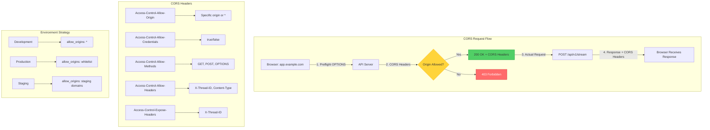

# ADR 019: CORS Configuration Strategy for Cross-Origin Access

## Status

**Accepted** - 2025-12-11

## Context

The SSE streaming microservice is designed to be consumed by web applications running on different domains (cross-origin requests). Modern browsers enforce **Same-Origin Policy (SOP)** which blocks cross-origin HTTP requests by default for security reasons. The application needs a **secure, flexible CORS configuration** to enable legitimate cross-origin access while preventing unauthorized domains.

### Problem Statement

Without proper CORS configuration, the API is unusable from web browsers:

1. **Browser Blocks Requests**: Same-Origin Policy prevents cross-origin calls
   ```javascript
   // Frontend on https://app.example.com
   fetch('https://api.example.com/api/v1/stream', {
       method: 'POST',
       body: JSON.stringify({query: "Hello"})
   })
   // ❌ CORS error: No 'Access-Control-Allow-Origin' header
   ```

2. **Preflight Requests Fail**: OPTIONS requests rejected
   - Browser sends OPTIONS request before actual request
   - Server must respond with CORS headers
   - Without proper handling: 405 Method Not Allowed

3. **Credentials Not Sent**: Cookies/auth headers blocked
   - `credentials: 'include'` requires `Access-Control-Allow-Credentials: true`
   - Without it: Authentication fails

4. **Custom Headers Blocked**: Thread ID header rejected
   - Custom headers require `Access-Control-Allow-Headers`
   - Without it: `X-Thread-ID` header stripped

5. **Response Headers Hidden**: Client can't read thread ID
   - Response headers hidden by default
   - Need `Access-Control-Expose-Headers` to expose them

### Real-World Impact

**Without CORS (Default Behavior)**:
```
Client (https://app.example.com):
  POST https://api.example.com/api/v1/stream
  
Browser Console:
  ❌ Access to fetch at 'https://api.example.com/api/v1/stream' 
     from origin 'https://app.example.com' has been blocked by CORS policy: 
     No 'Access-Control-Allow-Origin' header is present.
  
Result: API completely unusable from browsers
```

**With Wildcard CORS (Insecure)**:
```python
# Allow ALL origins
allow_origins=["*"]
allow_credentials=True  # ❌ INVALID COMBINATION!

Browser Error:
  ❌ Credential mode 'include' with wildcard origin is not allowed
  
Security Risk:
  - Any website can call your API
  - Potential for CSRF attacks
  - Data leakage to malicious sites
```

**With Proper CORS (Secure)**:
```python
# Allow specific origins
allow_origins=[
    "https://app.example.com",
    "https://staging.example.com"
]
allow_credentials=True  # ✅ VALID with specific origins

Result:
  ✅ Legitimate origins can access API
  ✅ Credentials sent securely
  ✅ Unauthorized origins blocked
```

### Why This Matters

- **Usability**: API must be accessible from web browsers
- **Security**: Prevent unauthorized cross-origin access
- **Compliance**: Meet security audit requirements
- **User Experience**: Smooth authentication flow

## Decision

Implement **environment-specific CORS configuration** with strict origin whitelisting in production and permissive settings in development.

### Visual Architecture



**Key Components**:
1. **Preflight Handling**: OPTIONS requests with CORS headers
2. **Origin Whitelisting**: Specific allowed origins
3. **Credentials Support**: Secure cookie/auth handling
4. **Header Exposure**: Custom headers visible to client

### Configuration Strategy

#### Environment-Specific Configuration

```python
# File: src/core/config/settings.py

class AppSettings(BaseSettings):
    """Application settings with environment-specific CORS."""
    
    ENVIRONMENT: str = Field(default="development")
    
    CORS_ORIGINS: list[str] = Field(
        default=["*"],
        description="Allowed CORS origins"
    )
    
    @property
    def cors_config(self) -> dict:
        """Get CORS configuration based on environment."""
        if self.ENVIRONMENT == "production":
            # Production: Strict whitelist
            return {
                "allow_origins": [
                    "https://app.example.com",
                    "https://www.example.com"
                ],
                "allow_credentials": True,
                "allow_methods": ["GET", "POST", "OPTIONS"],
                "allow_headers": ["*"],
                "expose_headers": ["X-Thread-ID"]
            }
        elif self.ENVIRONMENT == "staging":
            # Staging: Staging domains only
            return {
                "allow_origins": [
                    "https://staging.example.com",
                    "https://dev.example.com"
                ],
                "allow_credentials": True,
                "allow_methods": ["*"],
                "allow_headers": ["*"],
                "expose_headers": ["X-Thread-ID"]
            }
        else:
            # Development: Permissive (localhost, any port)
            return {
                "allow_origins": ["*"],
                "allow_credentials": False,  # Can't use with wildcard
                "allow_methods": ["*"],
                "allow_headers": ["*"],
                "expose_headers": ["X-Thread-ID"]
            }
```

#### FastAPI Integration

```python
# File: src/application/app.py

from fastapi.middleware.cors import CORSMiddleware

def create_app() -> FastAPI:
    """Create FastAPI application with CORS."""
    settings = get_settings()
    app = FastAPI(...)
    
    # CORS middleware configuration
    app.add_middleware(
        CORSMiddleware,
        allow_origins=settings.app.CORS_ORIGINS,
        allow_credentials=True,
        allow_methods=["*"],
        allow_headers=["*"],
        expose_headers=["X-Thread-ID"],  # Expose custom headers
    )
    
    return app
```

### CORS Headers Explained

#### 1. Access-Control-Allow-Origin

**Purpose**: Specifies which origins can access the resource

**Values**:
- `*`: Allow all origins (insecure, development only)
- `https://app.example.com`: Specific origin (secure, production)

**Example**:
```http
Access-Control-Allow-Origin: https://app.example.com
```

**Security Note**: Cannot use `*` with `allow_credentials=True`

#### 2. Access-Control-Allow-Credentials

**Purpose**: Allows cookies and authentication headers

**Values**:
- `true`: Allow credentials
- `false`: Block credentials

**Example**:
```http
Access-Control-Allow-Credentials: true
```

**Requirement**: Must use specific origin (not `*`)

#### 3. Access-Control-Allow-Methods

**Purpose**: Specifies allowed HTTP methods

**Values**:
- `*`: All methods
- `GET, POST, OPTIONS`: Specific methods

**Example**:
```http
Access-Control-Allow-Methods: GET, POST, OPTIONS
```

#### 4. Access-Control-Allow-Headers

**Purpose**: Specifies allowed request headers

**Values**:
- `*`: All headers
- `Content-Type, X-Thread-ID`: Specific headers

**Example**:
```http
Access-Control-Allow-Headers: Content-Type, X-Thread-ID, Authorization
```

#### 5. Access-Control-Expose-Headers

**Purpose**: Specifies response headers visible to JavaScript

**Values**: List of header names

**Example**:
```http
Access-Control-Expose-Headers: X-Thread-ID
```

**Why Needed**: By default, only simple headers are exposed (Content-Type, etc.)

### Preflight Request Handling

**Preflight Flow**:
```
1. Browser detects cross-origin request with custom headers
2. Browser sends OPTIONS request (preflight)
3. Server responds with CORS headers
4. If allowed, browser sends actual request
5. Server responds with data + CORS headers
```

**Example Preflight**:
```http
OPTIONS /api/v1/stream HTTP/1.1
Host: api.example.com
Origin: https://app.example.com
Access-Control-Request-Method: POST
Access-Control-Request-Headers: X-Thread-ID, Content-Type

HTTP/1.1 200 OK
Access-Control-Allow-Origin: https://app.example.com
Access-Control-Allow-Methods: GET, POST, OPTIONS
Access-Control-Allow-Headers: X-Thread-ID, Content-Type
Access-Control-Allow-Credentials: true
Access-Control-Max-Age: 86400
```

**Access-Control-Max-Age**: Cache preflight response for 24 hours (86400 seconds)

## Implementation Details

### Production Configuration

```yaml
# .env.production
ENVIRONMENT=production
CORS_ORIGINS=["https://app.example.com","https://www.example.com"]
```

### Development Configuration

```yaml
# .env.development
ENVIRONMENT=development
CORS_ORIGINS=["*"]
```

### Testing CORS

```python
# File: tests/integration/test_cors.py

def test_cors_preflight():
    """Test CORS preflight request."""
    response = client.options(
        "/api/v1/stream",
        headers={
            "Origin": "https://app.example.com",
            "Access-Control-Request-Method": "POST",
            "Access-Control-Request-Headers": "X-Thread-ID"
        }
    )
    
    assert response.status_code == 200
    assert "Access-Control-Allow-Origin" in response.headers
    assert response.headers["Access-Control-Allow-Origin"] == "https://app.example.com"
    assert "Access-Control-Allow-Credentials" in response.headers


def test_cors_actual_request():
    """Test CORS on actual request."""
    response = client.post(
        "/api/v1/stream",
        json={"query": "Hello"},
        headers={"Origin": "https://app.example.com"}
    )
    
    assert "Access-Control-Allow-Origin" in response.headers
    assert "X-Thread-ID" in response.headers
```

## Consequences

### Positive

1. **Browser Compatibility**: API works from web browsers
   - Cross-origin requests allowed
   - Preflight requests handled
   - Credentials sent securely

2. **Security**: Unauthorized origins blocked
   - Whitelist prevents unauthorized access
   - Credentials only sent to trusted origins
   - CSRF protection

3. **Flexibility**: Environment-specific configuration
   - Permissive in development
   - Strict in production
   - Easy to update whitelist

4. **Observability**: Custom headers exposed
   - Thread ID visible to client
   - Easier debugging
   - Request correlation

### Negative

1. **Configuration Complexity**: Must maintain origin whitelist
   - **Mitigation**: Centralized configuration
   - **Mitigation**: Environment variables
   - **Trade-off**: Security vs. simplicity

2. **Preflight Overhead**: OPTIONS requests add latency
   - **Mitigation**: `Access-Control-Max-Age` caches preflight
   - **Impact**: ~50ms per unique request (cached for 24h)
   - **Trade-off**: Security vs. performance

### Neutral

1. **Wildcard in Development**: Less secure but convenient
   - **Acceptable**: Development environment only
   - **Not exposed**: Not accessible from internet

## Alternatives Considered

### Alternative 1: No CORS (API-Only)

**Rejected**:
- ❌ **Unusable from browsers**: Can't call from web apps
- ❌ **Limited use cases**: Server-to-server only

### Alternative 2: Wildcard in Production

```python
allow_origins=["*"]
```

**Rejected**:
- ❌ **Insecure**: Any website can call API
- ❌ **CSRF risk**: Vulnerable to cross-site attacks
- ❌ **Can't use credentials**: Incompatible with `allow_credentials=True`

### Alternative 3: Proxy Pattern

```
Client → Same-Origin Proxy → API Server
```

**Rejected**:
- ❌ **Additional complexity**: Need proxy server
- ❌ **Performance overhead**: Extra hop
- ✅ **Avoids CORS**: No cross-origin requests

## Best Practices

### 1. Use Specific Origins in Production

✅ **Good**:
```python
allow_origins=["https://app.example.com"]
```

❌ **Bad**:
```python
allow_origins=["*"]  # In production!
```

### 2. Enable Credentials Only with Specific Origins

✅ **Good**:
```python
allow_origins=["https://app.example.com"]
allow_credentials=True
```

❌ **Bad**:
```python
allow_origins=["*"]
allow_credentials=True  # Invalid!
```

### 3. Expose Custom Headers

✅ **Good**:
```python
expose_headers=["X-Thread-ID"]
```

### 4. Use Environment Variables

✅ **Good**:
```python
CORS_ORIGINS=["https://app.example.com"]
```

## Monitoring

### Metrics to Track

1. **CORS Preflight Requests**: Count of OPTIONS requests
   - Monitor for unusual spikes

2. **CORS Errors**: Blocked origins
   - Alert on unauthorized access attempts

3. **Preflight Cache Hit Rate**: Effectiveness of `Max-Age`
   - Target: >90% cache hit rate

## References

- **CORS Specification**: https://developer.mozilla.org/en-US/docs/Web/HTTP/CORS
- **FastAPI CORS**: https://fastapi.tiangolo.com/tutorial/cors/
- **Implementation**: `src/application/app.py:204-212`

## Success Criteria

✅ **Achieved** if:
1. API accessible from whitelisted origins
2. Unauthorized origins blocked
3. Credentials sent securely
4. Custom headers exposed
5. Preflight requests cached

## Conclusion

Environment-specific CORS configuration provides **secure, flexible cross-origin access**. By using strict origin whitelisting in production and permissive settings in development, we achieve:

- **Browser compatibility** (cross-origin requests work)
- **Security** (unauthorized origins blocked)
- **Flexibility** (environment-specific configuration)
- **Observability** (custom headers exposed)

This configuration is **essential for web application integration** while maintaining security best practices.
