# SSE Infrastructure

**Enterprise-grade infrastructure orchestration for the SSE Streaming Application**

---

## Overview

This directory contains the complete infrastructure setup for the SSE (Server-Sent Events) streaming application. The infrastructure is designed following **Infrastructure as Code** principles, with automated orchestration, health monitoring, and professional-grade observability.

### What's Inside

```
infrastructure/
├── README.md                    # This file - Infrastructure overview
├── manage.py                    # Infrastructure orchestration CLI
├── grafana/                     # Monitoring dashboards and visualization
├── nginx/                       # Load balancer and reverse proxy
├── prometheus/                  # Metrics collection and alerting
└── kafka/                       # Message queue configuration (optional)
```

### Key Components

| Component | Purpose | Port | Documentation |
|-----------|---------|------|---------------|
| **NGINX** | Load balancer, SSL termination, reverse proxy | 80, 443 | [nginx/README.md](nginx/README.md) |
| **Prometheus** | Metrics collection, time-series database | 9090 | [prometheus/README.md](prometheus/README.md) |
| **Grafana** | Monitoring dashboards, visualization | 3000 | [grafana/README.md](grafana/README.md) |
| **Redis** | Caching, session storage | 6379 | Docker Compose |
| **Kafka** | Message queue (optional) | 9092 | Docker Compose |
| **Zookeeper** | Kafka coordination (optional) | 2181 | Docker Compose |

---

## Architecture

### System Overview


---

## The Orchestration Tool: `manage.py`

### What is `manage.py`?

`manage.py` is a **Python CLI tool** that orchestrates the entire infrastructure lifecycle. It abstracts away Docker Compose complexity and provides a simple, intuitive interface for managing services.

### Why Not Use Docker Compose Directly?

| Task | Docker Compose | manage.py |
|------|----------------|-----------|
| Start all services | `docker compose up -d` | `python manage.py start` |
| Start with apps | `docker compose up -d && docker compose up -d app-1 app-2 app-3` | `python manage.py start --all` |
| Check health | Manual inspection | Automatic health checks ✅ |
| Restart services | `docker compose restart service` | `python manage.py restart --services service` |
| View status | `docker compose ps` | Pretty-printed status table ✅ |
| Grafana operations | Manual API calls | Built-in dashboard management ✅ |

**Benefits**:
- ✅ **Simplified Commands**: One command instead of multiple
- ✅ **Health Validation**: Waits for services to be healthy before reporting success
- ✅ **Error Handling**: Clear error messages and troubleshooting hints
- ✅ **Grafana Integration**: Manage dashboards directly from CLI
- ✅ **Professional UX**: Colored output, progress indicators, status tables

### How `manage.py` and `docker-compose.yml` Work Together

```mermaid
sequenceDiagram
    participant User
    participant ManagePy as manage.py
    participant Docker as docker-compose.yml
    participant Services as Docker Services
    
    User->>ManagePy: python manage.py start
    
    Note over ManagePy: 1. Pre-flight checks
    ManagePy->>ManagePy: Check Docker available
    ManagePy->>ManagePy: Check docker-compose.yml exists
    
    Note over ManagePy: 2. Parse service definitions
    ManagePy->>Docker: Read service list
    Docker-->>ManagePy: CORE_SERVICES defined
    
    Note over ManagePy: 3. Start services
    ManagePy->>Docker: docker compose up -d<br/>[redis, zookeeper, kafka,<br/>nginx, prometheus, grafana]
    Docker->>Services: Create and start containers
    
    Note over ManagePy: 4. Health monitoring
    loop Every 5 seconds (max 60s)
        ManagePy->>Services: Check health endpoints
        Services-->>ManagePy: Health status
    end
    
    Note over ManagePy: 5. Display status
    ManagePy->>Services: Get final status
    Services-->>ManagePy: Running, healthy
    ManagePy-->>User: ✅ Infrastructure ready<br/>📊 Status table
```



### Service Groups

`manage.py` organizes services into logical groups:

```python
# Core infrastructure (always starts)
CORE_SERVICES = [
    "redis-master",
    "zookeeper",
    "kafka",
    "nginx",
    "prometheus",
    "grafana"
]

# Optional services (start with --all flag)
OPTIONAL_SERVICES = [
    "app-1",
    "app-2",
    "app-3",
    "redis-exporter"
]
```

---

## Quick Start

### Prerequisites

- Docker Desktop installed and running
- Python 3.11+ installed
- Ports available: 80, 443, 3000, 6379, 9090, 9092

### 1. Start Core Infrastructure

```bash
# Start Redis, Kafka, NGINX, Prometheus, Grafana
python infrastructure/manage.py start
```

**What happens**:
1. ✅ Validates Docker is available
2. ✅ Starts core services in dependency order
3. ✅ Waits for all services to be healthy
4. ✅ Displays status table with URLs

**Expected output**:
```
INFO - Starting infrastructure services...
INFO - Running pre-flight checks...
INFO - Pre-flight checks passed
INFO - Starting core infrastructure services
INFO - Services started: redis-master, zookeeper, kafka, nginx, prometheus, grafana
INFO - Waiting for services to become healthy...
INFO - Validating infrastructure health...

┌─────────────────┬──────────┬────────────────────────────────┐
│ Service         │ Status   │ URL                            │
├─────────────────┼──────────┼────────────────────────────────┤
│ redis-master    │ healthy  │ redis://localhost:6379         │
│ nginx           │ healthy  │ https://localhost              │
│ prometheus      │ healthy  │ http://localhost:9090          │
│ grafana         │ healthy  │ http://localhost:3000          │
└─────────────────┴──────────┴────────────────────────────────┘

✅ Infrastructure is ready!
```

### 2. Start Everything (Including App Instances)

```bash
# Start infrastructure + app instances
python infrastructure/manage.py start --all
```

**Additional services started**:
- `app-1`, `app-2`, `app-3` (application instances)
- `redis-exporter` (Redis metrics for Prometheus)

### 3. Check Status

```bash
python infrastructure/manage.py status
```

### 4. Restart Specific Services

```bash
# Restart just Grafana
python infrastructure/manage.py restart --services grafana

# Restart multiple services
python infrastructure/manage.py restart --services nginx prometheus grafana
```

### 5. Stop Infrastructure

```bash
python infrastructure/manage.py stop
```

---

## Docker Compose Integration

### Service Definitions

The `docker-compose.yml` file defines all services with their configurations:

```yaml
services:
  # Load Balancer
  nginx:
    image: nginx:1.25-alpine
    ports: ["80:80", "443:443"]
    volumes:
      - ./infrastructure/nginx/nginx.conf:/etc/nginx/nginx.conf:ro
      - ./infrastructure/nginx/ssl:/etc/nginx/ssl:ro
    depends_on:
      app-1: {condition: service_healthy}
      app-2: {condition: service_healthy}
      app-3: {condition: service_healthy}
  
  # Metrics Collection
  prometheus:
    image: prom/prometheus:v2.48.0
    ports: ["9090:9090"]
    volumes:
      - ./infrastructure/prometheus/prometheus.yml:/etc/prometheus/prometheus.yml:ro
      - ./infrastructure/prometheus/alerts:/etc/prometheus/alerts:ro
      - prometheus-data:/prometheus
    command:
      - '--storage.tsdb.retention.time=30d'
  
  # Monitoring Dashboards
  grafana:
    image: grafana/grafana:10.2.2
    ports: ["3000:3000"]
    volumes:
      - ./infrastructure/grafana/provisioning:/etc/grafana/provisioning:ro
      - ./infrastructure/grafana/dashboards:/etc/grafana/dashboards:ro
      - grafana-data:/var/lib/grafana
    depends_on:
      prometheus: {condition: service_healthy}
```

### Dependency Chain


**Why This Order?**
1. **Data layer first** (Redis, Kafka) - Apps depend on these
2. **App instances next** - NGINX needs healthy backends
3. **NGINX after apps** - Load balancer needs targets
4. **Prometheus after NGINX** - Needs all scrape targets available
5. **Grafana last** - Needs Prometheus datasource ready

### Health Checks

Every service has a health check to ensure it's fully operational:

```yaml
healthcheck:
  test: ["CMD", "wget", "--quiet", "--tries=1", "--spider", 
         "http://localhost:9090/-/healthy"]
  interval: 10s
  timeout: 5s
  retries: 3
  start_period: 30s
```

**Health Check Flow**:


---

## Common Workflows

### Development Workflow

```bash
# 1. Start infrastructure
python infrastructure/manage.py start

# 2. Start app instances for testing
python infrastructure/manage.py start --all

# 3. Make code changes...

# 4. Restart just the app instances
docker compose restart app-1 app-2 app-3

# 5. View logs
docker compose logs app-1 --follow

# 6. Stop everything when done
python infrastructure/manage.py stop
```

### Monitoring Workflow

```bash
# 1. Start infrastructure
python infrastructure/manage.py start

# 2. Access monitoring tools
open http://localhost:3000      # Grafana dashboards
open http://localhost:9090      # Prometheus queries

# 3. Check metrics
curl http://localhost:9090/api/v1/query?query=up

# 4. View Grafana dashboards
# Login: admin / admin
# Navigate to "SSE Streaming" folder
```

### Troubleshooting Workflow

```bash
# 1. Check service status
python infrastructure/manage.py status

# 2. View logs for specific service
docker compose logs grafana --tail=50

# 3. Restart problematic service
python infrastructure/manage.py restart --services grafana

# 4. Check health endpoints manually
curl http://localhost:9090/-/healthy   # Prometheus
curl http://localhost:3000/api/health  # Grafana
curl http://localhost/nginx-health     # NGINX

# 5. Inspect service details
docker compose ps
docker inspect sse-grafana
```

---

## Grafana Dashboard Management

`manage.py` includes built-in Grafana operations:

### List Dashboards

```bash
python infrastructure/manage.py grafana list
```

### Export Dashboard

```bash
python infrastructure/manage.py grafana export <dashboard-uid> output.json
```

### Import Dashboard

```bash
python infrastructure/manage.py grafana import dashboard.json
```

### Delete Dashboard

```bash
python infrastructure/manage.py grafana delete <dashboard-uid>
```

---

## Environment Configuration

### Docker Compose Environment Variables

```yaml
# In docker-compose.yml
environment:
  - ENVIRONMENT=development
  - LOG_LEVEL=INFO
  - CACHE_RESPONSE_TTL=3600
  - QUEUE_TYPE=redis  # or 'kafka'
```

### Prometheus Configuration

```yaml
# infrastructure/prometheus/prometheus.yml
global:
  scrape_interval: 15s
  external_labels:
    environment: 'development'  # Change for prod
    cluster: 'local'
```

### Grafana Configuration

```yaml
# infrastructure/grafana/provisioning/datasources/prometheus.yml
datasources:
  - name: Prometheus
    url: http://prometheus:9090
    uid: prometheus
```

---

## Monitoring Access

### Service URLs

| Service | URL | Credentials |
|---------|-----|-------------|
| **Application** | https://localhost | N/A |
| **Grafana** | http://localhost:3000 | admin / admin |
| **Prometheus** | http://localhost:9090 | None |
| **NGINX Status** | http://localhost/nginx-status | None |

### Key Dashboards

1. **SSE Overview** (http://localhost:3000/d/sse-overview)
   - Request rate, error rate, latency
   - Active connections
   - Cache performance

2. **Prometheus Targets** (http://localhost:9090/targets)
   - Scrape target health
   - Last scrape time
   - Error messages

3. **Prometheus Alerts** (http://localhost:9090/alerts)
   - Active alerts
   - Alert history
   - Silences

---

## Troubleshooting

### Common Issues

#### 1. Port Already in Use

**Error**: `Bind for 0.0.0.0:3000 failed: port is already allocated`

**Solution**:
```bash
# Find process using port
netstat -ano | findstr :3000  # Windows
lsof -i :3000                 # macOS/Linux

# Kill process or change port in docker-compose.yml
```

#### 2. Services Not Healthy

**Error**: `Service 'grafana' is not healthy after 60 seconds`

**Diagnosis**:
```bash
# Check service logs
docker compose logs grafana --tail=50

# Check health check status
docker inspect sse-grafana | grep -A 10 Health

# Test health endpoint manually
curl http://localhost:3000/api/health
```

#### 3. Docker Not Running

**Error**: `Error: Docker is not running`

**Solution**:
- Start Docker Desktop
- Verify: `docker ps`

---

## Best Practices

### Infrastructure as Code

✅ **All configuration in version control**
- `docker-compose.yml` defines services
- `prometheus.yml` defines scrape targets
- `nginx.conf` defines routing rules
- Grafana dashboards as JSON files

✅ **Reproducible environments**
- Same configuration works on dev, staging, prod
- No manual setup required
- Easy to onboard new developers

### Monitoring

✅ **Comprehensive observability**
- Metrics from all components
- Pre-configured dashboards
- Alert rules for common issues

✅ **Health checks everywhere**
- Every service has health endpoint
- Dependencies wait for health
- Automatic recovery on failure

### Security

✅ **SSL/TLS encryption**
- NGINX terminates SSL
- Self-signed certs for dev
- Easy to swap for production certs

✅ **Least privilege**
- Services run as non-root users
- Read-only volume mounts where possible
- Network isolation via Docker networks

---

## Further Reading

- [NGINX Load Balancer](nginx/README.md) - Load balancing and SSL configuration
- [Prometheus Monitoring](prometheus/README.md) - Metrics collection and alerting
- [Grafana Dashboards](grafana/README.md) - Visualization and provisioning
- [Docker Compose Documentation](https://docs.docker.com/compose/)
- [Infrastructure as Code Principles](https://www.terraform.io/intro/index.html)

---

## Quick Reference

```bash
# Start infrastructure
python infrastructure/manage.py start

# Start everything
python infrastructure/manage.py start --all

# Check status
python infrastructure/manage.py status

# Restart service
python infrastructure/manage.py restart --services <service>

# Stop infrastructure
python infrastructure/manage.py stop

# Grafana operations
python infrastructure/manage.py grafana list
python infrastructure/manage.py grafana export <uid> output.json
python infrastructure/manage.py grafana import dashboard.json

# Docker Compose (direct)
docker compose ps                    # List services
docker compose logs <service>        # View logs
docker compose restart <service>     # Restart service
docker compose down                  # Stop and remove
```
