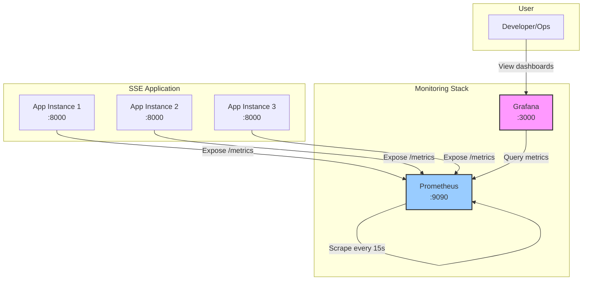
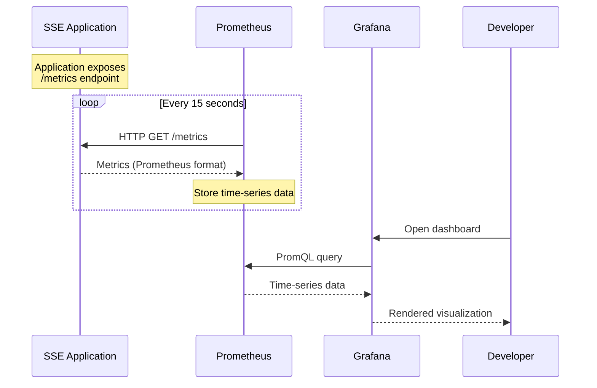
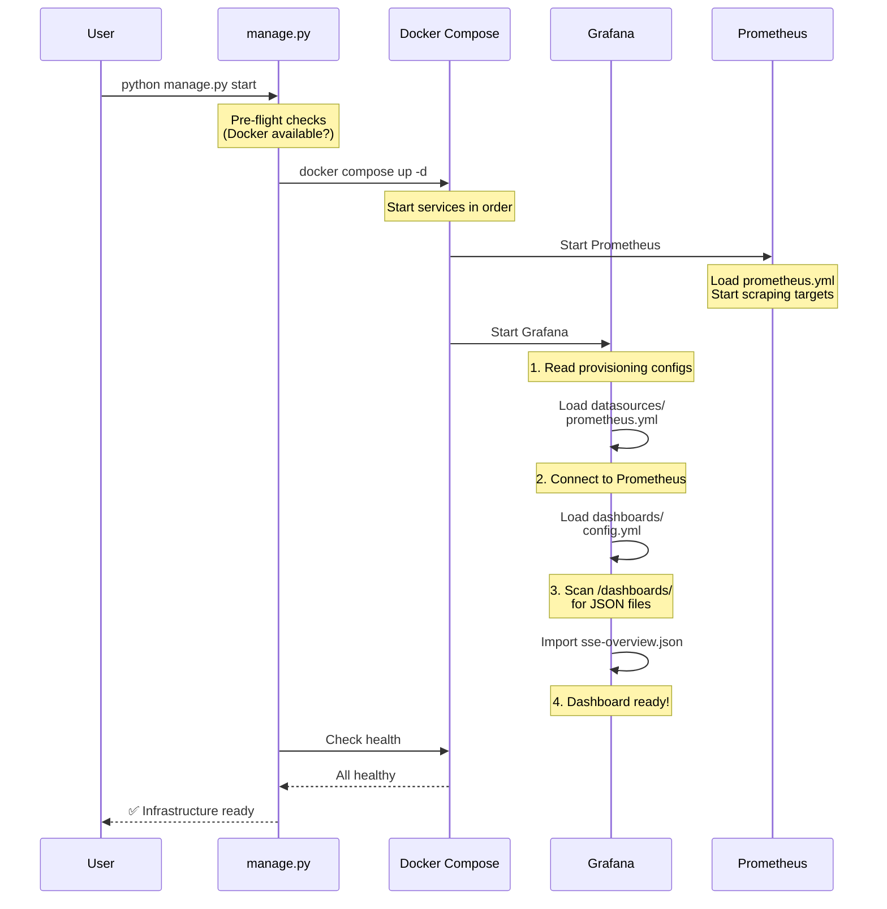
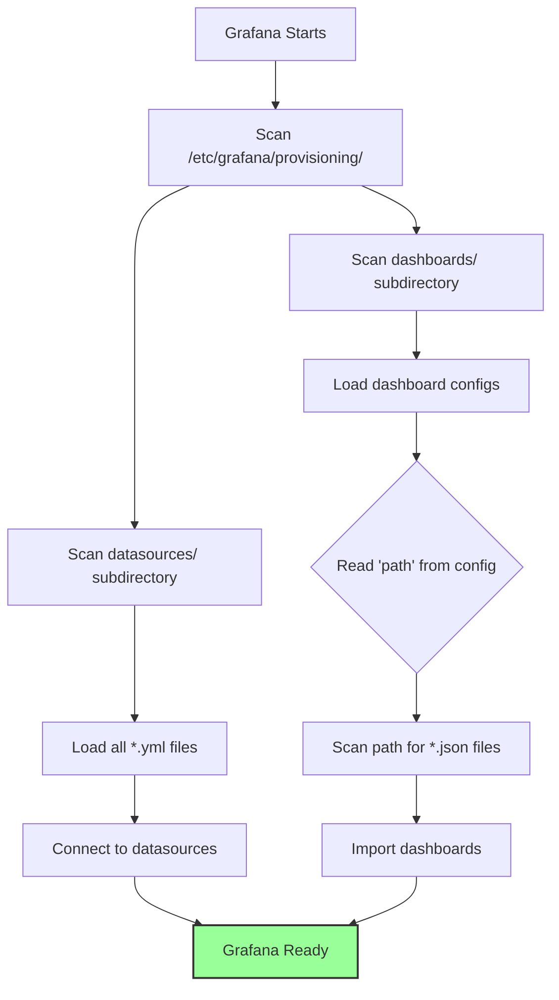
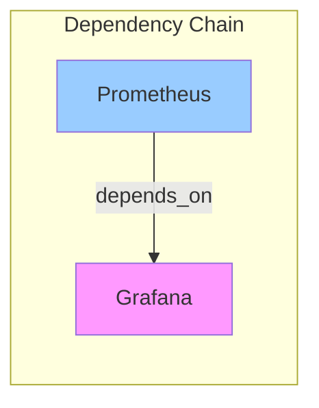
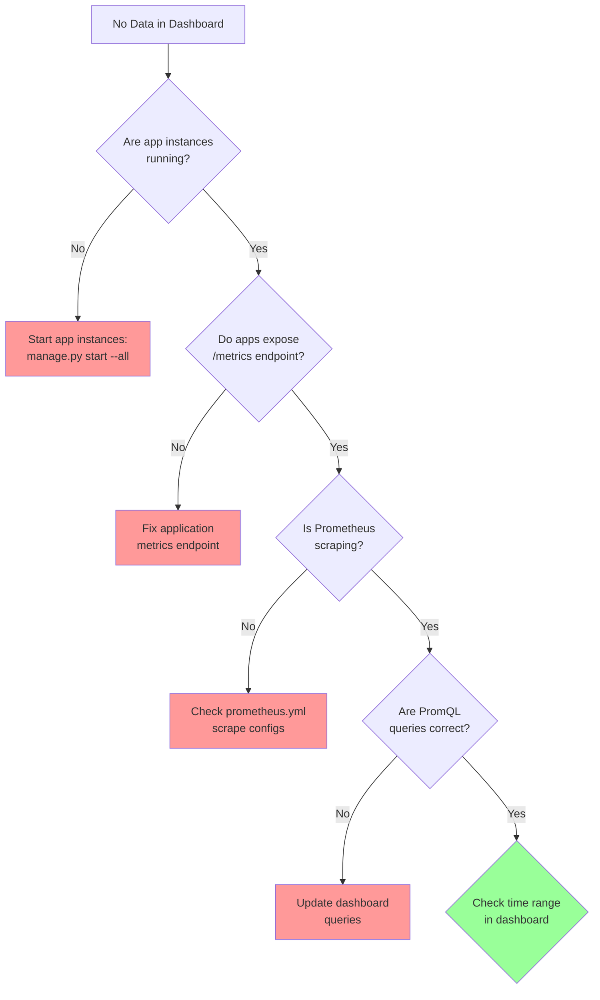
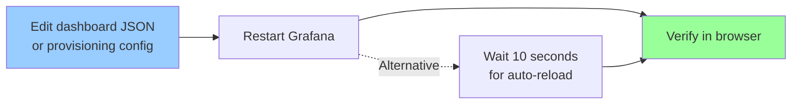

# Grafana Monitoring Infrastructure

**Professional monitoring and visualization for the SSE Streaming Application**

---

## Table of Contents

1. [Overview](#overview)
2. [Architecture](#architecture)
3. [Directory Structure](#directory-structure)
4. [How It Works](#how-it-works)
5. [Integration with Infrastructure](#integration-with-infrastructure)
6. [Configuration Deep Dive](#configuration-deep-dive)
7. [Troubleshooting](#troubleshooting)

---

## Overview

This directory contains the complete Grafana monitoring stack for the SSE application. Grafana provides real-time visualization of metrics collected by Prometheus, enabling you to monitor application health, performance, and user behavior through pre-configured dashboards.

### Key Features

- **Automatic Provisioning**: Dashboards and datasources are configured automatically on startup
- **Infrastructure as Code**: All configurations are version-controlled and reproducible
- **Zero Manual Setup**: No clicking through UIs required
- **Production-Ready**: Follows industry best practices for observability

---

## Architecture

### System Overview



### Data Flow



---

## Directory Structure

```
infrastructure/grafana/
├── README.md                           # This file
├── dashboards/                         # Dashboard Templates (JSON)
│   └── sse-overview.json              # Main application dashboard
└── provisioning/                       # Auto-configuration
    ├── datasources/
    │   └── prometheus.yml             # Prometheus connection config
    └── dashboards/
        └── config.yml                 # Dashboard loading config
```

### File Purposes

| File | Purpose | When It's Used |
|------|---------|----------------|
| `dashboards/sse-overview.json` | Dashboard blueprint defining panels, queries, and layout | Loaded by Grafana on startup via provisioning |
| `provisioning/datasources/prometheus.yml` | Configures Prometheus as a datasource | Read by Grafana during startup |
| `provisioning/dashboards/config.yml` | Tells Grafana where to find dashboard JSON files | Read by Grafana during startup |

---

## How It Works

### 1. Infrastructure Startup Sequence

When you run `python infrastructure/manage.py start`, here's what happens:



### 2. Docker Compose Integration

The `docker-compose.yml` file defines how Grafana runs and what it has access to:

```yaml
grafana:
  image: grafana/grafana:10.2.2
  ports:
    - "3000:3000"
  
  volumes:
    # Mount entire provisioning directory
    - ./infrastructure/grafana/provisioning:/etc/grafana/provisioning:ro
    
    # Mount dashboard templates
    - ./infrastructure/grafana/dashboards:/etc/grafana/dashboards:ro
    
    # Persistent storage
    - grafana-data:/var/lib/grafana
```

**Critical Design Decision**: We mount the **entire** `provisioning/` directory, not individual files. This is because Grafana's provisioning system scans subdirectories (`datasources/`, `dashboards/`) for configuration files. File-level mounts would break this scanning mechanism.

### 3. Provisioning System

Grafana's provisioning system follows this logic:



---

## Integration with Infrastructure

### manage.py Orchestration

The `infrastructure/manage.py` script orchestrates the entire infrastructure lifecycle:

#### Service Definitions

```python
# From manage.py
CORE_SERVICES = [
    "redis-master",
    "zookeeper", 
    "kafka",
    "nginx",
    "prometheus",  # ← Metrics collection
    "grafana"      # ← Visualization
]
```

Grafana is a **core service**, meaning it starts automatically with the infrastructure.

#### Startup Flow

| Step | Action | Command | What Happens |
|------|--------|---------|--------------|
| 1 | Pre-flight Check | `_preflight_check()` | Validates Docker is available |
| 2 | Start Services | `docker compose up -d` | Starts all core services |
| 3 | Wait for Health | `_wait_for_healthy()` | Polls health endpoints |
| 4 | Display Status | `_display_status()` | Shows service URLs |

#### Health Monitoring

```python
# Grafana health check (from docker-compose.yml)
healthcheck:
  test: ["CMD", "wget", "--quiet", "--tries=1", "--spider", 
         "http://localhost:3000/api/health"]
  interval: 10s
  timeout: 5s
  retries: 3
  start_period: 30s
```

The health check ensures Grafana is fully operational before `manage.py` reports success.

### Service Dependencies



Grafana depends on Prometheus being healthy before it starts. This ensures the datasource is available when Grafana tries to connect.

---

## Configuration Deep Dive

### Datasource Configuration

**File**: `provisioning/datasources/prometheus.yml`

```yaml
apiVersion: 1

datasources:
  - name: Prometheus
    type: prometheus
    access: proxy
    uid: prometheus          # ← Critical: Dashboards reference this UID
    url: http://prometheus:9090
    isDefault: true
    editable: false
```

**Key Fields**:

| Field | Value | Why It Matters |
|-------|-------|----------------|
| `uid` | `prometheus` | Dashboards use this to reference the datasource. Must be explicit. |
| `url` | `http://prometheus:9090` | Uses Docker Compose service name (not `localhost`) |
| `access` | `proxy` | Grafana proxies requests (secure, avoids CORS) |
| `isDefault` | `true` | Default datasource for new panels |
| `editable` | `false` | Prevents accidental UI changes (config is source of truth) |

### Dashboard Configuration

**File**: `provisioning/dashboards/config.yml`

```yaml
apiVersion: 1

providers:
  - name: 'SSE Dashboards'
    orgId: 1
    folder: 'SSE Streaming'
    type: file
    disableDeletion: false
    updateIntervalSeconds: 10
    allowUiUpdates: true
    options:
      path: /etc/grafana/dashboards
      foldersFromFilesStructure: true
```

**Key Fields**:

| Field | Value | Explanation |
|-------|-------|-------------|
| `folder` | `'SSE Streaming'` | Dashboards appear under this folder in Grafana UI |
| `path` | `/etc/grafana/dashboards` | Container path where JSON files are located |
| `updateIntervalSeconds` | `10` | Grafana checks for new/updated dashboards every 10s |
| `allowUiUpdates` | `true` | You can edit dashboards in UI (changes won't persist) |
| `foldersFromFilesStructure` | `true` | Subdirectories become folders in Grafana |

### Dashboard Template

**File**: `dashboards/sse-overview.json`

This is a **declarative blueprint** defining:
- Panel layout (rows, columns, sizes)
- PromQL queries for each metric
- Visualization types (graphs, gauges, stats)
- Thresholds and alerts
- Design rationale (embedded in descriptions)

**Portfolio Feature**: This dashboard includes educational comments explaining *why* specific metrics were chosen (RED method, Golden Signals), demonstrating architectural understanding.

---

## Troubleshooting

### Dashboard Shows "No data"

**Symptom**: Dashboard loads but panels show "No data"

**Diagnosis**:


**Solution**:
1. Verify app instances are running: `docker compose ps`
2. Check Prometheus targets: http://localhost:9090/targets
3. Verify metrics are being collected: http://localhost:9090/graph

### Dashboard Not Appearing

**Symptom**: Grafana shows "No dashboards yet"

**Root Cause**: Provisioning failed

**Diagnosis**:
```bash
# Check Grafana logs
docker compose logs grafana --tail=50

# Look for these lines:
# ✅ GOOD: "logger=provisioning.dashboard ... msg='provisioning dashboards'"
# ❌ BAD:  "logger=provisioning.dashboard ... error='no such file or directory'"
```

**Common Causes**:

| Error | Cause | Fix |
|-------|-------|-----|
| `no such file or directory` | Volume mount incorrect | Verify docker-compose.yml mounts |
| `failed to load dashboard` | Invalid JSON | Validate JSON syntax |
| `dashboard already exists` | UID conflict | Change dashboard UID |

### Datasource Connection Failed

**Symptom**: Dashboard shows "Failed to retrieve datasource"

**Diagnosis**:
```bash
# Check if Prometheus is running
docker compose ps prometheus

# Check Grafana can reach Prometheus
docker compose exec grafana wget -O- http://prometheus:9090/-/healthy
```

**Solution**:
1. Ensure Prometheus is healthy: `docker compose ps`
2. Verify datasource UID matches dashboard references
3. Check `provisioning/datasources/prometheus.yml` URL is correct

---

## Quick Reference

### Access URLs

| Service | URL | Credentials |
|---------|-----|-------------|
| Grafana | http://localhost:3000 | admin / admin |
| Prometheus | http://localhost:9090 | None |
| SSE Dashboard | http://localhost:3000/d/sse-overview | admin / admin |

### Common Commands

```bash
# Start infrastructure (including Grafana)
python infrastructure/manage.py start

# Start everything (including app instances)
python infrastructure/manage.py start --all

# Restart just Grafana
python infrastructure/manage.py restart --services grafana

# Stop infrastructure
python infrastructure/manage.py stop

# View Grafana logs
docker compose logs grafana --tail=50 --follow
```

### File Modification Workflow



**Note**: Dashboard provisioning checks for updates every 10 seconds. For immediate effect, restart Grafana.

---

## Professional Standards

This Grafana setup demonstrates:

✅ **Infrastructure as Code**: All configurations version-controlled  
✅ **Declarative Configuration**: Desired state defined, not imperative steps  
✅ **Automatic Provisioning**: Zero manual setup required  
✅ **Dependency Management**: Services start in correct order  
✅ **Health Monitoring**: Automated health checks ensure reliability  
✅ **Observability**: Comprehensive monitoring from day one  
✅ **Documentation**: Self-documenting architecture with inline explanations

---

## Further Reading

- [Grafana Provisioning Documentation](https://grafana.com/docs/grafana/latest/administration/provisioning/)
- [Prometheus Query Language (PromQL)](https://prometheus.io/docs/prometheus/latest/querying/basics/)
- [RED Method for Monitoring](https://www.weave.works/blog/the-red-method-key-metrics-for-microservices-architecture/)
- [Google SRE Book - Monitoring](https://sre.google/sre-book/monitoring-distributed-systems/)

