# Complete NGINX Load Balancing Guide for Python Applications

## Table of Contents
- [1. Introduction to Load Balancing](#1-introduction-to-load-balancing)
- [2. NGINX Architecture Deep Dive](#2-nginx-architecture-deep-dive)
- [3. Load Balancing Algorithms](#3-load-balancing-algorithms)
- [4. Configuration Breakdown](#4-configuration-breakdown)
- [5. Health Checks & Monitoring](#5-health-checks--monitoring)
- [6. SSL/TLS Configuration](#6-ssltls-configuration)
- [7. Performance Optimization](#7-performance-optimization)
- [8. Production Deployment](#8-production-deployment)
- [9. Troubleshooting Guide](#9-troubleshooting-guide)
- [10. Quick Reference](#10-quick-reference)

---

## 1. Introduction to Load Balancing

### 1.1 What is Load Balancing?

Load balancing is the process of distributing incoming network traffic across multiple servers to ensure:
- **No single server becomes overwhelmed** - Traffic is evenly distributed
- **High availability** - If one server fails, others continue serving
- **Scalability** - Add more servers as traffic grows
- **Better performance** - Requests are served faster

Think of it like a restaurant with multiple cashiers. Instead of everyone lining up at one cashier (which would be slow), customers are directed to available cashiers, making the overall service faster.

### 1.2 The Problem We're Solving

#### Health Check Endpoint Comparison

| Endpoint | Use Case | Returns 200 When | Returns 503 When |
|----------|----------|------------------|------------------|
| `/health/live` | Kubernetes liveness probe | Process is running | Process crashed |
| `/health/ready` | Load balancer health check | Can handle requests | Dependencies down |
| `/health/detailed` | Monitoring dashboards | Always returns 200 | Never (returns 200 with error details) |

#### Implementation Example

```python
from fastapi import FastAPI, Response
import redis

app = FastAPI()
redis_client = redis.Redis(host='redis', port=6379)

@app.get("/health/live")
async def liveness():
    """Simple check: is the process running?"""
    return {"status": "alive", "timestamp": datetime.now()}

@app.get("/health/ready")
async def readiness(response: Response):
    """Complex check: can we serve traffic?"""
    try:
        # Check Redis connectivity
        redis_client.ping()
        
        # Check other dependencies...
        
        return {
            "status": "ready",
            "components": {
                "redis": "healthy",
                "cache": "healthy"
            }
        }
    except Exception as e:
        response.status_code = 503
        return {
            "status": "not_ready",
            "error": str(e)
        }
```

### 5.3 NGINX Status Monitoring

#### Stub Status Module

```nginx
location /nginx-status {
    stub_status on;
    access_log off;
    
    # Security: restrict access
    allow 10.0.0.0/8;    # Internal network
    allow 127.0.0.1;      # Localhost
    deny all;             # Block everyone else
}
```

#### Sample Output

```
Active connections: 291
server accepts handled requests
 16630948 16630948 31070465
Reading: 6 Writing: 179 Waiting: 106
```

**Metrics Explained:**

| Metric | Value | Meaning |
|--------|-------|---------|
| `Active connections` | 291 | Currently open connections |
| `accepts` | 16630948 | Total accepted connections |
| `handled` | 16630948 | Total handled connections |
| `requests` | 31070465 | Total client requests |
| `Reading` | 6 | Connections reading request headers |
| `Writing` | 179 | Connections writing responses |
| `Waiting` | 106 | Idle keepalive connections |

**Health Indicators:**

```
✅ Healthy:
  accepts == handled (no dropped connections)
  Active connections < worker_processes × worker_connections

⚠️ Warning:
  Reading + Writing + Waiting ≈ Active (most connections active)
  
❌ Problem:
  accepts > handled (dropping connections - need more workers)
  Active connections near max (need to scale)
```

### 5.4 Real-Time Monitoring Dashboard

```mermaid
graph TD
    subgraph "Monitoring Stack"
        NGINX[NGINX] --> LOGS[Access & Error Logs]
        NGINX --> STATUS[/nginx-status]
        
        LOGS --> PARSER[Log Parser<br/>Prometheus/ELK]
        STATUS --> SCRAPER[Metrics Scraper<br/>Prometheus]
        
        PARSER --> METRICS[Metrics Database<br/>Prometheus]
        SCRAPER --> METRICS
        
        METRICS --> GRAFANA[Grafana Dashboard]
        METRICS --> ALERTS[Alert Manager]
    end
```

---

## 6. SSL/TLS Configuration

### 6.1 SSL/TLS Termination Architecture


#### Benefits of SSL Termination

| Benefit | Description |
|---------|-------------|
| **Centralized Management** | Update certificates in one place |
| **Reduced Backend Load** | CPU-intensive encryption handled by LB |
| **Simplified Backend** | Backends only need HTTP support |
| **Better Performance** | Dedicated hardware for SSL operations |

### 6.2 Certificate Types

#### Self-Signed Certificate (Development)

```bash
# Generate self-signed certificate
openssl req -x509 -nodes -days 365 -newkey rsa:2048 \
    -keyout localhost.key \
    -out localhost.crt \
    -subj "/CN=localhost"
```

**Use Cases:**
- ✅ Local development
- ✅ Internal testing
- ❌ Production (browsers show warning)

#### Let's Encrypt (Production - Free)

```bash
# Install certbot
apt-get install certbot python3-certbot-nginx

# Obtain certificate
certbot --nginx -d api.example.com

# Certificate files created:
# /etc/letsencrypt/live/api.example.com/fullchain.pem
# /etc/letsencrypt/live/api.example.com/privkey.pem
```

**Auto-Renewal:**
```bash
# Add to crontab
0 0 * * * certbot renew --quiet
```

#### Commercial Certificate

```bash
# 1. Generate CSR
openssl req -new -newkey rsa:2048 -nodes \
    -keyout domain.key -out domain.csr

# 2. Submit CSR to Certificate Authority
# 3. Receive certificate files:
#    - domain.crt (your certificate)
#    - intermediate.crt (CA bundle)
#    - domain.key (your private key)

# 4. Combine certificates
cat domain.crt intermediate.crt > fullchain.crt
```

### 6.3 SSL Configuration Deep Dive

```nginx
server {
    listen 443 ssl http2;
    server_name api.example.com;
    
    # Certificate files
    ssl_certificate /etc/nginx/ssl/fullchain.pem;
    ssl_certificate_key /etc/nginx/ssl/privkey.pem;
    
    # SSL protocols (security)
    ssl_protocols TLSv1.2 TLSv1.3;
    
    # Cipher suites (security)
    ssl_ciphers ECDHE-RSA-AES128-GCM-SHA256:ECDHE-RSA-AES256-GCM-SHA384;
    ssl_prefer_server_ciphers off;
    
    # SSL session caching (performance)
    ssl_session_cache shared:SSL:10m;
    ssl_session_timeout 10m;
    
    # OCSP stapling (security + performance)
    ssl_stapling on;
    ssl_stapling_verify on;
    ssl_trusted_certificate /etc/nginx/ssl/chain.pem;
    
    # Security headers
    add_header Strict-Transport-Security "max-age=31536000" always;
}
```

#### SSL Protocol Evolution

| Protocol | Year | Status | Security |
|----------|------|--------|----------|
| SSL 2.0 | 1995 | ❌ Broken | Vulnerable |
| SSL 3.0 | 1996 | ❌ Deprecated | POODLE attack |
| TLS 1.0 | 1999 | ⚠️ Legacy | Weak ciphers |
| TLS 1.1 | 2006 | ⚠️ Legacy | Weak ciphers |
| TLS 1.2 | 2008 | ✅ Secure | Widely supported |
| TLS 1.3 | 2018 | ✅ Most Secure | **Recommended** |

#### SSL Session Caching


**Performance Impact:**

| Scenario | Handshake Time | CPU Usage |
|----------|----------------|-----------|
| No session cache | 100ms | High |
| Session cache hit | 20ms | Low |
| **Improvement** | **80% faster** | **70% less CPU** |

### 6.4 HTTP to HTTPS Redirect

```nginx
# Redirect all HTTP to HTTPS
server {
    listen 80;
    server_name api.example.com;
    
    # 301 = Permanent redirect
    return 301 https://$server_name$request_uri;
}

server {
    listen 443 ssl http2;
    server_name api.example.com;
    
    # Your SSL configuration...
}
```

#### Status Code Comparison

| Code | Name | Meaning | Browser Behavior |
|------|------|---------|------------------|
| 301 | Permanent Redirect | Page moved forever | Caches redirect |
| 302 | Temporary Redirect | Page moved temporarily | Doesn't cache |
| 307 | Temporary (Preserve Method) | Temporary, keep POST | Doesn't cache |
| 308 | Permanent (Preserve Method) | Permanent, keep POST | Caches redirect |

**For HTTP→HTTPS:** Use **301** (permanent redirect)

---

## 7. Performance Optimization

### 7.1 Connection Settings

#### Keepalive Connections

```nginx
http {
    # Client keepalive
    keepalive_timeout 65;
    keepalive_requests 100;
    
    upstream backend {
        # Backend keepalive
        keepalive 32;
        keepalive_timeout 60s;
        keepalive_requests 100;
        
        server app-1:8000;
        server app-2:8000;
    }
}
```

**Performance Comparison:**


| Metric | Without Keepalive | With Keepalive |
|--------|------------------|----------------|
| Connections for 100 requests | 100 | 1-10 |
| TCP handshakes | 100 × 3ms = 300ms | 1-10 × 3ms = 3-30ms |
| Memory usage | High | Low |
| CPU usage | High | Low |

### 7.2 Buffering Configuration

#### Understanding Proxy Buffering


#### Configuration for Different Use Cases

**Standard HTTP/JSON API:**
```nginx
location /api {
    proxy_pass http://backend;
    
    # Enable buffering (default)
    proxy_buffering on;
    proxy_buffer_size 4k;
    proxy_buffers 8 4k;
    proxy_busy_buffers_size 8k;
}
```

**SSE/Streaming:**
```nginx
location /stream {
    proxy_pass http://backend;
    
    # Disable buffering
    proxy_buffering off;
    proxy_cache off;
    proxy_set_header X-Accel-Buffering no;
    
    # Prevent timeouts
    proxy_read_timeout 300s;
}
```

**Large File Downloads:**
```nginx
location /download {
    proxy_pass http://backend;
    
    # Large buffers for files
    proxy_buffering on;
    proxy_buffer_size 8k;
    proxy_buffers 16 32k;
    proxy_busy_buffers_size 64k;
}
```

### 7.3 Timeout Configuration

```nginx
http {
    # Client timeouts
    client_body_timeout 60s;    # Reading request body
    client_header_timeout 60s;   # Reading request headers
    send_timeout 60s;            # Sending response
    
    # Keepalive timeout
    keepalive_timeout 65s;
    
    # Proxy timeouts
    proxy_connect_timeout 60s;   # Connecting to backend
    proxy_send_timeout 60s;      # Sending to backend
    proxy_read_timeout 300s;     # Reading from backend (SSE!)
}
```

#### Timeout Decision Tree


**Timeout Recommendations by Use Case:**

| Use Case | connect_timeout | send_timeout | read_timeout | Reasoning |
|----------|----------------|--------------|--------------|-----------|
| REST API | 5s | 30s | 30s | Fast responses expected |
| File Upload | 10s | 300s | 30s | Large request body |
| SSE Streaming | 60s | 60s | 300s | Long-lived connections |
| Batch Processing | 60s | 60s | 600s | Long-running operations |

### 7.4 Rate Limiting

#### Basic Rate Limiting

```nginx
http {
    # Define rate limit zones
    limit_req_zone $binary_remote_addr zone=general:10m rate=10r/s;
    limit_req_zone $binary_remote_addr zone=api:10m rate=100r/s;
    limit_req_zone $binary_remote_addr zone=stream:10m rate=5r/s;
    
    server {
        # General pages - 10 req/sec
        location / {
            limit_req zone=general burst=20 nodelay;
            proxy_pass http://backend;
        }
        
        # API endpoints - 100 req/sec
        location /api {
            limit_req zone=api burst=50;
            proxy_pass http://backend;
        }
        
        # Streaming - 5 req/sec (expensive)
        location /stream {
            limit_req zone=stream burst=10;
            proxy_pass http://backend;
        }
    }
}
```

#### Rate Limit Parameters Explained

```mermaid
graph TD
    REQ[100 Requests in 1 second] --> ZONE{Rate Limit Zone<br/>rate=10r/s<br/>burst=20}
    
    ZONE -->|First 10| ALLOW1[✅ Processed immediately]
    ZONE -->|Next 20| QUEUE[📋 Queued in burst]
    ZONE -->|Remaining 70| REJECT[❌ 503 Error]
    
    QUEUE -->|nodelay ON| ALLOW2[✅ Processed immediately]
    QUEUE -->|nodelay OFF| DELAY[⏱️ Delayed to match rate]
```



| Parameter | Purpose | Example Values |
|-----------|---------|----------------|
| `rate` | Requests per second | `10r/s`, `100r/m` |
| `burst` | Extra capacity for spikes | `20`, `50`, `100` |
| `nodelay` | Process burst immediately | `nodelay` or omit |
| `delay` | Start delaying after N requests | `delay=5` |

**Burst Behavior:**

```
Without burst:
  rate=10r/s
  Request pattern: 50 req at t=0
  Result: 10 accepted, 40 rejected

With burst=20:
  rate=10r/s, burst=20
  Request pattern: 50 req at t=0
  Result: 30 accepted (10 + 20 burst), 20 rejected

With burst=20 nodelay:
  All 30 processed immediately
  
Without nodelay:
  10 processed at t=0
  10 processed at t=1
  10 processed at t=2
```

#### Multi-Tier Rate Limiting

```nginx
http {
    # Map user tier from header
    map $http_x_api_key $rate_limit_tier {
        "premium-key-123" "premium";
        "business-key-456" "business";
        default "free";
    }
    
    # Define zones for each tier
    limit_req_zone $binary_remote_addr zone=free:10m rate=10r/s;
    limit_req_zone $binary_remote_addr zone=business:10m rate=50r/s;
    limit_req_zone $binary_remote_addr zone=premium:10m rate=200r/s;
    
    server {
        location /api {
            # Apply appropriate zone
            limit_req zone=$rate_limit_tier burst=50;
            proxy_pass http://backend;
        }
    }
}
```

### 7.5 Caching Strategy

```nginx
http {
    # Cache path and settings
    proxy_cache_path /var/cache/nginx levels=1:2 keys_zone=api_cache:10m 
                     max_size=1g inactive=60m use_temp_path=off;
    
    server {
        # Static content - cache aggressively
        location /static {
            proxy_cache api_cache;
            proxy_cache_valid 200 7d;
            proxy_cache_valid 404 1h;
            add_header X-Cache-Status $upstream_cache_status;
            
            proxy_pass http://backend;
        }
        
        # API responses - cache briefly
        location /api/lookup {
            proxy_cache api_cache;
            proxy_cache_valid 200 5m;
            proxy_cache_key "$request_uri";
            add_header X-Cache-Status $upstream_cache_status;
            
            proxy_pass http://backend;
        }
        
        # Never cache
        location /stream {
            proxy_no_cache 1;
            proxy_cache_bypass 1;
            proxy_pass http://backend;
        }
    }
}
```

**Cache Status Values:**

| Status | Meaning |
|--------|---------|
| `MISS` | Response not in cache, fetched from backend |
| `HIT` | Response served from cache |
| `EXPIRED` | Cached response expired, revalidating |
| `STALE` | Serving stale content (backend unavailable) |
| `UPDATING` | Cache is being updated, serving stale |
| `BYPASS` | Cache bypass conditions met |

---

## 8. Production Deployment

### 8.1 Complete Production Architecture


### 8.2 Security Hardening

#### Essential Security Headers

```nginx
server {
    listen 443 ssl http2;
    
    # Security headers
    add_header X-Frame-Options "SAMEORIGIN" always;
    add_header X-Content-Type-Options "nosniff" always;
    add_header X-XSS-Protection "1; mode=block" always;
    add_header Referrer-Policy "no-referrer-when-downgrade" always;
    add_header Content-Security-Policy "default-src 'self' http: https: data: blob: 'unsafe-inline'" always;
    add_header Strict-Transport-Security "max-age=31536000; includeSubDomains" always;
    
    # Hide NGINX version
    server_tokens off;
    
    # Limit request size
    client_max_body_size 10m;
    client_body_buffer_size 128k;
    
    # Restrict methods
    if ($request_method !~ ^(GET|POST|HEAD|OPTIONS)$ ) {
        return 405;
    }
}
```

**Security Header Explanation:**

| Header | Purpose | Example Value |
|--------|---------|---------------|
| `X-Frame-Options` | Prevent clickjacking | `SAMEORIGIN` |
| `X-Content-Type-Options` | Prevent MIME sniffing | `nosniff` |
| `X-XSS-Protection` | XSS filter | `1; mode=block` |
| `Content-Security-Policy` | Control resource loading | Restrict to same origin |
| `Strict-Transport-Security` | Force HTTPS | `max-age=31536000` |

#### IP Whitelisting

```nginx
# Restrict admin endpoints
location /admin {
    # Allow specific IPs
    allow 10.0.0.0/8;        # Internal network
    allow 203.0.113.5;       # Office IP
    deny all;                 # Block everyone else
    
    proxy_pass http://backend;
}

# Geo-blocking
geo $allowed_country {
    default no;
    US yes;
    CA yes;
    GB yes;
}

server {
    if ($allowed_country = no) {
        return 403;
    }
}
```

### 8.3 High Availability with Keepalived

#### Keepalived Configuration

**Master Load Balancer:**
```
# /etc/keepalived/keepalived.conf
vrrp_script check_nginx {
    script "/usr/local/bin/check_nginx.sh"
    interval 2
    weight 2
}

vrrp_instance VI_1 {
    state MASTER
    interface eth0
    virtual_router_id 51
    priority 101
    advert_int 1
    
    authentication {
        auth_type PASS
        auth_pass secret123
    }
    
    virtual_ipaddress {
        192.168.1.100/24
    }
    
    track_script {
        check_nginx
    }
}
```

**Backup Load Balancer:**
```
vrrp_instance VI_1 {
    state BACKUP
    interface eth0
    virtual_router_id 51
    priority 100          # Lower priority
    advert_int 1
    
    # ... rest same as master
}
```

#### Health Check Script

```bash
#!/bin/bash
# /usr/local/bin/check_nginx.sh

# Check if NGINX is running
if ! pgrep nginx > /dev/null; then
    exit 1
fi

# Check if NGINX is responding
if ! curl -sf http://localhost/nginx-health > /dev/null; then
    exit 1
fi

exit 0
```

#### Failover Sequence


### 8.4 Deployment Strategies

#### Blue-Green Deployment

```nginx
upstream backend_blue {
    server app-blue-1:8000;
    server app-blue-2:8000;
}

upstream backend_green {
    server app-green-1:8000;
    server app-green-2:8000;
}

# Switch between blue and green
server {
    location / {
        # Currently serving blue
        proxy_pass http://backend_blue;
        
        # To switch to green:
        # 1. Update configuration: proxy_pass http://backend_green;
        # 2. Test: nginx -t
        # 3. Reload: nginx -s reload
        # 4. Zero downtime!
    }
}
```

#### Canary Deployment

```nginx
split_clients "$remote_addr$remote_port" $backend_pool {
    10% "backend_new";     # 10% traffic to new version
    *   "backend_stable";  # 90% traffic to stable version
}

upstream backend_stable {
    server app-stable-1:8000;
    server app-stable-2:8000;
}

upstream backend_new {
    server app-new-1:8000;
}

server {
    location / {
        proxy_pass http://$backend_pool;
    }
}
```

---

## 9. Troubleshooting Guide

### 9.1 Common Error Codes

| Error Code | Name | Common Causes | Solution |
|------------|------|---------------|----------|
| **502** | Bad Gateway | Backend down, network issue | Check backend health, verify connectivity |
| **503** | Service Unavailable | All backends down | Check `max_fails`, restart backends |
| **504** | Gateway Timeout | Backend too slow | Increase `proxy_read_timeout` |
| **499** | Client Closed Request | Client disconnected | Check client-side timeout settings |
| **413** | Payload Too Large | Request body too big | Increase `client_max_body_size` |

### 9.2 Debugging Workflow


### 9.3 Diagnostic Commands

```bash
# Check NGINX configuration
nginx -t

# Reload configuration
nginx -s reload

# View error log in real-time
tail -f /var/log/nginx/error.log

# View access log with response times
tail -f /var/log/nginx/access.log | grep "rt="

# Check NGINX status
curl http://localhost/nginx-status

# Test backend directly
curl -v http://app-1:8000/health/ready

# Check active connections
netstat -an | grep :80 | grep ESTABLISHED | wc -l

# Check which process is using port
lsof -i :80

# Test SSL certificate
openssl s_client -connect localhost:443 -servername api.example.com

# Check SSL certificate expiry
echo | openssl s_client -servername api.example.com -connect api.example.com:443 2>/dev/null | openssl x509 -noout -dates
```

### 9.4 Performance Debugging

#### Slow Response Investigation

```nginx
# Add detailed timing to logs
log_format detailed '$remote_addr - $remote_user [$time_local] '
                    '"$request" $status $body_bytes_sent '
                    'rt=$request_time '
                    'uct=$upstream_connect_time '
                    'uht=$upstream_header_time '
                    'urt=$upstream_response_time';
```

**Analyzing Log Timings:**

| Metric | What It Measures | High Value Indicates |
|--------|------------------|---------------------|
| `request_time` | Total time (client → NGINX → backend → client) | Overall slowness |
| `upstream_connect_time` | Time to connect to backend | Network issues, backend overload |
| `upstream_header_time` | Time for backend to start responding | Application startup delay |
| `upstream_response_time` | Time for backend to send full response | Slow query, processing |

**Example Log Analysis:**

```
rt=5.234 uct=0.002 uht=0.050 urt=5.180
```

**Interpretation:**
- Total time: 5.234s (slow!)
- Connect time: 0.002s (✅ good - network is fine)
- Header time: 0.050s (✅ good - app responds quickly)
- Response time: 5.180s (❌ problem - slow processing/query)

**Solution:** Optimize backend application, check database queries

---

## 10. Quick Reference

### 10.1 Essential Commands

```bash
# Configuration Management
nginx -t                      # Test configuration
nginx -T                      # Test and print configuration
nginx -s reload               # Reload configuration (zero downtime)
nginx -s quit                 # Graceful shutdown
nginx -s stop                 # Fast shutdown
nginx -V                      # Show version and compile options

# Process Management
systemctl start nginx         # Start NGINX
systemctl stop nginx          # Stop NGINX
systemctl restart nginx       # Restart NGINX
systemctl status nginx        # Check status
systemctl enable nginx        # Start on boot

# Log Management
tail -f /var/log/nginx/access.log          # Follow access log
tail -f /var/log/nginx/error.log           # Follow error log
grep "502" /var/log/nginx/access.log       # Find specific errors
grep "upstream" /var/log/nginx/error.log   # Backend issues

# Testing
curl -I http://localhost                   # Check HTTP headers
curl -k https://localhost                  # Test HTTPS (ignore cert)
ab -n 1000 -c 10 http://localhost/         # Benchmark (Apache Bench)
```

### 10.2 Configuration Templates

#### Minimal HTTP Load Balancer

```nginx
events {
    worker_connections 1024;
}

http {
    upstream backend {
        least_conn;
        server app-1:8000;
        server app-2:8000;
        server app-3:8000;
    }
    
    server {
        listen 80;
        
        location / {
            proxy_pass http://backend;
            proxy_set_header Host $host;
            proxy_set_header X-Real-IP $remote_addr;
        }
    }
}
```

#### Production HTTPS Load Balancer

```nginx
events {
    worker_connections 4096;
    use epoll;
    multi_accept on;
}

http {
    # Performance
    sendfile on;
    tcp_nopush on;
    tcp_nodelay on;
    keepalive_timeout 65;
    
    # Logging
    log_format main '$remote_addr - [$time_local] "$request" '
                    '$status $body_bytes_sent '
                    'rt=$request_time urt=$upstream_response_time '
                    'upstream=$upstream_addr';
    access_log /var/log/nginx/access.log main;
    error_log /var/log/nginx/error.log warn;
    
    # Gzip
    gzip on;
    gzip_vary on;
    gzip_comp_level 6;
    gzip_types text/plain text/css text/xml text/javascript 
               application/json application/javascript;
    
    # Rate limiting
    limit_req_zone $binary_remote_addr zone=api:10m rate=100r/s;
    
    # Backend pool
    upstream backend {
        least_conn;
        server app-1:8000 max_fails=3 fail_timeout=30s;
        server app-2:8000 max_fails=3 fail_timeout=30s;
        server app-3:8000 max_fails=3 fail_timeout=30s;
        keepalive 32;
    }
    
    # HTTP → HTTPS redirect
    server {
        listen 80;
        server_name api.example.com;
        return 301 https://$server_name$request_uri;
    }
    
    # HTTPS server
    server {
        listen 443 ssl http2;
        server_name api.example.com;
        
        # SSL
        ssl_certificate /etc/nginx/ssl/fullchain.pem;
        ssl_certificate_key /etc/nginx/ssl/privkey.pem;
        ssl_protocols TLSv1.2 TLSv1.3;
        ssl_session_cache shared:SSL:10m;
        
        # Security headers
        add_header Strict-Transport-Security "max-age=31536000" always;
        add_header X-Content-Type-Options "nosniff" always;
        add_header X-Frame-Options "SAMEORIGIN" always;
        
        # API endpoints
        location /api {
            limit_req zone=api burst=50;
            
            proxy_pass http://backend;
            proxy_http_version 1.1;
            proxy_set_header Connection "";
            proxy_set_header Host $host;
            proxy_set_header X-Real-IP $remote_addr;
            proxy_set_header X-Forwarded-For $proxy_add_x_forwarded_for;
            proxy_set_header X-Forwarded-Proto $scheme;
            
            proxy_connect_timeout 60s;
            proxy_send_timeout 60s;
            proxy_read_timeout 60s;
        }
        
        # SSE streaming
        location /stream {
            limit_req zone=api burst=10;
            
            proxy_pass http://backend;
            proxy_http_version 1.1;
            proxy_set_header Connection "";
            proxy_buffering off;
            proxy_cache off;
            proxy_set_header X-Accel-Buffering no;
            
            proxy_read_timeout 300s;
        }
        
        # Health check
        location /nginx-health {
            access_log off;
            return 200 "OK\n";
            add_header Content-Type text/plain;
        }
    }
}
```

### 10.3 Docker Compose Production Setup

```yaml
version: '3.8'

services:
  # NGINX Load Balancer
  nginx:
    image: nginx:alpine
    container_name: nginx_lb
    ports:
      - "80:80"
      - "443:443"
    volumes:
      - ./nginx.conf:/etc/nginx/nginx.conf:ro
      - ./ssl:/etc/nginx/ssl:ro
      - nginx_logs:/var/log/nginx
    depends_on:
      - app-1
      - app-2
      - app-3
    networks:
      - app_network
    restart: unless-stopped
    healthcheck:
      test: ["CMD", "curl", "-f", "http://localhost/nginx-health"]
      interval: 30s
      timeout: 10s
      retries: 3
  
  # Application Instances
  app-1:
    build: .
    container_name: app_1
    environment:
      - INSTANCE_ID=app-1
      - REDIS_URL=redis://redis:6379
    networks:
      - app_network
    restart: unless-stopped
    healthcheck:
      test: ["CMD", "curl", "-f", "http://localhost:8000/health/ready"]
      interval: 30s
      timeout: 10s
      retries: 3
  
  app-2:
    build: .
    container_name: app_2
    environment:
      - INSTANCE_ID=app-2
      - REDIS_URL=redis://redis:6379
    networks:
      - app_network
    restart: unless-stopped
  
  app-3:
    build: .
    container_name: app_3
    environment:
      - INSTANCE_ID=app-3
      - REDIS_URL=redis://redis:6379
    networks:
      - app_network
    restart: unless-stopped
  
  # Redis for shared state
  redis:
    image: redis:alpine
    container_name: redis
    networks:
      - app_network
    restart: unless-stopped
    healthcheck:
      test: ["CMD", "redis-cli", "ping"]
      interval: 30s
      timeout: 10s
      retries: 3
  
  # Prometheus for monitoring
  prometheus:
    image: prom/prometheus
    container_name: prometheus
    volumes:
      - ./prometheus.yml:/etc/prometheus/prometheus.yml
      - prometheus_data:/prometheus
    ports:
      - "9090:9090"
    networks:
      - app_network
    restart: unless-stopped

volumes:
  nginx_logs:
  prometheus_data:

networks:
  app_network:
    driver: bridge
```

### 10.4 Health Check Matrix

| Endpoint | Who Uses It | Success Criteria | Failure Action |
|----------|-------------|------------------|----------------|
| `/health/live` | Kubernetes | 200 OK | Restart pod |
| `/health/ready` | Load Balancer | 200 OK + dependencies healthy | Remove from rotation |
| `/nginx-health` | Monitoring | 200 OK | Alert operations |
| `/nginx-status` | Monitoring | Active connections < max | Scale up |

### 10.5 Troubleshooting Checklist

#### When Users Report Errors

```
1. Check NGINX status
   ✓ Is NGINX running? (systemctl status nginx)
   ✓ Are there errors? (tail /var/log/nginx/error.log)

2. Check backend health
   ✓ Are backends responding? (curl http://app-1:8000/health)
   ✓ Are any marked as down? (curl /nginx-status)

3. Check connectivity
   ✓ Can NGINX reach backends? (ping app-1)
   ✓ Are ports open? (telnet app-1 8000)

4. Check resources
   ✓ Is disk full? (df -h)
   ✓ Is memory exhausted? (free -m)
   ✓ Are connections maxed? (netstat -an | wc -l)

5. Check logs
   ✓ Recent errors? (tail -100 /var/log/nginx/error.log)
   ✓ Slow responses? (grep "urt=" /var/log/nginx/access.log)
   ✓ High error rate? (grep " 5[0-9][0-9] " access.log | wc -l)
```

### 10.6 Performance Benchmarks

#### Expected Performance (Approximate)

| Metric | Value | Hardware |
|--------|-------|----------|
| **Requests/sec** | 10,000-50,000 | 4 CPU, 8GB RAM |
| **Concurrent connections** | 10,000+ | With keepalive |
| **Latency (p50)** | <10ms | Proxy overhead only |
| **Latency (p99)** | <50ms | Including backend |
| **SSL handshakes/sec** | 1,000-5,000 | With session cache |

#### Benchmark Your Setup

```bash
# Install tools
apt-get install apache2-utils wrk

# Simple benchmark
ab -n 10000 -c 100 http://localhost/

# Advanced benchmark
wrk -t4 -c100 -d30s http://localhost/api

# SSL benchmark
openssl s_time -connect localhost:443 -www /

# Results interpretation:
# Requests/sec > 1000: ✅ Good
# Requests/sec < 100:  ❌ Problem (check backend)
# Failed requests > 1%: ❌ Problem (check logs)
```

---

## Summary

This guide covered:

1. **Load Balancing Fundamentals** - Why and how to distribute traffic
2. **NGINX Architecture** - Process model, configuration structure
3. **Algorithms** - Round robin, least connections, IP hash, weighted
4. **Configuration** - Every directive explained with diagrams
5. **Health Checks** - Passive monitoring and health endpoints
6. **SSL/TLS** - Certificate management and termination
7. **Performance** - Optimization techniques and caching
8. **Production** - High availability and deployment strategies
9. **Troubleshooting** - Common issues and debugging workflows
10. **Quick Reference** - Commands, templates, and checklists

### Key Takeaways

✅ **For SSE Streaming:**
- Use `least_conn` algorithm
- Disable buffering: `proxy_buffering off`
- Long timeouts: `proxy_read_timeout 300s`
- No session affinity needed (stateless with Redis)

✅ **For Production:**
- Multiple load balancers (Keepalived)
- Health checks on all endpoints
- Rate limiting to protect backends
- Comprehensive monitoring (Prometheus + Grafana)
- Regular SSL certificate renewal

✅ **Performance:**
- Enable keepalive connections
- Use gzip compression
- Implement caching where appropriate
- Monitor response times continuously

### Further Resources

- [Official NGINX Documentation](https://nginx.org/en/docs/)
- [NGINX Blog - Best Practices](https://www.nginx.com/blog/)
- [Let's Encrypt - Free SSL](https://letsencrypt.org/)
- [Mozilla SSL Configuration Generator](https://ssl-config.mozilla.org/)

---

**Last Updated:** December 2025  
**Author:** Comprehensive guide for SSE streaming applications with Python backends Scenario: Single Server Application


**Problems:**
- Server handles 1,000 requests/second max
- If 2,000 users connect → 1,000 users experience slow response
- If server crashes → ALL users are affected
- Can't update server without downtime
- Single CPU/RAM limit

#### Solution: Load Balanced Architecture


**Benefits:**
- 3 servers = 3,000 requests/second capacity
- If Server 1 fails → Server 2 & 3 continue serving
- Can update servers one-by-one (zero downtime)
- Horizontal scaling (add more servers as needed)

### 1.3 Request Flow Diagram

```mermaid
sequenceDiagram
    participant Client
    participant NGINX
    participant Server1
    participant Server2
    participant Server3
    
    Note over NGINX: Health Check Status:<br/>Server1: ✅ Healthy<br/>Server2: ✅ Healthy<br/>Server3: ❌ Down
    
    Client->>NGINX: Request 1
    NGINX->>NGINX: Check algorithm (least_conn)<br/>Server1: 5 connections<br/>Server2: 3 connections
    NGINX->>Server2: Forward Request 1
    Server2->>NGINX: Response
    NGINX->>Client: Response
    
    Client->>NGINX: Request 2
    NGINX->>NGINX: Server2: 4 connections<br/>Server1: 5 connections
    NGINX->>Server2: Forward Request 2
    Server2->>NGINX: Response
    NGINX->>Client: Response
    
    Client->>NGINX: Request 3
    NGINX->>NGINX: Server1: 5 connections<br/>Server2: 5 connections<br/>(Equal, pick first)
    NGINX->>Server1: Forward Request 3
    Server1->>NGINX: Response
    NGINX->>Client: Response
```



### 1.4 Key Concepts

| Concept | Definition | Analogy |
|---------|------------|---------|
| **Load Balancer** | Distributes traffic across servers | Traffic cop directing cars to different lanes |
| **Upstream** | Group of backend servers | Pool of cashiers at a store |
| **Health Check** | Monitoring if servers are working | Manager checking if cashiers are at their stations |
| **Algorithm** | Method to choose which server | Strategy for directing customers to cashiers |
| **Failover** | Redirecting traffic when server fails | Sending customers to other cashiers when one is unavailable |

---

## 2. NGINX Architecture Deep Dive

### 2.1 What is NGINX?

NGINX (pronounced "engine-ex") is a high-performance web server that can act as:
- **Web Server** - Serves static files (HTML, CSS, images)
- **Reverse Proxy** - Forwards requests to backend applications
- **Load Balancer** - Distributes traffic across multiple backends
- **SSL Terminator** - Handles HTTPS encryption/decryption
- **Cache** - Stores responses to reduce backend load

### 2.2 NGINX Process Architecture


#### Master Process Responsibilities
- **Configuration Management** - Reads and validates nginx.conf
- **Worker Lifecycle** - Spawns, monitors, and restarts workers
- **Signal Handling** - Graceful reload, shutdown
- **Privilege Management** - Runs as root to bind privileged ports (80, 443)

#### Worker Process Responsibilities
- **Connection Handling** - Accepts and processes client requests
- **Event-Driven** - Uses epoll (Linux) for efficient I/O
- **Non-Blocking** - Can handle thousands of connections simultaneously
- **Unprivileged** - Runs as nginx user for security

### 2.3 Configuration File Structure


#### Configuration Hierarchy Explained

| Context | Purpose | Example Directives |
|---------|---------|-------------------|
| **Main** | Global settings | `user`, `worker_processes`, `error_log` |
| **Events** | Connection processing | `worker_connections`, `use epoll` |
| **HTTP** | HTTP server settings | `gzip`, `keepalive_timeout`, `log_format` |
| **Upstream** | Backend server pools | `server`, `least_conn`, `keepalive` |
| **Server** | Virtual host config | `listen`, `server_name`, `ssl_certificate` |
| **Location** | URI-specific rules | `proxy_pass`, `proxy_set_header` |

### 2.4 How NGINX Handles Connections


---

## 3. Load Balancing Algorithms

### 3.1 Round Robin (Default)

#### How It Works

Round Robin distributes requests sequentially, cycling through servers in order.


#### Configuration
```nginx
upstream backend {
    # No directive needed - round robin is default
    server app-1:8000;
    server app-2:8000;
    server app-3:8000;
}
```

#### When to Use

| ✅ Good For | ❌ Bad For |
|------------|-----------|
| Servers with identical capacity | Servers with different specs |
| Requests with similar processing time | Long-lived connections (SSE, WebSockets) |
| Stateless applications | Requests with varying complexity |
| Simple, predictable distribution | Applications requiring session persistence |

#### Example Scenario

```
Time: 0:00 - All servers idle
Request 1 (fast query) → Server 1 [completes in 0.1s]
Request 2 (fast query) → Server 2 [completes in 0.1s]
Request 3 (slow query) → Server 3 [takes 10s]
Request 4 (fast query) → Server 1 [completes in 0.1s]
Request 5 (fast query) → Server 2 [completes in 0.1s]
Request 6 (fast query) → Server 3 [WAITS for request 3]

Problem: Server 3 becomes bottleneck while 1 & 2 are idle
```

### 3.2 Least Connections (Recommended for SSE)

#### How It Works

Sends requests to the server with the fewest active connections.


#### Configuration
```nginx
upstream backend {
    least_conn;  # Enable least connections
    server app-1:8000;
    server app-2:8000;
    server app-3:8000;
}
```

#### Why Perfect for SSE Streaming

SSE connections are **long-lived** (minutes to hours). Round robin would create severe imbalance:


**Result**: Server 3 handles 4x requests but is mostly idle!

#### With Least Connections


**Result**: Balanced distribution across all servers!

### 3.3 IP Hash (Session Affinity)

#### How It Works

Uses a hash of the client's IP address to consistently route them to the same server.

```mermaid
graph TD
    C1[Client IP:<br/>192.168.1.100] --> HASH1[Hash Function]
    C2[Client IP:<br/>192.168.1.101] --> HASH2[Hash Function]
    C3[Client IP:<br/>192.168.1.102] --> HASH3[Hash Function]
    
    HASH1 --> S2[Always Server 2]
    HASH2 --> S1[Always Server 1]
    HASH3 --> S3[Always Server 3]
    
    style S1 fill:#51cf66
    style S2 fill:#51cf66
    style S3 fill:#51cf66
```

#### Configuration
```nginx
upstream backend {
    ip_hash;  # Enable IP-based routing
    server app-1:8000;
    server app-2:8000;
    server app-3:8000;
}
```

#### Use Cases

**✅ When You Need It:**
- Application stores session data in server memory (not Redis)
- WebSocket connections requiring persistence
- Stateful applications without shared storage

**❌ When You Don't Need It:**
- Using Redis/database for session storage (our case)
- Stateless applications
- API servers with token-based auth

#### Problem with IP Hash

```
Corporate Network (NAT):
  1000 employees → 1 public IP → All go to Server 1

Home WiFi:
  5 devices → 1 public IP → All go to same server

Result: Extremely uneven distribution!
```

### 3.4 Weighted Load Balancing

#### How It Works

Assigns different weights to servers based on capacity. Higher weight = more traffic.

```mermaid
graph TD
    LB[Load Balancer] --> S1[Server 1<br/>Weight: 3<br/>Gets 50% traffic]
    LB --> S2[Server 2<br/>Weight: 2<br/>Gets 33% traffic]
    LB --> S3[Server 3<br/>Weight: 1<br/>Gets 17% traffic]
    
    style S1 fill:#51cf66
    style S2 fill:#ffd43b
    style S3 fill:#ff6b6b
```

#### Configuration
```nginx
upstream backend {
    least_conn;
    
    # Powerful server - gets 3x traffic
    server app-1:8000 weight=3;
    
    # Medium server - gets 2x traffic
    server app-2:8000 weight=2;
    
    # Small server - gets 1x traffic
    server app-3:8000 weight=1;
}
```

#### Practical Use Cases

**1. Different Server Capacities**
```nginx
upstream backend {
    server powerful.server:8000 weight=5;  # 32 CPU cores, 64GB RAM
    server medium.server:8000 weight=3;     # 16 CPU cores, 32GB RAM
    server small.server:8000 weight=1;      # 4 CPU cores, 8GB RAM
}
```

**2. Gradual Rollout (Canary Deployment)**
```nginx
upstream backend {
    server old-version:8000 weight=9;   # 90% traffic
    server new-version:8000 weight=1;   # 10% traffic (testing)
}
```

**3. Draining Server for Maintenance**
```nginx
upstream backend {
    server app-1:8000 weight=1;
    server app-2:8000 weight=1;
    server app-3:8000 weight=0;  # No new connections, finish existing
}
```

### 3.5 Algorithm Comparison Table

| Algorithm | Distribution Method | Connection Type | State Required | Use Case |
|-----------|-------------------|-----------------|----------------|----------|
| **Round Robin** | Sequential rotation | Short-lived HTTP | None | Simple APIs, identical servers |
| **Least Connections** | Active connection count | Long-lived (SSE, WS) | Connection tracking | Streaming, WebSockets |
| **IP Hash** | Client IP hash | Any | IP mapping | Session persistence |
| **Weighted** | Capacity-based | Any | Weight config | Different server sizes |

---

## 4. Configuration Breakdown

### 4.1 Worker Processes Configuration

```nginx
user nginx;
worker_processes auto;
error_log /var/log/nginx/error.log warn;
pid /var/run/nginx.pid;
```

#### Directive Explanations

| Directive | Value | Purpose |
|-----------|-------|---------|
| `user` | `nginx` | Run workers as unprivileged nginx user (security) |
| `worker_processes` | `auto` | Create 1 worker per CPU core |
| `error_log` | `/var/log/nginx/error.log warn` | Log errors at warning level and above |
| `pid` | `/var/run/nginx.pid` | Process ID file location |

#### Worker Process Calculation

```
Server with 4 CPU cores:
  worker_processes auto → Creates 4 workers
  worker_connections 1024 → Each handles 1024 connections
  Total capacity: 4 × 1024 = 4,096 concurrent connections
```

### 4.2 Events Configuration

```nginx
events {
    worker_connections 1024;
    use epoll;
    multi_accept on;
}
```

#### Directive Explanations

```mermaid
graph TD
    A[events block] --> B[worker_connections 1024]
    A --> C[use epoll]
    A --> D[multi_accept on]
    
    B --> B1[Max connections per worker]
    B --> B2[Limits memory usage]
    
    C --> C1[Linux-specific optimization]
    C --> C2[Efficient I/O monitoring]
    
    D --> D1[Accept multiple connections]
    D --> D2[Reduces latency spikes]
```

| Directive | Value | Impact |
|-----------|-------|--------|
| `worker_connections` | `1024` | Each worker can handle 1024 simultaneous connections |
| `use` | `epoll` | Use Linux's efficient event notification mechanism |
| `multi_accept` | `on` | Accept all pending connections at once (reduces latency) |

#### Event Processing Methods by OS

| Operating System | Best Method | Efficiency |
|-----------------|-------------|-----------|
| Linux | `epoll` | ⭐⭐⭐⭐⭐ |
| FreeBSD / macOS | `kqueue` | ⭐⭐⭐⭐⭐ |
| Solaris | `eventport` | ⭐⭐⭐⭐ |
| Windows | `select` | ⭐⭐ |

### 4.3 HTTP Configuration

```nginx
http {
    include /etc/nginx/mime.types;
    default_type application/octet-stream;
    
    # Logging
    log_format main '$remote_addr - $remote_user [$time_local] "$request" '
                    '$status $body_bytes_sent "$http_referer" '
                    '"$http_user_agent" "$ $http_x_forwarded_for" '
                    'rt=$request_time uct=$upstream_connect_time '
                    'uht=$upstream_header_time urt=$upstream_response_time '
                    'upstream=$upstream_addr';
    
    access_log /var/log/nginx/access.log main;
}
```

#### Log Format Variables

| Variable | Example | Meaning |
|----------|---------|---------|
| `$remote_addr` | `192.168.1.100` | Client IP address |
| `$remote_user` | `john` | Authenticated username (if using HTTP auth) |
| `$time_local` | `07/Dec/2025:10:30:00 +0530` | Request timestamp |
| `$request` | `GET /stream HTTP/1.1` | Full request line |
| `$status` | `200` | HTTP response status code |
| `$body_bytes_sent` | `1024` | Response body size in bytes |
| `$http_referer` | `https://example.com` | URL that referred this request |
| `$http_user_agent` | `Mozilla/5.0...` | Client browser/application |
| `$request_time` | `0.523` | Total request processing time (seconds) |
| `$upstream_addr` | `192.168.1.10:8000` | Backend server that handled request |
| `$upstream_response_time` | `0.450` | Time backend took to respond |

#### Sample Log Entry Decoded

```
192.168.1.100 - - [07/Dec/2025:10:30:00 +0530] "GET /stream HTTP/1.1" 200 1024 "https://example.com" "Mozilla/5.0" "-" rt=0.523 uct=0.002 uht=0.020 urt=0.450 upstream=192.168.1.10:8000
```

**Translation:**
- Client `192.168.1.100` made a request
- At `10:30:00` on `Dec 7, 2025`
- Requested `GET /stream`
- Response: `200 OK`, `1024 bytes` sent
- Came from: `https://example.com`
- Using: `Mozilla/5.0` browser
- Total time: `0.523 seconds`
- Backend connection: `0.002s`
- Backend header generation: `0.020s`
- Backend response: `0.450s`
- Handled by: `192.168.1.10:8000`

### 4.4 Performance Optimizations

```nginx
http {
    # File sending optimizations
    sendfile on;
    tcp_nopush on;
    tcp_nodelay on;
    
    # Connection settings
    keepalive_timeout 65;
    
    # Compression
    gzip on;
    gzip_vary on;
    gzip_proxied any;
    gzip_comp_level 6;
    gzip_types text/plain text/css text/xml text/javascript 
               application/json application/javascript;
}
```

#### Directive Deep Dive

**1. sendfile**
```mermaid
graph TD
    subgraph "Without sendfile (Traditional)"
        F1[File on Disk] --> K1[Kernel Buffer]
        K1 --> A1[Application Buffer NGINX]
        A1 --> K2[Kernel Buffer]
        K2 --> N1[Network Socket]
    end
    
    subgraph "With sendfile (Optimized)"
        F2[File on Disk] --> K3[Kernel Buffer]
        K3 --> N2[Network Socket]
    end
    
    style F2 fill:#51cf66
    style K3 fill:#51cf66
    style N2 fill:#51cf66
```

| Feature | Without sendfile | With sendfile |
|---------|-----------------|---------------|
| **Data Copies** | 4 copies | 2 copies |
| **CPU Usage** | High | Low |
| **Memory Usage** | High | Low |
| **Speed** | Slower | Faster |

**2. tcp_nopush and tcp_nodelay**

```nginx
tcp_nopush on;    # Wait for full packet before sending
tcp_nodelay on;   # Don't wait, send immediately
```

**Why use both?**
- `tcp_nopush`: Efficient for large file transfers
- `tcp_nodelay`: Low latency for small responses (SSE chunks)
- Together: Best of both worlds

**3. Gzip Compression**

| File Type | Original Size | Compressed Size | Savings |
|-----------|--------------|-----------------|---------|
| HTML | 100 KB | 25 KB | 75% |
| JSON | 500 KB | 100 KB | 80% |
| CSS | 50 KB | 12 KB | 76% |
| JavaScript | 200 KB | 60 KB | 70% |
| Images (JPEG/PNG) | 1 MB | 1 MB | 0% (already compressed) |

```nginx
gzip_comp_level 6;  # Compression level (1-9)
```

| Level | Speed | Compression | Recommendation |
|-------|-------|-------------|----------------|
| 1 | Fastest | 60% | Low CPU servers |
| 6 | Balanced | 75% | **Recommended** |
| 9 | Slowest | 78% | High CPU, slow networks |

### 4.5 Upstream Configuration

```nginx
upstream sse_backend {
    least_conn;
    
    server app-1:8000 max_fails=3 fail_timeout=30s weight=1;
    server app-2:8000 max_fails=3 fail_timeout=30s weight=1;
    server app-3:8000 max_fails=3 fail_timeout=30s weight=1;
    
    keepalive 32;
}
```

#### Server Directive Parameters

| Parameter | Value | Purpose |
|-----------|-------|---------|
| `max_fails` | `3` | Mark server down after 3 consecutive failures |
| `fail_timeout` | `30s` | Wait 30s before retrying failed server |
| `weight` | `1` | Relative weight for load distribution |
| `backup` | flag | Only use if all primary servers fail |
| `down` | flag | Permanently mark server as unavailable |

#### Health Check State Machine

```mermaid
stateDiagram-v2
    [*] --> Healthy
    
    Healthy --> Checking: Request fails
    Checking --> Healthy: Request succeeds<br/>(reset counter)
    Checking --> Checking: Fail count < max_fails
    Checking --> Down: Fail count >= max_fails
    
    Down --> Waiting: fail_timeout elapsed
    Waiting --> Healthy: Request succeeds
    Waiting --> Down: Request fails
```

#### Keepalive Connections

```nginx
keepalive 32;
```

**Without keepalive:**
```
Request 1: Connect → Request → Response → Close
Request 2: Connect → Request → Response → Close
Request 3: Connect → Request → Response → Close

TCP handshake overhead per request: ~3ms
10,000 requests = 30 seconds wasted!
```

**With keepalive:**
```
Connect once → Request 1 → Response → Request 2 → Response → ... → Close

TCP handshake overhead: ~3ms total
10,000 requests = ~3ms wasted
```

| Metric | Without Keepalive | With Keepalive (32) |
|--------|------------------|---------------------|
| Connections/sec | 100 | 3200 |
| Latency | High (+3ms/request) | Low |
| CPU Usage | High | Low |

---

## 5. Health Checks & Monitoring

### 5.1 Passive Health Checks

#### How They Work

```mermaid
sequenceDiagram
    participant NGINX
    participant Server1
    participant Server2
    
    Note over NGINX,Server1: Normal Operation
    NGINX->>Server1: Request 1
    Server1->>NGINX: 200 OK (Success)
    
    Note over NGINX,Server1: Server Starts Failing
    NGINX->>Server1: Request 2
    Server1--xNGINX: Timeout/Error (Fail 1)
    
    NGINX->>Server1: Request 3
    Server1--xNGINX: Timeout/Error (Fail 2)
    
    NGINX->>Server1: Request 4
    Server1--xNGINX: Timeout/Error (Fail 3)
    
    Note over Server1: Marked as DOWN<br/>max_fails=3 reached
    
    NGINX->>Server2: Request 5 (failover)
    Server2->>NGINX: 200 OK
    
    Note over Server1: Wait fail_timeout (30s)
    
    Note over Server1: Retry after timeout
    NGINX->>Server1: Health Check Request
    Server1->>NGINX: 200 OK (Success)
    
    Note over Server1: Marked as UP<br/>Back in rotation
```

#### Configuration Parameters

```nginx
server app-1:8000 max_fails=3 fail_timeout=30s;
```

**Parameter Tuning Guide:**

| Scenario | max_fails | fail_timeout | Reasoning |
|----------|-----------|--------------|-----------|
| **Stable Network** | 2 | 10s | Fail fast, recover quickly |
| **Unstable Network** | 5 | 60s | Tolerate transient errors |
| **Production (Balanced)** | 3 | 30s | **Recommended default** |
| **Critical Service** | 10 | 120s | Avoid false positives |

### 5.2 Application Health Endpoints

#### Endpoint Hierarchy

```mermaid
graph TD
    ROOT[/health] --> LIVE[/health/live<br/>Liveness Check]
    ROOT --> READY[/health/ready<br/>Readiness Check]
    ROOT --> DETAIL[/health/detailed<br/>Detailed Status]
    
    LIVE --> L1[Is process running?]
    
    READY --> R1[Can accept traffic?]
    READY --> R2[Redis connected?]
    READY --> R3[Dependencies healthy?]
    
    DETAIL --> D1[All ready checks]
    DETAIL --> D2[Performance metrics]
    DETAIL --> D3[Connection counts]
    DETAIL --> D4[Error rates]
```

####