# NGINX Load Balancer Infrastructure

**Enterprise-grade load balancing and reverse proxy for the SSE Streaming Application**

---

## Table of Contents

1. [Overview](#overview)
2. [Architecture](#architecture)
3. [Directory Structure](#directory-structure)
4. [How It Works](#how-it-works)
5. [Integration with Infrastructure](#integration-with-infrastructure)
6. [Configuration Deep Dive](#configuration-deep-dive)
7. [Load Balancing Strategies](#load-balancing-strategies)
8. [SSL/TLS Configuration](#ssltls-configuration)
9. [Troubleshooting](#troubleshooting)

---

## Overview

This directory contains the NGINX load balancer configuration for the SSE application. NGINX acts as a reverse proxy, distributing incoming requests across multiple application instances while providing SSL termination, health checking, and performance optimizations specifically tuned for Server-Sent Events (SSE) streaming.

### Key Features

- **Load Balancing**: Distributes traffic across 3 application instances using least-connections algorithm
- **SSL/TLS Termination**: Handles HTTPS encryption at the edge
- **Health Checking**: Automatically removes unhealthy instances from rotation
- **SSE Optimization**: Disabled buffering for real-time streaming
- **High Availability**: Zero downtime deployments and automatic failover
- **Performance**: Optimized for low latency and high throughput

---

## Architecture

### System Overview

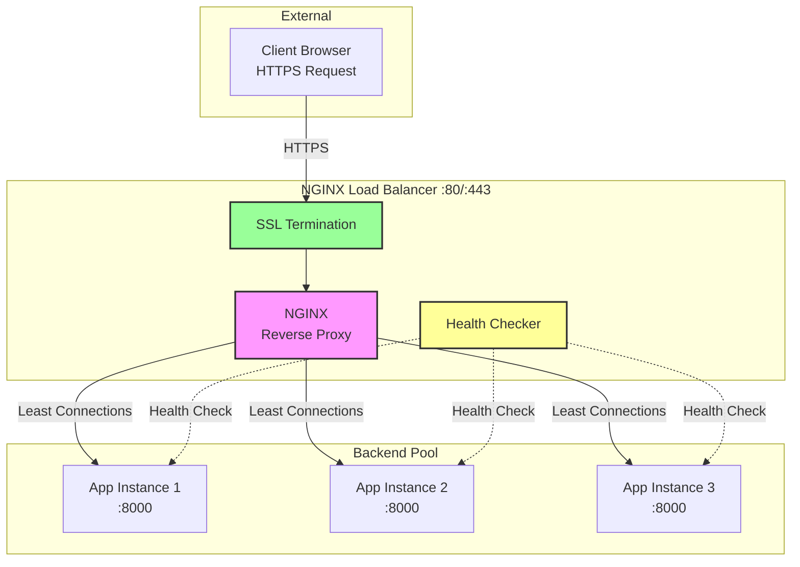

### Request Flow

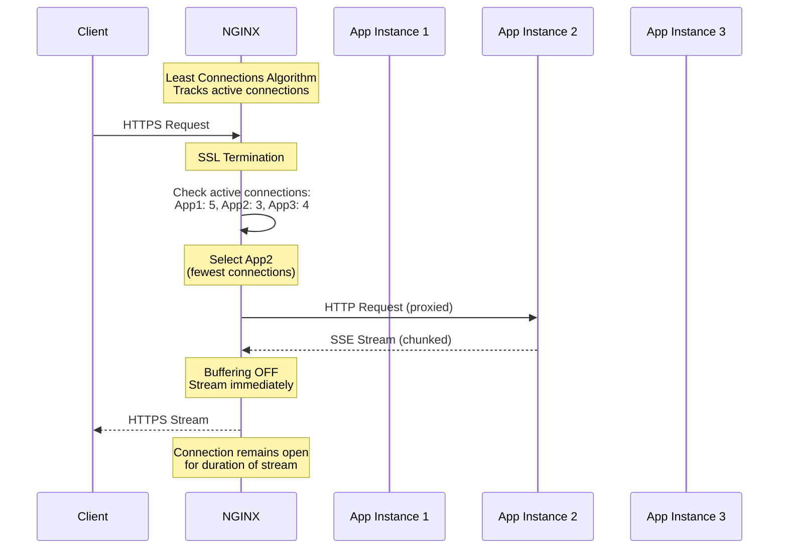

---

## Directory Structure

```
infrastructure/nginx/
├── README.md                          # This file
├── nginx.conf                         # Main NGINX configuration
├── conf.d/                            # Additional configurations (if needed)
├── ssl/                               # SSL certificates
│   ├── localhost.crt                 # Self-signed certificate (dev)
│   ├── localhost.key                 # Private key (dev)
│   ├── generate-certs.sh             # Certificate generation script
│   └── README.md                     # SSL documentation
├── NGINX_LOAD_BALANCING.md           # Detailed load balancing guide
└── VERIFICATION_REPORT.md            # Load balancer verification results
```

### File Purposes

| File | Purpose | When It's Used |
|------|---------|----------------|
| `nginx.conf` | Main configuration defining load balancing, SSL, and proxy settings | Read by NGINX on startup |
| `ssl/localhost.crt` | SSL certificate for HTTPS | Used for every HTTPS connection |
| `ssl/localhost.key` | Private key for SSL certificate | Used for every HTTPS connection |
| `conf.d/*.conf` | Additional configuration files (optional) | Included by main nginx.conf |

---

## How It Works

### 1. Infrastructure Startup Sequence

When you run `python infrastructure/manage.py start`, here's the NGINX lifecycle:

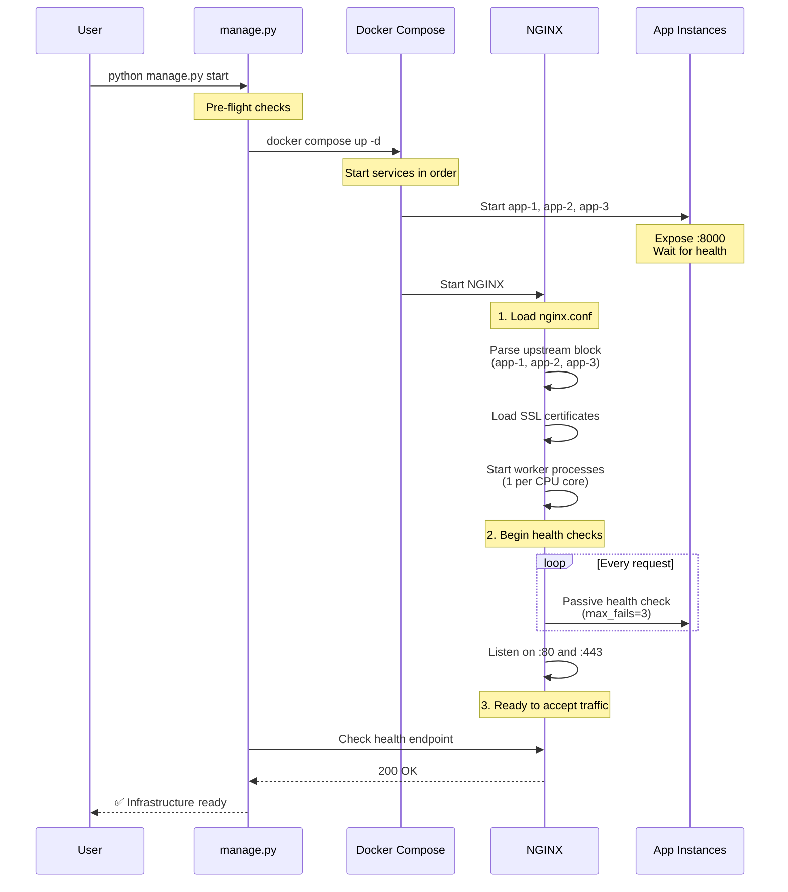

### 2. Docker Compose Integration

The `docker-compose.yml` file defines how NGINX runs and connects to backend services:

```yaml
nginx:
  image: nginx:1.25-alpine
  ports:
    - "80:80"      # HTTP (redirects to HTTPS)
    - "443:443"    # HTTPS (main entry point)
  
  volumes:
    # Mount NGINX configuration
    - ./infrastructure/nginx/nginx.conf:/etc/nginx/nginx.conf:ro
    
    # Mount SSL certificates
    - ./infrastructure/nginx/ssl:/etc/nginx/ssl:ro
  
  depends_on:
    app-1:
      condition: service_healthy
    app-2:
      condition: service_healthy
    app-3:
      condition: service_healthy
  
  healthcheck:
    test: ["CMD", "wget", "--quiet", "--tries=1", "--spider", 
           "http://localhost/nginx-health"]
    interval: 10s
    timeout: 5s
    retries: 3
```

**Critical Design Decisions**:

| Decision | Rationale |
|----------|-----------|
| `depends_on` with `service_healthy` | NGINX only starts after all app instances are healthy |
| Read-only mounts (`:ro`) | Prevents accidental configuration changes |
| Alpine image | Smaller image size, faster startup |
| Health check endpoint | Enables orchestration tools to monitor NGINX health |

### 3. Load Balancing Algorithm

NGINX uses the **Least Connections** algorithm for SSE streaming:

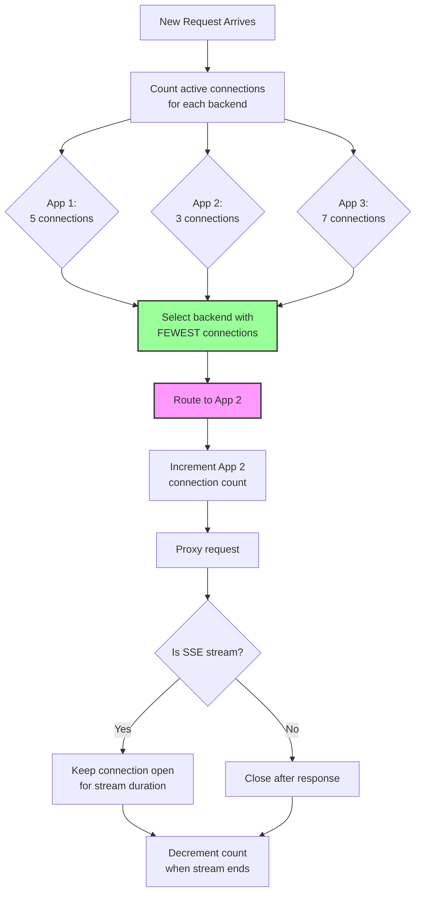

**Why Least Connections for SSE?**

| Algorithm | Best For | Why NOT for SSE? |
|-----------|----------|------------------|
| Round Robin | Short-lived requests of equal duration | Doesn't account for long-lived SSE connections |
| IP Hash | Session affinity (sticky sessions) | Not needed; app is stateless (uses Redis) |
| **Least Connections** | **Long-lived connections** | **✅ Perfect for SSE streams** |

---

## Integration with Infrastructure

### manage.py Orchestration

The `infrastructure/manage.py` script manages NGINX as a core service:

#### Service Definitions

```python
# From manage.py
CORE_SERVICES = [
    "redis-master",
    "zookeeper",
    "kafka",
    "nginx",        # ← Load balancer (this component)
    "prometheus",
    "grafana"
]
```

NGINX is a **core service**, meaning:
- Starts automatically with infrastructure
- Must be healthy before system is considered ready
- Monitored for health continuously

#### Dependency Chain

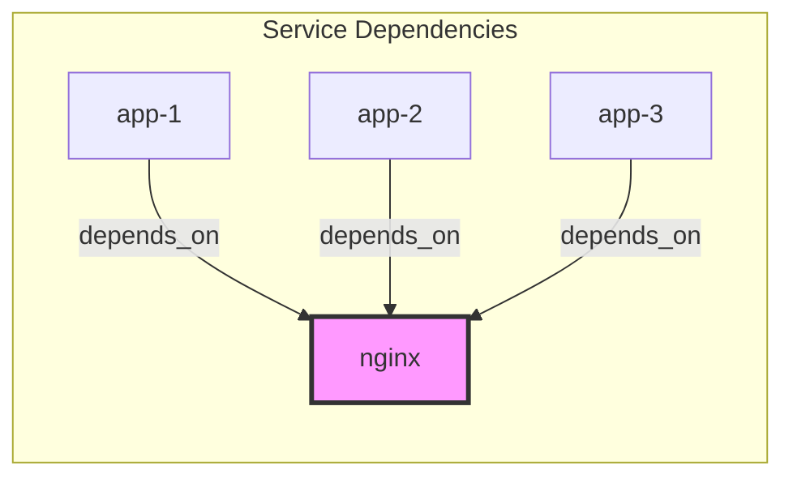

NGINX **depends on** all app instances being healthy. This ensures:
1. No requests are routed to unhealthy backends
2. Load balancer starts only when backends are ready
3. Clean startup sequence

### Health Monitoring

#### NGINX Health Check

```yaml
# From docker-compose.yml
healthcheck:
  test: ["CMD", "wget", "--quiet", "--tries=1", "--spider", 
         "http://localhost/nginx-health"]
  interval: 10s
  timeout: 5s
  retries: 3
  start_period: 30s
```

**Health Check Endpoint** (`/nginx-health`):
```nginx
location /nginx-health {
    access_log off;  # Don't log health checks
    return 200 "NGINX is healthy\n";
    add_header Content-Type text/plain;
}
```

#### Backend Health Checks

NGINX performs **passive health checks** on backend instances:

```nginx
upstream sse_backend {
    least_conn;
    
    server app-1:8000 max_fails=3 fail_timeout=30s;
    server app-2:8000 max_fails=3 fail_timeout=30s;
    server app-3:8000 max_fails=3 fail_timeout=30s;
}
```

**Health Check Logic**:

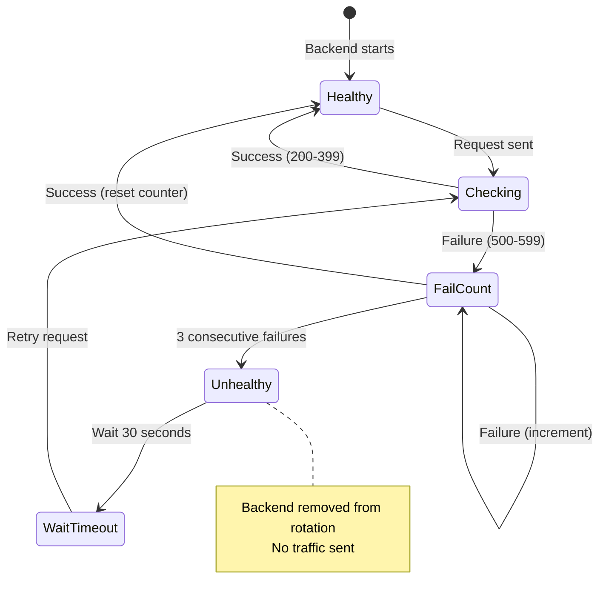

| Parameter | Value | Meaning |
|-----------|-------|---------|
| `max_fails` | 3 | Mark unhealthy after 3 consecutive failures |
| `fail_timeout` | 30s | Wait 30s before retrying unhealthy backend |

---

## Configuration Deep Dive

### Worker Process Configuration

```nginx
user nginx;
worker_processes auto;  # 1 worker per CPU core
```

**Why `auto`?**

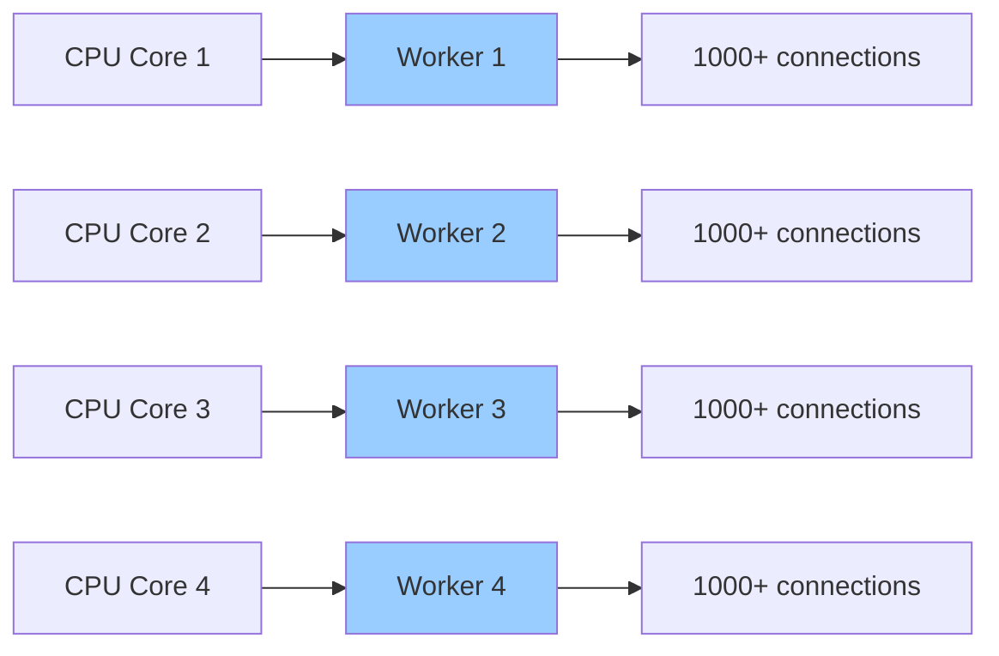

- Maximizes CPU utilization
- Each worker handles connections independently
- No inter-worker communication overhead
- Scales automatically with hardware

### Event Processing

```nginx
events {
    worker_connections 1024;  # Max connections per worker
    use epoll;                # Linux-optimized event mechanism
    multi_accept on;          # Accept multiple connections at once
}
```

**Connection Capacity**:
```
Total Capacity = worker_processes × worker_connections
Example: 4 cores × 1024 = 4,096 concurrent connections
```

### Upstream Configuration

```nginx
upstream sse_backend {
    least_conn;  # Load balancing algorithm
    
    server app-1:8000 max_fails=3 fail_timeout=30s;
    server app-2:8000 max_fails=3 fail_timeout=30s;
    server app-3:8000 max_fails=3 fail_timeout=30s;
    
    keepalive 32;  # Connection pool to backends
}
```

**Keepalive Connections**:

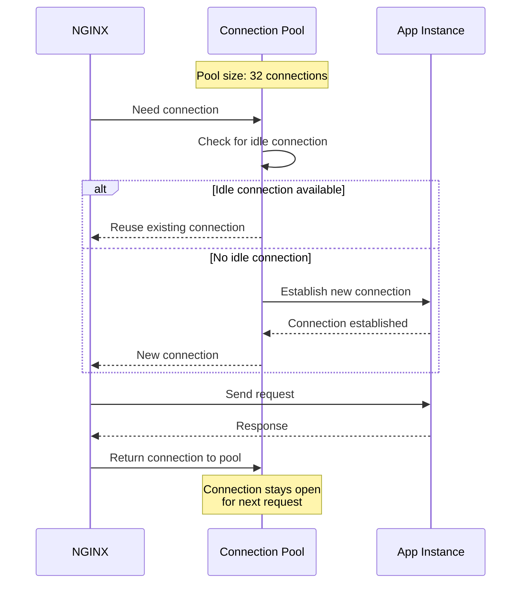

**Benefits**:
- Reduces latency (no TCP handshake overhead)
- Reduces backend load (fewer new connections)
- Improves throughput

### Proxy Configuration for SSE

**Critical Settings for Streaming**:

```nginx
location / {
    proxy_pass http://sse_backend;
    
    # Disable buffering (CRITICAL for SSE)
    proxy_buffering off;
    proxy_request_buffering off;
    
    # Long timeout for streams
    proxy_read_timeout 300s;  # 5 minutes
    
    # HTTP/1.1 for keepalive
    proxy_http_version 1.1;
    proxy_set_header Connection "";
    
    # Prevent caching
    proxy_set_header Cache-Control "no-cache, no-store, must-revalidate";
    proxy_set_header X-Accel-Buffering no;
}
```

**Why Disable Buffering?**

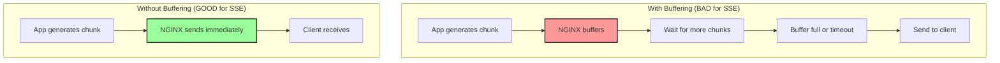

---

## Load Balancing Strategies

### Comparison of Algorithms

| Algorithm | How It Works | Best For | SSE Suitability |
|-----------|--------------|----------|-----------------|
| **Round Robin** | Cycles through backends in order | Equal-capacity servers, short requests | ❌ Poor - doesn't account for long connections |
| **Least Connections** | Routes to backend with fewest active connections | Long-lived connections, varying request duration | ✅ **Excellent** - perfect for SSE |
| **IP Hash** | Same client IP always goes to same backend | Stateful apps requiring session affinity | ⚠️ Not needed - app is stateless |
| **Least Time** (Plus only) | Routes to fastest backend | Servers with varying performance | ✅ Good, but requires NGINX Plus |

### Least Connections in Action

**Scenario**: 3 app instances, 10 concurrent SSE streams

```mermaid
gantt
    title Load Distribution Over Time
    dateFormat  HH:mm:ss
    axisFormat %H:%M:%S
    
    section App 1
    Stream 1 :a1, 00:00:00, 60s
    Stream 4 :a2, 00:00:03, 45s
    Stream 7 :a3, 00:00:06, 30s
    
    section App 2
    Stream 2 :b1, 00:00:01, 50s
    Stream 5 :b2, 00:00:04, 40s
    Stream 8 :b3, 00:00:07, 35s
    
    section App 3
    Stream 3 :c1, 00:00:02, 55s
    Stream 6 :c2, 00:00:05, 42s
    Stream 9 :c3, 00:00:08, 38s
    Stream 10 :c4, 00:00:09, 25s
```

**Result**: Balanced distribution based on active connections, not just request count.

---

## SSL/TLS Configuration

### Certificate Management

**Development (Self-Signed)**:
```bash
# Generate self-signed certificate
cd infrastructure/nginx/ssl
./generate-certs.sh
```

**Production (Let's Encrypt)**:
```bash
# Use Certbot for free SSL certificates
certbot certonly --webroot -w /var/www/html -d yourdomain.com
```

### SSL Configuration

```nginx
server {
    listen 443 ssl;
    http2 on;
    
    ssl_certificate /etc/nginx/ssl/localhost.crt;
    ssl_certificate_key /etc/nginx/ssl/localhost.key;
    
    # Modern SSL configuration
    ssl_protocols TLSv1.2 TLSv1.3;
    ssl_ciphers ECDHE-RSA-AES128-GCM-SHA256:ECDHE-RSA-AES256-GCM-SHA384;
    ssl_prefer_server_ciphers off;
}
```

### HTTP to HTTPS Redirect

```nginx
server {
    listen 80;
    server_name _;
    
    # Redirect all HTTP to HTTPS
    return 301 https://$host$request_uri;
}
```

**Flow**:

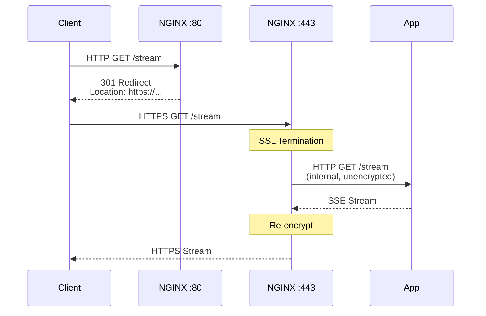

---

## Troubleshooting

### Common Issues

#### 1. 502 Bad Gateway

**Symptom**: NGINX returns 502 error

**Diagnosis**:
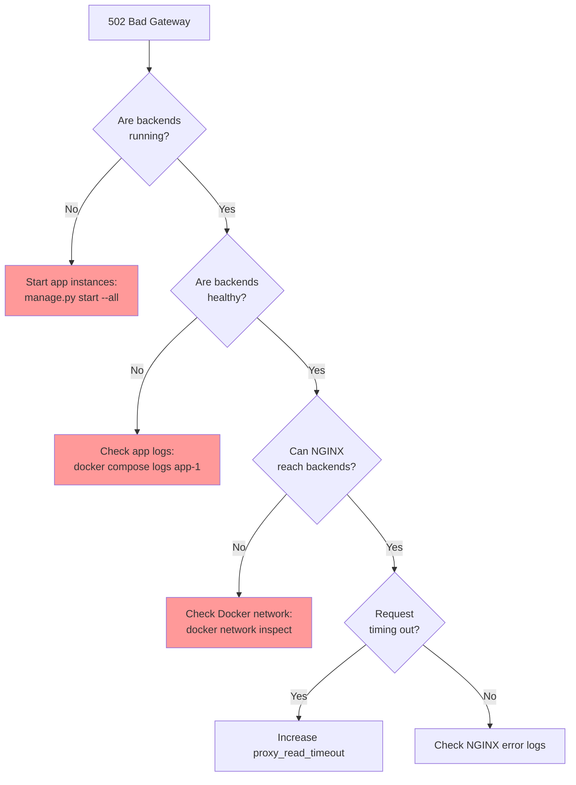

**Solution**:
```bash
# Check backend health
docker compose ps

# Check NGINX can reach backends
docker compose exec nginx ping app-1

# Check NGINX error logs
docker compose logs nginx --tail=50
```

#### 2. Slow Response Times

**Symptom**: Requests taking longer than expected

**Diagnosis**:

| Check | Command | What to Look For |
|-------|---------|------------------|
| NGINX access logs | `docker compose logs nginx \| grep "rt="` | High `rt=` (request time) values |
| Backend response time | `docker compose logs nginx \| grep "urt="` | High `urt=` (upstream response time) |
| Connection time | `docker compose logs nginx \| grep "uct="` | High `uct=` (upstream connect time) |

**Solution**:
```nginx
# Increase keepalive connections
upstream sse_backend {
    keepalive 64;  # Increase from 32
}

# Increase worker connections
events {
    worker_connections 2048;  # Increase from 1024
}
```

#### 3. SSL Certificate Errors

**Symptom**: Browser shows "Your connection is not private"

**For Development**:
- Expected with self-signed certificates
- Click "Advanced" → "Proceed to localhost"

**For Production**:
```bash
# Verify certificate is valid
openssl x509 -in /path/to/cert.crt -text -noout

# Check certificate expiration
openssl x509 -in /path/to/cert.crt -noout -dates
```

### Monitoring Commands

```bash
# Check NGINX status
docker compose ps nginx

# View real-time access logs
docker compose logs nginx --follow

# Check NGINX configuration syntax
docker compose exec nginx nginx -t

# Reload NGINX configuration (zero downtime)
docker compose exec nginx nginx -s reload

# View NGINX metrics
curl http://localhost/nginx-status
```

---

## Performance Tuning

### Optimization Checklist

| Setting | Default | Tuned | Impact |
|---------|---------|-------|--------|
| `worker_processes` | 1 | `auto` | ✅ Utilizes all CPU cores |
| `worker_connections` | 512 | 1024 | ✅ Handles more concurrent connections |
| `keepalive` (upstream) | 0 | 32 | ✅ Reduces backend connection overhead |
| `proxy_buffering` | on | `off` | ✅ Enables real-time SSE streaming |
| `sendfile` | off | `on` | ✅ Optimizes static file serving |
| `tcp_nodelay` | off | `on` | ✅ Reduces latency for streaming |

### Load Testing

```bash
# Test load balancing distribution
for i in {1..100}; do
    curl -s https://localhost/stream | grep "instance" &
done

# Monitor connection distribution
watch -n 1 'docker compose exec nginx cat /var/log/nginx/access.log | grep upstream | tail -20'
```

---

## Quick Reference

### Access URLs

| Endpoint | URL | Purpose |
|----------|-----|---------|
| Application (HTTP) | http://localhost | Redirects to HTTPS |
| Application (HTTPS) | https://localhost | Main entry point |
| NGINX Health | http://localhost/nginx-health | Health check endpoint |
| NGINX Status | http://localhost/nginx-status | Metrics endpoint |

### Common Commands

```bash
# Start infrastructure (including NGINX)
python infrastructure/manage.py start

# Restart just NGINX
python infrastructure/manage.py restart --services nginx

# Reload NGINX config (zero downtime)
docker compose exec nginx nginx -s reload

# Test NGINX configuration
docker compose exec nginx nginx -t

# View NGINX logs
docker compose logs nginx --tail=50 --follow

# Check backend distribution
docker compose logs nginx | grep upstream | tail -20
```

---

## Professional Standards

This NGINX setup demonstrates:

✅ **High Availability**: Automatic failover and health checking  
✅ **Load Balancing**: Intelligent traffic distribution  
✅ **SSL/TLS Security**: Encrypted communication  
✅ **Performance Optimization**: Tuned for low latency and high throughput  
✅ **SSE-Specific Configuration**: Disabled buffering for real-time streaming  
✅ **Observability**: Comprehensive logging and metrics  
✅ **Zero Downtime**: Configuration reloads without dropping connections  
✅ **Documentation**: Extensively commented configuration

---

## Further Reading

- [NGINX Official Documentation](https://nginx.org/en/docs/)
- [NGINX Load Balancing Guide](https://docs.nginx.com/nginx/admin-guide/load-balancer/http-load-balancer/)
- [NGINX SSL/TLS Configuration](https://nginx.org/en/docs/http/configuring_https_servers.html)
- [Server-Sent Events Specification](https://html.spec.whatwg.org/multipage/server-sent-events.html)
- [NGINX Performance Tuning](https://www.nginx.com/blog/tuning-nginx/)
