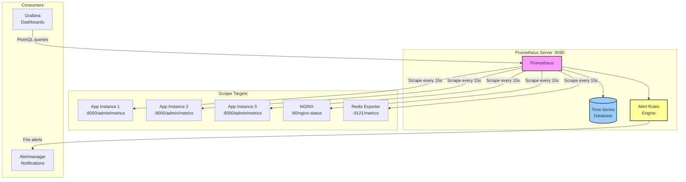
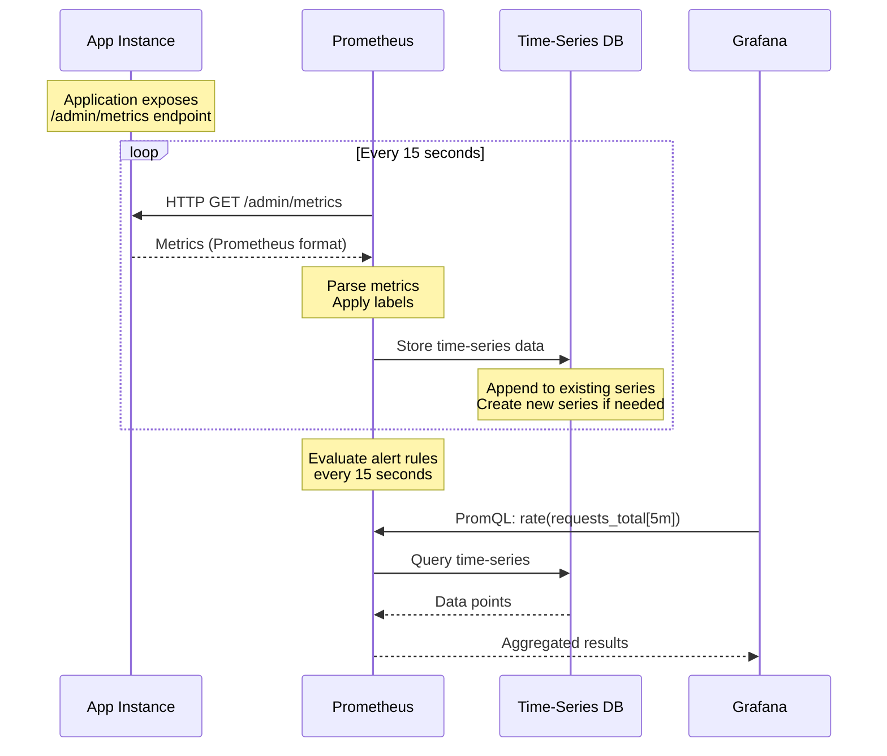
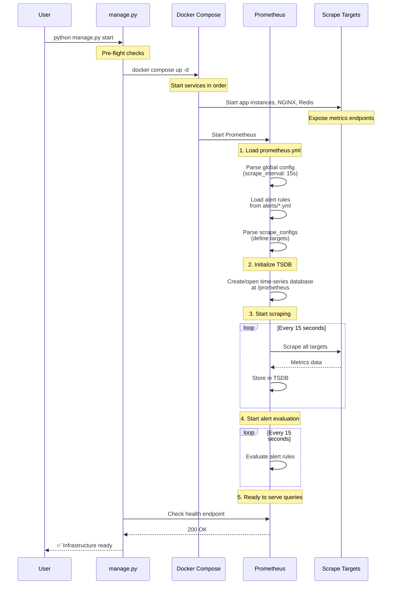
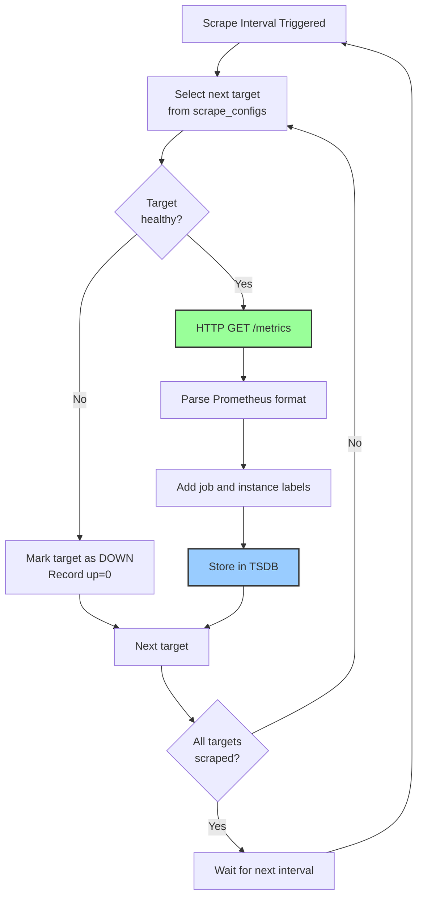
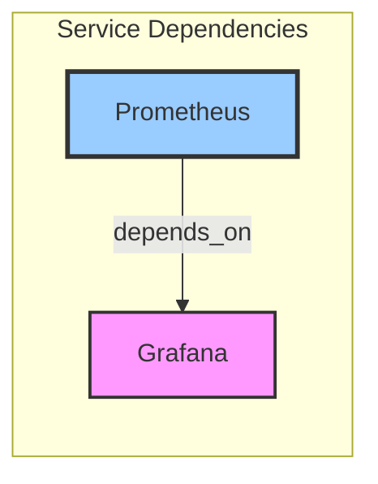
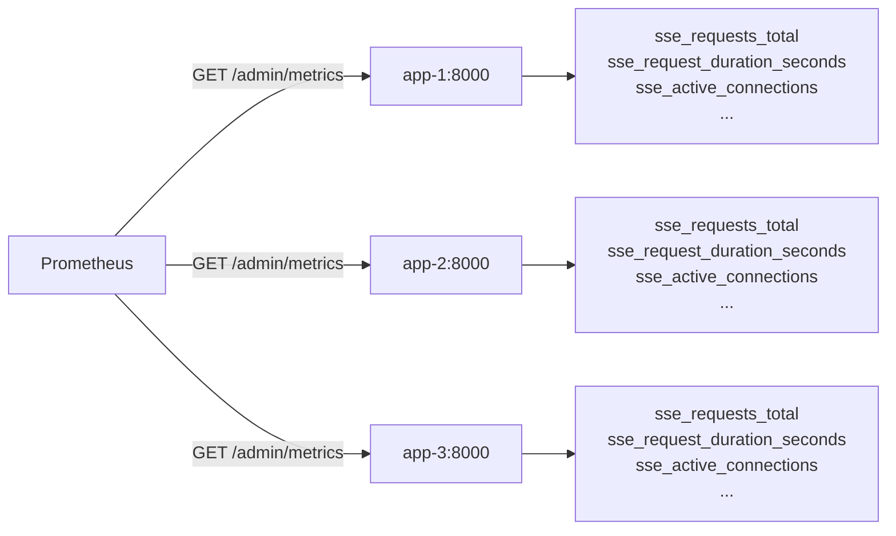
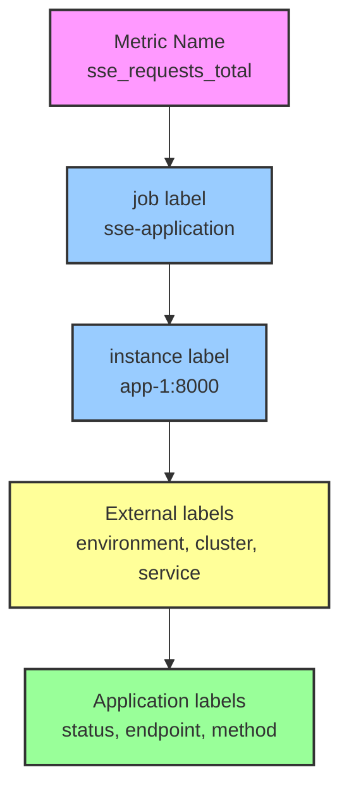
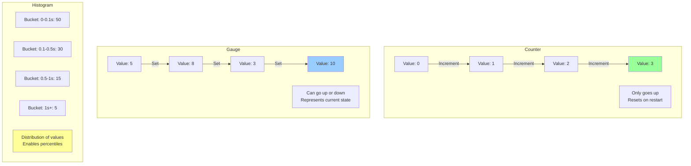
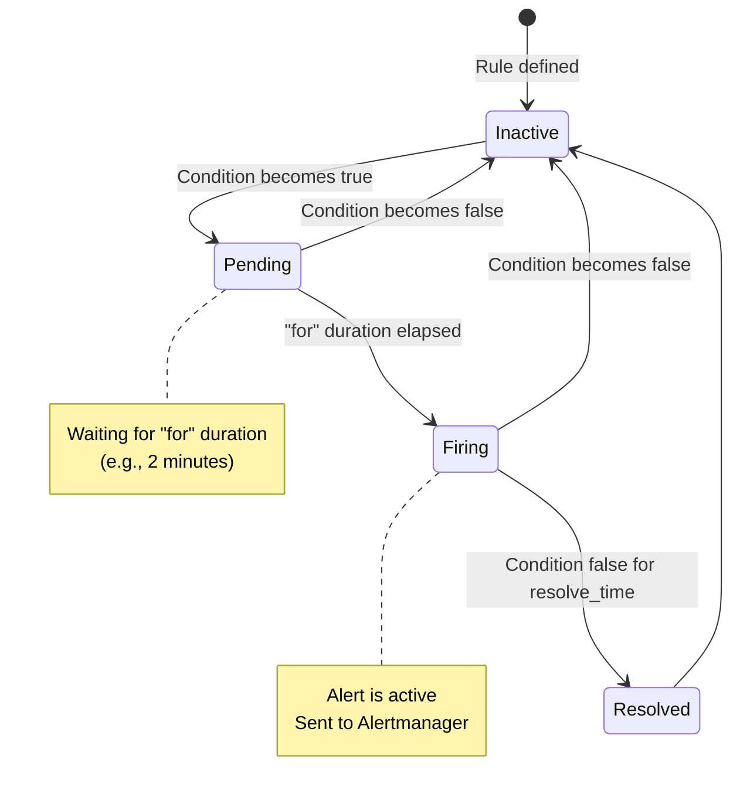
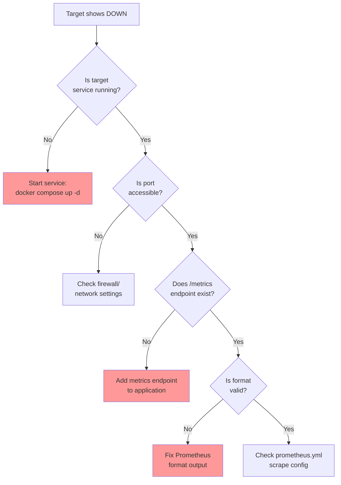

# Prometheus Monitoring Infrastructure

**Time-series metrics collection and alerting for the SSE Streaming Application**

---

## Table of Contents

1. [Overview](#overview)
2. [Architecture](#architecture)
3. [Directory Structure](#directory-structure)
4. [How It Works](#how-it-works)
5. [Integration with Infrastructure](#integration-with-infrastructure)
6. [Scrape Configuration](#scrape-configuration)
7. [Metrics and Labels](#metrics-and-labels)
8. [Alerting Rules](#alerting-rules)
9. [Troubleshooting](#troubleshooting)

---

## Overview

This directory contains the Prometheus monitoring configuration for the SSE application. Prometheus is a time-series database and monitoring system that scrapes metrics from application instances, stores them efficiently, and enables powerful querying and alerting capabilities.

### Key Features

- **Multi-Target Scraping**: Collects metrics from app instances, NGINX, and Redis
- **Time-Series Storage**: Efficient storage with configurable retention
- **PromQL**: Powerful query language for metric analysis
- **Alerting**: Proactive detection of issues via alert rules
- **Service Discovery**: Automatic detection of Docker services
- **High Availability**: Designed for reliability and uptime

---

## Architecture

### System Overview



### Data Flow



---

## Directory Structure

```
infrastructure/prometheus/
├── README.md                          # This file
├── prometheus.yml                     # Main configuration
├── alerts/                            # Alert rule definitions
│   └── sse_alerts.yml                # SSE application alerts
└── docs/                              # Additional documentation
    └── PROMETHEUS_SETUP.md           # Setup guide
```

### File Purposes

| File | Purpose | When It's Used |
|------|---------|----------------|
| `prometheus.yml` | Main configuration: scrape targets, intervals, alert rules | Read by Prometheus on startup |
| `alerts/sse_alerts.yml` | Alert rule definitions (high error rate, latency, etc.) | Evaluated every 15 seconds |
| `docs/PROMETHEUS_SETUP.md` | Detailed setup and configuration guide | Reference documentation |

---

## How It Works

### 1. Infrastructure Startup Sequence

When you run `python infrastructure/manage.py start`, here's the Prometheus lifecycle:



### 2. Docker Compose Integration

The `docker-compose.yml` file defines how Prometheus runs:

```yaml
prometheus:
  image: prom/prometheus:v2.48.0
  ports:
    - "9090:9090"
  
  volumes:
    # Mount configuration
    - ./infrastructure/prometheus/prometheus.yml:/etc/prometheus/prometheus.yml:ro
    
    # Mount alert rules
    - ./infrastructure/prometheus/alerts:/etc/prometheus/alerts:ro
    
    # Persistent storage for time-series data
    - prometheus-data:/prometheus
  
  command:
    - '--config.file=/etc/prometheus/prometheus.yml'
    - '--storage.tsdb.path=/prometheus'
    - '--storage.tsdb.retention.time=30d'  # Keep 30 days of data
    - '--web.console.libraries=/usr/share/prometheus/console_libraries'
    - '--web.console.templates=/usr/share/prometheus/consoles'
  
  healthcheck:
    test: ["CMD", "wget", "--quiet", "--tries=1", "--spider", 
           "http://localhost:9090/-/healthy"]
    interval: 10s
    timeout: 5s
    retries: 3
```

**Critical Design Decisions**:

| Decision | Rationale |
|----------|-----------|
| `retention.time=30d` | Balances storage cost with historical analysis needs |
| Read-only config mounts | Prevents accidental modification |
| Named volume for data | Persists metrics across container restarts |
| Health check endpoint | Enables orchestration and monitoring |

### 3. Scrape Mechanism

Prometheus uses a **pull model** (not push):



---

## Integration with Infrastructure

### manage.py Orchestration

The `infrastructure/manage.py` script manages Prometheus as a core service:

#### Service Definitions

```python
# From manage.py
CORE_SERVICES = [
    "redis-master",
    "zookeeper",
    "kafka",
    "nginx",
    "prometheus",   # ← Metrics collection (this component)
    "grafana"
]
```

Prometheus is a **core service**, meaning:
- Starts automatically with infrastructure
- Must be healthy before Grafana starts (dependency)
- Monitored for health continuously

#### Dependency Chain



Grafana **depends on** Prometheus being healthy. This ensures:
1. Datasource is available when Grafana starts
2. Dashboards can query metrics immediately
3. Clean startup sequence

---

## Scrape Configuration

### Global Settings

```yaml
global:
  scrape_interval: 15s      # How often to scrape targets
  evaluation_interval: 15s  # How often to evaluate rules
  
  external_labels:
    environment: 'development'
    cluster: 'local'
    service: 'sse-streaming'
```

**Scrape Interval Trade-offs**:

| Interval | Pros | Cons | Best For |
|----------|------|------|----------|
| 5s | High resolution, fast detection | 3x storage, more load | Critical systems |
| **15s** | **Good balance** | **Standard choice** | **Most applications** |
| 30s | Lower storage, less load | Slower detection | Low-traffic apps |
| 60s | Minimal storage | Very slow detection | Batch jobs |

### Scrape Targets

#### 1. SSE Application Instances

```yaml
scrape_configs:
  - job_name: 'sse-application'
    static_configs:
      - targets:
          - 'app-1:8000'
          - 'app-2:8000'
          - 'app-3:8000'
    metrics_path: '/admin/metrics'
    scrape_interval: 15s
```

**What Gets Scraped**:



#### 2. NGINX Metrics

```yaml
- job_name: 'nginx'
  static_configs:
    - targets: ['nginx:80']
  metrics_path: '/nginx-status'
```

#### 3. Redis Metrics

```yaml
- job_name: 'redis'
  static_configs:
    - targets: ['redis-exporter:9121']
  metrics_path: '/metrics'
```

### Metric Labels

Every metric automatically gets these labels:

```promql
sse_requests_total{
  job="sse-application",           # From scrape config
  instance="app-1:8000",            # Target address
  environment="development",        # External label
  cluster="local",                  # External label
  service="sse-streaming",          # External label
  status="success"                  # Application-defined label
}
```

**Label Hierarchy**:



---

## Metrics and Labels

### Key Metrics Collected

#### Application Metrics

| Metric | Type | Description | Labels |
|--------|------|-------------|--------|
| `sse_requests_total` | Counter | Total requests received | `status`, `endpoint`, `method` |
| `sse_request_duration_seconds` | Histogram | Request latency distribution | `endpoint`, `method` |
| `sse_active_connections` | Gauge | Current active SSE connections | `instance` |
| `sse_cache_hits_total` | Counter | Cache hit count | `tier` (L1/L2) |
| `sse_cache_misses_total` | Counter | Cache miss count | `tier` (L1/L2) |

#### NGINX Metrics

| Metric | Type | Description |
|--------|------|-------------|
| `nginx_connections_active` | Gauge | Active client connections |
| `nginx_connections_reading` | Gauge | Connections reading request |
| `nginx_connections_writing` | Gauge | Connections writing response |
| `nginx_connections_waiting` | Gauge | Idle keepalive connections |

#### Redis Metrics

| Metric | Type | Description |
|--------|------|-------------|
| `redis_connected_clients` | Gauge | Number of connected clients |
| `redis_used_memory_bytes` | Gauge | Memory used by Redis |
| `redis_commands_processed_total` | Counter | Total commands processed |

### Metric Types Explained



---

## Alerting Rules

### Alert Rule Structure

```yaml
groups:
  - name: sse_application
    interval: 15s
    rules:
      - alert: HighErrorRate
        expr: |
          (
            sum(rate(sse_requests_total{status!="success"}[5m]))
            /
            sum(rate(sse_requests_total[5m]))
          ) > 0.05
        for: 2m
        labels:
          severity: warning
        annotations:
          summary: "High error rate detected"
          description: "Error rate is {{ $value | humanizePercentage }}"
```

### Alert Lifecycle



### Example Alerts

#### 1. High Error Rate

```yaml
- alert: HighErrorRate
  expr: |
    (sum(rate(sse_requests_total{status!="success"}[5m])) 
     / sum(rate(sse_requests_total[5m]))) > 0.05
  for: 2m
  labels:
    severity: warning
  annotations:
    summary: "Error rate above 5%"
```

**When It Fires**: Error rate > 5% for 2 consecutive minutes

#### 2. High P95 Latency

```yaml
- alert: HighP95Latency
  expr: |
    histogram_quantile(0.95, 
      sum(rate(sse_request_duration_seconds_bucket[5m])) by (le)
    ) > 2
  for: 5m
  labels:
    severity: warning
  annotations:
    summary: "P95 latency above 2 seconds"
```

**When It Fires**: 95th percentile latency > 2s for 5 minutes

#### 3. Low Cache Hit Rate

```yaml
- alert: LowCacheHitRate
  expr: |
    (sum(rate(sse_cache_hits_total{tier="L2"}[10m]))
     / (sum(rate(sse_cache_hits_total{tier="L2"}[10m])) 
        + sum(rate(sse_cache_misses_total{tier="L2"}[10m])))) < 0.5
  for: 10m
  labels:
    severity: info
  annotations:
    summary: "L2 cache hit rate below 50%"
```

**When It Fires**: L2 cache hit rate < 50% for 10 minutes

---

## Troubleshooting

### Common Issues

#### 1. Target Down

**Symptom**: Prometheus shows target as "DOWN" in `/targets` page

**Diagnosis**:



**Solution**:
```bash
# Check if target is running
docker compose ps app-1

# Test metrics endpoint manually
curl http://app-1:8000/admin/metrics

# Check Prometheus logs
docker compose logs prometheus --tail=50
```

#### 2. No Data in Grafana

**Symptom**: Grafana dashboards show "No data"

**Diagnosis**:

| Check | Command | What to Look For |
|-------|---------|------------------|
| Prometheus health | `curl http://localhost:9090/-/healthy` | Should return "Prometheus is Healthy" |
| Targets status | Visit http://localhost:9090/targets | All targets should be "UP" |
| Query metrics | `curl 'http://localhost:9090/api/v1/query?query=up'` | Should return data |
| Grafana datasource | Check Grafana datasource settings | URL should be `http://prometheus:9090` |

#### 3. High Memory Usage

**Symptom**: Prometheus container using excessive memory

**Causes & Solutions**:

| Cause | Solution |
|-------|----------|
| Too many metrics | Reduce scrape targets or increase `scrape_interval` |
| Long retention | Reduce `storage.tsdb.retention.time` |
| High cardinality labels | Avoid labels with many unique values |
| Memory leaks | Restart Prometheus, upgrade to latest version |

**Monitoring Memory**:
```bash
# Check Prometheus memory usage
docker stats prometheus

# Check TSDB size
docker compose exec prometheus du -sh /prometheus
```

---

## Query Examples

### PromQL Basics

#### Request Rate

```promql
# Requests per second (last 5 minutes)
rate(sse_requests_total[5m])

# Total requests per second across all instances
sum(rate(sse_requests_total[5m]))

# Requests per second by instance
sum(rate(sse_requests_total[5m])) by (instance)
```

#### Error Rate

```promql
# Error rate as percentage
(
  sum(rate(sse_requests_total{status!="success"}[5m]))
  /
  sum(rate(sse_requests_total[5m]))
) * 100
```

#### Latency Percentiles

```promql
# P50 latency
histogram_quantile(0.50, 
  sum(rate(sse_request_duration_seconds_bucket[5m])) by (le)
)

# P95 latency
histogram_quantile(0.95, 
  sum(rate(sse_request_duration_seconds_bucket[5m])) by (le)
)

# P99 latency
histogram_quantile(0.99, 
  sum(rate(sse_request_duration_seconds_bucket[5m])) by (le)
)
```

#### Cache Hit Rate

```promql
# L2 cache hit rate
(
  sum(rate(sse_cache_hits_total{tier="L2"}[5m]))
  /
  (
    sum(rate(sse_cache_hits_total{tier="L2"}[5m]))
    +
    sum(rate(sse_cache_misses_total{tier="L2"}[5m]))
  )
) * 100
```

---

## Performance Tuning

### Storage Optimization

```yaml
# In docker-compose.yml command section
--storage.tsdb.retention.time=30d      # Keep 30 days
--storage.tsdb.retention.size=10GB     # Or max 10GB
```

**Retention Trade-offs**:

| Retention | Storage | Use Case |
|-----------|---------|----------|
| 7d | ~2GB | Development, testing |
| 15d | ~4GB | Short-term production |
| **30d** | **~8GB** | **Standard production** |
| 90d | ~24GB | Compliance, long-term analysis |

### Scrape Optimization

```yaml
# Reduce load on high-cardinality targets
scrape_configs:
  - job_name: 'expensive-target'
    scrape_interval: 30s  # Slower than global 15s
    scrape_timeout: 10s   # Longer timeout
```

---

## Quick Reference

### Access URLs

| Service | URL | Purpose |
|---------|-----|---------|
| Prometheus UI | http://localhost:9090 | Query interface, target status |
| Targets | http://localhost:9090/targets | View scrape target health |
| Alerts | http://localhost:9090/alerts | View active alerts |
| Graph | http://localhost:9090/graph | Execute PromQL queries |
| Metrics | http://localhost:9090/metrics | Prometheus's own metrics |

### Common Commands

```bash
# Start infrastructure (including Prometheus)
python infrastructure/manage.py start

# Restart just Prometheus
python infrastructure/manage.py restart --services prometheus

# View Prometheus logs
docker compose logs prometheus --tail=50 --follow

# Check configuration syntax
docker compose exec prometheus promtool check config /etc/prometheus/prometheus.yml

# Check alert rules syntax
docker compose exec prometheus promtool check rules /etc/prometheus/alerts/*.yml

# Query metrics via CLI
docker compose exec prometheus promtool query instant http://localhost:9090 'up'
```

---

## Professional Standards

This Prometheus setup demonstrates:

✅ **Comprehensive Monitoring**: Metrics from all critical components  
✅ **Efficient Storage**: Optimized retention and scrape intervals  
✅ **Proactive Alerting**: Alert rules for common failure modes  
✅ **High Availability**: Health checks and automatic recovery  
✅ **Observability**: Full visibility into system behavior  
✅ **Best Practices**: Industry-standard configuration patterns  
✅ **Documentation**: Extensively commented configuration  

---

## Further Reading

- [Prometheus Official Documentation](https://prometheus.io/docs/introduction/overview/)
- [PromQL Basics](https://prometheus.io/docs/prometheus/latest/querying/basics/)
- [Alerting Rules](https://prometheus.io/docs/prometheus/latest/configuration/alerting_rules/)
- [Best Practices](https://prometheus.io/docs/practices/naming/)
- [Metric Types](https://prometheus.io/docs/concepts/metric_types/)
