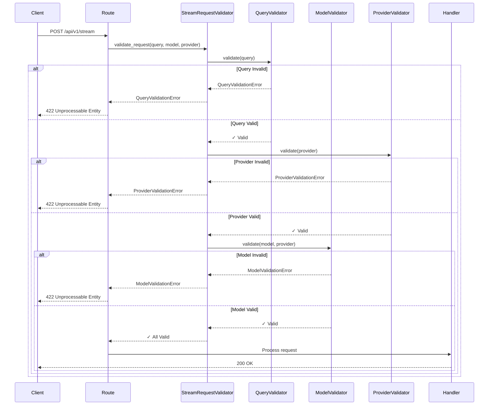

# FastAPI Application Layer

**Professional REST API implementation for the SSE Streaming Microservice**

---

## Table of Contents

1. [Overview](#overview)
2. [Architecture](#architecture)
3. [Enterprise Decisions](#enterprise-decisions)
4. [Directory Structure](#directory-structure)
5. [How It Works](#how-it-works)
6. [API Endpoints](#api-endpoints)
7. [Configuration Deep Dive](#configuration-deep-dive)
8. [Troubleshooting](#troubleshooting)

---

## Overview

This directory contains the complete FastAPI application layer for the SSE streaming microservice. The application provides a production-ready REST API with enterprise-grade features including dependency injection, middleware, error handling, comprehensive validation, and observability.

### Key Features

- **Professional API Structure**: Clean separation of concerns with routers, dependencies, middleware, and validators
- **Configurable API Versioning**: Support for `/api/v1`, `/api/v2`, etc. via `API_BASE_PATH`
- **Enterprise Middleware Stack**: Error handling, CORS, rate limiting, request logging, security headers
- **Comprehensive Validation**: Custom exception hierarchy, whitelist validation, security pattern detection
- **Dependency Injection**: Type-safe, testable dependencies using FastAPI's DI system
- **SOLID Principles**: Single Responsibility, Open/Closed, Dependency Inversion applied throughout
- **Auto-Generated Documentation**: OpenAPI/Swagger docs with educational comments

---

## Architecture

### System Overview


### Request Lifecycle


---

## Enterprise Decisions

This section documents all enterprise-level architectural decisions made in the application layer.

### 1. API Versioning Strategy

**Decision**: Configurable base URL prefix for all endpoints

**Implementation**: `API_BASE_PATH` setting (default: `/api/v1`)

**Rationale**:
- Professional API versioning (`/api/v1`, `/api/v2`)
- Easy version management without code changes
- Clear separation from root endpoints (`/`, `/docs`, `/redoc`)
- Industry-standard URL structure
- Supports running multiple versions simultaneously during migration

**Configuration**:
```python
# .env
API_BASE_PATH=/api/v1  # or /api/v2, or "" for root
```

**Impact**: All endpoints are prefixed with base path
- `POST /api/v1/stream`
- `GET /api/v1/health`
- `PUT /api/v1/admin/config`

---

### 2. Middleware Execution Order

**Decision**: Specific middleware registration order for security and observability

**Implementation**: Middleware registered in reverse execution order

**Order** (registration → execution):
1. **Error Handler** (first registered, last executed)
2. **CORS Middleware**
3. **Rate Limiter**
4. **Thread ID Middleware**

**Rationale**:
- Error handler catches exceptions from all other middleware
- CORS ensures error responses have proper headers
- Rate limiting protects against abuse
- Thread ID provides request correlation

**Critical Design Point**: Middleware executes in **REVERSE** order of registration
```
Request:  Client → Error → CORS → Rate → Thread → Handler
Response: Handler → Thread → Rate → CORS → Error → Client
```

---

### 3. Dependency Injection Pattern

**Decision**: FastAPI's native dependency injection for all shared resources

**Implementation**: Type-safe dependencies with `Depends()` and `Annotated`

**Key Dependencies**:
```python
# Orchestrator (singleton from app.state)
OrchestratorDep = Annotated[StreamOrchestrator, Depends(get_orchestrator)]

# Settings (singleton)
SettingsDep = Annotated[Settings, Depends(get_settings)]

# User ID (extracted from request)
UserIdDep = Annotated[str, Depends(get_user_id)]
```

**Benefits**:
- **Testability**: Easy to mock dependencies in tests
- **Type Safety**: IDE autocomplete and type checking
- **Separation of Concerns**: Dependencies isolated from business logic
- **Reusability**: Same dependency used across multiple endpoints
- **Lazy Loading**: Dependencies resolved only when needed

---

### 4. User Identification Strategy

**Decision**: Centralized user ID extraction via dependency injection

**Implementation**: `get_user_id()` dependency with fallback logic

**Hierarchy**:
1. Check `X-User-ID` header (explicit user identification)
2. Fall back to client IP address (implicit identification)

**Rationale**:
- **DRY Principle**: User ID extraction defined once, used everywhere
- **Flexibility**: Easy to add JWT validation or other auth mechanisms
- **Testability**: Simple to mock in tests
- **Observability**: Consistent user tracking across all requests

**Future-Proof**: Can be extended to support:
- JWT token validation
- API key authentication
- OAuth2 integration

---

### 5. Validation Framework

**Decision**: Comprehensive validation layer with custom exception hierarchy

**Implementation**: Specialized validators with base class utilities

**Architecture**:
```
validators/
├── exceptions.py          # Custom exception hierarchy
├── base.py               # BaseValidator with utilities
├── stream_validator.py   # Stream request validators
└── config_validator.py   # Configuration validators
```

**Design Patterns**:
- **Template Method**: BaseValidator provides common utilities
- **Facade**: StreamRequestValidator orchestrates multiple validators
- **Exception Hierarchy**: Specific exceptions for precise error handling
- **Separation of Concerns**: Each validator has single responsibility

**Validators**:
1. **QueryValidator**: Query content validation (length, security patterns)
2. **ModelValidator**: Model identifier validation (whitelist, provider mapping)
3. **ProviderValidator**: Provider identifier validation
4. **ConfigValidator**: Runtime configuration validation
5. **StreamRequestValidator**: Orchestrates all validators (facade)

**Security Features**:
- XSS detection (script tags, event handlers)
- SQL injection detection (DROP, DELETE, UNION)
- Path traversal detection (../, /etc/passwd)
- Whitelist validation (only known-good values allowed)

---

### 6. REST Compliance

**Decision**: Proper HTTP method semantics

**Key Change**: `POST /admin/config` → `PUT /admin/config`

**Rationale**:
- **PUT** = Replace/update existing resource (idempotent)
- **POST** = Create new resource (non-idempotent)
- Config endpoint **updates** existing config, doesn't create new
- Multiple identical PUT requests have same effect (idempotent)

**Impact**: Better REST compliance and semantic correctness

---

### 7. Error Handling Strategy

**Decision**: Centralized error handling with custom exceptions

**Implementation**: `ErrorHandlingMiddleware` + custom exception types

**Features**:
- Catches all unhandled exceptions
- Logs errors with context
- Records metrics
- Returns sanitized JSON responses
- Hides stack traces in production
- Shows tracebacks in development

**Exception Hierarchy**:
```python
ValidationError (base)
├── QueryValidationError
├── ModelValidationError
├── ProviderValidationError
├── SecurityValidationError
├── ConfigValidationError
└── RateLimitValidationError
```

**Benefits**:
- **Precise Error Handling**: Catch specific exception types
- **Structured Responses**: Consistent error format for API clients
- **Security**: No sensitive information leakage
- **Observability**: All errors logged and tracked

---

### 8. SOLID Principles Application

#### Single Responsibility Principle (SRP)
- Each validator has one job (QueryValidator, ModelValidator, etc.)
- Each middleware has one concern (logging, security, performance)
- Each router handles one domain (streaming, health, admin)

#### Open/Closed Principle (OCP)
- BaseValidator is open for extension (inherit and add logic)
- Closed for modification (base utilities don't change)
- New validators can be added without changing existing ones

#### Liskov Substitution Principle (LSP)
- All validators inherit from BaseValidator
- Can be used interchangeably where BaseValidator is expected

#### Interface Segregation Principle (ISP)
- Validators expose only relevant methods
- Dependencies provide focused interfaces

#### Dependency Inversion Principle (DIP)
- High-level modules (routes) depend on abstractions (dependencies)
- Low-level modules (orchestrator) injected via DI
- Easy to swap implementations for testing

---

### 9. Security Headers

**Decision**: Comprehensive security headers on all responses

**Implementation**: `SecurityHeadersMiddleware`

**Headers Applied**:
- `X-Content-Type-Options: nosniff` (prevent MIME sniffing)
- `X-Frame-Options: DENY` (prevent clickjacking)
- `X-XSS-Protection: 1; mode=block` (XSS protection)
- `Strict-Transport-Security` (force HTTPS)
- `Content-Security-Policy` (restrict resource loading)

**Rationale**: Defense in depth - multiple layers of security

---

### 10. Observability Strategy

**Decision**: Comprehensive logging, metrics, and tracing

**Implementation**:
- **Structured Logging**: JSON format with context
- **Request Correlation**: Thread ID in all logs
- **Performance Monitoring**: Request duration tracking
- **Metrics Collection**: Prometheus metrics exposed
- **Health Checks**: Multiple health endpoints for K8s

**Endpoints**:
- `/api/v1/health` - Basic health
- `/api/v1/health/detailed` - Component health
- `/api/v1/health/live` - Liveness probe
- `/api/v1/health/ready` - Readiness probe
- `/api/v1/admin/metrics` - Prometheus metrics

---

## Dependency Injection Deep Dive

FastAPI's dependency injection system is a core feature of this application. This section explains how it works and how we use it.

### What is Dependency Injection?

**Dependency Injection (DI)** is a design pattern where objects receive their dependencies from external sources rather than creating them internally.

**Without DI** (tightly coupled):
```python
@router.post("/stream")
async def create_stream(request: Request):
    # Create dependencies inside the function
    settings = get_settings()  # ← Hardcoded dependency
    orchestrator = get_orchestrator(request)  # ← Hardcoded dependency
    user_id = request.headers.get("X-User-ID") or request.client.host  # ← Hardcoded logic
    
    # Business logic
    result = await orchestrator.stream(...)
    return result
```

**With DI** (loosely coupled):
```python
@router.post("/stream")
async def create_stream(
    orchestrator: OrchestratorDep,  # ← Injected
    user_id: UserIdDep,             # ← Injected
    settings: SettingsDep           # ← Injected
):
    # Business logic only
    result = await orchestrator.stream(...)
    return result
```

### Benefits of Dependency Injection

| Benefit | Explanation | Example |
|---------|-------------|---------|
| **Testability** | Easy to mock dependencies | Inject fake orchestrator in tests |
| **Type Safety** | IDE autocomplete and type checking | `orchestrator: StreamOrchestrator` |
| **Separation of Concerns** | Dependencies isolated from business logic | Route only handles HTTP, not initialization |
| **Reusability** | Same dependency used across endpoints | `OrchestratorDep` used in multiple routes |
| **Lazy Loading** | Dependencies resolved only when needed | Orchestrator created only if route is called |

---

### How FastAPI's DI Works


### Request Lifecycle with Dependencies

```mermaid
flowchart TD
    Start[Request Arrives] --> Parse[FastAPI Parses Route]
    Parse --> Inspect{Has Depends()<br/>parameters?}
    
    Inspect -->|No| Direct[Call handler directly]
    Inspect -->|Yes| Resolve[Resolve Dependencies]
    
    Resolve --> Order[Resolve in dependency order]
    Order --> Dep1[get_settings]
    Order --> Dep2[get_orchestrator]
    Order --> Dep3[get_user_id]
    
    Dep1 --> Cache1{Cached in<br/>request?}
    Cache1 -->|Yes| Use1[Use cached value]
    Cache1 -->|No| Call1[Call function]
    Call1 --> Store1[Cache for request]
    
    Dep2 --> Cache2{Cached in<br/>request?}
    Cache2 -->|Yes| Use2[Use cached value]
    Cache2 -->|No| Call2[Call function]
    Call2 --> Store2[Cache for request]
    
    Dep3 --> Cache3{Cached in<br/>request?}
    Cache3 -->|Yes| Use3[Use cached value]
    Cache3 -->|No| Call3[Call function]
    Call3 --> Store3[Cache for request]
    
    Use1 --> Inject[Inject into handler]
    Use2 --> Inject
    Use3 --> Inject
    Store1 --> Inject
    Store2 --> Inject
    Store3 --> Inject
    
    Direct --> Handler[Execute Handler]
    Inject --> Handler
    
    Handler --> Response[Return Response]
    
    style Inject fill:#9f9,stroke:#333,stroke-width:2px
    style Cache1 fill:#fc9,stroke:#333,stroke-width:2px
    style Cache2 fill:#fc9,stroke:#333,stroke-width:2px
    style Cache3 fill:#fc9,stroke:#333,stroke-width:2px
```

---

### Our Dependency Providers

**File**: `src/application/api/dependencies.py`

#### 1. Settings Dependency

```python
def get_settings() -> Settings:
    """Get application settings singleton."""
    return Settings()

# Type alias for clean injection
SettingsDep = Annotated[Settings, Depends(get_settings)]
```

**Usage**:
```python
@router.get("/example")
async def example(settings: SettingsDep):
    return {"environment": settings.app.ENVIRONMENT}
```

**Caching**: Settings are cached per request (same instance reused)

---

#### 2. Orchestrator Dependency

```python
def get_orchestrator(request: Request) -> StreamOrchestrator:
    """Retrieve orchestrator from app.state."""
    return request.app.state.orchestrator

# Type alias
OrchestratorDep = Annotated[StreamOrchestrator, Depends(get_orchestrator)]
```

**Usage**:
```python
@router.post("/stream")
async def create_stream(orchestrator: OrchestratorDep):
    async for event in orchestrator.stream(...):
        yield event
```

**Singleton Pattern**: One orchestrator instance shared across all requests

---

#### 3. User ID Dependency

```python
def get_user_id(request: Request) -> str:
    """Extract user ID from request."""
    user_id = request.headers.get("X-User-ID")
    if user_id:
        return user_id
    return request.client.host if request.client else "unknown"

# Type alias
UserIdDep = Annotated[str, Depends(get_user_id)]
```

**Usage**:
```python
@router.post("/stream")
async def create_stream(user_id: UserIdDep):
    logger.info("Request from user", user_id=user_id)
```

**Hierarchy**:
1. Check `X-User-ID` header (explicit)
2. Fall back to client IP (implicit)
3. Fall back to "unknown" (safety)

---

### Dependency Composition

Dependencies can depend on other dependencies:

```python
def get_cache_manager(settings: SettingsDep) -> CacheManager:
    """
    Get cache manager (depends on settings).
    
    This dependency has its own dependency (settings).
    FastAPI automatically resolves the dependency chain.
    """
    return CacheManager(settings.cache)

CacheManagerDep = Annotated[CacheManager, Depends(get_cache_manager)]
```

**Dependency Chain**:
```
Route Handler
    └── CacheManagerDep
            └── SettingsDep
```

FastAPI resolves from bottom to top:
1. Call `get_settings()` → Settings
2. Pass Settings to `get_cache_manager(settings)` → CacheManager
3. Pass CacheManager to route handler

---

### Testing with Dependencies

Dependencies make testing easy by allowing mocks:

```python
# Production code
@router.get("/example")
async def example(orchestrator: OrchestratorDep):
    return await orchestrator.process()

# Test code
def test_example():
    # Create mock orchestrator
    mock_orchestrator = Mock(spec=StreamOrchestrator)
    mock_orchestrator.process.return_value = "test result"
    
    # Override dependency
    app.dependency_overrides[get_orchestrator] = lambda: mock_orchestrator
    
    # Test endpoint
    response = client.get("/example")
    assert response.json() == "test result"
    
    # Clean up
    app.dependency_overrides.clear()
```

---

### Dependency Caching

FastAPI caches dependency results **per request** by default:

```python
@router.get("/example")
async def example(
    settings1: SettingsDep,  # ← Calls get_settings()
    settings2: SettingsDep,  # ← Reuses cached result
    settings3: SettingsDep,  # ← Reuses cached result
):
    # All three are the SAME instance
    assert settings1 is settings2 is settings3
```

**Why This Matters**:
- **Performance**: Dependency function called once per request
- **Consistency**: Same instance used throughout request
- **Efficiency**: No redundant initialization

**Disable Caching** (if needed):
```python
# use_cache=False means call function every time
SettingsDep = Annotated[Settings, Depends(get_settings, use_cache=False)]
```

---

### Advanced: Dependency Scopes

| Scope | Lifetime | Example |
|-------|----------|---------|
| **Request** | Created per request, cached within request | `SettingsDep`, `UserIdDep` |
| **Application** | Created once at startup, shared across all requests | `OrchestratorDep` (from app.state) |
| **No Cache** | Created every time, never cached | Custom with `use_cache=False` |

---

### Real-World Example

**Streaming Endpoint** with multiple dependencies:

```python
@router.post("/stream")
async def create_stream(
    request: Request,                    # ← FastAPI built-in dependency
    body: StreamRequestModel,            # ← Pydantic validation (implicit dependency)
    orchestrator: OrchestratorDep,       # ← Custom dependency (singleton)
    user_id: UserIdDep,                  # ← Custom dependency (per-request)
    settings: SettingsDep = None         # ← Optional dependency
):
    """
    Create SSE stream with injected dependencies.
    
    Dependencies resolved:
    1. Request (FastAPI provides)
    2. body (Pydantic validates JSON)
    3. orchestrator (from app.state)
    4. user_id (from header or IP)
    5. settings (from get_settings, optional)
    """
    # All dependencies available, just use them
    stream_request = StreamRequest(
        query=body.query,
        model=body.model,
        user_id=user_id,  # ← Injected
    )
    
    async for event in orchestrator.stream(stream_request):
        yield event.format()
```

**What FastAPI Does**:
1. Parse request body → `StreamRequestModel`
2. Call `get_orchestrator(request)` → `orchestrator`
3. Call `get_user_id(request)` → `user_id`
4. Call `get_settings()` → `settings` (if not None)
5. Inject all into `create_stream()`

---

### Best Practices

✅ **Use Type Aliases**: `OrchestratorDep` instead of `Annotated[StreamOrchestrator, Depends(get_orchestrator)]`

✅ **Keep Dependencies Pure**: No side effects, just return values

✅ **Document Dependencies**: Explain what each dependency provides

✅ **Test with Mocks**: Use `app.dependency_overrides` for testing

✅ **Cache Wisely**: Use default caching for most dependencies

❌ **Don't Create in Routes**: Never `orchestrator = StreamOrchestrator()` in route

❌ **Don't Use Globals**: Use `app.state` instead of global variables

❌ **Don't Mix Concerns**: Dependencies should provide, not process

---

## Validation Framework Deep Dive

This application implements a comprehensive, enterprise-grade validation framework with custom exceptions, reusable utilities, and security-first design.

### Validation Architecture


---

### Design Principles

#### 1. Separation of Concerns
Each validator has a **single responsibility**:

| Validator | Responsibility | What It Validates |
|-----------|---------------|-------------------|
| `QueryValidator` | Query content | Length, emptiness, security patterns |
| `ModelValidator` | Model identifiers | Whitelist, provider mapping |
| `ProviderValidator` | Provider names | Whitelist, case-insensitive |
| `ConfigValidator` | Runtime config | Allowed keys, types, constraints |
| `StreamRequestValidator` | Complete requests | Orchestrates all validators (Facade) |

#### 2. Template Method Pattern
**BaseValidator** provides reusable utilities:

```python
class BaseValidator(ABC):
    # Reusable methods all validators can use
    def validate_length(value, field_name, min_length, max_length)
    def validate_not_empty(value, field_name)
    def validate_pattern(value, pattern, field_name)
    def validate_whitelist(value, allowed_values, field_name)
    def check_security_patterns(value, field_name)
    
    @abstractmethod
    def validate(**kwargs):
        # Subclasses implement specific validation
        pass
```

**Benefits**:
- **DRY**: Common validation logic defined once
- **Consistency**: All validators use same utilities
- **Extensibility**: Easy to add new validators

#### 3. Facade Pattern
**StreamRequestValidator** orchestrates multiple validators:

```python
class StreamRequestValidator:
    def __init__(self):
        self.query_validator = QueryValidator()
        self.model_validator = ModelValidator()
        self.provider_validator = ProviderValidator()
    
    def validate_request(self, query, model, provider):
        # Orchestrate all validations
        self.query_validator.validate(query)
        self.provider_validator.validate(provider)
        self.model_validator.validate(model, provider)
```

**Benefits**:
- **Simple Interface**: One method validates everything
- **Correct Order**: Validations run in optimal sequence
- **Encapsulation**: Hides complexity from callers

---

### Validation Principles

#### Whitelist Validation (Security First)

**Principle**: Explicitly allow known-good values, reject everything else

**Why Whitelist > Blacklist**:
- ✅ **Secure by Default**: Unknown values are rejected
- ✅ **No Bypass**: Can't bypass via encoding/obfuscation
- ✅ **Explicit**: Clear what's allowed
- ❌ **Blacklist Problem**: Impossible to list all bad values

**Example**:
```python
# Whitelist approach (GOOD)
VALID_MODELS = {"gpt-3.5-turbo", "gpt-4", "claude-3-opus"}
if model not in VALID_MODELS:
    raise ModelValidationError(f"Invalid model: {model}")

# Blacklist approach (BAD - don't do this)
INVALID_MODELS = {"bad-model", "malicious-model"}
if model in INVALID_MODELS:
    raise ModelValidationError(f"Invalid model: {model}")
# Problem: What about "unknown-model"? It passes!
```

---

#### Defense in Depth (Multiple Security Layers)

**Principle**: Multiple layers of security checks

**Security Patterns Detected**:

| Pattern | Example | Risk |
|---------|---------|------|
| **XSS** | `<script>alert('xss')</script>` | Cross-site scripting |
| **SQL Injection** | `'; DROP TABLE users--` | Database manipulation |
| **Path Traversal** | `../../etc/passwd` | File system access |
| **Event Handlers** | `` | JavaScript execution |

**Implementation**:
```python
SECURITY_PATTERNS = [
    (re.compile(r'<script[^>]*>.*?</script>', re.IGNORECASE), "XSS: Script tag"),
    (re.compile(r'javascript:', re.IGNORECASE), "XSS: JavaScript protocol"),
    (re.compile(r';\s*drop\s+table', re.IGNORECASE), "SQL Injection: DROP TABLE"),
    (re.compile(r'\.\./'), "Path Traversal: ../"),
    # ... more patterns
]

for pattern, description in SECURITY_PATTERNS:
    if pattern.search(value):
        raise SecurityValidationError(f"Detected: {description}")
```

**Why Multiple Patterns**:
- Different attack vectors
- Layered protection
- Catches variations and obfuscation attempts

---

#### Fail Fast Principle

**Principle**: Validate in order of likelihood to fail

**Validation Order**:
```python
def validate_request(self, query, model, provider):
    # 1. Query (most likely to fail - user input)
    self.query_validator.validate(query)
    
    # 2. Provider (optional, less likely to fail)
    self.provider_validator.validate(provider)
    
    # 3. Model (required, validated against provider)
    self.model_validator.validate(model, provider)
```

**Benefits**:
- **Performance**: Stop early on invalid input
- **User Experience**: Quick feedback on errors
- **Resource Efficiency**: Don't waste time on doomed requests

---

### Custom Exception Hierarchy

**Principle**: Specific exceptions for precise error handling


**Exception Features**:
```python
class ValidationError(Exception):
    def __init__(self, message: str, field: str = None, value: Any = None):
        self.message = message
        self.field = field  # Which field failed
        self.value = value  # What value failed (sanitized)
    
    def to_dict(self) -> dict:
        """Convert to API response format."""
        return {
            "error": self.__class__.__name__,
            "message": self.message,
            "field": self.field
        }
```

**Benefits**:
- **Precise Handling**: Catch specific exception types
- **Structured Errors**: Consistent API responses
- **Context**: Know what failed and why
- **Security**: Sanitized error messages (no data leakage)

---

### Validator Implementations

#### QueryValidator

**Responsibility**: Validate query content

**Rules**:
1. Not empty or whitespace-only
2. Length: 1 - 100,000 characters
3. No malicious patterns (XSS, SQL injection, path traversal)

**Implementation**:
```python
class QueryValidator(BaseValidator):
    DEFAULT_MIN_LENGTH = 1
    DEFAULT_MAX_LENGTH = 100_000  # 100KB
    
    def validate(self, query: str) -> None:
        # Step 1: Not empty (fail fast)
        self.validate_not_empty(query, "query")
        
        # Step 2: Length limits (prevent DoS)
        self.validate_length(
            query, "query",
            min_length=self.DEFAULT_MIN_LENGTH,
            max_length=self.DEFAULT_MAX_LENGTH
        )
        
        # Step 3: Security checks (prevent attacks)
        self.check_security_patterns(query, "query")
```

**Why These Rules**:
- **Not Empty**: Prevent meaningless requests
- **Max Length**: Prevent DoS via large payloads
- **Security**: Prevent XSS, SQL injection, path traversal

---

#### ModelValidator

**Responsibility**: Validate model identifiers

**Rules**:
1. Not empty
2. In whitelist of known models
3. Matches provider (if provider specified)

**Model Organization**:
```python
class ModelValidator(BaseValidator):
    # Organized by provider for clarity
    OPENAI_MODELS = {"gpt-3.5-turbo", "gpt-4", "gpt-4o", ...}
    ANTHROPIC_MODELS = {"claude-3-opus", "claude-3-sonnet", ...}
    GOOGLE_MODELS = {"gemini-pro", "gemini-1.5-flash", ...}
    DEEPSEEK_MODELS = {"deepseek-chat", "deepseek-coder"}
    
    # Combined whitelist
    VALID_MODELS = (
        OPENAI_MODELS | ANTHROPIC_MODELS | 
        GOOGLE_MODELS | DEEPSEEK_MODELS
    )
```

**Provider-Model Validation**:
```python
def validate(self, model: str, provider: str = None):
    # Whitelist validation
    self.validate_whitelist(model, self.VALID_MODELS, "model")
    
    # Provider-specific validation
    if provider:
        self._validate_model_for_provider(model, provider)

def _validate_model_for_provider(self, model, provider):
    """Ensure model belongs to provider."""
    provider_models = {
        "openai": self.OPENAI_MODELS,
        "anthropic": self.ANTHROPIC_MODELS,
        # ...
    }
    
    if model not in provider_models[provider.lower()]:
        raise ModelValidationError(
            f"Model '{model}' is not valid for provider '{provider}'"
        )
```

**Benefits**:
- **Security**: Only known models allowed
- **Consistency**: Model-provider mapping enforced
- **Maintainability**: Easy to add new models

---

#### ConfigValidator

**Responsibility**: Validate runtime configuration updates

**Rules**:
1. Only allowed keys can be updated (whitelist)
2. Values match expected types
3. Values satisfy constraints (allowed values, patterns)

**Configuration Spec**:
```python
ALLOWED_CONFIG = {
    "USE_FAKE_LLM": {
        "type": bool,
        "description": "Use fake LLM for testing"
    },
    "QUEUE_TYPE": {
        "type": str,
        "allowed_values": {"redis", "kafka"},
        "description": "Message queue type"
    },
    "RATE_LIMIT_DEFAULT": {
        "type": str,
        "pattern": r"^\d+/(second|minute|hour|day)$",
        "description": "Default rate limit"
    }
}
```

**Validation Logic**:
```python
def validate(self, config_updates: dict):
    for key, value in config_updates.items():
        # Check key is allowed (whitelist)
        if key not in self.ALLOWED_CONFIG:
            raise ConfigValidationError(f"Key '{key}' not allowed")
        
        spec = self.ALLOWED_CONFIG[key]
        
        # Check type
        if not isinstance(value, spec["type"]):
            raise ConfigValidationError(f"Wrong type for '{key}'")
        
        # Check constraints
        if "allowed_values" in spec:
            if value not in spec["allowed_values"]:
                raise ConfigValidationError(f"Invalid value for '{key}'")
        
        if "pattern" in spec:
            self.validate_pattern(value, spec["pattern"], key)
```

**Benefits**:
- **Safety**: Only valid config keys accepted
- **Type Safety**: Values must match expected types
- **Constraints**: Values must satisfy business rules
- **No Typos**: Prevents silent failures from typos

---

### Validation Flow



---

### Usage Examples

#### Basic Validation

```python
from src.application.validators import StreamRequestValidator

validator = StreamRequestValidator()

try:
    validator.validate_request(
        query="What is AI?",
        model="gpt-3.5-turbo",
        provider="openai"
    )
    # All validations passed
except QueryValidationError as e:
    print(f"Query error: {e.message}")
    print(f"Field: {e.field}")
except ModelValidationError as e:
    print(f"Model error: {e.message}")
```

#### Individual Validator

```python
from src.application.validators import QueryValidator

query_validator = QueryValidator()

try:
    query_validator.validate("What is quantum computing?")
    # Query is valid
except QueryValidationError as e:
    print(e.to_dict())
    # {
    #   "error": "QueryValidationError",
    #   "message": "Query too long",
    #   "field": "query"
    # }
```

#### Configuration Validation

```python
from src.application.validators import ConfigValidator

config_validator = ConfigValidator()

try:
    config_validator.validate({
        "USE_FAKE_LLM": True,
        "QUEUE_TYPE": "redis"
    })
    # Config is valid
except ConfigValidationError as e:
    print(f"Config error: {e.message}")
```

---

### Best Practices

✅ **Validate Early**: Validate at API boundary, not in business logic

✅ **Use Whitelist**: Explicitly allow known-good values

✅ **Fail Fast**: Validate in order of likelihood to fail

✅ **Specific Exceptions**: Use custom exceptions for precise handling

✅ **Sanitize Errors**: Don't leak sensitive data in error messages

✅ **Document Rules**: Explain why each validation rule exists

❌ **Don't Trust Input**: Always validate user input

❌ **Don't Use Blacklist**: Impossible to list all bad values

❌ **Don't Validate Twice**: Validate once at entry point

❌ **Don't Ignore Errors**: Handle validation errors properly

---

### Security Considerations

#### Input Sanitization
- All user input validated before processing
- Security patterns detected and rejected
- Length limits prevent DoS attacks

#### Error Messages
- Generic messages to clients (no internal details)
- Detailed logging for debugging
- No sensitive data in error responses

#### Whitelist Approach
- Only known-good values accepted
- Prevents injection attacks
- Reduces attack surface

---

## Directory Structure

```
src/application/
├── README.md                           # This file
├── app.py                              # Main application entry point
├── api/                                # API layer
│   ├── dependencies.py                 # Dependency injection providers
│   ├── middleware/                     # HTTP middleware
│   │   ├── __init__.py                # Middleware setup function
│   │   ├── error_handler.py           # Centralized error handling
│   │   ├── request_logging.py         # Request/response logging
│   │   ├── performance_monitor.py     # Performance tracking
│   │   ├── request_validator.py       # Request validation
│   │   └── security_headers.py        # Security headers
│   └── routes/                         # API route handlers
│       ├── streaming.py               # SSE streaming endpoints
│       ├── health.py                  # Health check endpoints
│       └── admin.py                   # Admin/monitoring endpoints
└── validators/                         # Request validators
    ├── __init__.py                    # Public API
    ├── exceptions.py                  # Custom exceptions
    ├── base.py                        # Base validator
    ├── stream_validator.py            # Stream validators
    └── config_validator.py            # Config validators
```

### Component Purposes

| Component | Purpose | Enterprise Pattern |
|-----------|---------|-------------------|
| `app.py` | Application factory, lifespan management | Factory Pattern |
| `dependencies.py` | Dependency injection providers | Dependency Injection |
| `middleware/` | Request/response processing | Chain of Responsibility |
| `routes/` | API endpoint handlers | MVC (Controller) |
| `validators/` | Input validation | Template Method, Facade |

---

## How It Works

### 1. Application Startup Sequence


### 2. Request Processing Flow


---

## API Endpoints

### Complete Endpoint Map

All endpoints are prefixed with `API_BASE_PATH` (default: `/api/v1`)

#### Health Endpoints

| Method | Path | Purpose | K8s Probe |
|--------|------|---------|-----------|
| GET | `/api/v1/health` | Basic health check | ✓ |
| GET | `/api/v1/health/detailed` | Detailed component health | - |
| GET | `/api/v1/health/live` | Liveness probe | ✓ Liveness |
| GET | `/api/v1/health/ready` | Readiness probe | ✓ Readiness |

#### Streaming Endpoints

| Method | Path | Purpose | Rate Limited |
|--------|------|---------|--------------|
| POST | `/api/v1/stream` | Create SSE stream | ✓ |

#### Admin Endpoints

| Method | Path | Purpose | Auth Recommended |
|--------|------|---------|------------------|
| GET | `/api/v1/admin/execution-stats` | Execution statistics | ✓ |
| GET | `/api/v1/admin/circuit-breakers` | Circuit breaker states | ✓ |
| GET | `/api/v1/admin/metrics` | Prometheus metrics | - |
| GET | `/api/v1/admin/config` | Get configuration | ✓ |
| PUT | `/api/v1/admin/config` | Update configuration | ✓ |

---

## Configuration Deep Dive

### Application Settings

**File**: `src/core/config/settings.py`

```python
class ApplicationSettings(BaseSettings):
    # API Configuration
    API_HOST: str = "0.0.0.0"
    API_PORT: int = 8000
    API_BASE_PATH: str = "/api/v1"  # ← Configurable versioning
    
    # CORS Configuration
    CORS_ORIGINS: list[str] = ["*"]
    
    # Environment
    ENVIRONMENT: Literal["development", "staging", "production"] = "development"
```

### Key Configuration Options

| Setting | Default | Purpose | Example Values |
|---------|---------|---------|----------------|
| `API_BASE_PATH` | `/api/v1` | Base URL prefix | `/api/v1`, `/api/v2`, `""` |
| `API_HOST` | `0.0.0.0` | Bind address | `0.0.0.0`, `127.0.0.1` |
| `API_PORT` | `8000` | Port number | `8000`, `80`, `443` |
| `CORS_ORIGINS` | `["*"]` | Allowed origins | `["https://app.com"]` |
| `ENVIRONMENT` | `development` | Environment | `development`, `production` |

---

## Troubleshooting

### 404 Not Found on All Endpoints

**Symptom**: All API calls return 404

**Diagnosis**:


**Solution**:
```bash
# Check current base path
curl http://localhost:8000/api/v1/health

# If that fails, try root
curl http://localhost:8000/health
```

### Validation Errors

**Symptom**: `422 Unprocessable Entity` with validation error

**Common Causes**:
- Empty query
- Invalid model name
- Malicious content detected
- Query too long (>100KB)

**Solution**: Check error response for specific field and reason
```json
{
  "error": "QueryValidationError",
  "message": "Query too long (maximum 100000 characters)",
  "field": "query"
}
```

---

## Professional Standards

This FastAPI application demonstrates:

✅ **Clean Architecture**: Clear separation of concerns (routes, dependencies, middleware, validators)  
✅ **SOLID Principles**: All five principles applied throughout  
✅ **Design Patterns**: Template Method, Facade, Dependency Injection, Factory  
✅ **API Versioning**: Configurable base path for version management  
✅ **REST Compliance**: Proper HTTP methods and status codes  
✅ **Comprehensive Validation**: Custom exceptions, whitelist validation, security checks  
✅ **Error Handling**: Centralized with proper logging and metrics  
✅ **Security**: Defense in depth with multiple security layers  
✅ **Observability**: Logging, metrics, tracing, health checks  
✅ **Testing**: Comprehensive unit tests for all components  
✅ **Documentation**: Auto-generated OpenAPI docs + educational comments

---

## Further Reading

- [FastAPI Documentation](https://fastapi.tiangolo.com/)
- [Dependency Injection in FastAPI](https://fastapi.tiangolo.com/tutorial/dependencies/)
- [REST API Best Practices](https://restfulapi.net/)
- [API Versioning Strategies](https://www.freecodecamp.org/news/how-to-version-a-rest-api/)
- [SOLID Principles](https://en.wikipedia.org/wiki/SOLID)
- [Middleware in FastAPI](https://fastapi.tiangolo.com/tutorial/middleware/)
