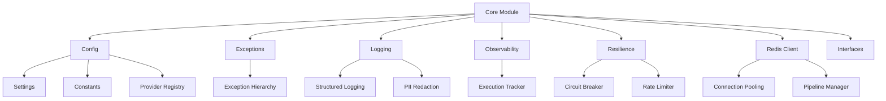

# Core Module

## Overview

The `core` module is the **foundation** of the SSE streaming microservice, providing essential infrastructure components used across all layers of the application.

## Architecture



## Module Structure

### [`config/`](./config/)
**Purpose**: Centralized configuration management

**Components**:
- **`settings.py`**: Pydantic-based type-safe configuration
- **`constants.py`**: System-wide constants and enums
- **`provider_registry.py`**: LLM provider registration

**Key Features**:
- Environment variable loading
- Type validation at startup
- Nested configuration objects
- Professional naming conventions

### [`exceptions/`](./exceptions/)
**Purpose**: Structured exception hierarchy

**Components**:
- **`base.py`**: All exception classes (base + specialized)
- **`__init__.py`**: Public exception exports

**Exception Categories**:
- Configuration errors
- Cache errors (Redis)
- Queue errors (messaging)
- Provider errors (LLM)
- Circuit breaker errors
- Rate limiting errors
- Streaming errors
- Validation errors
- Execution tracker errors

### [`logging/`](./logging/)
**Purpose**: Production-grade structured logging

**Components**:
- **`logger.py`**: structlog configuration with PII redaction

**Key Features**:
- JSON/console output formats
- Thread ID correlation
- PII redaction (emails, API keys, phone numbers)
- Stage-based logging

### [`observability/`](./observability/) ⭐
**Purpose**: Execution tracking and performance monitoring

**Components**:
- **`execution_tracker.py`**: Centralized execution time tracking
- **`README.md`**: Comprehensive documentation

**Key Features**:
- Automatic timing with context managers
- Nested stage/substage tracking
- Probabilistic sampling (10% default)
- Hash-based deterministic sampling
- Thread-safe operations
- Performance statistics (p50, p95, p99)

### [`resilience/`](./resilience/)
**Purpose**: Fault tolerance and reliability

**Components**:
- **`circuit_breaker.py`**: Distributed circuit breaker
- **`rate_limiter.py`**: Redis-backed rate limiting

**Key Features**:
- Circuit breaker pattern for LLM providers
- Token bucket rate limiting
- Local cache for performance
- Tiered limits (default/premium)

### [`redis.py`](./redis.py)
**Purpose**: Async Redis client with connection pooling

**Key Features**:
- Connection pooling (min 10, max 200)
- Auto-batching pipeline
- Health checks
- Execution tracking integration
- Professional stage naming

### [`interfaces.py`](./interfaces.py)
**Purpose**: Abstract interfaces for core components

**Components**:
- `MessageQueue`: Abstract message queue interface
- `QueueMessage`: Message dataclass

## Professional Naming Conventions

### Stage Identifiers
All stage identifiers follow the format: `{SEQUENCE}_{DESCRIPTIVE_NAME}`

**Examples**:
```python
# Main lifecycle
"0.0_INITIALIZATION"
"1.0_REQUEST_VALIDATION"
"2.0_CACHE_LOOKUP"
"2.1_L1_CACHE_LOOKUP"
"2.2_L2_CACHE_LOOKUP"

# Redis operations
"REDIS.1_CLIENT_INITIALIZATION"
"REDIS.2_CONNECTION_ESTABLISHMENT"
"REDIS.GET_OPERATION"

# Execution tracker
"ET.1_TRACKER_INITIALIZATION"
"ET.2_STAGE_TRACKING"
```

### File Naming
- ✅ **Descriptive**: `provider_registry.py` (not `bootstrap.py`)
- ✅ **Clear purpose**: `execution_tracker.py`
- ✅ **Consistent**: All lowercase with underscores

## Type Safety

The core module uses **modern Python typing** throughout:

```python
# Modern union syntax (Python 3.10+)
str | None
list[str]
dict[str, Any]

# Pydantic for runtime validation
from pydantic import Field, field_validator

# Literal types for enums
from typing import Literal
LOG_FORMAT: Literal["json", "console"]

# Generic types
from typing import Any, Callable
```

## Configuration Usage

```python
from src.core.config.settings import get_settings

settings = get_settings()

# Access nested settings
redis_host = settings.redis.REDIS_HOST
openai_key = settings.llm.OPENAI_API_KEY
log_level = settings.logging.LOG_LEVEL
```

## Exception Handling

```python
from src.core.exceptions import (
    CacheConnectionError,
    ProviderTimeoutError,
    RateLimitExceededError
)

try:
    await redis_client.connect()
except CacheConnectionError as e:
    logger.error(
        "Redis connection failed",
        thread_id=e.thread_id,
        details=e.details
    )
```

## Logging Usage

```python
from src.core.logging import get_logger, log_stage

logger = get_logger(__name__)

# Structured logging
logger.info(
    "Processing request",
    stage="1.0_REQUEST_VALIDATION",
    thread_id=thread_id,
    user_id=user_id
)

# Stage logging helper
log_stage(
    logger,
    "2.1_L1_CACHE_LOOKUP",
    "Cache hit",
    level="info",
    thread_id=thread_id,
    cache_key=key
)
```

## Execution Tracking Usage

```python
from src.core.observability.execution_tracker import get_tracker

tracker = get_tracker()

# Track a stage
with tracker.track_stage("2.0_CACHE_LOOKUP", "Cache Lookup", thread_id):
    # Track sub-stages
    with tracker.track_substage("2.1_L1_CACHE_LOOKUP", "L1 Cache"):
        result = l1_cache.get(key)

# Get summary
summary = tracker.get_execution_summary(thread_id)
print(f"Total: {summary['total_duration_ms']}ms")
```

## Best Practices

### 1. Use Descriptive Stage Names
❌ Bad: `stage="2.1"`  
✅ Good: `stage="2.1_L1_CACHE_LOOKUP"`

### 2. Always Provide Thread ID
```python
# For correlation across logs
logger.info("Event", thread_id=thread_id)
tracker.track_stage(..., thread_id=thread_id)
```

### 3. Use Structured Exceptions
```python
raise ProviderTimeoutError(
    "OpenAI request timed out",
    thread_id=thread_id,
    details={
        "provider": "openai",
        "timeout": 30,
        "retry_count": 3
    }
)
```

### 4. Clean Up Resources
```python
try:
    with tracker.track_stage(...):
        pass
finally:
    tracker.clear_thread_data(thread_id)
```

## Testing

```bash
# Run core layer tests
pytest tests/unit/core_layer/ -v

# With coverage
pytest tests/unit/core_layer/ --cov=src/core --cov-report=term-missing
```

## Dependencies

**Core Dependencies**:
- `pydantic` - Type-safe settings
- `pydantic-settings` - Environment variable loading
- `structlog` - Structured logging
- `redis` - Redis client
- `slowapi` - Rate limiting

**Type Checking**:
- Uses Python 3.10+ type hints
- Compatible with `mypy` and `pyright`

## Future Enhancements

- [ ] Add `CacheBackend` protocol for abstraction
- [ ] Create `interfaces/` directory structure
- [ ] Add `__repr__` to `SSEBaseError`
- [ ] Add `from_exception()` helper
- [ ] Split `exceptions/base.py` into separate files
- [ ] Add Mermaid diagrams to circuit breaker docs
- [ ] Performance benchmarking suite

---

**Author**: System Architect  
**Last Updated**: 2025-12-08  
**Test Coverage**: 100% (131/131 tests passing)  
**Related**: [`src/application`](../../application/), [`src/infrastructure`](../../infrastructure/)
