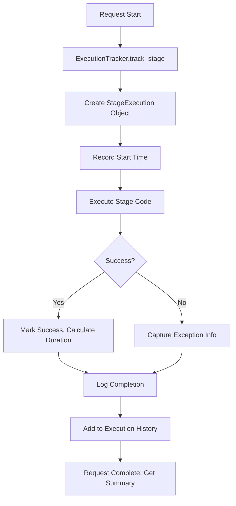

# Observability Module

## Overview

The `observability` module provides comprehensive execution tracking and performance monitoring capabilities for the SSE streaming microservice. It enables instant bottleneck identification, performance analysis, and detailed request flow tracing.

## Architecture



## Components

### ExecutionTracker

**File**: [`execution_tracker.py`](file:///d:/Generative%20AI%20Portfolio%20Projects/SSE/src/core/observability/execution_tracker.py)

**Purpose**: Centralized execution time tracking for all request stages with probabilistic sampling.

**Key Features**:
- **Automatic Timing**: Context managers for hands-off measurement
- **Nested Tracking**: Support for stages with sub-stages
- **Probabilistic Sampling**: 10% sampling rate to reduce memory by 90%
- **Thread-Safe**: Isolated tracking per thread ID
- **Exception Capture**: Automatic error tracking with stage correlation

**Core Classes**:

#### `StageExecution`
Immutable dataclass representing a single stage execution:
- `stage_id`: Identifier (e.g., `"ET.1_TRACKER_INITIALIZATION"`)
- `stage_name`: Human-readable name
- `duration_ms`: Execution time in milliseconds
- `success`: Whether stage completed successfully
- `error_type`, `error_message`: Exception details if failed
- `substages`: List of nested stage executions
- `metadata`: Additional context

#### `ExecutionTracker`
Singleton tracker managing all executions:

**Methods**:
- `track_stage(stage_id, stage_name, thread_id)`: Context manager for stage tracking
- `track_substage(substage_id, substage_name)`: Context manager for sub-stage tracking
- `should_track(thread_id, force)`: Deterministic hash-based sampling
- `get_execution_summary(thread_id)`: Retrieve complete execution history
- `get_stage_statistics(stage_id, limit)`: Calculate percentiles across requests
- `clear_thread_data(thread_id)`: Clean up after request completion

## Usage Examples

### Basic Stage Tracking

```python
from src.core.observability.execution_tracker import get_tracker

tracker = get_tracker()

# Track a top-level stage
with tracker.track_stage("2.0_CACHE_LOOKUP", "Cache Lookup", thread_id):
    result = perform_cache_lookup()
```

### Nested Sub-Stage Tracking

```python
with tracker.track_stage("2.0_CACHE_LOOKUP", "Cache Lookup", thread_id):
    # L1 cache sub-stage
    with tracker.track_substage("2.1_L1_CACHE_LOOKUP", "L1 Cache"):
        l1_result = l1_cache.get(key)
    
    if l1_result is None:
        # L2 cache sub-stage  
        with tracker.track_substage("2.2_L2_CACHE_LOOKUP", "L2 Redis Cache"):
            l2_result = redis_client.get(key)
```

### Force Tracking (Override Sampling)

```python
# Always track this request (for debugging)
with tracker.track_stage(
    "5.0_LLM_STREAMING",
    "LLM Streaming",
    thread_id,
    force_tracking=True  # Override sampling
):
    stream_response()
```

### Retrieving Execution Summary

```python
# Get complete execution history for a request
summary = tracker.get_execution_summary(thread_id)

print(f"Total Duration: {summary['total_duration_ms']}ms")
print(f"Stage Count: {summary['stage_count']}")
print(f"Success: {summary['success']}")

for stage in summary['stages']:
    print(f"  {stage['stage_id']}: {stage['duration_ms']}ms")
    for substage in stage['substages']:
        print(f"    {substage['stage_id']}: {substage['duration_ms']}ms")
```

### Stage Statistics (Percentiles)

```python
# Get performance statistics for cache lookups across all requests
stats = tracker.get_stage_statistics("2.1_L1_CACHE_LOOKUP", limit=100)

print(f"Executions: {stats['execution_count']}")
print(f"Average: {stats['avg_duration_ms']}ms")
print(f"P50 (Median): {stats['p50_duration_ms']}ms")
print(f"P95: {stats['p95_duration_ms']}ms")
print(f"P99: {stats['p99_duration_ms']}ms")
print(f"Success Rate: {stats['success_rate'] * 100}%")
```

## Sampling Strategy

### Why Sampling?

Tracking 100% of requests in a high-traffic system creates massive memory overhead:
- 10,000 requests/min × 10 stages × 200 bytes = **20 MB/min**
- Over 1 hour: **1.2 GB of memory**

With 10% sampling:
- 1,000 requests/min × 10 stages × 200 bytes = **2 MB/min**
- Over 1 hour: **120 MB of memory**
- **90% memory reduction** while maintaining statistical validity

### Hash-Based Deterministic Sampling

Instead of random sampling (which could track stage 1 but not stage 2 of the same request), we use **consistent hash-based sampling**:

1. Hash the `thread_id` using MD5
2. Convert to integer and modulo 100 (map to bucket 0-99)
3. Compare against sample rate threshold

**Key Property**: Same `thread_id` always maps to same bucket → consistent decision

**Example**:
```python
sample_rate = 0.1  # 10%

# Request A
thread_id = "req-abc-123"
hash_value = md5("req-abc-123") % 100 = 7
7 < 10 → TRACK ✓

# Request B  
thread_id = "req-def-456"
hash_value = md5("req-def-456") % 100 = 47
47 < 10 → DON'T TRACK ✗

# Request A again
thread_id = "req-abc-123"
hash_value = md5("req-abc-123") % 100 = 7  # Always 7!
7 < 10 → TRACK ✓ (consistent!)
```

### Forcing Tracking

Override sampling for debugging:
```python
# Always track this specific request
with tracker.track_stage(..., force_tracking=True):
    pass
```

## Performance Impact

| Operation | Overhead | Notes |
|-----------|----------|-------|
| `track_stage()` | < 0.1ms | Timestamp capture + dict ops |
| `track_substage()` | < 0.1ms | Inherited from track_stage |
| `should_track()` | ~2μs | MD5 hash + modulo |
| `get_execution_summary()` | ~1ms | Dict serialization |
| **Total per Request** | **< 1%** | Negligible compared to LLM latency |

## Integration with Other Modules

### Logging Integration

Stage tracking automatically logs execution events:
```python
# Logs:
# [DEBUG] Stage started: Cache Lookup | stage=2.0_CACHE_LOOKUP | thread_id=...
# [INFO] Stage completed: Cache Lookup | stage=2.0_CACHE_LOOKUP | duration_ms=5.23
```

### Metrics Integration

Future enhancement: Export to Prometheus/Grafana:
```prometheus
# Stage duration histogram
request_stage_duration_ms{stage="2.1_L1_CACHE_LOOKUP"} 5.2

# Stage success rate gauge
request_stage_success_rate{stage="2.1_L1_CACHE_LOOKUP"} 0.98
```

### Redis Integration

Example from `redis.py`:
```python
async with client.tracked_operation("REDIS.2_CONNECTION_ESTABLISHMENT", "Connect", thread_id):
    await client.connect()
```

## Configuration

**Environment Variables**:
```bash
# Enable/disable execution tracking
EXECUTION_TRACKING_ENABLED=true

# Sampling rate (0.0 - 1.0)
EXECUTION_TRACKING_SAMPLE_RATE=0.1  # 10%
```

**Settings**:
```python
from src.core.config.settings import get_settings

settings = get_settings()
tracking_enabled = settings.EXECUTION_TRACKING_ENABLED
sample_rate = settings.EXECUTION_TRACKING_SAMPLE_RATE
```

## Best Practices

### 1. Use Descriptive Stage Identifiers

❌ **Bad** (Cryptic):
```python
with tracker.track_stage("2.1", "Cache", thread_id):
    pass
```

✅ **Good** (Self-Documenting):
```python
with tracker.track_stage("2.1_L1_CACHE_LOOKUP", "L1 Cache Lookup", thread_id):
    pass
```

### 2. Always Clean Up Thread Data

```python
try:
    # Process request
    with tracker.track_stage(...):
        pass
finally:
    # Prevent memory leaks
    tracker.clear_thread_data(thread_id)
```

### 3. Use Force Tracking Sparingly

Only use `force_tracking=True` for debugging specific issues:
```python
# Debugging a slow request
if suspicious_request:
    force_tracking = True
else:
    force_tracking = False

with tracker.track_stage(..., force_tracking=force_tracking):
    pass
```

### 4. Nest Sub-Stages Properly

Sub-stages must be called WITHIN a parent stage:
```python
# ✅ Correct
with tracker.track_stage("2.0_CACHE_LOOKUP", ..., thread_id):
    with tracker.track_substage("2.1_L1_CACHE_LOOKUP", ...):
        pass

# ❌ Wrong - No parent stage
with tracker.track_substage("2.1_L1_CACHE_LOOKUP", ...):
    pass
```

## Troubleshooting

### Issue: No executions tracked

**Cause**: Sampling rate too low or tracking disabled

**Solution**:
```python
# Check configuration
settings = get_settings()
print(f"Enabled: {settings.EXECUTION_TRACKING_ENABLED}")
print(f"Sample Rate: {settings.EXECUTION_TRACKING_SAMPLE_RATE}")

# Force tracking for testing
with tracker.track_stage(..., force_tracking=True):
    pass
```

### Issue: Memory growing unbounded

**Cause**: Not clearing thread data after requests

**Solution**:
```python
# Always clean up in finally block
try:
    with tracker.track_stage(...):
        pass
finally:
    tracker.clear_thread_data(thread_id)
```

### Issue: Incomplete execution traces

**Cause**: Sampling decision inconsistency (shouldn't happen with hash-based sampling)

**Debug**:
```python
# Verify sampling is deterministic
thread_id = "test-123"
for i in range(10):
    result = tracker.should_track(thread_id)
    print(f"Attempt {i}: {result}")  # Should always be same result
```

## Future Enhancements

- **Distributed Tracing**: Integration with OpenTelemetry/Jaeger
- **Real-Time Dashboards**: Live execution monitoring
- **Anomaly Detection**: Automatic alerting for slow stages
- **Stage Comparison**: Compare execution profiles across deployments
- **Persisted Analytics**: Store summaries in time-series database

---

**Author**: System Architect  
**Last Updated**: 2025-12-08  
**Related**: [`src/core/logging`](../logging/), [`src/core/resilience`](../resilience/)
