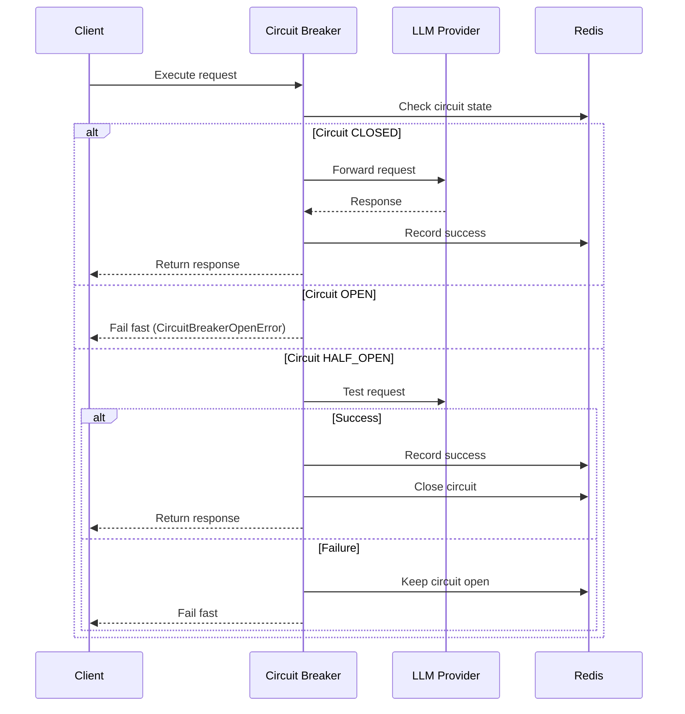
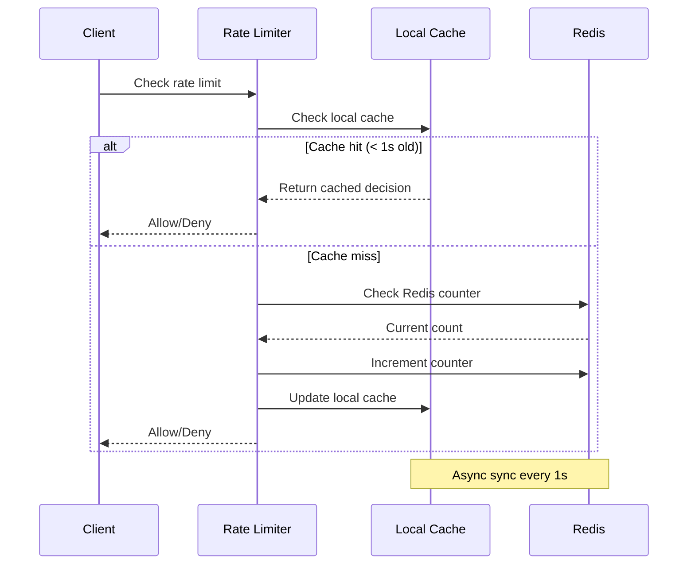

# Resilience Module

## Overview

The `resilience` module provides fault tolerance and reliability mechanisms for the SSE streaming microservice, implementing the **Circuit Breaker** and **Rate Limiting** patterns to prevent cascade failures and protect against overload.

## Components

### Circuit Breaker (`circuit_breaker.py`)

**Purpose**: Prevent cascade failures by failing fast when LLM providers are down

**Pattern**: Circuit Breaker with three states (CLOSED, OPEN, HALF_OPEN)

**Key Classes**:
- `DistributedCircuitBreaker`: Redis-backed circuit breaker
- `ResilientCall`: Wrapper for LLM calls with retry logic

**States**:
```
CLOSED (Normal) → OPEN (Failing Fast) → HALF_OPEN (Testing) → CLOSED
     ↑                                                              ↓
     └──────────────────────────────────────────────────────────────┘
```

**Configuration**:
```python
CB_FAILURE_THRESHOLD = 5      # Failures before opening
CB_RECOVERY_TIMEOUT = 60      # Seconds before half-open
CB_SUCCESS_THRESHOLD = 2      # Successes to close
CB_TIMEOUT = 30               # Request timeout
```

**Usage**:
```python
from src.core.resilience.circuit_breaker import ResilientCall

# Wrap LLM call with circuit breaker
resilient_call = ResilientCall(provider_name="openai")

async def call_llm():
    response = await provider.stream(query)
    return response

# Execute with fault tolerance
result = await resilient_call.execute(call_llm)
```

### Rate Limiter (`rate_limiter.py`)

**Purpose**: Protect against overload with token bucket rate limiting

**Pattern**: Distributed rate limiting with local caching

**Key Classes**:
- `LocalRateLimitCache`: In-memory cache for performance
- `RateLimitManager`: Tiered rate limits (default/premium)

**Tiers**:
- **Default**: 100 requests/minute
- **Premium**: 1000 requests/minute
- **Burst**: 20 additional requests

**Configuration**:
```python
RATE_LIMIT_DEFAULT = "100/minute"
RATE_LIMIT_PREMIUM = "1000/minute"
RATE_LIMIT_BURST = 20
```

**Usage**:
```python
from src.core.resilience.rate_limiter import get_rate_limit_manager

manager = get_rate_limit_manager()

# Check rate limit
is_allowed = await manager.check_rate_limit(
    key=f"user:{user_id}",
    limit="100/minute"
)

if not is_allowed:
    raise RateLimitExceededError("Rate limit exceeded")
```

## Architecture

### Circuit Breaker Flow



### Rate Limiting Flow



## Professional Naming

### Stage Identifiers

Circuit breaker stages use descriptive names:
```python
"CB_CIRCUIT_BREAKER"              # Main identifier
"CB.1_CHECK_CIRCUIT_STATE"        # Check if circuit is open
"CB.2_EXECUTE_REQUEST"            # Execute the actual request
"CB.3_RECORD_SUCCESS"             # Record successful execution
"CB.4_RECORD_FAILURE"             # Record failed execution
"CB.5_TRANSITION_STATE"           # Transition circuit state
```

Rate limiting stages:
```python
"3.0_RATE_LIMITING"               # Main stage
"3.1_CHECK_LOCAL_CACHE"           # Check local cache
"3.2_CHECK_REDIS_COUNTER"         # Check Redis counter
"3.3_INCREMENT_COUNTER"           # Increment request counter
"3.4_UPDATE_LOCAL_CACHE"          # Update local cache
```

## Best Practices

### 1. Circuit Breaker Configuration

```python
# Per-provider circuit breakers
openai_breaker = ResilientCall(provider_name="openai")
deepseek_breaker = ResilientCall(provider_name="deepseek")

# Adjust thresholds for flaky providers
settings.CB_FAILURE_THRESHOLD = 10  # More tolerant
settings.CB_RECOVERY_TIMEOUT = 30   # Faster recovery
```

### 2. Rate Limiting Strategy

```python
# Per-user limits
user_key = f"user:{user_id}"
await manager.check_rate_limit(user_key, "100/minute")

# Per-IP limits (fallback)
ip_key = f"ip:{client_ip}"
await manager.check_rate_limit(ip_key, "1000/minute")

# Premium users
if user.is_premium:
    await manager.check_rate_limit(user_key, "1000/minute")
```

### 3. Graceful Degradation

```python
try:
    result = await resilient_call.execute(call_llm)
except CircuitBreakerOpenError:
    # Fail fast - circuit is open
    logger.warning("Circuit breaker open", provider="openai")
    # Try fallback provider
    result = await fallback_provider.stream(query)
except RateLimitExceededError:
    # Rate limit exceeded
    logger.warning("Rate limit exceeded", user_id=user_id)
    # Return 429 with retry-after header
    raise
```

## Performance Impact

### Circuit Breaker
- **Overhead**: ~1ms per request (Redis state check)
- **Benefit**: Prevents cascade failures, saves resources
- **Trade-off**: Temporary unavailability during recovery

### Rate Limiter
- **Overhead**: ~0.5ms with local cache, ~2ms without
- **Benefit**: Protects against overload, ensures fair usage
- **Trade-off**: May reject legitimate requests during spikes

## Configuration

### Environment Variables

```bash
# Circuit Breaker
CB_FAILURE_THRESHOLD=5
CB_RECOVERY_TIMEOUT=60
CB_SUCCESS_THRESHOLD=2
CB_TIMEOUT=30

# Rate Limiting
RATE_LIMIT_DEFAULT="100/minute"
RATE_LIMIT_PREMIUM="1000/minute"
RATE_LIMIT_BURST=20
RATE_LIMIT_LOCAL_CACHE_ENABLED=true
RATE_LIMIT_LOCAL_SYNC_INTERVAL=1
```

### Programmatic Configuration

```python
from src.core.config.settings import get_settings

settings = get_settings()

# Circuit breaker
cb_settings = settings.circuit_breaker
print(f"Failure threshold: {cb_settings.CB_FAILURE_THRESHOLD}")

# Rate limiting
rl_settings = settings.rate_limit
print(f"Default limit: {rl_settings.RATE_LIMIT_DEFAULT}")
```

## Testing

```bash
# Run resilience tests
pytest tests/unit/core_layer/test_circuit_breaker*.py -v
pytest tests/unit/infrastructure_layer/test_rate_limiter*.py -v

# Test circuit breaker states
pytest tests/unit/core_layer/test_circuit_breaker.py::TestCircuitBreakerStates -v

# Test rate limiting
pytest tests/unit/infrastructure_layer/test_rate_limiter.py::TestRateLimiting -v
```

## Monitoring

### Circuit Breaker Metrics

```python
# Get circuit breaker state
state = await breaker.get_state()
print(f"Circuit state: {state}")  # CLOSED, OPEN, or HALF_OPEN

# Get failure count
failures = await breaker.get_failure_count()
print(f"Failures: {failures}")
```

### Rate Limiting Metrics

```python
# Get current rate limit status
status = await manager.get_status(key=f"user:{user_id}")
print(f"Requests: {status['current']}/{status['limit']}")
print(f"Reset in: {status['reset_in']}s")
```

## Troubleshooting

### Circuit Breaker Stuck Open

**Symptom**: Circuit remains open even after provider recovers

**Cause**: Recovery timeout too long or success threshold too high

**Solution**:
```python
# Reduce recovery timeout
settings.CB_RECOVERY_TIMEOUT = 30  # From 60

# Reduce success threshold
settings.CB_SUCCESS_THRESHOLD = 1  # From 2

# Manually reset circuit (admin endpoint)
await breaker.reset()
```

### Rate Limiting Too Aggressive

**Symptom**: Legitimate users getting rate limited

**Cause**: Limits too low or burst allowance insufficient

**Solution**:
```python
# Increase limits
settings.RATE_LIMIT_DEFAULT = "200/minute"  # From 100
settings.RATE_LIMIT_BURST = 40  # From 20

# Enable local cache for better performance
settings.RATE_LIMIT_LOCAL_CACHE_ENABLED = True
```

## Future Enhancements

- [ ] Adaptive circuit breaker (dynamic thresholds)
- [ ] Sliding window rate limiting
- [ ] Distributed rate limiting across instances
- [ ] Circuit breaker dashboard
- [ ] Rate limit analytics
- [ ] Custom rate limit tiers
- [ ] Bulkhead pattern implementation

---

**Author**: System Architect  
**Last Updated**: 2025-12-08  
**Related**: [`src/core/observability`](../observability/), [`src/core/config`](../config/)
