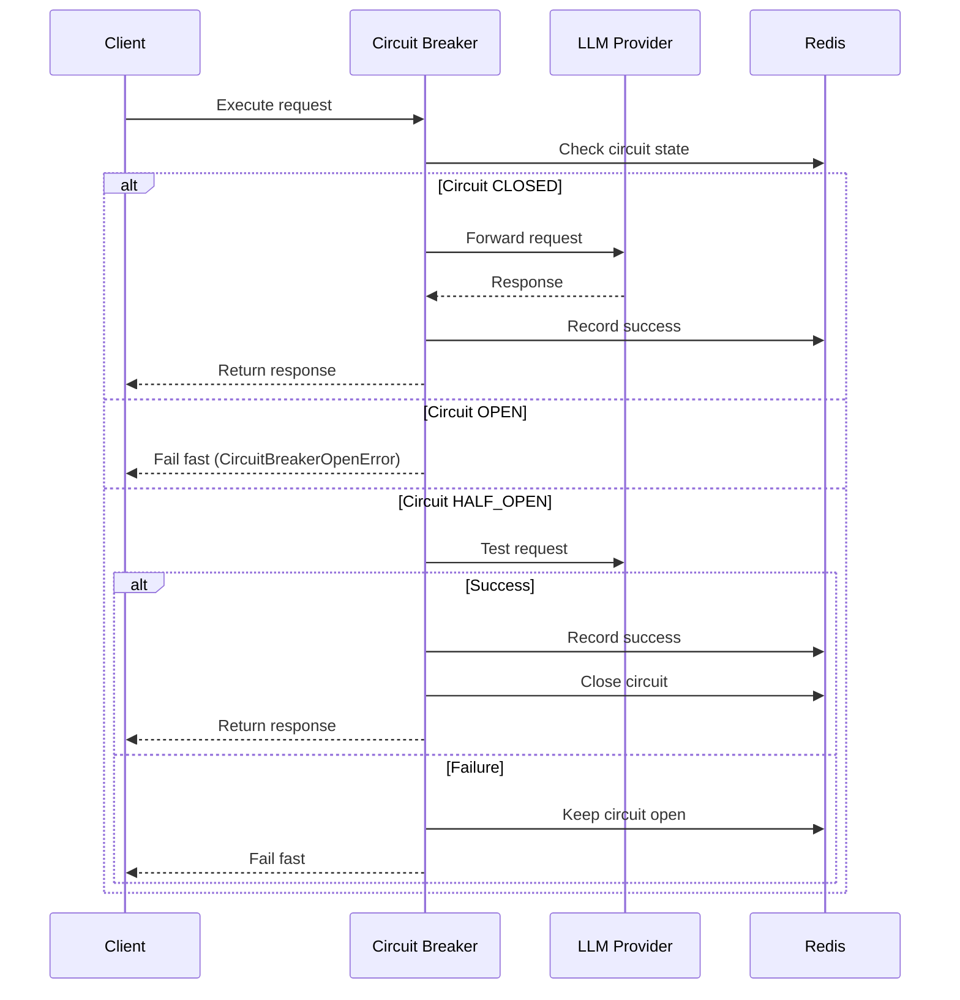
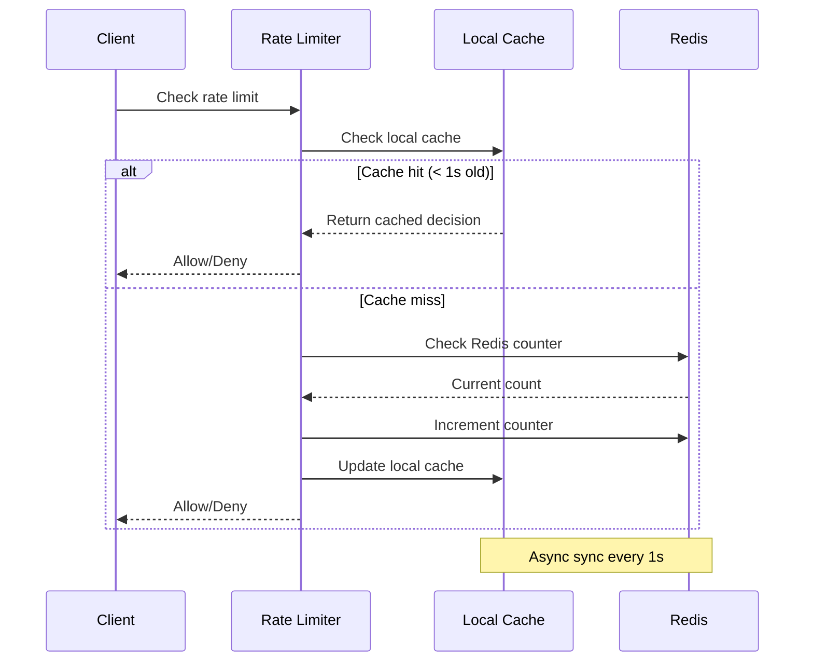

# Resilience Module

## Overview

The `resilience` module provides fault tolerance and reliability mechanisms for the SSE streaming microservice, implementing the **Connection Pool Management**, **Circuit Breaker**, and **Rate Limiting** patterns to prevent cascade failures, enforce backpressure, and protect against overload.

## Components

### Connection Pool Manager (`connection_pool_manager.py`)

**Purpose**: Enforce connection limits and provide backpressure to prevent server overload during high-concurrency streaming workloads

**Pattern**: Distributed connection pool with per-user limits and graceful degradation

**Key Classes**:
- `ConnectionPoolManager`: Centralized pool manager with Redis-backed distributed coordination
- `ConnectionState`: Health state enum (HEALTHY, DEGRADED, CRITICAL, EXHAUSTED)

**Critical Architecture**:

The Connection Pool Manager is a **foundational component** that protects the system from overload by enforcing strict connection limits. Unlike traditional connection pools that manage database connections, this pool manages **active SSE streaming connections** to prevent resource exhaustion.

**Why This Matters**:
- **Prevents Server Collapse**: Without connection limits, a surge of requests can exhaust memory, CPU, and network resources
- **Fair Resource Allocation**: Per-user limits prevent a single user from monopolizing server capacity
- **Graceful Degradation**: Returns proper HTTP 429/503 errors instead of crashing or timing out
- **Distributed Coordination**: Works across multiple FastAPI instances using Redis for state synchronization

**Connection Lifecycle**:
```
Client Request → Acquire Connection (CP.1) → Process Request → Release Connection (CP.4)
                      ↓                                              ↑
                Check Limits                                   Decrement Counters
                (Global + Per-User)                           (Global + Per-User)
```

**States**:
```
HEALTHY (0-70% capacity)
   ↓
DEGRADED (70-90% capacity) - Warning logs, monitoring alerts
   ↓
CRITICAL (90-100% capacity) - High alert, approaching limit
   ↓
EXHAUSTED (100% capacity) - Reject new connections with 503
```

**Configuration**:
```python
MAX_CONCURRENT_CONNECTIONS = 10000    # Global limit across all users
MAX_CONNECTIONS_PER_USER = 3          # Per-user limit
CONNECTION_POOL_DEGRADED_THRESHOLD = 0.7   # 70% capacity
CONNECTION_POOL_CRITICAL_THRESHOLD = 0.9   # 90% capacity
```

**Usage**:
```python
from src.core.resilience.connection_pool_manager import get_connection_pool_manager

pool_manager = get_connection_pool_manager()

# Acquire connection before processing request
try:
    await pool_manager.acquire_connection(user_id="user-123", thread_id="req-abc")
    
    # Process streaming request
    async for chunk in stream_llm_response():
        yield chunk
        
finally:
    # Always release connection in finally block
    await pool_manager.release_connection(thread_id="req-abc", user_id="user-123")
```

**Error Responses**:
- **503 Service Unavailable**: Global pool exhausted (all 10,000 slots used)
  ```json
  {
    "error": "service_unavailable",
    "message": "Server at capacity. Please try again later.",
    "details": {"current": 10000, "max": 10000}
  }
  ```
  
- **429 Too Many Requests**: User exceeded per-user limit (3 concurrent connections)
  ```json
  {
    "error": "too_many_connections",
    "message": "Too many concurrent connections. Maximum 3 allowed.",
    "details": {"user_id": "user-123", "current": 3, "limit": 3}
  }
  ```

**Distributed Coordination**:

The pool uses Redis for distributed state management across multiple FastAPI instances:

```python
# Redis keys for distributed tracking
connection_pool:total                    # Global connection count
connection_pool:user:{user_id}           # Per-user connection count
connection_pool:connections              # Set of active thread IDs
```

**Atomic Operations**:
- `INCR connection_pool:total` - Increment global counter
- `INCR connection_pool:user:{user_id}` - Increment user counter
- `SADD connection_pool:connections {thread_id}` - Track active connection
- `DECR` and `SREM` for release operations

**Local Fallback**:

If Redis is unavailable, the pool falls back to local in-memory counters:
- Maintains eventual consistency when Redis recovers
- Prevents complete service outage during Redis downtime
- Logs warnings when using fallback mode

**Monitoring and Observability**:

```python
# Get pool statistics
stats = await pool_manager.get_stats()
# Returns:
{
    "total_connections": 150,
    "max_connections": 10000,
    "utilization_percent": 1.5,
    "state": "healthy",
    "degraded_threshold": 7000,
    "critical_threshold": 9000,
    "redis_enabled": true
}

# Get current pool state
state = await pool_manager.get_pool_state()
# Returns: ConnectionState.HEALTHY | DEGRADED | CRITICAL | EXHAUSTED
```

**Stage-Based Logging**:

All operations are logged with stage identifiers for precise tracking:

```json
// CP.1: Connection acquisition attempt
{
  "stage": "CP.1",
  "user_id": "user-123",
  "thread_id": "req-abc",
  "event": "Attempting to acquire connection"
}

// CP.1.4: Successful acquisition
{
  "stage": "CP.1.4",
  "thread_id": "req-abc",
  "user_id": "user-123",
  "total_connections": 151,
  "user_connections": 2,
  "utilization_percent": 1.51,
  "pool_state": "healthy",
  "event": "Connection acquired from pool"
}

// CP.4: Connection release
{
  "stage": "CP.4",
  "thread_id": "req-abc",
  "user_id": "user-123",
  "event": "Releasing connection"
}

// CP.4.1: Release completion
{
  "stage": "CP.4.1",
  "thread_id": "req-abc",
  "total_connections": 150,
  "utilization_percent": 1.5,
  "pool_state": "healthy",
  "event": "Connection released"
}
```

**Performance Impact**:
- **Overhead**: ~0.5ms per request (Redis INCR/DECR operations)
- **Benefit**: Prevents server collapse, enables predictable capacity planning
- **Trade-off**: Legitimate requests may be rejected during extreme load

**Best Practices**:

1. **Always Use Finally Blocks**:
```python
try:
    await pool_manager.acquire_connection(user_id, thread_id)
    # Process request
finally:
    await pool_manager.release_connection(thread_id, user_id)
```

2. **Monitor Pool Utilization**:
```python
# Set up alerts for DEGRADED state (70% capacity)
if state == ConnectionState.DEGRADED:
    send_alert("Connection pool at 70% capacity")
    
# Critical alert for CRITICAL state (90% capacity)
if state == ConnectionState.CRITICAL:
    send_critical_alert("Connection pool at 90% capacity - scale immediately")
```

3. **Tune Limits Based on Load**:
```python
# For high-traffic scenarios
MAX_CONCURRENT_CONNECTIONS = 20000
MAX_CONNECTIONS_PER_USER = 5

# For resource-constrained environments
MAX_CONCURRENT_CONNECTIONS = 5000
MAX_CONNECTIONS_PER_USER = 2
```

**Integration with FastAPI**:

The connection pool is integrated at the route handler level:

```python
@router.post("/stream")
async def create_stream(
    request: Request,
    body: StreamRequestModel,
    user_id: UserIdDep
):
    thread_id = request.headers.get("X-Thread-ID") or str(uuid.uuid4())
    pool_manager = get_connection_pool_manager()
    
    try:
        # Acquire connection before processing
        await pool_manager.acquire_connection(user_id=user_id, thread_id=thread_id)
    except ConnectionPoolExhaustedError as e:
        return JSONResponse(
            status_code=503,
            content={"error": "service_unavailable", "message": str(e)},
            headers={"X-Thread-ID": thread_id}
        )
    except UserConnectionLimitError as e:
        return JSONResponse(
            status_code=429,
            content={"error": "too_many_connections", "message": str(e)},
            headers={"X-Thread-ID": thread_id}
        )
    
    try:
        # Process streaming request
        return StreamingResponse(event_generator(), media_type="text/event-stream")
    finally:
        # Always release connection
        await pool_manager.release_connection(thread_id=thread_id, user_id=user_id)
```

---

### Circuit Breaker (`circuit_breaker.py`)

**Purpose**: Prevent cascade failures by failing fast when LLM providers are down

**Pattern**: Circuit Breaker with three states (CLOSED, OPEN, HALF_OPEN)

**Key Classes**:
- `DistributedCircuitBreaker`: Redis-backed circuit breaker
- `ResilientCall`: Wrapper for LLM calls with retry logic

**States**:
```
CLOSED (Normal) → OPEN (Failing Fast) → HALF_OPEN (Testing) → CLOSED
     ↑                                                              ↓
     └──────────────────────────────────────────────────────────────┘
```

**Configuration**:
```python
CB_FAILURE_THRESHOLD = 5      # Failures before opening
CB_RECOVERY_TIMEOUT = 60      # Seconds before half-open
CB_SUCCESS_THRESHOLD = 2      # Successes to close
CB_TIMEOUT = 30               # Request timeout
```

**Usage**:
```python
from src.core.resilience.circuit_breaker import ResilientCall

# Wrap LLM call with circuit breaker
resilient_call = ResilientCall(provider_name="openai")

async def call_llm():
    response = await provider.stream(query)
    return response

# Execute with fault tolerance
result = await resilient_call.execute(call_llm)
```

### Rate Limiter (`rate_limiter.py`)

**Purpose**: Protect against overload with token bucket rate limiting

**Pattern**: Distributed rate limiting with local caching

**Key Classes**:
- `LocalRateLimitCache`: In-memory cache for performance
- `RateLimitManager`: Tiered rate limits (default/premium)

**Tiers**:
- **Default**: 100 requests/minute
- **Premium**: 1000 requests/minute
- **Burst**: 20 additional requests

**Configuration**:
```python
RATE_LIMIT_DEFAULT = "100/minute"
RATE_LIMIT_PREMIUM = "1000/minute"
RATE_LIMIT_BURST = 20
```

**Usage**:
```python
from src.core.resilience.rate_limiter import get_rate_limit_manager

manager = get_rate_limit_manager()

# Check rate limit
is_allowed = await manager.check_rate_limit(
    key=f"user:{user_id}",
    limit="100/minute"
)

if not is_allowed:
    raise RateLimitExceededError("Rate limit exceeded")
```

## Architecture

### Circuit Breaker Flow



### Rate Limiting Flow



## Professional Naming

### Stage Identifiers

Circuit breaker stages use descriptive names:
```python
"CB_CIRCUIT_BREAKER"              # Main identifier
"CB.1_CHECK_CIRCUIT_STATE"        # Check if circuit is open
"CB.2_EXECUTE_REQUEST"            # Execute the actual request
"CB.3_RECORD_SUCCESS"             # Record successful execution
"CB.4_RECORD_FAILURE"             # Record failed execution
"CB.5_TRANSITION_STATE"           # Transition circuit state
```

Rate limiting stages:
```python
"3.0_RATE_LIMITING"               # Main stage
"3.1_CHECK_LOCAL_CACHE"           # Check local cache
"3.2_CHECK_REDIS_COUNTER"         # Check Redis counter
"3.3_INCREMENT_COUNTER"           # Increment request counter
"3.4_UPDATE_LOCAL_CACHE"          # Update local cache
```

## Best Practices

### 1. Circuit Breaker Configuration

```python
# Per-provider circuit breakers
openai_breaker = ResilientCall(provider_name="openai")
deepseek_breaker = ResilientCall(provider_name="deepseek")

# Adjust thresholds for flaky providers
settings.CB_FAILURE_THRESHOLD = 10  # More tolerant
settings.CB_RECOVERY_TIMEOUT = 30   # Faster recovery
```

### 2. Rate Limiting Strategy

```python
# Per-user limits
user_key = f"user:{user_id}"
await manager.check_rate_limit(user_key, "100/minute")

# Per-IP limits (fallback)
ip_key = f"ip:{client_ip}"
await manager.check_rate_limit(ip_key, "1000/minute")

# Premium users
if user.is_premium:
    await manager.check_rate_limit(user_key, "1000/minute")
```

### 3. Graceful Degradation

```python
try:
    result = await resilient_call.execute(call_llm)
except CircuitBreakerOpenError:
    # Fail fast - circuit is open
    logger.warning("Circuit breaker open", provider="openai")
    # Try fallback provider
    result = await fallback_provider.stream(query)
except RateLimitExceededError:
    # Rate limit exceeded
    logger.warning("Rate limit exceeded", user_id=user_id)
    # Return 429 with retry-after header
    raise
```

## Performance Impact

### Circuit Breaker
- **Overhead**: ~1ms per request (Redis state check)
- **Benefit**: Prevents cascade failures, saves resources
- **Trade-off**: Temporary unavailability during recovery

### Rate Limiter
- **Overhead**: ~0.5ms with local cache, ~2ms without
- **Benefit**: Protects against overload, ensures fair usage
- **Trade-off**: May reject legitimate requests during spikes

## Configuration

### Environment Variables

```bash
# Circuit Breaker
CB_FAILURE_THRESHOLD=5
CB_RECOVERY_TIMEOUT=60
CB_SUCCESS_THRESHOLD=2
CB_TIMEOUT=30

# Rate Limiting
RATE_LIMIT_DEFAULT="100/minute"
RATE_LIMIT_PREMIUM="1000/minute"
RATE_LIMIT_BURST=20
RATE_LIMIT_LOCAL_CACHE_ENABLED=true
RATE_LIMIT_LOCAL_SYNC_INTERVAL=1
```

### Programmatic Configuration

```python
from src.core.config.settings import get_settings

settings = get_settings()

# Circuit breaker
cb_settings = settings.circuit_breaker
print(f"Failure threshold: {cb_settings.CB_FAILURE_THRESHOLD}")

# Rate limiting
rl_settings = settings.rate_limit
print(f"Default limit: {rl_settings.RATE_LIMIT_DEFAULT}")
```

## Testing

```bash
# Run resilience tests
pytest tests/unit/core_layer/test_circuit_breaker*.py -v
pytest tests/unit/infrastructure_layer/test_rate_limiter*.py -v

# Test circuit breaker states
pytest tests/unit/core_layer/test_circuit_breaker.py::TestCircuitBreakerStates -v

# Test rate limiting
pytest tests/unit/infrastructure_layer/test_rate_limiter.py::TestRateLimiting -v
```

## Monitoring

### Circuit Breaker Metrics

```python
# Get circuit breaker state
state = await breaker.get_state()
print(f"Circuit state: {state}")  # CLOSED, OPEN, or HALF_OPEN

# Get failure count
failures = await breaker.get_failure_count()
print(f"Failures: {failures}")
```

### Rate Limiting Metrics

```python
# Get current rate limit status
status = await manager.get_status(key=f"user:{user_id}")
print(f"Requests: {status['current']}/{status['limit']}")
print(f"Reset in: {status['reset_in']}s")
```

## Troubleshooting

### Circuit Breaker Stuck Open

**Symptom**: Circuit remains open even after provider recovers

**Cause**: Recovery timeout too long or success threshold too high

**Solution**:
```python
# Reduce recovery timeout
settings.CB_RECOVERY_TIMEOUT = 30  # From 60

# Reduce success threshold
settings.CB_SUCCESS_THRESHOLD = 1  # From 2

# Manually reset circuit (admin endpoint)
await breaker.reset()
```

### Rate Limiting Too Aggressive

**Symptom**: Legitimate users getting rate limited

**Cause**: Limits too low or burst allowance insufficient

**Solution**:
```python
# Increase limits
settings.RATE_LIMIT_DEFAULT = "200/minute"  # From 100
settings.RATE_LIMIT_BURST = 40  # From 20

# Enable local cache for better performance
settings.RATE_LIMIT_LOCAL_CACHE_ENABLED = True
```

## Future Enhancements

- [ ] Adaptive circuit breaker (dynamic thresholds)
- [ ] Sliding window rate limiting
- [ ] Distributed rate limiting across instances
- [ ] Circuit breaker dashboard
- [ ] Rate limit analytics
- [ ] Custom rate limit tiers
- [ ] Bulkhead pattern implementation

---

**Author**: System Architect  
**Last Updated**: 2025-12-08  
**Related**: [`src/core/observability`](../observability/), [`src/core/config`](../config/)
