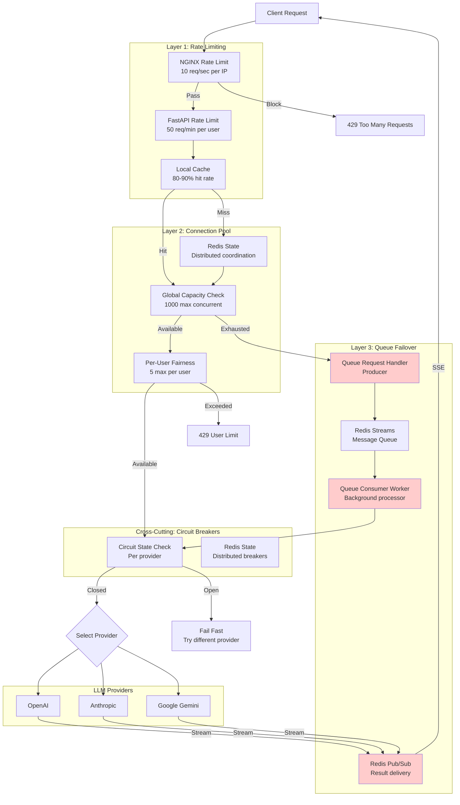

# Resilience Architecture Overview

## Introduction

The SSE Streaming Service implements a **sophisticated multi-layered resilience architecture** designed to handle the unique challenges of streaming LLM responses at scale. This architecture ensures high availability, graceful degradation, and excellent user experience even under extreme conditions: traffic spikes, provider outages, resource exhaustion, and malicious attacks.

### The Core Problem

Streaming LLM services face a perfect storm of challenges:

**External Dependencies**:
- Multiple LLM providers (OpenAI, Anthropic, Google) with varying reliability
- Provider outages, rate limiting, and unpredictable latency
- No SLA guarantees from third-party APIs

**Resource Constraints**:
- Finite memory, CPU, and network bandwidth
- Limited concurrent connections to LLM providers
- Database connection pool limits

**Traffic Patterns**:
- Unpredictable bursts (viral content, marketing campaigns)
- Potential abuse (DDoS attacks, scraping bots)
- Legitimate high-demand periods

**User Expectations**:
- Real-time streaming responses (no buffering delays)
- High availability (99.9%+ uptime)
- Fair access during peak load

**The Challenge**: How to deliver reliable, real-time streaming to thousands of concurrent users while depending on unreliable external providers and managing finite resources?

### The Solution: Defense in Depth

This system employs a **four-layer defense strategy** where each layer addresses a specific failure mode:

```
┌─────────────────────────────────────────────────────────────┐
│ Layer 1: Rate Limiting (NGINX + FastAPI)                   │
│ Problem: API abuse, DDoS attacks                            │
│ Solution: Block excessive requests before they consume      │
│           resources                                          │
└─────────────────────────────────────────────────────────────┘
                          ↓
┌─────────────────────────────────────────────────────────────┐
│ Layer 2: Connection Pooling                                 │
│ Problem: Resource exhaustion from unbounded concurrency     │
│ Solution: Limit concurrent streams to prevent memory/CPU    │
│           saturation                                         │
└─────────────────────────────────────────────────────────────┘
                          ↓
┌─────────────────────────────────────────────────────────────┐
│ Layer 3: Queue Failover (THE HEART)                        │
│ Problem: Connection pool exhaustion during traffic spikes   │
│ Solution: Queue requests for async processing instead of    │
│           rejecting them                                     │
└─────────────────────────────────────────────────────────────┘
                          ↓
┌─────────────────────────────────────────────────────────────┐
│ Cross-Cutting: Circuit Breakers                             │
│ Problem: Cascading failures from provider outages           │
│ Solution: Fail-fast when providers are down, probe for      │
│           recovery                                           │
└─────────────────────────────────────────────────────────────┘
```

**Key Innovation**: Unlike traditional architectures that reject requests when capacity is reached (HTTP 429), this system **queues requests for asynchronous processing** while maintaining the streaming user experience through Redis Pub/Sub. This transforms capacity limits from hard failures into graceful degradation with slightly increased latency.

---

## Architecture Diagram

### Complete Request Flow



---

## Layer-by-Layer Breakdown

### Layer 1: Rate Limiting

**Purpose**: First line of defense against abuse and resource exhaustion

**Components**:
- **NGINX Layer**: Network-level IP-based limiting (10 req/sec)
- **FastAPI Layer**: Application-level user-aware limiting (50 req/min)
- **Local Cache**: In-memory optimization (80-90% Redis reduction)

**What It Protects Against**:
- DDoS attacks
- Scraping bots
- Misconfigured clients
- Single user monopolization

**Failure Mode Handled**:
```
Without: 10,000 requests/sec → System overwhelmed → Crash
With: 10,000 requests/sec → 9,500 blocked → 500 processed → Stable
```

**Key Metrics**:
- NGINX check: < 0.01ms
- FastAPI check (cached): < 0.1ms
- FastAPI check (Redis): 1-2ms

**Documentation**: [01_rate_limiting.md](./01_rate_limiting.md)

---

### Layer 2: Connection Pooling

**Purpose**: Manage finite resources and ensure fair access

**Components**:
- **Global Capacity Limit**: 1000 max concurrent connections
- **Per-User Fairness Limit**: 5 max concurrent per user
- **Redis Coordination**: Distributed state across instances

**What It Protects Against**:
- Memory exhaustion (OOM crashes)
- CPU saturation
- Provider API limits
- Resource monopolization

**Failure Mode Handled**:
```
Without: Unlimited connections → Memory exhausted → OOM crash
With: 1000 connection limit → Controlled resource usage → Stable
```

**Health States**:
- HEALTHY (0-70%): Normal operation
- DEGRADED (70-90%): High load warning
- CRITICAL (90-100%): Scale immediately
- EXHAUSTED (100%): Triggers Layer 3

**Key Metrics**:
- Acquisition latency: 1-2ms (Redis)
- Resource per connection: ~50 bytes (Redis) + ~100 bytes (local)

**Documentation**: [02_connection_pooling.md](./02_connection_pooling.md)

---

### Layer 3: Queue Failover (THE HEART)

**Purpose**: Transform capacity limits from hard failures into graceful degradation

**Components**:
- **Queue Request Handler**: Producer that enqueues requests
- **Redis Streams**: Message queue for request storage
- **Queue Consumer Worker**: Background processor
- **Redis Pub/Sub**: Real-time result delivery

**What It Protects Against**:
- Traffic spikes exceeding capacity
- Temporary resource exhaustion
- User-facing 429 errors during peak load

**Failure Mode Handled**:
```
Traditional Approach:
  Pool full → 429 error → User sees failure → Bad experience

Queue Failover Approach:
  Pool full → Queue request → Process async → Stream via Pub/Sub → User sees response (slightly slower)
```

**The Innovation**:
- **Zero 429 Errors**: Requests never rejected due to capacity
- **Streaming Maintained**: Client still receives SSE stream
- **Transparent Failover**: User doesn't know they were queued
- **Only Trade-off**: Slightly higher latency (P99: +2-5 seconds)

**Architecture Highlights**:
1. **Race Condition Prevention**: Subscribe to Pub/Sub before enqueuing
2. **Server-Side Blocking**: Efficient waiting (no polling)
3. **Heartbeat Mechanism**: Keep connection alive during processing
4. **Batch Optimization**: Reduce Redis Pub/Sub overhead by 5x

**Key Metrics**:
- Direct path latency: P50 2-5s, P99 8-15s
- Queue path latency: P50 4-10s, P99 10-20s
- Additional overhead: ~2-5s at P99

**Documentation**: [04_queue_failover.md](./04_queue_failover.md)

---

### Cross-Cutting: Circuit Breakers

**Purpose**: Protect against cascading failures from provider outages

**Components**:
- **Distributed Circuit Breaker**: Redis-backed state machine
- **Resilient Call Wrapper**: Orchestrates circuit breaking + retries
- **Per-Provider Circuits**: Independent breakers for each LLM provider

**What It Protects Against**:
- Provider outages
- High latency providers
- Cascading failures
- Thundering herd on recovery

**Failure Mode Handled**:
```
Without Circuit Breaker:
  Provider down → 1000 requests timeout (30s each) → 30,000s wasted → Pool exhausted

With Circuit Breaker:
  Provider down → 5 failures → Circuit opens → Remaining 995 requests fail fast (1ms) → Pool healthy
```

**State Machine**:
- **CLOSED**: Normal operation, track failures
- **OPEN**: Fail-fast mode, reject immediately
- **HALF_OPEN**: Recovery probe, test provider

**Key Metrics**:
- Fail-fast rejection: < 0.1ms (vs 30s timeout)
- Speed improvement: 90,000x faster failure
- Recovery probe: After 30s timeout

**Documentation**: [03_circuit_breaking.md](./03_circuit_breaking.md)

---

## Request Flow Scenarios

### Scenario 1: Normal Operation (Happy Path)

```
1. Client sends request
2. NGINX rate limit: ✓ Pass (under 10 req/sec)
3. FastAPI rate limit: ✓ Pass (under 50 req/min)
4. Connection pool: ✓ Acquire slot (753/1000 used)
5. Circuit breaker: ✓ Closed (OpenAI healthy)
6. LLM provider: ✓ Stream response
7. Client: Receives SSE stream

Total latency: P50 2-5s, P99 8-15s
```

### Scenario 2: High Load (Pool Near Capacity)

```
1. Client sends request
2. NGINX rate limit: ✓ Pass
3. FastAPI rate limit: ✓ Pass
4. Connection pool: ✓ Acquire slot (950/1000 used)
   - Pool state: CRITICAL
   - Alert: "Scale immediately"
5. Circuit breaker: ✓ Closed
6. LLM provider: ✓ Stream response
7. Client: Receives SSE stream

Total latency: P50 3-6s, P99 10-18s (slightly higher due to contention)
```

### Scenario 3: Pool Exhausted (Queue Failover Activated)

```
1. Client sends request
2. NGINX rate limit: ✓ Pass
3. FastAPI rate limit: ✓ Pass
4. Connection pool: ✗ Exhausted (1000/1000 used)
   - Raises: ConnectionPoolExhaustedError
5. Queue failover: ✓ Activate
   a. Subscribe to Redis Pub/Sub channel
   b. Enqueue request to Redis Streams
   c. Send heartbeat to keep connection alive
6. Background worker:
   a. Consume from queue
   b. Acquire connection slot (when available)
   c. Call LLM provider
   d. Publish chunks to Pub/Sub
7. Queue handler: Receive chunks from Pub/Sub
8. Client: Receives SSE stream

Total latency: P50 4-10s, P99 10-20s (additional 2-5s overhead)
User experience: Identical to normal path, just slightly slower
```

### Scenario 4: Provider Outage (Circuit Breaker Activated)

```
1. Client sends request
2. NGINX rate limit: ✓ Pass
3. FastAPI rate limit: ✓ Pass
4. Connection pool: ✓ Acquire slot
5. Circuit breaker: ✗ OPEN (OpenAI down)
   - Raises: CircuitBreakerOpenError
6. Fallback logic: Try different provider
   a. Check Anthropic circuit: ✓ CLOSED
   b. Call Anthropic instead
7. LLM provider: ✓ Stream response (from Anthropic)
8. Client: Receives SSE stream

Total latency: P50 2-5s, P99 8-15s (no degradation, transparent fallback)
Benefit: Avoided 30s timeout, failed fast in 1ms
```

### Scenario 5: Rate Limit Exceeded

```
1. Client sends request (51st in 1 minute)
2. NGINX rate limit: ✓ Pass (under 10/sec)
3. FastAPI rate limit: ✗ Exceeded (50/min limit)
   - Response: 429 Too Many Requests
   - Headers: Retry-After: 60

Client: Receives immediate 429, can retry after 60s
Benefit: Prevented request from consuming resources
```

### Scenario 6: User Monopolization Attempt

```
1. User has 5 active streams
2. User sends 6th request
3. NGINX rate limit: ✓ Pass
4. FastAPI rate limit: ✓ Pass
5. Connection pool:
   a. Global check: ✓ Pass (800/1000)
   b. User check: ✗ Exceeded (5/5)
   - Raises: UserConnectionLimitError
   - Response: 429 User Limit

Client: Receives 429, must wait for existing streams to complete
Benefit: Prevented single user from monopolizing pool
```

---

## Failure Scenario Analysis

### Complete Provider Outage

**Scenario**: OpenAI experiences total outage

**System Response**:
1. First 5 requests to OpenAI fail
2. Circuit breaker opens after 5 failures
3. All subsequent requests fail fast (< 1ms)
4. Application tries alternative providers (Anthropic, Google)
5. If all providers down:
   - Queue failover still active
   - Requests queued, waiting for any provider to recover
   - Circuit breakers probe for recovery every 30s

**User Impact**:
- Transparent fallback to working providers
- If all down: Slightly higher latency, but no failures
- No 429 errors, no service unavailability

**Recovery**:
1. After 30s, circuit allows probe request
2. If probe succeeds: Circuit closes, normal operation resumes
3. If probe fails: Circuit stays open, retry after another 30s

### Traffic Spike (10x Normal Load)

**Scenario**: Viral content drives 10,000 concurrent requests (normal: 1,000)

**System Response**:
1. **Layer 1 (Rate Limiting)**:
   - NGINX blocks excessive requests per IP
   - FastAPI blocks excessive requests per user
   - ~30% of traffic blocked (abusive patterns)

2. **Layer 2 (Connection Pool)**:
   - First 1,000 requests acquire slots
   - Pool reaches EXHAUSTED state
   - Remaining 6,000 requests trigger queue failover

3. **Layer 3 (Queue Failover)**:
   - 6,000 requests enqueued to Redis Streams
   - Background workers process queue as slots free up
   - All users receive streaming responses (with higher latency)

**User Impact**:
- First 1,000 users: Normal latency (P50 2-5s)
- Next 6,000 users: Higher latency (P50 4-10s)
- Zero 429 errors, 100% request success rate

**System Behavior**:
- Memory usage: Stable (queue in Redis, not in-memory)
- CPU usage: High but controlled (workers throttled by pool)
- Gradual processing of queue over time

### Redis Outage

**Scenario**: Redis becomes unavailable

**System Response**:
1. **Rate Limiting**: Falls back to local cache (per-instance limits)
2. **Connection Pool**: Falls back to local counters (per-instance limits)
3. **Queue Failover**: Disabled (requires Redis)
4. **Circuit Breakers**: Fail-open (assume CLOSED state)

**User Impact**:
- Slight degradation in distributed coordination
- May exceed global limits temporarily (each instance enforces independently)
- Queue failover unavailable (429 errors possible during spikes)

**Mitigation**:
- All layers gracefully degrade
- System remains available
- Alerts trigger for Redis outage
- Returns to normal when Redis recovers

---

## Monitoring and Observability

### Key Metrics to Track

| Metric | Layer | Purpose | Alert Threshold |
|--------|-------|---------|-----------------|
| Rate limit rejections | L1 | Detect abuse | > 5% of requests |
| Pool utilization | L2 | Capacity planning | > 90% (CRITICAL) |
| Pool state | L2 | Health monitoring | CRITICAL or EXHAUSTED |
| Queue depth | L3 | Backlog tracking | > 1000 messages |
| Queue processing rate | L3 | Worker capacity | < 10 msg/sec |
| Circuit breaker state | CB | Provider health | Any circuit OPEN |
| Failover activation rate | L3 | Frequency of spikes | > 10/min |

### Health Dashboard

**Recommended Metrics**:
```
┌─────────────────────────────────────────────────────────┐
│ System Health Overview                                  │
├─────────────────────────────────────────────────────────┤
│ Rate Limiting:                                          │
│   - Requests/sec: 450 (NGINX) / 380 (FastAPI)          │
│   - Rejection rate: 2.3%                                │
│   - Cache hit rate: 87%                                 │
│                                                          │
│ Connection Pool:                                        │
│   - Utilization: 753/1000 (75.3%) - DEGRADED           │
│   - Per-user max: 3/5                                   │
│   - Acquisition latency: P50 1.2ms, P99 3.1ms          │
│                                                          │
│ Queue Failover:                                         │
│   - Queue depth: 127 messages                           │
│   - Processing rate: 23 msg/sec                         │
│   - Failover activations: 3/min                         │
│                                                          │
│ Circuit Breakers:                                       │
│   - OpenAI: CLOSED (0 failures)                         │
│   - Anthropic: CLOSED (2 failures)                      │
│   - Google: OPEN (last failure: 45s ago)                │
└─────────────────────────────────────────────────────────┘
```

### Alerting Strategy

**Critical Alerts** (Page immediately):
- Pool state: EXHAUSTED for > 5 minutes
- All circuit breakers: OPEN simultaneously
- Queue depth: > 5000 messages
- Redis: Unavailable

**Warning Alerts** (Investigate within 1 hour):
- Pool state: CRITICAL (> 90%)
- Any circuit breaker: OPEN
- Queue depth: > 1000 messages
- Rate limit rejections: > 10% of traffic

**Info Alerts** (Review daily):
- Pool state: DEGRADED (> 70%)
- Queue failover: Activated > 100 times/day
- Circuit breaker: > 10 failures/hour

---

## Operational Runbook

### Scaling Decisions

**When to Scale Web Tier** (Add more application instances):
- Pool utilization consistently > 80%
- Queue failover activating frequently (> 50/min)
- Response latency P99 > 20s

**When to Scale Worker Tier** (Add more queue consumers):
- Queue depth consistently > 500 messages
- Queue processing rate < 10 msg/sec
- Queue wait time P99 > 10s

**When to Scale Redis**:
- Redis CPU > 80%
- Redis memory > 80%
- Redis latency P99 > 10ms

### Troubleshooting Guide

**Symptom**: High rate limit rejections (> 10%)

**Diagnosis**:
1. Check if legitimate traffic spike or attack
2. Review top rate-limited IPs/users
3. Analyze request patterns

**Resolution**:
- If attack: Block IPs at firewall level
- If legitimate: Increase rate limits temporarily
- Long-term: Implement tiered rate limits (free/premium)

---

**Symptom**: Pool constantly EXHAUSTED

**Diagnosis**:
1. Check current pool utilization
2. Review per-user connection distribution
3. Analyze queue depth and processing rate

**Resolution**:
- Short-term: Scale web tier (add instances)
- Medium-term: Increase `MAX_CONCURRENT_CONNECTIONS`
- Long-term: Optimize LLM provider latency

---

**Symptom**: All circuit breakers OPEN

**Diagnosis**:
1. Check provider status pages
2. Review circuit breaker failure logs
3. Test provider APIs manually

**Resolution**:
- If provider outage: Wait for recovery, monitor probe attempts
- If network issue: Check firewall/routing
- If API key issue: Rotate keys
- Emergency: Implement cached responses for common queries

---

**Symptom**: Queue depth growing unbounded

**Diagnosis**:
1. Check worker count and processing rate
2. Review worker error logs
3. Analyze message age in queue

**Resolution**:
- Short-term: Scale worker tier immediately
- Check for worker crashes/errors
- Verify Redis Streams not corrupted
- Emergency: Drain queue manually if needed

---

## Performance Characteristics

### Latency Budget

| Component | Latency | Cumulative |
|-----------|---------|------------|
| NGINX rate limit | < 0.01ms | 0.01ms |
| FastAPI rate limit (cached) | < 0.1ms | 0.11ms |
| Connection pool check | 1-2ms | 2.11ms |
| Circuit breaker check | 1-2ms | 4.11ms |
| LLM provider (OpenAI) | 2-5s (P50) | 2-5s |
| **Total (Direct Path)** | **P50: 2-5s** | **P99: 8-15s** |

**Queue Failover Additional Overhead**:
- Enqueue: ~5ms
- Pub/Sub delivery: ~10-50ms
- Worker acquisition wait: Variable (0-10s depending on queue depth)
- **Total Additional**: P50 +2-3s, P99 +2-5s

### Throughput Capacity

**Per Instance** (with default config):
- Max concurrent connections: 1000
- Avg request duration: 5s
- Theoretical throughput: 200 req/sec

**With 5 Instances**:
- Total capacity: 5000 concurrent
- Theoretical throughput: 1000 req/sec

**With Queue Failover**:
- Burst capacity: Unlimited (queue-limited only by Redis)
- Sustained throughput: Same as above (worker-limited)
- Queue acts as buffer for bursts

---

## Future Enhancements

### Planned Improvements

1. **Adaptive Rate Limiting**: Adjust limits based on system load
2. **Priority Queues**: Premium users bypass queue
3. **Predictive Scaling**: ML-based capacity prediction
4. **Regional Circuit Breakers**: Separate circuits per region
5. **Advanced Metrics**: Prometheus/Grafana integration

### Research Areas

1. **Client-Side Queueing**: Push queue awareness to clients
2. **Hybrid Approaches**: Combine queue + connection pool expansion
3. **Cost Optimization**: Dynamic provider selection based on cost
4. **Latency Optimization**: Reduce queue failover overhead

---

## References

**Layer Documentation**:
- [Layer 1: Rate Limiting](./01_rate_limiting.md)
- [Layer 2: Connection Pooling](./02_connection_pooling.md)
- [Layer 3: Queue Failover](./04_queue_failover.md)
- [Cross-Cutting: Circuit Breaking](./03_circuit_breaking.md)

**Source Files**:
- Rate Limiter: `src/core/resilience/rate_limiter.py` (334 lines)
- Connection Pool: `src/core/resilience/connection_pool_manager.py` (451 lines)
- Queue Handler: `src/core/resilience/queue_request_handler.py` (800 lines)
- Queue Worker: `src/core/resilience/queue_consumer_worker.py` (800 lines)
- Circuit Breaker: `src/core/resilience/circuit_breaker.py` (374 lines)

**Design Patterns**:
- Defense in Depth (multi-layered protection)
- Circuit Breaker Pattern (failure detection)
- Queue-Based Load Leveling (traffic smoothing)
- Retry Pattern (transient failure handling)
- Bulkhead Pattern (resource isolation)
