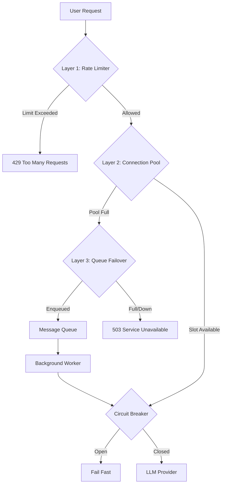

# Resilience Architecture Overview

This module (`src/core/resilience`) implements a **Multi-Layered Defense Strategy** to ensure high availability, fault tolerance, and graceful degradation for the SSE Streaming Service.

The architecture is designed to handle high concurrency and LLM provider outages without crashing the application or providing a poor user experience.

## The 3-Layer Defense Strategy

The system relies on three concentric layers of protection, processed in order:

### Layer 1: Distributed Rate Limiting
**Objective**: Prevent abuse and ensure fair usage.
- **Component**: `rate_limiter.py`
- **Mechanism**: Token Bucket algorithm with Redis backend.
- **Optimization**: Uses a local in-memory cache to handle 90% of traffic without Redis round-trips.

### Layer 2: Connection Pooling
**Objective**: Protect backend resources and LLM providers from being overwhelmed.
- **Component**: `connection_pool_manager.py`
- **Mechanism**: Semaphores limiting concurrent executions per user and globally.
- **Distributed State**: Synchronized via Redis to enforce limits across multiple API instances.

### Layer 3: Queue Failover (The Safety Net)
**Objective**: Handle traffic spikes that exceed connection pool capacity.
- **Components**: `queue_request_handler.py`, `queue_consumer_worker.py`
- **Mechanism**: Asynchronous queuing with "Zero-Downtime" streaming.
- **Behavior**: Instead of rejecting users when the pool is full, requests are queued and processed by background workers, streaming results back via Pub/Sub.

---

## Resilience Primitives

In addition to the main layers, the following primitives cover reliability at the request level:

### Circuit Breaker
**Component**: `circuit_breaker.py`
- **Purpose**: Detect downstream provider outages and "fail fast" to prevent cascading failures.
- **Pattern**: Distributed Circuit Breaker (Closed -> Open -> Half-Open).
- **Storage**: State is shared via Redis.

### Retry Strategy
**Component**: `retry_strategy.py` (Integrated in Circuit Breaker logic)
- **Purpose**: Handle transient network errors (blips).
- **Mechanism**: Exponential backoff with jitter.

## Directory Structure

| Component | File | Responsibility |
|:---|:---|:---|
| **Rate Limiter** | `rate_limiter.py` | Layer 1: Traffic control & DDoS protection. |
| **Connection Pool** | `connection_pool_manager.py` | Layer 2: Resource constraint enforcement. |
| **Request Handler** | `queue_request_handler.py` | Layer 3 (Producer): Enqueues requests during high load. |
| **Consumer Worker** | `queue_consumer_worker.py` | Layer 3 (Consumer): Processes background jobs. |
| **Circuit Breaker** | `circuit_breaker.py` | Fails fast when providers are down. |
