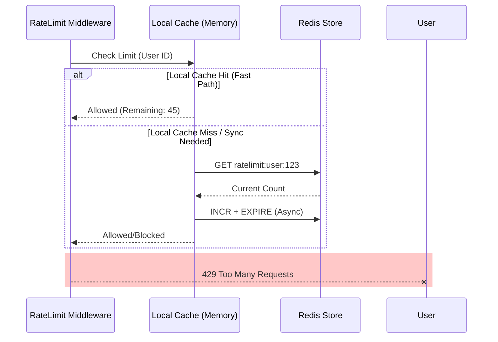

# Layer 1: Distributed Rate Limiting

The Rate Limiter serves as the first line of defense, protecting the application from abuse, denial-of-service attacks, and ensuring fair resource allocation among users.

**Source File**: `src/core/resilience/rate_limiter.py`

## Architecture

The system implements a **Hybrid Two-Level Rate Limiter** to balance precision (distributed consistency) with performance (low latency).

### 1. Local Cache (L1)
- **Technology**: In-memory dictionary + Async Lock.
- **Purpose**: Absorb the majority of high-frequency traffic without network I/O.
- **Hit Rate**: Designed to handle ~80-90% of checks locally.
- **Consistency**: Eventually consistent (syncs every 1.0s).

### 2. Remote Store (L2)
- **Technology**: Redis (String counters + TTL).
- **Purpose**: Maintain the global state across multiple API replicas.
- **Fallback**: Changes in local cache are asynchronously flushed to Redis.

## Request Flow



## Algorithms

### Token Bucket / Moving Window
The implementation uses a simplified **Fixed Window** counter with TTL, which approximates the Token Bucket algorithm for high-performance scenarios.

- **Key Format**: `ratelimit:{scope}:{identifier}`
- **Expiration**: Keys automatically expire after the window (e.g., 60 seconds).

### User Identification Strategy
Users are identified in the following priority order:
1.  `X-User-ID` Header (Internal Service Auth)
2.  `Authorization` Bearer Token (Hashed for privacy)
3.  Remote IP Address (Fallback for public endpoints)

## Configuration

| Parameter | Default | Description |
|:---|:---|:---|
| `SYNC_INTERVAL` | 1.0s | How often local counters sync with Redis. |
| `Strategy` | Moving Window | The rate limiting algorithm used. |

## Usage Example

```python
from src.core.resilience.rate_limiter import setup_rate_limiting

# Apply to endpoint
@router.get("/stream")
@limiter.limit("50/minute")
async def stream_endpoint(request: Request):
    ...
```
