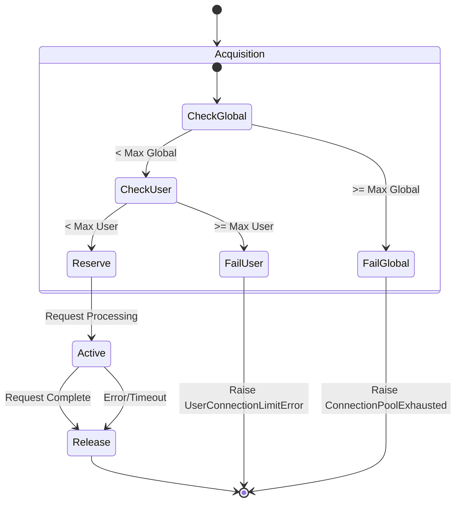

# Layer 2: Connection Pooling

Connection Pooling is the second layer of defense. It manages the finite resources of the application (e.g., database connections, LLM provider API limits) by enforcing strict concurrency limits.

**Source File**: `src/core/resilience/connection_pool_manager.py`

## Core Concepts

### 1. Global vs. User Limits
The manager enforces two types of constraints simultaneously:
*   **Grid Capacity (Global)**: Total number of requests the entire system can handle at once (e.g., 1000).
*   **Fair Share (User)**: Maximum concurrent requests a single user can make (e.g., 5).

### 2. Distributed State
Unlike threaded connection pools (like SQLAlchemy), this pool manages **Logical Connections** across distributed instances.
*   **State Store**: Redis.
*   **Mechanism**: Atomic increments/decrements.
*   **Fallback**: If Redis is down, it degrades gratefully to local-only enforcement.

## Health States

The pool monitors its own utilization to report system health ("Backpressure"):

| State | Utilization | Description |
|:---|:---|:---|
| **HEALTHY** | 0-70% | Normal operation. |
| **DEGRADED** | 70-90% | High load. System warning. |
| **CRITICAL** | 90-100% | Near capacity. Alerts firing. |
| **EXHAUSTED** | 100% | Full. **Triggers Layer 3 (Queue Failover)**. |

## Lifecycle Diagram

## Stage Codes
The code uses "Stage Codes" for granular logging and debugging:

*   **CP.0**: Initialization.
*   **CP.1**: Acquisition (CP.1.1 Stats Check, CP.1.2 Exhaustion Error).
*   **CP.4**: Release (CP.4.1 Usage Updated).
*   **CP.5**: Health Check.
