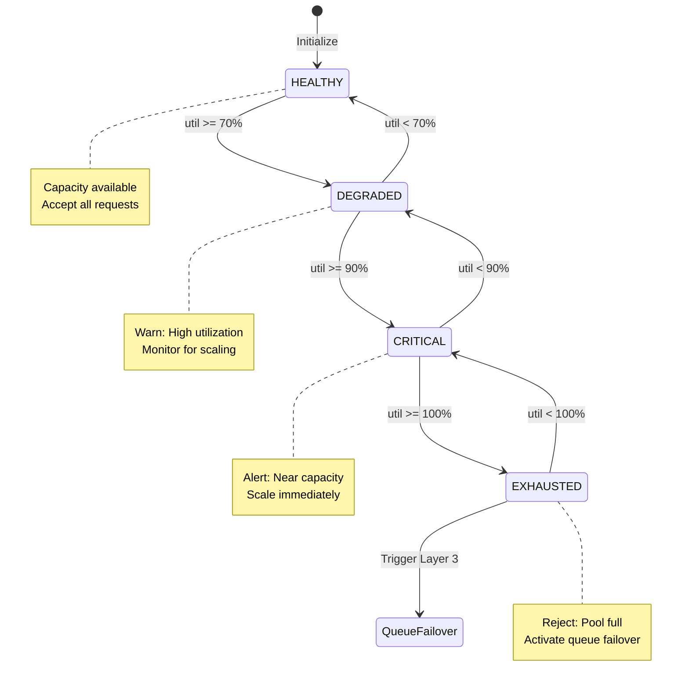
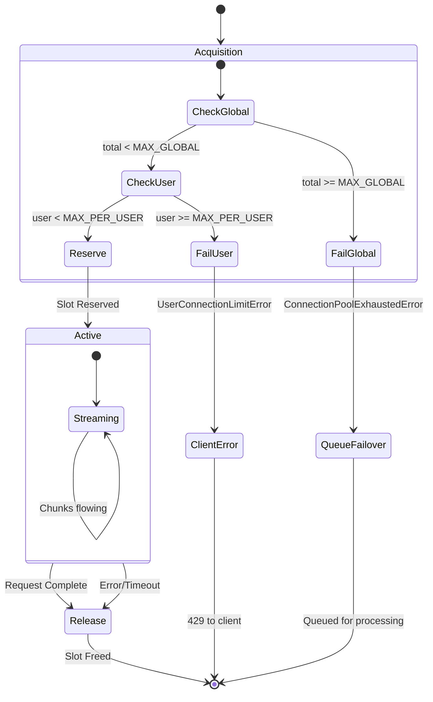

# Layer 2: Connection Pooling

## Introduction

Connection pooling serves as the second layer of defense in the resilience architecture, managing finite system resources to ensure smooth operation even under high load. While not the architectural centerpiece (that distinction belongs to queue failover), connection pooling is essential for maintaining system stability, fairness, and predictable performance.

### Problem Statement

Streaming LLM applications face critical resource management challenges:

**Unbounded Concurrent Connections**:
- Each active stream consumes memory (request state, buffers, context)
- Each stream maintains an open HTTP connection
- LLM providers impose strict API rate and concurrency limits
- Backend resources (CPU, memory, network) are finite
- Database connections have hard limits

**Consequences Without Connection Pooling**:
- **Memory Exhaustion**: Unchecked growth leads to Out-of-Memory crashes
- **CPU Saturation**: Too many concurrent streams starve other processes
- **Provider Throttling**: Exceeding LLM provider limits causes failures
- **Fair Access Violated**: Single user monopolizes all connections
- **Cascading Failures**: Resource exhaustion propagates across services
- **Unpredictable Performance**: System becomes unresponsive under load

**The Core Challenge**: How to maximize system utilization while preventing resource exhaustion and ensuring fair access across all users in a distributed environment with multiple application instances?

### Solution Overview

This system implements a **distributed connection pool with dual-layer limits** that manages resources at two levels:

1. **Global Capacity Limit** (Total System)
   - Maximum concurrent connections across all instances
   - Prevents total resource exhaustion
   - Default: 1000 concurrent streams
   - Enforced via Redis for distributed coordination

2. **Per-User Fairness Limit** (Individual Access)
   - Maximum concurrent connections per user
   - Prevents resource monopolization
   - Default: 5 concurrent streams per user
   - Ensures fair access during high demand

3. **Health State Monitoring** (Proactive Visibility)
   - Four health states: HEALTHY → DEGRADED → CRITICAL → EXHAUSTED
   - Enables proactive scaling decisions
   - Triggers queue failover at 100% utilization

**Key Innovation**: Unlike traditional thread-pool-based connection pools (e.g., SQLAlchemy), this manages logical streaming connections across distributed application instances using Redis for atomic coordination, with graceful local fallback if Redis becomes unavailable.

---

## Architecture

### Dual-Layer Enforcement

```
Connection Request Flow:
    Client Request
         ↓
    [Check 1: Global Capacity]
         ├→ Block if: total_connections >= 1000
         ├→ Error: ConnectionPoolExhaustedError
         ├→ Triggers: Layer 3 (Queue Failover)
         ↓
    [Check 2: User Fairness]
         ├→ Block if: user_connections >= 5
         ├→ Error: UserConnectionLimitError
         ├→ Protects: Against user monopolization
         ↓
    [Reserve Connection Slot]
         ├→ Atomic: Redis INCR operations
         ├→ Tracking: Global + per-user counters
         ├→ Fallback: Local counters if Redis down
         ↓
    Stream Processing
         ↓
    [Release Connection Slot]
         ├→ Atomic: Redis DECR operations
         ├→ Cleanup: Remove user counter if zero
```

### Distributed State Management

**Coordination Mechanism**: Redis-ba atomic counters

**Redis Keys**:
```
connection_pool:total                    → Global connection count
connection_pool:user:{user_id}          → Per-user connection count
connection_pool:connections             → Set of active thread/request IDs
```

**Operations**:
- **Acquire**: Atomic `INCR` on both global and user counters
- **Release**: Atomic `DECR` on both counters
- **Cleanup**: `DELETE` user counter when reaches zero

**Fallback Strategy**:
```python
if redis_available:
    count = await redis.get("connection_pool:total")
else:
    count = local_total_count  # In-memory fallback
```

**Why Redis?**
- Atomic operations ensure consistency across instances
- Sub-millisecond latency for counter operations
- Automatic key expiration prevents stale data
- Battle-tested at scale

**Graceful Degradation**:
- If Redis unavailable, falls back to local counters
- Each instance enforces limits independently
- May allow slight over-limit temporarily
- Acceptable trade-off for availability

---

## Health States

The connection pool continuously monitors utilization and reports one of four health states:

| State | Utilization | Threshold | Description | Actions |
|-------|-------------|-----------|-------------|---------|
| **HEALTHY** | 0-70% | < 700/1000 | Normal operation, ample capacity | None required |
| **DEGRADED** | 70-90% | 700-900 | High load, consider scaling | Warning logs, monitor closely |
| **CRITICAL** | 90-100% | 900-1000 | Near capacity, scale immediately | Alert firing, emergency scaling |
| **EXHAUSTED** | 100% | 1000/1000 | At capacity, rejecting new requests | Queue failover active |

### State Transitions



### Configuration

**File**: `src/core/config/constants.py`

```python
MAX_CONCURRENT_CONNECTIONS = 1000  # Global capacity
MAX_CONNECTIONS_PER_USER = 5       # Per-user fairness limit

CONNECTION_POOL_DEGRADED_THRESHOLD = 0.7   # 70% → DEGRADED
CONNECTION_POOL_CRITICAL_THRESHOLD = 0.9   # 90% → CRITICAL
```

**Tuning Recommendations**:

| Scenario | Global Limit | Per-User Limit | Rationale |
|----------|--------------|----------------|-----------|
| **High Memory** (32GB+) | 2000 | 10 | More capacity available |
| **Standard** (16GB) | 1000 | 5 | Balanced default |
| **Low Memory** (8GB) | 500 | 3 | Prevent OOM |
| **Premium Tier** | 1000 | 20 | Higher user limits |
| **Development** | 100 | 2 | Easier testing |

---

## Connection Lifecycle

### Acquisition Flow

```python
async def acquire_connection(user_id: str, thread_id: str) -> bool:
    # STAGE CP.1: Connection Acquisition
    
    async with lock:  # Thread-safe
        # Step 1: Get current counts
        total_count = await redis.get("connection_pool:total")
        user_count = await redis.get(f"connection_pool:user:{user_id}")
        
        # Step 2: Check global capacity
        if total_count >= MAX_CONCURRENT_CONNECTIONS:
            raise ConnectionPoolExhaustedError(
                current=total_count,
                max=MAX_CONCURRENT_CONNECTIONS
            )
        
        # Step 3: Check per-user limit
        if user_count >= MAX_CONNECTIONS_PER_USER:
            raise UserConnectionLimitError(
                user_id=user_id,
                limit=MAX_CONNECTIONS_PER_USER,
                current=user_count
            )
        
        # Step 4: Reserve connection slot (atomic)
        await redis.incr("connection_pool:total")
        await redis.incr(f"connection_pool:user:{user_id}")
        await redis.sadd("connection_pool:connections", thread_id)
        
        # Step 5: Log acquisition with health state
        state = await get_pool_state()
        utilization = (total_count + 1) / MAX_CONCURRENT_CONNECTIONS * 100
        
        logger.info(
            f"Connection acquired (utilization: {utilization:.1f}%, state: {state})",
            stage="CP.1.4",
            thread_id=thread_id,
            user_id=user_id
        )
        
        return True
```

### Release Flow

```python
async def release_connection(thread_id: str, user_id: str) -> None:
    # STAGE CP.4: Connection Release
    
    async with lock:
        # Step 1: Decrement counters (atomic)
        await redis.decr("connection_pool:total")
        user_count = await redis.decr(f"connection_pool:user:{user_id}")
        
        # Step 2: Cleanup user counter if zero
        if user_count <= 0:
            await redis.delete(f"connection_pool:user:{user_id}")
        
        # Step 3: Remove from active set
        await redis.srem("connection_pool:connections", thread_id)
        
        # Step 4: Log release with new health state
        state = await get_pool_state()
        logger.info(
            f"Connection released (state: {state})",
            stage="CP.4.1",
            thread_id=thread_id
        )
```

### State Diagram



---

## Integration with Other Layers

### Layer 1: Rate Limiting

Rate limiting runs **before** connection pooling:

```
Request Flow:
    Rate Limit Check → Connection Pool Check → Stream Processing
```

- Rate limiting prevents excessive requests from reaching pool
- Pool protects against burst traffic that passes rate limits
- Independent enforcement (different resources/criteria)

### Layer 3: Queue Failover

Connection pool exhaustion **triggers** queue failover:

```python
try:
    await connection_pool.acquire_connection(user_id, thread_id)
    # Direct streaming path
    return direct_stream()
    
except ConnectionPoolExhaustedError:
    # Fallback to queue failover
    logger.warning("Activating queue failover (pool exhausted)")
    return queue_stream()
```

**Coordination**:
1. Pool reaches 100% utilization → EXHAUSTED state
2. Next request raises `ConnectionPoolExhaustedError`
3. Streaming service catches exception
4. Activates queue failover (Layer 3)
5. Request queued for async processing
6. Client receives streaming response via Pub/Sub

---

## Error Handling

### ConnectionPoolExhaustedError

**Trigger**: Global capacity reached (1000/1000)  
**Response**: Activate queue failover (Layer 3)  
**Client Impact**: None (transparent failover)

```python
{
    "error_type": "ConnectionPoolExhaustedError",
    "details": {
        "current": 1000,
        "max": 1000,
        "user_id": "user123"
    }
}
```

**Mitigation**:
- Automatically triggers queue failover
- Request queued for processing
- Client still receives streaming response
- Slightly higher latency (see Layer 3 docs)

### UserConnectionLimitError

**Trigger**: Per-user limit reached (5/5)  
**Response**: Return 429 to client  
**Client Impact**: Must retry later

```python
{
    "error_type": "UserConnectionLimitError",
    "user_id": "user123",
    "limit": 5,
    "details": {"current": 5}
}
```

**Rationale**:
- Prevents single user from monopolizing all connections
- Ensures fair access during high demand
- Forces user to wait for existing streams to complete

### Redis Unavailability

**Trigger**: Redis connection lost  
**Response**: Graceful degradation to local counters  
**Impact**: Eventual consistency across instances

**Behavior**:
```python
if await redis_client.ping():
    # Use Redis (distributed)
    count = await redis.get("connection_pool:total")
else:
    # Fallback to local (per-instance)
    count = local_total_count
```

**Consequences**:
- Each instance enforces limits independently
- Total connections may slightly exceed global limit
- Per-user limits enforced locally (less strict)
- Returns to normal when Redis recovers

**Acceptability**:
- Temporary degradation is acceptable
- Maintains availability over perfect consistency
- Alerts trigger for Redis outage investigation

---

## Operational Characteristics

### Performance Metrics

| Operation | Latency | Notes |
|-----------|---------|-------|
| **Acquire (Redis)** | 1-2ms | Redis GET + INCR operations |
| **Acquire (Local Fallback)** | < 0.1ms | In-memory dictionary lookup |
| **Release (Redis)** | 1-2ms | Redis DECR + SREM operations |
| **State Check** | 1-2ms | Redis GET operation |

### Resource Utilization

**Per Connection**:
- Redis memory: ~50 bytes (per counter)
- Local memory: ~100 bytes (thread ID, metadata)
- Lock overhead: Negligible (async lock, short-held)

**Total System** (at 1000 connections):
- Redis memory: ~50 KB (1000 × 50 bytes)
- Local memory: ~100 KB per instance
- CPU: <1% (counter operations are trivial)

### Scaling Characteristics

**Horizontal Scaling** (Multiple Instances):
- Redis provides distributed consistency
- Each instance participates in global pool
- No coordination overhead beyond Redis operations

**Vertical Scaling** (Higher Limits):
- Increase `MAX_CONCURRENT_CONNECTIONS` as memory allows
- Rule of thumb: 50MB per 500 connections
- Monitor memory/CPU under load

---

## Monitoring and Observability

### Key Metrics

| Metric | Purpose | Alert Threshold |
|--------|---------|-----------------|
| Pool utilization | Track capacity usage | > 90% (CRITICAL) |
| Pool state | Monitor health | CRITICAL or EXHAUSTED |
| Acquisition rate | Track request volume | Sudden spikes |
| Release rate | Verify cleanup | Should match acquisitions |
| Per-user connections | Detect monopolization | Any user at limit |
| Pool exhaustion events | Count Layer 3 triggers | > 10/min |

### Logging

**Structured Logging** with stage codes:

```python
# CP.0: Initialization
logger.info("Connection pool manager initialized",
            stage="CP.0",
            max_connections=1000,
            max_per_user=5)

# CP.1: Acquisition
logger.info("Connection acquired (utilization: 75.3%, state: DEGRADED)",
            stage="CP.1.4",
            thread_id="abc123",
            user_id="user456",
            total_connections=753,
            user_connections=3)

# CP.4: Release
logger.info("Connection released (state: DEGRADED)",
            stage="CP.4.1",
            thread_id="abc123",
            total_connections=752)

# CP.5: Health monitoring
logger.info("Pool state changed",
            stage="CP.5",
            old_state="HEALTHY",
            new_state="DEGRADED",
            utilization_percent=72.5)
```

### Stage Codes Reference

| Stage | Purpose |
|-------|---------|
| `CP.0` | Initialization |
| `CP.1` | Connection acquisition |
| `CP.1.1` | Stats check |
| `CP.1.2` | Global capacity check (exhausted) |
| `CP.1.3` | Per-user limit check (exceeded) |
| `CP.1.4` | Acquisition successful |
| `CP.3` | Connection tracking |
| `CP.3.FALLBACK` | Redis unavailable, using local |
| `CP.4` | Connection release |
| `CP.4.1` | Release successful |
| `CP.4.FALLBACK` | Redis unavailable, using local |
| `CP.5` | Health state monitoring |

---

## Testing and Verification

### Manual Testing

**Test Global Capacity Limit**:
```python
import asyncio
from src.core.resilience.connection_pool_manager import get_connection_pool_manager

async def test_global_limit():
    pool = get_connection_pool_manager()
    
    # Acquire MAX_CONCURRENT_CONNECTIONS
    for i in range(1000):
        await pool.acquire_connection(f"user{i % 10}", f"thread{i}")
    
    # Next acquisition should fail with ConnectionPoolExhaustedError
    try:
        await pool.acquire_connection("user999", "thread_fail")
    except ConnectionPoolExhaustedError:
        print("✓ Global limit enforced correctly")
```

**Test Per-User Limit**:
```python
async def test_user_limit():
    pool = get_connection_pool_manager()
    user_id = "test_user"
    
    # Acquire MAX_CONNECTIONS_PER_USER
    for i in range(5):
        await pool.acquire_connection(user_id, f"thread{i}")
    
    # Next acquisition for same user should fail
    try:
        await pool.acquire_connection(user_id, "thread_fail")
    except UserConnectionLimitError:
        print("✓ Per-user limit enforced correctly")
```

**Test Health States**:
```python
async def test_health_states():
    pool = get_connection_pool_manager()
    
    # HEALTHY: 0-70%
    for i in range(700):
        await pool.acquire_connection(f"user{i}", f"thread{i}")
    assert await pool.get_pool_state() == ConnectionState.HEALTHY
    
    # DEGRADED: 70-90%
    for i in range(700, 900):
        await pool.acquire_connection(f"user{i}", f"thread{i}")
    assert await pool.get_pool_state() == ConnectionState.DEGRADED
    
    # CRITICAL: 90-100%
    for i in range(900, 1000):
        await pool.acquire_connection(f"user{i}", f"thread{i}")
    assert await pool.get_pool_state() == ConnectionState.CRITICAL
    
    print("✓ Health state transitions correct")
```

**Monitor Pool Statistics**:
```bash
# API endpoint for pool stats
curl http://localhost:8000/admin/connection-pool-stats

# Response:
{
    "total_connections": 753,
    "max_connections": 1000,
    "utilization_percent": 75.3,
    "state": "degraded",
    "degraded_threshold": 700,
    "critical_threshold": 900,
    "redis_enabled": true
}
```

---

## Tuning Recommendations

### High Traffic Scenarios

**Increase Global Capacity**:
```python
MAX_CONCURRENT_CONNECTIONS = 2000  # Double capacity
MAX_CONNECTIONS_PER_USER = 10      # Allow more per user
```

**Lower Health Thresholds**:
```python
CONNECTION_POOL_DEGRADED_THRESHOLD = 0.8   # More capacity before warning
CONNECTION_POOL_CRITICAL_THRESHOLD = 0.95  # Tighter critical window
```

### Memory-Constrained Environments

**Reduce Global Capacity**:
```python
MAX_CONCURRENT_CONNECTIONS = 500   # Half capacity
MAX_CONNECTIONS_PER_USER = 3       # Stricter per-user
```

**Lower Thresholds for Earlier Warnings**:
```python
CONNECTION_POOL_DEGRADED_THRESHOLD = 0.6   # Earlier warning
CONNECTION_POOL_CRITICAL_THRESHOLD = 0.8   # Earlier critical state
```

### Fair Access Priority

**Strict Per-User Limits**:
```python
MAX_CONNECTIONS_PER_USER = 2       # Very strict
# Prevents any single user from consuming > 0.2% of pool
```

---

## Future Enhancements

### Planned Improvements

1. **Dynamic Capacity**: Adjust limits based on available memory
2. **Priority Queues**: Premium users bypass pool limits
3. **Connection Timeouts**: Auto-release stale connections
4. **Metrics Export**: Prometheus metrics for monitoring
5. **Admission Control**: Predictive rejection before pool exhaustion

### Research Areas

1. **Adaptive Limits**: ML-based capacity prediction
2. **Connection Prefetching**: Reserve slots for expected requests
3. **Hierarchical Pools**: Separate pools per user tier

---

## References

**Source Files**:
- Connection Pool Manager: `src/core/resilience/connection_pool_manager.py` (451 lines)
- Exceptions: `src/core/exceptions/connection_pool.py`
- Constants: `src/core/config/constants.py`

**Related Documentation**:
- [01_rate_limiting.md](./01_rate_limiting.md) - Layer 1 defense
- [04_queue_failover.md](./04_queue_failover.md) - Layer 3 defense
- [01_overview.md](./01_overview.md) - Three-layer architecture

**Design Patterns**:
- Resource Pool Pattern (connection management)
- Distributed Lock Pattern (Redis-based coordination)
- Circuit Breaker Pattern (graceful degradation on Redis failure)
- Health Check Pattern (state monitoring)
