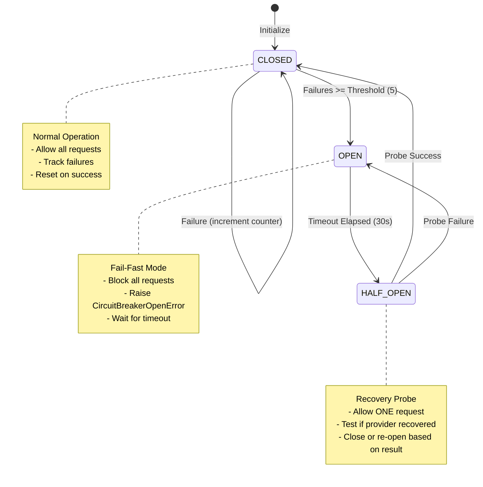

# Circuit Breaker

## Introduction

The Circuit Breaker pattern serves as a critical protection mechanism against cascading failures from unreliable external dependencies. In the context of LLM streaming services, where multiple providers may experience intermittent outages, high latency, or rate limiting, circuit breakers prevent the system from repeatedly attempting operations that are likely to fail, protecting both the application and its users from degraded experiences.

### Problem Statement

LLM streaming applications depend on external providers (OpenAI, Anthropic, Google, etc.) that can fail in various ways:

**Provider Failure Modes**:
- Complete outages (service down)
- Partial outages (some regions/endpoints failing)
- High latency (responses taking 30+ seconds)
- Rate limiting (429 errors from excessive requests)
- Intermittent timeouts (network instability)
- Silent failures (hanging connections)

**Consequences Without Circuit Breakers**:
- **Cascading Failures**: Application threads blocked waiting for unresponsive providers
- **Resource Exhaustion**: Connection pool depleted by hanging requests
- **User Impact Amplification**: Every user experiences slow/failed requests
- **Thundering Herd**: When provider recovers, all instances hammer it simultaneously
- **Wasted Resources**: CPU/memory consumed by doomed retry attempts
- **Poor User Experience**: Long waits followed by failures instead of fast failures

**The Core Challenge**: How to detect provider failures quickly, stop sending traffic to failing providers, and probe for recovery without overwhelming the provider when it comes back online?

### Solution Overview

This system implements a **distributed circuit breaker with Redis-backed state** that protects against provider failures through three key mechanisms:

1. **Fail-Fast Behavior** (Immediate Rejection)
   - When provider is known to be down, reject requests immediately
   - No wasted time waiting for timeouts
   - Frees resources for healthy providers
   - Better user experience (fast failure > slow failure)

2. **Distributed State Sharing** (Cross-Instance Coordination)
   - All application instances share circuit breaker state via Redis
   - If Instance A detects Provider X is down, Instance B stops calling it
   - Prevents thundering herd when provider recovers
   - Consistent behavior across distributed system

3. **Automatic Recovery Probing** (Self-Healing)
   - After timeout period, allows single probe request
   - If probe succeeds, circuit closes (normal operation resumes)
   - If probe fails, circuit stays open (retry later)
   - Gradual recovery prevents overwhelming provider

**Key Innovation**: Unlike traditional circuit breakers (per-instance, library-based), this uses Redis for distributed state, ensuring all application instances immediately benefit from failure detection by any single instance.

---

## Architecture

### State Machine

The circuit breaker operates as a three-state finite state machine:



### State Descriptions

#### CLOSED (Normal Operation)

**Behavior**:
- All requests allowed to pass through
- Failures tracked in Redis counter
- Successes reset failure counter to zero

**Transition Trigger**:
- Failure count reaches threshold (default: 5 consecutive failures)
- Transitions to OPEN state

**Redis Keys**:
```
circuit:{provider}:state = "closed"
circuit:{provider}:failures = 0-4
```

#### OPEN (Fail-Fast Mode)

**Behavior**:
- All requests immediately rejected with `CircuitBreakerOpenError`
- No network calls attempted to failing provider
- Timestamp of circuit opening recorded

**Transition Trigger**:
- After `reset_timeout` seconds (default: 30s), transitions to HALF_OPEN
- Timeout is "virtual" - checked on next request attempt

**Redis Keys**:
```
circuit:{provider}:state = "open"
circuit:{provider}:last_failure_time = 1702500000.0
```

**User Impact**:
- Fast failure (< 1ms) instead of slow timeout (30s)
- Clear error message indicating provider unavailability
- Can retry with different provider immediately

#### HALF_OPEN (Recovery Probe)

**Behavior**:
- Allows exactly ONE request through as a "probe"
- If probe succeeds: Provider recovered → transition to CLOSED
- If probe fails: Provider still down → transition back to OPEN

**Transition Trigger**:
- Success: Immediate transition to CLOSED, reset failure counter
- Failure: Immediate transition to OPEN, restart timeout

**Implementation Note**:
- HALF_OPEN is "virtual" - not explicitly stored in Redis
- Implemented as: OPEN + (time_elapsed > timeout) = allow one request

---

## Distributed Implementation

### Why Distributed?

**Problem**: In a multi-instance deployment, each instance has its own circuit breaker state.

**Without Distribution**:
```
Instance A: Detects Provider X is down → Opens circuit
Instance B: Doesn't know → Keeps calling Provider X → Fails
Instance C: Doesn't know → Keeps calling Provider X → Fails
Result: 2/3 of instances waste resources on failing provider
```

**With Distribution** (Redis-backed):
```
Instance A: Detects Provider X is down → Opens circuit in Redis
Instance B: Reads state from Redis → Sees circuit is open → Stops calling
Instance C: Reads state from Redis → Sees circuit is open → Stops calling
Result: All instances immediately stop calling failing provider
```

### Redis State Schema

**Keys**:
```
circuit:{provider_name}:state              → "closed" | "open"
circuit:{provider_name}:failures           → Integer counter (0-5)
circuit:{provider_name}:last_failure_time  → Unix timestamp (float)
```

**Operations**:
- **Check State**: `GET circuit:{provider}:state`
- **Record Failure**: `INCR circuit:{provider}:failures`
- **Open Circuit**: `SET circuit:{provider}:state "open"`
- **Close Circuit**: `SET circuit:{provider}:state "closed"` + `SET failures 0`

**Atomicity**:
- Redis operations are atomic
- No race conditions between instances
- Consistent view across all instances

### Thundering Herd Prevention

**Problem**: When provider recovers, all instances try to call it simultaneously.

**Solution**: HALF_OPEN state allows only ONE probe request.

**Mechanism**:
```python
async def should_allow_request():
    state = await redis.get("circuit:{provider}:state")
    
    if state == "open":
        last_failure = await redis.get("circuit:{provider}:last_failure_time")
        elapsed = time.time() - float(last_failure)
        
        if elapsed > RESET_TIMEOUT:
            # This is the HALF_OPEN probe
            # Only first instance to check gets through
            return True
        
        return False  # Still in timeout period
```

**Result**: Gradual recovery, not thundering herd.

---

## Resilient Call Wrapper

The `ResilientCall` class orchestrates circuit breaking with retry logic:

### Three-Layer Protection

```
Request Flow:
    ┌─────────────────────────────────┐
    │ Layer 1: Circuit Breaker Check  │
    │ - Is circuit OPEN?              │
    │ - If yes: Fail immediately      │
    │ - If no: Proceed                │
    └─────────────────────────────────┘
                  ↓
    ┌─────────────────────────────────┐
    │ Layer 2: Retry Logic            │
    │ - Execute with exponential      │
    │   backoff (Tenacity)            │
    │ - Retry ONLY transient errors   │
    │ - Max 3 attempts                │
    └─────────────────────────────────┘
                  ↓
    ┌─────────────────────────────────┐
    │ Layer 3: Result Recording       │
    │ - Success: Reset failure count  │
    │ - Failure: Increment counter    │
    │ - Trip circuit if threshold hit │
    └─────────────────────────────────┘
```

### Retry Strategy

**Retryable Errors** (Transient):
- `TimeoutError`: Network timeout
- `ConnectionError`: Connection refused/reset
- `ProviderTimeoutError`: LLM provider timeout

**Non-Retryable Errors** (Permanent):
- `400 Bad Request`: Invalid input
- `401 Unauthorized`: Invalid API key
- `403 Forbidden`: Insufficient permissions
- `404 Not Found`: Invalid endpoint

**Exponential Backoff**:
```
Attempt 1: Immediate
Attempt 2: Wait 1s  (base delay)
Attempt 3: Wait 2s  (exponential increase)
Max delay: 10s (cap)
```

**Configuration**:
```python
MAX_RETRIES = 3              # Maximum retry attempts
RETRY_BASE_DELAY = 1.0       # Initial delay (seconds)
RETRY_MAX_DELAY = 10.0       # Maximum delay cap (seconds)
```

### Code Example

```python
from src.core.resilience.circuit_breaker import ResilientCall

# Create resilient wrapper for provider
resilient_call = ResilientCall(
    provider_name="openai",
    redis_client=redis,
    max_retries=3
)

# Execute with full protection
try:
    result = await resilient_call.call(
        func=llm_provider.stream,
        prompt="Hello",
        thread_id="abc123"
    )
except CircuitBreakerOpenError:
    # Provider is known to be down
    # Fail fast, try different provider
    logger.warning("OpenAI circuit is open, using fallback")
    result = await fallback_provider.stream(prompt="Hello")
```

---

## Configuration

**File**: `src/core/config/settings.py`

### Circuit Breaker Settings

| Setting | Default | Description |
|---------|---------|-------------|
| `CB_FAILURE_THRESHOLD` | `5` | Consecutive failures before opening circuit |
| `CB_RECOVERY_TIMEOUT` | `30` seconds | Time to wait before probing recovery |

### Retry Settings

| Setting | Default | Description |
|---------|---------|-------------|
| `MAX_RETRIES` | `3` | Maximum retry attempts per request |
| `RETRY_BASE_DELAY` | `1.0` seconds | Initial retry delay |
| `RETRY_MAX_DELAY` | `10.0` seconds | Maximum retry delay cap |

### Tuning Recommendations

| Scenario | Failure Threshold | Recovery Timeout | Rationale |
|----------|-------------------|------------------|-----------|
| **Stable Providers** | 10 | 60s | Tolerate more failures, longer recovery |
| **Unstable Providers** | 3 | 15s | Trip faster, probe sooner |
| **High Traffic** | 5 | 30s | Balanced (default) |
| **Development** | 10 | 10s | More forgiving, faster testing |

---

## Operational Characteristics

### Performance Metrics

| Operation | Latency | Notes |
|-----------|---------|-------|
| **Circuit Check (CLOSED)** | 1-2ms | Redis GET operation |
| **Circuit Check (OPEN)** | 1-2ms | Redis GET + timestamp check |
| **Fail-Fast Rejection** | < 0.1ms | No network call, immediate error |
| **Record Success** | 1-2ms | Redis SET operations |
| **Record Failure** | 1-2ms | Redis INCR + SET operations |

### Latency Comparison

**Without Circuit Breaker** (Provider Down):
```
Request → Timeout (30s) → Retry 1 → Timeout (30s) → Retry 2 → Timeout (30s) → Fail
Total: 90 seconds
```

**With Circuit Breaker** (Provider Down):
```
Request → Circuit Check (1ms) → CircuitBreakerOpenError
Total: 1 millisecond (90,000x faster)
```

### Resource Utilization

**Per Provider**:
- Redis memory: ~150 bytes (3 keys × 50 bytes)
- Local memory: Negligible (breaker instance)
- CPU: < 0.1% (Redis operations)

**System-Wide** (10 providers):
- Redis memory: ~1.5 KB
- Minimal overhead

---

## Error Handling

### CircuitBreakerOpenError

**Trigger**: Circuit is in OPEN state  
**Response**: Immediate rejection, no provider call  
**Client Impact**: Fast failure, can retry with different provider

```python
{
    "error_type": "CircuitBreakerOpenError",
    "message": "Circuit open for openai",
    "details": {
        "provider": "openai",
        "state": "open",
        "last_failure_time": 1702500000.0
    }
}
```

**Handling Strategy**:
```python
try:
    result = await call_openai(prompt)
except CircuitBreakerOpenError:
    # Provider is down, use fallback
    logger.warning("OpenAI circuit open, using Anthropic")
    result = await call_anthropic(prompt)
```

### Retry Exhaustion

**Trigger**: All retry attempts failed  
**Response**: Record failure in circuit breaker  
**Impact**: May trip circuit if threshold reached

```python
# After 3 failed attempts:
# - Failure counter incremented
# - If counter >= 5: Circuit opens
# - Error propagated to caller
```

### Redis Unavailability

**Trigger**: Redis connection lost  
**Response**: Graceful degradation (fail-open)  
**Behavior**: Allow all requests (CLOSED state assumed)

```python
async def get_state():
    try:
        state = await redis.get("circuit:{provider}:state")
        return state or "closed"
    except Exception:
        logger.warning("Redis unavailable, assuming circuit CLOSED")
        return "closed"  # Fail-open (allow traffic)
```

**Rationale**:
- Availability > perfect protection
- Temporary degradation acceptable
- Returns to normal when Redis recovers

---

## Monitoring and Observability

### Key Metrics

| Metric | Purpose | Alert Threshold |
|--------|---------|-----------------|
| Circuit state | Track provider health | Any circuit OPEN |
| Failure count | Monitor approaching threshold | >= 3 failures |
| Circuit open events | Count provider outages | > 5/hour |
| Circuit recovery time | Measure downtime duration | > 5 minutes |
| Probe success rate | Verify recovery detection | < 50% |

### Logging

**Circuit State Changes**:
```python
# Circuit opens
logger.error("Circuit 'openai' tripped! Opening circuit.",
             failures=5,
             threshold=5,
             provider="openai")

# Circuit recovers
logger.info("Circuit 'openai' recovered! Resetting to CLOSED.",
            provider="openai",
            downtime_seconds=45)

# Probe allowed
logger.info("Circuit 'openai' probe allowed (timeout passed)",
            elapsed_seconds=32,
            timeout=30)
```

**Failure Recording**:
```python
logger.warning("Circuit 'openai' recorded failure (3/5)",
               provider="openai",
               failures=3,
               threshold=5)
```

### Admin Endpoint

**Get All Circuit States**:
```bash
curl http://localhost:8000/admin/circuit-breakers

# Response:
{
    "openai": {
        "state": "open",
        "failures": 5,
        "last_failure_time": 1702500000.0
    },
    "anthropic": {
        "state": "closed",
        "failures": 0
    },
    "google": {
        "state": "closed",
        "failures": 2
    }
}
```

---

## Testing and Verification

### Manual Testing

**Test Circuit Opening**:
```python
import asyncio
from src.core.resilience.circuit_breaker import ResilientCall

async def test_circuit_opening():
    resilient = ResilientCall("test_provider", redis_client)
    
    # Simulate 5 failures
    for i in range(5):
        try:
            await resilient.call(failing_function)
        except Exception:
            pass  # Expected to fail
    
    # Circuit should now be OPEN
    state = await resilient.breaker.get_state()
    assert state == "open", "Circuit should be open after 5 failures"
    
    # Next call should fail immediately
    try:
        await resilient.call(any_function)
        assert False, "Should have raised CircuitBreakerOpenError"
    except CircuitBreakerOpenError:
        print("✓ Circuit correctly rejects requests when open")
```

**Test Recovery Probing**:
```python
async def test_recovery():
    # Open circuit
    await open_circuit("test_provider")
    
    # Wait for timeout
    await asyncio.sleep(31)  # > 30s timeout
    
    # Next request should be allowed (probe)
    is_allowed = await breaker.should_allow_request()
    assert is_allowed, "Probe should be allowed after timeout"
    
    # If probe succeeds, circuit closes
    await breaker.record_success()
    state = await breaker.get_state()
    assert state == "closed", "Circuit should close after successful probe"
    
    print("✓ Circuit recovery works correctly")
```

**Test Distributed State**:
```python
async def test_distributed_state():
    # Instance A opens circuit
    breaker_a = DistributedCircuitBreaker("shared_provider", redis)
    await breaker_a._set_state(CircuitState.OPEN)
    
    # Instance B should see it immediately
    breaker_b = DistributedCircuitBreaker("shared_provider", redis)
    state = await breaker_b.get_state()
    assert state == "open", "Instance B should see circuit is open"
    
    print("✓ Distributed state sharing works")
```

---

## Integration with Other Layers

### Layer 1: Rate Limiting

Circuit breakers operate **after** rate limiting:

```
Request Flow:
    Rate Limit Check → Circuit Breaker Check → Provider Call
```

- Rate limiting prevents excessive requests from reaching circuit breaker
- Circuit breaker protects against provider failures
- Independent concerns, complementary protection

### Layer 2: Connection Pool

Circuit breakers prevent connection pool exhaustion:

```python
# Without circuit breaker:
# - 1000 requests to failing provider
# - All hang for 30s waiting for timeout
# - Connection pool exhausted
# - System becomes unresponsive

# With circuit breaker:
# - First 5 requests fail, circuit opens
# - Remaining 995 requests fail immediately
# - Connection pool stays healthy
# - System remains responsive
```

### Layer 3: Queue Failover

Circuit breakers can trigger queue failover:

```python
try:
    result = await resilient_call.call(provider.stream, prompt)
except CircuitBreakerOpenError:
    # All providers down, use queue failover
    logger.warning("All circuits open, activating queue failover")
    result = await queue_failover.queue_and_stream(prompt)
```

---

## Future Enhancements

### Planned Improvements

1. **Adaptive Thresholds**: Adjust failure threshold based on traffic volume
2. **Partial Circuit Breaking**: Allow percentage of traffic through (canary)
3. **Circuit Metrics Export**: Prometheus metrics for monitoring
4. **Health Dashboard**: Real-time circuit state visualization
5. **Automatic Fallback**: Configure fallback providers per circuit

### Research Areas

1. **ML-Based Failure Prediction**: Predict failures before they occur
2. **Gradual Recovery**: Slowly ramp up traffic after recovery
3. **Regional Circuit Breakers**: Separate circuits per geographic region

---

## References

**Source Files**:
- Circuit Breaker: `src/core/resilience/circuit_breaker.py` (374 lines)
- Exceptions: `src/core/exceptions/__init__.py`
- Configuration: `src/core/config/settings.py`

**Related Documentation**:
- [01_rate_limiting.md](./01_rate_limiting.md) - Layer 1 defense
- [02_connection_pooling.md](./02_connection_pooling.md) - Layer 2 defense
- [04_queue_failover.md](./04_queue_failover.md) - Layer 3 defense

**Design Patterns**:
- Circuit Breaker Pattern (failure detection and recovery)
- Retry Pattern (exponential backoff)
- Fail-Fast Pattern (immediate rejection)
- Distributed State Pattern (Redis-backed coordination)
