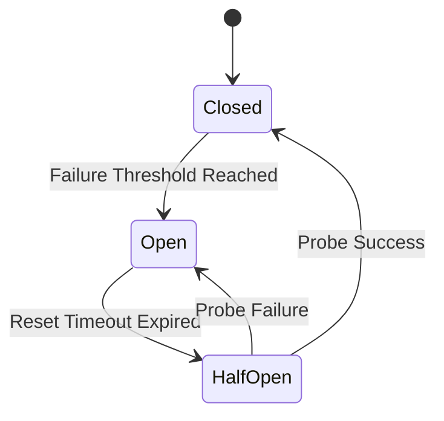

# Circuit Breaker

The Circuit Breaker pattern prevents the application from repeatedly trying to execute an operation that's likely to fail. It is crucial for external LLM integrations where providers may experience downtime or high latency.

**Source File**: `src/core/resilience/circuit_breaker.py`

## State Machine

The circuit breaker operates as a state machine with three states:

### 1. CLOSED (Normal)
*   The system is healthy.
*   Requests pass through to the provider.
*   **Transition**: Moves to OPEN if failure count >= Threshold (e.g., 5 errors).

### 2. OPEN (Failure)
*   The provider is down.
*   Requests fail immediately ("Fail Fast") without network calls.
*   **Transition**: Moves to HALF-OPEN after a timeout (e.g., 30s).

### 3. HALF-OPEN (Probing)
*   The system tests if the provider has recovered.
*   Allows a **single request** through.
*   **Success**: Reset to CLOSED.
*   **Failure**: Return to OPEN.

## Distributed Implementation
This is a **Distributed Circuit Breaker**, meaning all API instances share the same state view via Redis.

*   **Benefit**: If Instance A detects Provider X is down, Instance B immediately stops calling Provider X.
*   **Prevention**: Prevents the "Thundering Herd" problem when a provider recovers.

## Resilience Wrapper (`ResilientCall`)

The `ResilientCall` class wraps the raw execution with layers of protection:

1.  **Stage 1: Check Circuit** 
    *   Is the circuit OPEN? If so, raise `CircuitBreakerOpenError`.
2.  **Stage 2: Retry Logic**
    *   Uses `tenacity` for exponential backoff.
    *   Retries ONLY on transient errors (Timeouts, Connection Refused).
    *   Does NOT retry on logical errors (400 Bad Request).
3.  **Stage 3: Stats Recording**
    *   Success: Resets failure counters.
    *   Failure: Increments counters (potentially tripping the breaker).

## Configuration

| Key | Default | Description |
|:---|:---|:---|
| `MAX_FAILURES` | 5 | consecutive failures before opening. |
| `RESET_TIMEOUT` | 30s | time to wait before probing. |
| `MAX_RETRIES` | 3 | retry attempts per request. |
