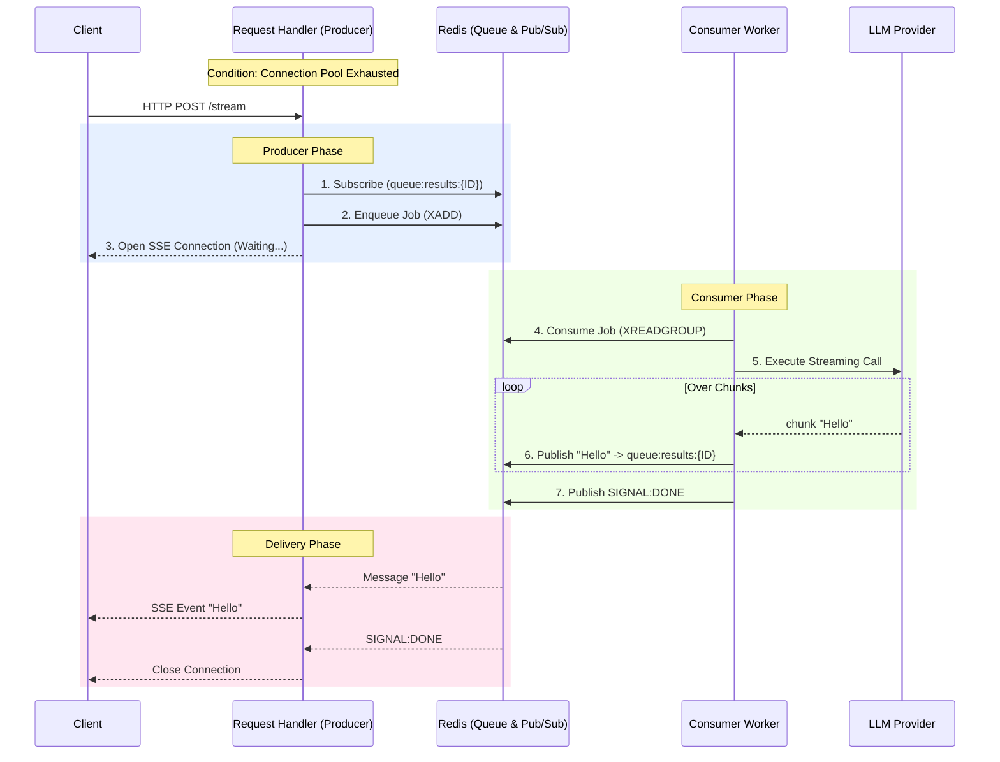

# Layer 3: Queue Failover

The Queue Failover system represents the final layer of defense. It transforms synchronous HTTP requests into asynchronous background jobs when the system is under heavy load, preventing `429 Too Many Requests` errors.

**Source Files**: 
*   Producer: `src/core/resilience/queue_request_handler.py`
*   Consumer: `src/core/resilience/queue_consumer_worker.py`

## Architecture

This system implements a **Producer-Consumer** pattern decoupled by a Message Queue (Redis Streams or Kafka) and re-coupled by a generic Pub/Sub channel for results.

### High-Level Data Flow

## Components

### 1. Request Handler (Producer)
**Class**: `QueueRequestHandler`

Responsible for seamless failover handling within the API route.

*   **Initialization**: Lazy-loaded singleton.
*   **Orchestration**:
    1.  Generates a unique `request_id`.
    2.  Subscribes to the specific result channel **before** enqueueing (prevents race conditions).
    3.  Enqueues the payload.
    4.  Enters an async loop yielding events from Pub/Sub to the HTTP response.
*   **Heartbeats**: Sends SSE comments (`: ping`) every 15s to keep the HTTP connection alive during queue wait times.

### 2. Consumer Worker (Consumer)
**Class**: `QueueConsumerWorker`

Background process responsible for heavy lifting.

*   **Lifespan**: Runs as a separate `asyncio` task (or process).
*   **Batching**: Fetches jobs in small batches (e.g., 5) to maximize throughput while respecting rate limits.
*   **Isolation**: Uses its own `StreamPublisher` to broadcast results without knowing the consumner.
*   **Retry Logic**: Implements exponential backoff for failed jobs (e.g., network errors).

## Message Protocol

The system uses a strict protocol over Redis Pub/Sub:

| Message Type | Format | Description |
|:---|:---|:---|
| **Data Chunk** | `data: {...}` | Standard SSE data payload. |
| **Completion** | `SIGNAL:DONE` | Indicates the stream has finished successfully. |
| **Error** | `SIGNAL:ERROR:{msg}` | Indicates a processing error occurred. |
| **Heartbeat** | `SIGNAL:HEARTBEAT` | Keep-alive signal (internal). |

## Scaling

This architecture allows for independent scaling:
*   **Web Tier**: Scale up API instances to handle more concurrent open connections.
*   **Worker Tier**: Scale up Worker instances to process the queue faster.
