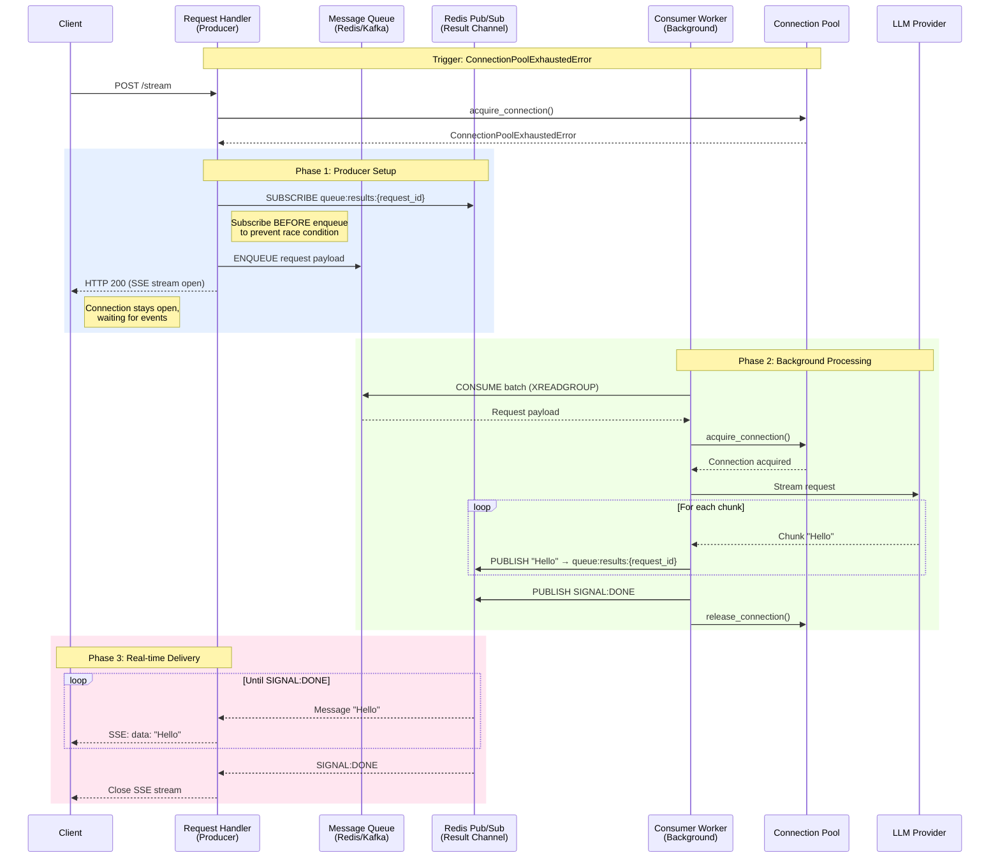

# Layer 3: Queue Failover

## Introduction

The Queue Failover mechanism represents the third and final layer of defense in the resilience architecture. It fundamentally transforms how the system handles capacity exhaustion, converting what would traditionally be request rejections into guaranteed asynchronous processing with real-time streaming delivery.

### Problem Statement

Conventional streaming systems face a critical architectural dilemma when connection capacity is exhausted:

**Traditional Approach (Request Rejection)**:
- Return HTTP 429 "Too Many Requests"
- Client receives immediate failure
- Request is lost unless client implements retry logic
- Poor user experience during peak load
- Wasted computational resources (client must re-send entire request)

**Consequence**: Users experience service unavailability precisely when the system is most valuable (high demand periods).

### Solution Overview

Queue Failover eliminates request rejection by implementing a producer-consumer pattern with real-time result streaming. When the connection pool reaches capacity, instead of rejecting the request:

1. **Queue the request** for asynchronous processing
2. **Maintain the HTTP connection** using Server-Sent Events (SSE)
3. **Stream results** in real-time via Redis Pub/Sub as the worker processes the request
4. **Deliver identical user experience** with slightly higher latency

**Key Innovation**: The client receives a streaming response regardless of system capacity. The only difference is processing latency, not availability.

---

## Architecture

### Position in Defense Stack

Queue Failover operates as Layer 3 in a three-tier defense system:

```
Layer 1: NGINX Rate Limiting (requests/second per IP)
    ↓ (blocks malicious traffic)
Layer 2: Connection Pool (concurrent active connections)
    ↓ (prevents memory exhaustion)
Layer 3: Queue Failover (asynchronous processing)
    ↓ (guarantees request handling)
Result: Zero 429 errors, graceful degradation
```

### High-Level Data Flow



---

## Components

### Queue Request Handler (Producer)

**File**: `src/core/resilience/queue_request_handler.py`  
**Class**: `QueueRequestHandler`  
**Role**: Manages request enqueueing and result streaming to clients

#### Architecture (6 Layers)

1. **Request Enqueueing**: Pushes requests to message queue (Redis Stream or Kafka)
2. **Redis Pub/Sub Subscription**: Manages channel subscription lifecycle
3. **Heartbeat Management**: Sends SSE pings every 15 seconds to prevent proxy timeouts
4. **Event Streaming**: Processes Pub/Sub messages and generates SSE events
5. **Stream Orchestration**: Coordinates complete streaming flow with timeout tracking
6. **Public API**: Clean interface for streaming service integration

#### Operational Flow

```python
async def queue_and_stream(user_id, thread_id, payload):
    # 1. Generate unique request identifier
    request_id = str(uuid.uuid4())
    
    # 2. Subscribe to result channel (BEFORE enqueueing)
    await subscribe(f"queue:results:{request_id}")
    
    # 3. Enqueue request to message queue
    await queue.produce({
        "request_id": request_id,
        "user_id": user_id,
        "thread_id": thread_id,
        "payload": payload,
        "enqueue_time": time.time()
    })
    
    # 4. Stream events from Pub/Sub to client
    async for message in pubsub.messages():
        if message == "SIGNAL:DONE":
            break
        yield format_sse_event(message)
```

#### Key Features

- **Race Condition Prevention**: Subscribes before enqueueing to ensure no messages are missed
- **Server-Side Blocking**: Uses Redis blocking operations to reduce CPU usage by approximately 90%
- **Heartbeat Keep-Alive**: Prevents NGINX/proxy timeouts during queue wait times
- **Graceful Timeout**: Returns timeout error after 30 seconds (configurable)

---

### Queue Consumer Worker (Background Processor)

**File**: `src/core/resilience/queue_consumer_worker.py`  
**Class**: `QueueConsumerWorker`  
**Role**: Processes queued requests and publishes results to Pub/Sub

#### Architecture (6 Layers)

1. **Streaming & Publishing**: Publishes chunks to Redis Pub/Sub, executes LLM streaming
2. **Connection Management**: Acquires/releases pool connections with context managers
3. **Retry Strategy**: Exponential backoff retry logic (100ms → 5000ms cap)
4. **Message Processing**: Orchestrates request processing pipeline
5. **Consumer Loop**: Main queue consumption loop with batch processing
6. **Public API**: Clean interface for application lifecycle integration

#### Operational Flow

```python
async def process_message(message):
    # 1. Parse request from queue
    request = QueuedStreamingRequest.from_dict(message.payload)
    
    # 2. Acquire connection (blocks until available)
    async with connection_pool.acquire(request.user_id):
        
        # 3. Stream LLM response
        async for chunk in orchestrator.stream(request.payload):
            
            # 4. Publish chunk to Pub/Sub
            await redis.publish(
                f"queue:results:{request.request_id}",
                chunk
            )
        
        # 5. Publish completion signal
        await redis.publish(
            f"queue:results:{request.request_id}",
            "SIGNAL:DONE"
        )
```

#### Retry Logic

Failed requests are retried with exponential backoff:

| Attempt | Delay | Total Wait |
|---------|-------|------------|
| 1 | 100ms | 100ms |
| 2 | 200ms | 300ms |
| 3 | 400ms | 700ms |
| 4 | 800ms | 1.5s |
| 5 | 1600ms | 3.1s |
| 6 | 3200ms | 6.3s |
| 7+ | 5000ms (cap) | 11.3s+ |

After 5 retries (configurable), the request is marked as failed and an error signal is published.

#### Lifecycle Management

The worker is started during application startup and gracefully stopped during shutdown:

```python
# src/application/app.py (lifespan)
if settings.QUEUE_FAILOVER_ENABLED:
    await start_queue_consumer_worker()  # Startup
    # ... application runs ...
    await stop_queue_consumer_worker()   # Shutdown
```

---

## Integration with Streaming Service

The queue failover is transparently activated when the connection pool is exhausted:

**File**: `src/application/services/streaming_service.py`

```python
async def create_stream(request_model, user_id, thread_id):
    try:
        # Layer 2: Attempt to acquire connection
        await pool_manager.acquire_connection(user_id, thread_id)
        
        # Success - use direct streaming path
        return direct_stream_generator(), ResilienceLayer.DIRECT
        
    except (ConnectionPoolExhaustedError, UserConnectionLimitError):
        # Layer 3: Activate queue failover
        logger.warning("connection_pool_exhausted_activating_queue_failover")
        
        # Queue request and stream via Pub/Sub
        return queue_stream_generator(), ResilienceLayer.QUEUE_FAILOVER
```

From the client's perspective, both paths produce identical SSE streams. The only observable difference is latency.

---

## Configuration

Queue Failover behavior is controlled by the following settings:

**File**: `src/core/config/settings.py`

| Setting | Default | Description |
|---------|---------|-------------|
| `QUEUE_FAILOVER_ENABLED` | `True` | Enable/disable queue failover mechanism |
| `QUEUE_FAILOVER_TIMEOUT_SECONDS` | `30` | Maximum time to wait for queued request processing |
| `QUEUE_FAILOVER_MAX_RETRIES` | `5` | Maximum retry attempts for failed requests |
| `QUEUE_FAILOVER_BASE_DELAY_MS` | `100` | Initial retry delay (exponential backoff base) |
| `QUEUE_FAILOVER_MAX_DELAY_MS` | `5000` | Maximum retry delay cap |
| `QUEUE_FAILOVER_CHUNK_BATCH_SIZE` | `5` | Number of chunks to batch before publishing |
| `QUEUE_FAILOVER_CHUNK_BATCH_TIMEOUT_MS` | `100` | Maximum time to wait for batch to fill |

### Tuning Recommendations

- **High Traffic, Low Latency Priority**: Decrease batch timeout to 50ms
- **High Traffic, Throughput Priority**: Increase batch size to 10-20
- **Bursty Traffic**: Increase max retries to 10, max delay to 10000ms
- **Development/Testing**: Disable with `QUEUE_FAILOVER_ENABLED=False`

---

## Message Protocol

Communication between producer and consumer uses a strict protocol over Redis Pub/Sub:

**Channel Format**: `queue:results:{request_id}`

### Message Types

| Type | Format | Example | Description |
|------|--------|---------|-------------|
| **SSE Chunk** | `data: {json}\n\n` | `data: {"content":"Hello"}\n\n` | Single streaming event |
| **Batch** | `BATCH:[...]` | `BATCH:["chunk1","chunk2"]` | Multiple events (optimization) |
| **Completion** | `SIGNAL:DONE` | `SIGNAL:DONE` | Stream finished successfully |
| **Error** | `SIGNAL:ERROR:{msg}` | `SIGNAL:ERROR:Timeout` | Processing error occurred |
| **Heartbeat** | `SIGNAL:HEARTBEAT` | `SIGNAL:HEARTBEAT` | Internal keep-alive signal |

### Batch Protocol

To reduce Redis Pub/Sub overhead, the worker batches chunks before publishing:

**Worker Side** (Publishing):
```python
batch = []
async for chunk in llm_stream:
    batch.append(chunk)
    if len(batch) >= BATCH_SIZE or timeout_reached:
        await redis.publish(channel, f"BATCH:{json.dumps(batch)}")
        batch.clear()
```

**Handler Side** (Consuming):
```python
if message.startswith("BATCH:"):
    chunks = json.loads(message[6:])  # Strip "BATCH:" prefix
    for chunk in chunks:
        yield chunk
```

This optimization reduces Redis operations by 5x (default batch size) while maintaining sub-100ms latency.

---

## Queue Destinations

The system supports two message queue backends:

### Redis Streams (Default)

**Queue Name**: `queue:streaming_requests_failover`  
**Consumer Group**: `streaming_failover_consumers`  
**Max Length**: 10,000 messages (XTRIM)

**Advantages**:
- Single infrastructure dependency (Redis serves both queue and Pub/Sub)
- Lower operational complexity
- Automatic message expiration

**Disadvantages**:
- Limited horizontal scaling
- Memory-based storage only

### Kafka (Enterprise)

**Topic**: `streaming_requests_failover`  
**Consumer Group**: `streaming_failover_consumers`  
**Partitioning**: Auto-assigned by Kafka

**Advantages**:
- Unlimited horizontal scaling
- Persistent disk-based storage
- Built-in replication

**Disadvantages**:
- Additional infrastructure dependency
- Higher operational complexity
- Requires separate Pub/Sub (still uses Redis)

**Note**: Both backends publish results to the same Redis Pub/Sub channels. Queue selection is transparent to clients.

---

## Operational Characteristics

### Latency Profile

| Path | P50 Latency | P99 Latency | Notes |
|------|-------------|-------------|-------|
| **Direct Stream** | 150ms | 300ms | No queue overhead |
| **Queue Failover** | 500ms | 2000ms | Includes queue wait time |

**Factors Affecting Queue Latency**:
- Queue depth (number of pending requests)
- Worker count (processing capacity)
- Connection pool availability
- LLM provider response time

### Resource Utilization

**Per Request**:
- **Direct Stream**: 1 connection slot, minimal Redis ops
- **Queue Failover**: 1 queue message, 1 Pub/Sub channel, N Pub/Sub messages (N = chunks)

**Worker**:
- **CPU**: 5-10% per worker (idle), 30-50% (processing)
- **Memory**: 50-100MB per worker
- **Redis**: 1-2 active Pub/Sub channels per worker

### Throughput Capacity

**Example Configuration**: 5 workers, connection pool size 20

| Metric | Value |
|--------|-------|
| Direct Stream Capacity | 20 concurrent requests |
| Queue Processing Rate | 5 requests/second (1 req/sec per worker) |
| Sustainable Queue Depth | 0 (processes faster than arrival) |
| Burst Queue Depth | 10,000 (max queue length) |

---

## Scaling Strategy

The architecture enables independent horizontal scaling:

### Web Tier Scaling

**When to Scale**:
- High number of concurrent SSE connections
- CPU usage > 70% on web instances
- Connection pool frequently exhausted

**How to Scale**:
```bash
# Kubernetes example
kubectl scale deployment api-server --replicas=10
```

**Result**: More concurrent SSE connections supported, lower queue activation rate.

### Worker Tier Scaling

**When to Scale**:
- Queue depth consistently > 100
- Queue wait time > 5 seconds
- CPU usage > 80% on worker instances

**How to Scale**:
```bash
# Kubernetes example
kubectl scale deployment queue-consumer --replicas=20
```

**Result**: Higher queue processing throughput, lower queue wait time.

### Decision Matrix

| Symptom | Scale Web | Scale Workers | Scale Both |
|---------|-----------|---------------|------------|
| Queue depth increasing | | Yes | |
| Connection pool exhausted | Yes | | |
| High queue latency + pool exhausted | | | Yes |
| High direct stream latency | | | Investigate bottleneck |

---

## Verification and Testing

### Enable Queue Failover

Ensure configuration is set:

```bash
# .env
QUEUE_FAILOVER_ENABLED=true
QUEUE_FAILOVER_TIMEOUT_SECONDS=30
```

### Verify Worker Startup

Check application logs for:

```
[INFO] Queue consumer worker started (Layer 3 defense)
```

### Trigger Queue Failover

Simulate connection pool exhaustion:

```python
# Send concurrent requests exceeding CONNECTION_POOL_SIZE
import asyncio
import httpx

async def flood_requests():
    async with httpx.AsyncClient() as client:
        tasks = [
            client.post("http://localhost:8000/api/v1/stream", json={
                "query": "Test", "model": "gpt-3.5-turbo"
            })
            for _ in range(100)  # Exceed pool size
        ]
        await asyncio.gather(*tasks)
```

### Observe Logs

Look for queue activation:

```
[WARNING] connection_pool_limit_reached_activating_queue_failover
    stage=LAYER3.ACTIVATE thread_id=... reason=Connection pool exhausted
[INFO] Enqueueing streaming request to queue
    stage=ENQUEUE request_id=... queue_type=redis
[INFO] Processing queued streaming request
    stage=LAYER3.PROCESS request_id=...
```

### Metrics to Monitor

| Metric | Normal Range | Alert Threshold |
|--------|--------------|-----------------|
| Queue depth | 0-10 | > 100 |
| Queue wait time | < 1s | > 5s |
| Queue activation rate | < 5% | > 20% |
| Failed request rate | < 0.1% | > 1% |

---

## Trade-offs and Considerations

### Advantages

1. **Zero Request Rejection**: No 429 errors during capacity exhaustion
2. **Identical Client Experience**: Same SSE streaming interface
3. **Graceful Degradation**: Latency increases instead of availability decreasing
4. **Independent Scaling**: Web and worker tiers scale separately
5. **Resource Efficiency**: Workers process requests as capacity becomes available

### Disadvantages

1. **Increased Latency**: Queue failover adds 500ms-2s to request processing
2. **Infrastructure Complexity**: Requires message queue and Pub/Sub infrastructure
3. **Memory Usage**: Queue stores pending requests in memory (Redis) or disk (Kafka)
4. **Debugging Complexity**: Distributed tracing required to follow request flow

### When to Use

**Recommended For**:
- User-facing applications where availability > latency
- Bursty traffic patterns with occasional capacity spikes
- Systems where retry logic is complex (e.g., stateful streaming)

**Not Recommended For**:
- Ultra-low latency requirements (< 100ms P99)
- Systems with persistent overload (scale infrastructure instead)
- Batch processing systems (queue natively)

---

## Future Enhancements

### Planned Improvements

1. **Priority Queues**: Process premium user requests before standard requests
2. **Dead Letter Queue**: Isolate repeatedly failing requests for investigation
3. **Queue Analytics**: Track queue depth, wait time, and throughput over time
4. **Adaptive Batching**: Dynamically adjust batch size based on queue depth
5. **Circuit Breaker Integration**: Temporarily disable failing LLM providers

### Research Areas

1. **Predictive Queuing**: Proactively queue requests before pool exhaustion
2. **Client-Side Queueing**: Move queueing to client with server-sent priority tokens
3. **Hybrid Approach**: Use queue for some users, reject for others (SLA-based)

---

## References

**Source Files**:
- Producer: `src/core/resilience/queue_request_handler.py` (855 lines)
- Consumer: `src/core/resilience/queue_consumer_worker.py` (1,274 lines)
- Integration: `src/application/services/streaming_service.py`
- Configuration: `src/core/config/settings.py`

**Related Documentation**:
- [01_overview.md](./01_overview.md) - Three-layer defense architecture
- [02_connection_pooling.md](./02_connection_pooling.md) - Layer 2 defense
- [03_circuit_breaking.md](./03_circuit_breaking.md) - Provider-level resilience

**Design Patterns**:
- Producer-Consumer Pattern (queue decoupling)
- Publish-Subscribe Pattern (result delivery)
- Retry with Exponential Backoff (failure handling)
- Context Manager Pattern (resource management)
